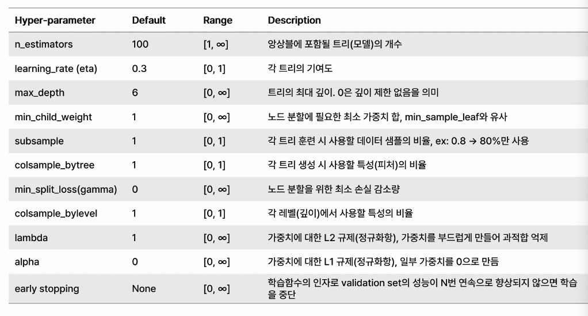

## ML 모델링

- 우리는 시계열 예측이라는 표현보다 전망한다고 함

## 모델 최적화 방법론

1. 더 좋은 데이터
   1. 데이터 클리닝
   2. 데이터 엔지니어링
   3. 불균형 데이터 처리
2. 더 좋은 모델
   1. 적합한 알고리즘 선택
   2. 최적의 모델 설정 탐색
   3. 과적합 제어 및 일반화
3. 더 좋은 전략
   1. 앙상블
   2. 샘플링
   3. 성능 검증

큰 흐름과 곁다리 흐름에 따라서 작업되는 것임

결측치 처리하다보면 이것저것 건들이게 되는데 그러지 말고

확실히 알아보고 싶어했던 걸 확인 후에 그 인사이트를 다른 것들과 병합하기

## 하이퍼 파라미터 튜닝

> 언더 피팅할 건지 오버 피팅할건지 방향을 잡고 하는거임

- 그리드 서치
- 랜덤서치
