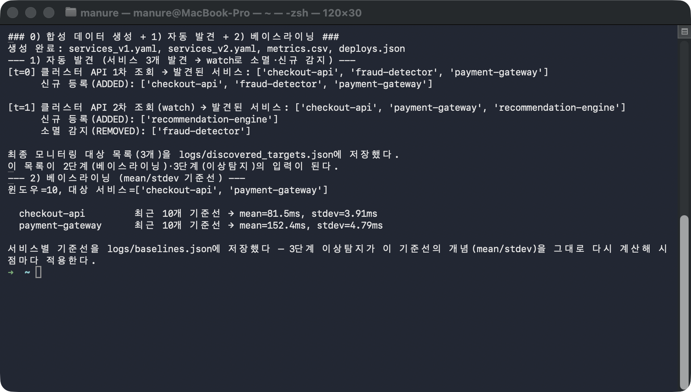
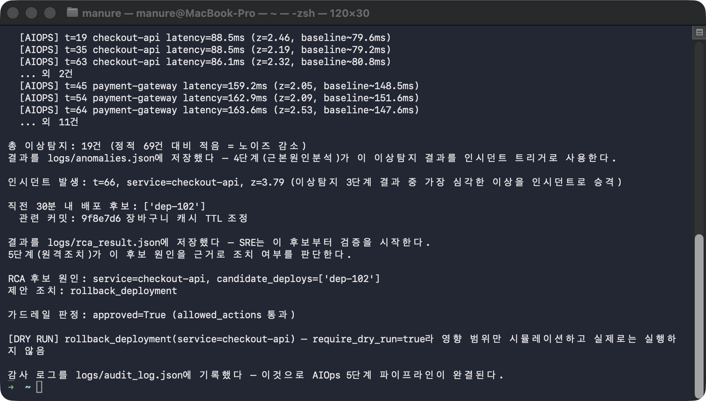

# followup.md — AIOps 5단계 파이프라인 한 줄씩 따라하기

AIOps의 5대 자동화 축을 순수 Python(표준 라이브러리)만으로 순서대로 실행한다:
**①자동 발견 → ②베이스라이닝 → ③이상탐지 → ④근본원인분석(RCA) → ⑤원격조치**.
외부 API 키·쿠버네티스 클러스터 없이 로컬에서 전 구간이 돌아가고, 각 단계의
산출물(`logs/*.json`)이 다음 단계의 입력이 되는 사슬을 눈으로 확인한다.

## 필요한 파일

| 파일 | 역할 | 몇 단계에서 쓰이나 |
|---|---|---|
| `data/generate_sample_data.py` | 합성 데이터 생성(seed=42로 재현 가능) — services_v1/v2.yaml, metrics.csv, deploys.json | 0단계 |
| `scripts/01_auto_discovery.py` | 서비스 자동 발견(watch로 신규/소멸 감지) | 1단계 |
| `scripts/02_baselining.py` | 서비스별 mean/stdev 기준선 계산 | 2단계 |
| `scripts/03_anomaly_detection.py` | 정적 임계값 vs 이동평균 z-score 이상탐지 비교 | 3단계 |
| `scripts/04_root_cause_analysis.py` | 가장 심각한 이상 → 인시던트 승격 → 배포 후보 제시 | 4단계 |
| `scripts/05_remediation.py` | 조치 제안 → 가드레일 판정 → DRY RUN + 감사 로그 | 5단계 |
| `scripts/common.py` | 공유 데이터 모델(MetricPoint, Deploy) | 2~5단계 |

**필요한 도구**: `python3`(3.11 검증)만 있으면 된다 — 표준 라이브러리만 쓰므로 pip 설치·가상환경·Docker 불필요.

## 무엇을 확인해야 하는가

각 단계의 산출물이 다음 단계로 이어지는 사슬이 핵심이다. `random.seed(42)`로
고정돼 있어 **아래 값들이 매 실행마다 똑같이 재현**된다.

| 단계 | 핵심 확인 값 | 정상 패턴 |
|---|---|---|
| 1 자동 발견 | 최종 대상 3개 | t=0에 3개 발견 → watch에서 `fraud-detector` 소멸, `recommendation-engine` 신규 |
| 2 베이스라이닝 | mean/stdev | checkout-api mean=81.5ms, payment-gateway mean=152.4ms |
| 3 이상탐지 | 정적 vs 이동평균 | **정적 69건 vs 이동평균 19건** (노이즈 감소가 핵심) |
| 4 RCA | 인시던트 + 배포 후보 | `t=66 checkout-api z=3.79` 승격 → `dep-102`(캐시 TTL 조정) 후보 |
| 5 원격조치 | 가드레일 판정 | `rollback_deployment` approved=True → `require_dry_run`이라 **DRY RUN** |

> ℹ️ **값이 고정이다**: 합성 데이터가 seed=42로 생성되므로 위 숫자(69/19, z=3.79,
> dep-102 등)가 그대로 나와야 정상이다. 다르게 나온다면 데이터 생성 단계(0단계)를
> 건너뛰었거나 스크립트가 수정된 것이다.
>
> ⚠️ **5단계는 실제 실행이 아니라 DRY RUN이다**: 로컬에 쿠버네티스 클러스터가
> 없으므로 `kubectl` 실제 실행 대신 감사 로그 기록으로 대체한다 — "판정 로직
> (가드레일 통과/차단, dry-run)"만 검증하지 실제 롤백을 하는 게 아니다.

## 0단계 — 이동 + 합성 데이터 생성

```bash
cd base-aiops
python3 data/generate_sample_data.py
```

먼저 실습 입력 데이터를 만든다. seed가 고정돼 있어 언제 돌려도 같은 데이터가 나온다.

**실행 결과 예시**

```
생성 완료: services_v1.yaml, services_v2.yaml, metrics.csv, deploys.json
```

## 1단계 — 자동 발견

```bash
python3 scripts/01_auto_discovery.py
```

클러스터 API를 두 번 조회(t=0, t=1 watch)해 서비스 목록의 변화(신규 등록/소멸)를
감지하고, 최종 모니터링 대상을 `logs/discovered_targets.json`에 저장한다.

**실행 결과 예시**

```
[t=0] 클러스터 API 1차 조회 → 발견된 서비스: ['checkout-api', 'fraud-detector', 'payment-gateway']
[t=1] 클러스터 API 2차 조회(watch) → 발견된 서비스: ['checkout-api', 'payment-gateway', 'recommendation-engine']
      신규 등록(ADDED): ['recommendation-engine']
      소멸 감지(REMOVED): ['fraud-detector']
최종 모니터링 대상 목록(3개)을 logs/discovered_targets.json에 저장했다.
```

## 2단계 — 베이스라이닝

```bash
python3 scripts/02_baselining.py
```

1단계가 찾은 대상별로 최근 10개 값의 mean/stdev 기준선을 계산해
`logs/baselines.json`에 저장한다. 3단계 이상탐지가 이 기준선 개념을 시점마다
다시 계산해 적용한다.

**실행 결과 예시**

```
윈도우=10, 대상 서비스=['checkout-api', 'payment-gateway']
  checkout-api         최근 10개 기준선 → mean=81.5ms, stdev=3.91ms
  payment-gateway      최근 10개 기준선 → mean=152.4ms, stdev=4.79ms
```



## 3단계 — 이상탐지 (정적 임계값 vs 이동평균)

```bash
python3 scripts/03_anomaly_detection.py
```

같은 데이터에 **정적 임계값(150ms)**과 **이동평균 z-score** 두 방식을 나란히
적용해, AIOps식 이동평균 방식이 노이즈를 얼마나 줄이는지 비교한다. 결과는
`logs/anomalies.json`에 저장되어 4단계 인시던트 트리거가 된다.

**실행 결과 예시**

```
=== 정적 임계값 알림(비교용) ===
총 69건 (노이즈 많음 — payment-gateway는 원래도 150ms를 넘나든다)

=== AIOps 이동평균 이상탐지 ===
  [AIOPS] t=19 checkout-api latency=88.5ms (z=2.46, baseline~79.6ms)
  ...
총 이상탐지: 19건 (정적 69건 대비 적음 = 노이즈 감소)
```

**정적 69건 → 이동평균 19건**으로 줄어든 것이 이 단계의 핵심 — 임계값을 넘나드는
게 "정상"인 서비스의 노이즈를 기준선 대비 편차(z-score)로 걸러낸 결과다.

## 4단계 — 근본원인분석(RCA)

```bash
python3 scripts/04_root_cause_analysis.py
```

3단계 이상 중 **z-score가 가장 큰(가장 심각한)** 이상을 인시던트로 승격하고, 그
직전 30분 내 배포 이력에서 원인 후보를 자동 제시한다.

**실행 결과 예시**

```
인시던트 발생: t=66, service=checkout-api, z=3.79 (가장 심각한 이상을 인시던트로 승격)
직전 30분 내 배포 후보: ['dep-102']
  관련 커밋: 9f8e7d6 장바구니 캐시 TTL 조정
```

## 5단계 — 원격조치 (가드레일 + DRY RUN)

```bash
python3 scripts/05_remediation.py
```

RCA가 지목한 원인에 대해 조치(`rollback_deployment`)를 제안하고, 가드레일
(`allowed_actions`/`require_dry_run`)로 판정한 뒤 감사 로그에 기록한다.

**실행 결과 예시**

```
RCA 후보 원인: service=checkout-api, candidate_deploys=['dep-102']
제안 조치: rollback_deployment
가드레일 판정: approved=True (allowed_actions 통과)
[DRY RUN] rollback_deployment(service=checkout-api) — require_dry_run=true라 영향 범위만 시뮬레이션하고 실제로는 실행하지 않음
감사 로그를 logs/audit_log.json에 기록했다 — 이것으로 AIOps 5단계 파이프라인이 완결된다.
```



## 최종 비교표

2026-09-29 `logs/`의 JSON 5개와 대조한 값. 실제 롤백은 수행되지 않음(`executed=false`).

| 확인 항목 | 이 문서의 값 | 직접 실행한 값 |
|---|---|---|
| 1단계 최종 대상 수 | 3개 | 3개 |
| 2단계 checkout-api mean | 81.5ms | 81.5ms |
| 3단계 정적 vs 이동평균 | 69건 vs 19건 | 69건 vs 19건 |
| 4단계 인시던트 | t=66 checkout-api z=3.79 | t=66 checkout-api z=3.79 |
| 4단계 배포 후보 | dep-102 | dep-102 |
| 5단계 판정 | approved=True → DRY RUN | approved=True → DRY RUN |

seed가 고정돼 있어 위 값들이 직접 실행에서도 그대로 나왔다면 — 자동 발견부터
원격조치까지 5단계가 산출물 사슬(`logs/*.json`)로 이어지는 AIOps 자동화 흐름을
스스로 확인한 것이다.
