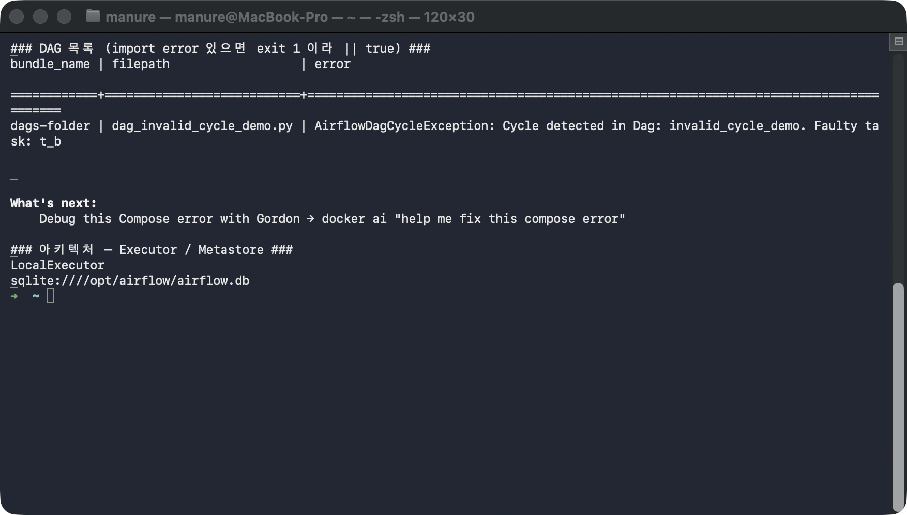
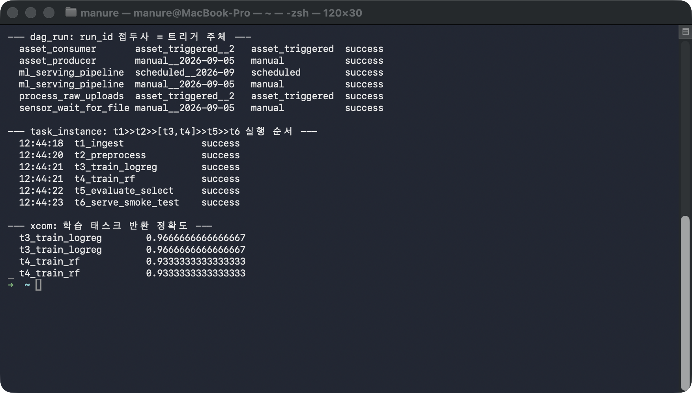

# Airflow 바깥에서(사람이 직접) 감시 폴더에 새 csv를 떨군다

printf "id,value\n1,hello\n2,world\n" > watched_uploads/new_upload.csv

# Triggerer 안의 커스텀 트리거가 이 파일을 감지 → process_raw_uploads 자동 실행

docker compose exec airflow airflow dags list-runs process_raw_uploads -o plain

# followup.md — Docker Airflow로 핵심 개념 한 판 따라하기

Apache Airflow 3.3.1을 Docker 컨테이너 하나(standalone: SQLite + LocalExecutor)로
띄워, 다음을 **한 줄씩 직접 실행하며** 눈으로 확인한다:

- 복잡한 ML 작업을 6단계로 쪼갠 **Pipeline Model Serving** DAG (수집→전처리→학습×2→평가→서빙)
- **DAG의 "Acyclic"** — 순환이 있으면 파싱에서 거부됨
- **Scheduler**가 `@daily`만으로 런을 자동 생성 / **Executor·Worker** 프로세스
- **Asset / AssetWatcher / Sensor** — cron 없이 이벤트·폴링으로 트리거
- **Metastore(SQLite)** 에 실행 순서와 XCom이 그대로 기록됨

## 필요한 파일

| 파일                                     | 역할                                                                          | 사용 단계   |
| ---------------------------------------- | ----------------------------------------------------------------------------- | ----------- |
| `Dockerfile`                           | `apache/airflow:3.3.1` + `scikit-learn`                                   | 1단계(빌드) |
| `docker-compose.yml`                   | standalone 컨테이너 1개 (포트 8280, dags/plugins/data/watched_uploads 마운트) | 1~2단계     |
| `dags/dag_ml_serving_pipeline.py`      | 6단계 파이프라인 (Bash/PythonOperator, 팬아웃/팬인)                           | 4·9단계    |
| `dags/dag_invalid_cycle_demo.py`       | 순환 반례 — 파싱에서 거부됨                                                  | 3단계       |
| `dags/dag_asset_pair.py`               | Asset producer/consumer                                                       | 6단계       |
| `dags/dag_asset_watcher.py`            | AssetWatcher (폴더 pull 감시)                                                 | 8단계       |
| `dags/dag_file_sensor.py`              | Sensor (FileSensor 폴링)                                                      | 7단계       |
| `plugins/directory_watcher_trigger.py` | AssetWatcher용 커스텀 트리거                                                  | 8단계       |

추가로 필요한 것: **Docker Desktop**(`docker`, `docker compose`)만 있으면 된다 —
Python·Airflow·라이브러리는 전부 컨테이너 안에 들어있다.

## 무엇을 확인해야 하는가

이 실습의 판정 기준은 **`run_id`의 접두사**와 **DagRun 상태**다. run_id 접두사가
"누가/무엇이 이 실행을 트리거했는지"를 그대로 말해준다.

| run_id 접두사         | 의미                                         | 어느 단계에서 |
| --------------------- | -------------------------------------------- | ------------- |
| `manual__`          | 사람이`dags trigger`로 실행                | 4·6·7단계   |
| `scheduled__`       | **Scheduler**가 `@daily`로 자동 생성 | 5단계         |
| `asset_triggered__` | **Asset 이벤트**로 자동 트리거         | 6·8단계      |

> ⚠️ **실행마다 달라지는 값**: run_id 뒤에 붙는 타임스탬프(`__2026-09-05T...`),
> asset_triggered의 랜덤 접미사(`_GsatwWn6`), `start_date`의 시:분:초, poke 횟수,
> 정확도 소수점 자릿수는 실행할 때마다 다르다. **숫자 자체가 아니라 위 표의
> "접두사 패턴"과 "state=success"** 만 맞으면 정상이다. 단, ml_serving_pipeline의
> `t3`(logreg=0.9667) > `t4`(rf=0.9333) 대소 관계는 시드가 고정돼 항상 같다.

docker compose exec airflow python - <<'PYEOF'
import sqlite3
conn = sqlite3.connect("/opt/airflow/airflow.db")
print("--- dag_run: run_id 접두사 = 트리거 주체 ---")
for r in conn.execute("SELECT dag_id, substr(run_id,1,18), run_type, state FROM dag_run ORDER BY dag_id"):
    print(f"  {r[0]:<20} {r[1]:<20} {r[2]:<16} {r[3]}")
print("\n--- task_instance: t1>>t2>>[t3,t4]>>t5>>t6 실행 순서 ---")
for r in conn.execute("""SELECT strftime('%H:%M:%S',start_date), task_id, state FROM task_instance
    WHERE dag_id='ml_serving_pipeline' AND run_id LIKE 'manual__%' ORDER BY start_date"""):
    print(f"  {r[0]}  {r[1]:<22} {r[2]}")
print("\n--- xcom: 학습 태스크 반환 정확도 ---")
for r in conn.execute("SELECT task_id, value FROM xcom WHERE dag_id='ml_serving_pipeline' AND task_id LIKE 't%train%'"):
    print(f"  {r[0]:<22} {r[1]}")
PYEOF

```bash
cd base-airflow
```

## 1단계 — 컨테이너 빌드 + 기동

```bash
docker compose up -d --build
```

`apache/airflow:3.3.1` 위에 scikit-learn을 얹은 이미지를 빌드하고, 그 안에서
`airflow standalone`(Scheduler + Triggerer + DAG Processor + API Server)을 띄운다.
Metastore는 컨테이너 안 SQLite, Executor는 LocalExecutor — 아무것도 바꾸지 않은
"기본 구성 그대로의 Airflow"다.

**실행 결과 예시**

```
[+] Running 2/2
 ✔ Network base-airflow_default      Created
 ✔ Container base-airflow-airflow-1  Started
```

## 2단계 — 기동 완료(healthy)까지 대기

```bash
# healthy가 될 때까지 상태를 반복 확인 (보통 20~40초)
until [ "$(docker compose ps airflow --format '{{.Health}}')" = "healthy" ]; do
  echo "  ...대기 중: $(docker compose ps airflow --format '{{.Health}}')"; sleep 3
done
echo "healthy!"
sleep 8   # dag-processor가 dags/ 폴더를 최초 스캔할 시간
```

**실행 결과 예시**

```
  ...대기 중: starting
  ...대기 중: starting
healthy!
```

## 3단계 — DAG 목록 + 순환 반례가 파싱에서 거부되는 것 확인 (DAG의 "Acyclic")

```bash
# 정상 DAG 목록 (import error가 있으면 이 명령이 exit 1 이라, || true 로 계속 진행)
docker compose exec airflow airflow dags list || true

# 순환을 넣은 반례가 여기 에러로 잡혀야 정상
docker compose exec airflow airflow dags list-import-errors || true
```

정상 DAG 5개는 등록되지만, 일부러 `t_a >> t_b >> t_a` 순환을 넣은
`invalid_cycle_demo`는 **파싱 단계에서 거부**되어 실행 목록에 오르지 못하고
import error로만 나타난다 — 순환이 있으면 실행 순서를 정할 수 없기 때문이다.

**실행 결과 예시**

```
--- dags list ---
dag_id               | fileloc                                      | is_paused
=====================+==============================================+==========
asset_consumer       | /opt/airflow/dags/dag_asset_pair.py          | True
asset_producer       | /opt/airflow/dags/dag_asset_pair.py          | True
ml_serving_pipeline  | /opt/airflow/dags/dag_ml_serving_pipeline.py | True
process_raw_uploads  | /opt/airflow/dags/dag_asset_watcher.py       | True
sensor_wait_for_file | /opt/airflow/dags/dag_file_sensor.py         | True

--- import errors ---
dags-folder | dag_invalid_cycle_demo.py | AirflowDagCycleException: Cycle detected in Dag: invalid_cycle_demo. Faulty task: t_b
```

이어서 아키텍처 증거도 확인한다.

```bash
docker compose exec airflow airflow config get-value core executor
docker compose exec airflow airflow config get-value database sql_alchemy_conn
```

```
LocalExecutor
sqlite:////opt/airflow/airflow.db
```



## 4단계 — 5개 DAG unpause + 6단계 파이프라인 트리거

```bash
for d in ml_serving_pipeline sensor_wait_for_file asset_producer asset_consumer process_raw_uploads; do
  docker compose exec airflow airflow dags unpause "$d"
done

# Pipeline Model Serving 6단계 파이프라인 수동 실행
docker compose exec airflow airflow dags trigger ml_serving_pipeline -l 2024-03-01T00:00:00+00:00

# 완료될 때까지 상태 확인 (success가 뜰 때까지 반복)
docker compose exec airflow airflow dags state ml_serving_pipeline 2024-03-01T00:00:00+00:00
```

`t1_ingest(Bash) >> t2_preprocess >> [t3_train_logreg, t4_train_rf] >> t5_evaluate_select >> t6_serve_smoke_test`
순서로, 두 모델을 병렬 학습(팬아웃)한 뒤 최고 정확도 모델을 골라(팬인) 서빙 smoke
test까지 통과하면 `success`다.

**실행 결과 예시**

```
success
```

서빙 스테이지(t6)의 로그를 직접 열어 보면:

```bash
docker compose exec airflow bash -c "grep -h '\[serve\]' /opt/airflow/logs/dag_id=ml_serving_pipeline/*/task_id=t6_serve_smoke_test/*.log | tail -2"
```

```
[serve] smoke test — 실제=[0, 1, 0] 예측=[0, 1, 0]
[serve] smoke test 통과 ✅ — 파이프라인 끝단에서 서빙 가능 상태 확인
```

## 5단계 — Scheduler 증거: `scheduled__` 런이 자동 생성됨

```bash
docker compose exec airflow airflow dags list-runs ml_serving_pipeline -o plain
```

방금 사람이 만든 `manual__` 런 말고, **run_id가 `scheduled__`로 시작하는 런이
함께** 보여야 한다 — `@daily`로 선언했으므로 unpause만 해도 Scheduler가 최근
구간 런을 스스로 만든 것이다(사람은 이건 트리거한 적 없다).

**실행 결과 예시**

```
ml_serving_pipeline  manual__2026-...                success   ← 4단계에서 사람이 트리거
ml_serving_pipeline  scheduled__2026-09-05T00:00:00  success   ← Scheduler가 자동 생성 ✅
```

## 6단계 — Asset: producer → consumer가 `asset_triggered__`로 자동 실행

```bash
# producer가 outlets로 report_source Asset을 갱신한다
docker compose exec airflow airflow dags trigger asset_producer -l 2024-03-01T00:00:00+00:00
docker compose exec airflow airflow dags state asset_producer 2024-03-01T00:00:00+00:00   # success 대기

# consumer는 cron 없이 schedule=[report_source] 만 걸려 있다 → 자동으로 돈다
docker compose exec airflow airflow dags list-runs asset_consumer -o plain
```

`asset_consumer`는 사람이 트리거하지 않았는데도 실행됐고, 그 run_id가
`asset_triggered__`로 시작한다 — Asset 갱신 이벤트가 트리거한 것이다.

**실행 결과 예시**

```
asset_consumer  asset_triggered__2026-...  success   ← manual이 아니라 asset_triggered ✅
```

## 7단계 — Sensor: 파일이 나타날 때까지 poke 재시도

```bash
# 먼저 센서 DAG를 트리거 (아직 감시 파일은 없다)
docker compose exec airflow airflow dags trigger sensor_wait_for_file -l 2024-03-01T00:00:00+00:00

# 15초쯤 기다렸다가, 감시 대상 파일을 만든다 (그 사이 Sensor는 계속 poke 중)
sleep 15
echo "hello sensor" > watched_uploads/trigger.txt

# 파일이 생기면 Sensor가 통과 → success
docker compose exec airflow airflow dags state sensor_wait_for_file 2024-03-01T00:00:00+00:00
```

FileSensor가 파일이 없는 동안 `poke_interval=3`초마다 "아직 없음"을 반복하다가,
`trigger.txt`가 나타나자 통과한다. poke를 여러 번 한 흔적을 로그로 볼 수 있다.

```bash
docker compose exec airflow bash -c "grep -h 'Poking for file' /opt/airflow/logs/dag_id=sensor_wait_for_file/*/task_id=wait_for_file/*.log"
```

**실행 결과 예시**

```
success
--- poke 로그 (3초 간격으로 여러 번 반복된 뒤 파일이 생기면 통과) ---
Poking for file /opt/airflow/watched_uploads/trigger.txt
Poking for file /opt/airflow/watched_uploads/trigger.txt
Poking for file /opt/airflow/watched_uploads/trigger.txt
... (총 6~8회)
```

## 8단계 — AssetWatcher: 외부 폴더를 직접 폴링(pull)해 자동 트리거

```bash
# Airflow 바깥에서(사람이 직접) 감시 폴더에 새 csv를 떨군다
printf "id,value\n1,hello\n2,world\n" > watched_uploads/new_upload.csv

# Triggerer 안의 커스텀 트리거가 이 파일을 감지 → process_raw_uploads 자동 실행
docker compose exec airflow airflow dags list-runs process_raw_uploads -o plain
```

Asset이 "다른 DAG의 outlets"가 아니라, Triggerer 안에서 폴더를 **직접 폴링**하는
watcher가 갱신시킨다는 점이 6단계와 다르다 — 그래서 파일을 쓰는 쪽이 Airflow
태스크가 아니어도(사람이 그냥 복사해도) 트리거된다.

Triggerer가 새 파일을 감지한 로그도 직접 확인할 수 있다.

```bash
docker compose logs airflow | grep "새 파일 감지"
```

**실행 결과 예시**

```
process_raw_uploads  asset_triggered__2026-...  success   ← asset_triggered ✅
[DirectoryFilePatternTrigger] pattern=*.csv 새 파일 감지: ['new_upload.csv'] → TriggerEvent 발생
```

## 9단계 — Metastore(SQLite)를 직접 SQL로 열어 실행 기록 확인

```bash
docker compose exec airflow python - <<'PYEOF'
import sqlite3
conn = sqlite3.connect("/opt/airflow/airflow.db")
print("--- dag_run: run_id 접두사 = 트리거 주체 ---")
for r in conn.execute("SELECT dag_id, substr(run_id,1,18), run_type, state FROM dag_run ORDER BY dag_id"):
    print(f"  {r[0]:<20} {r[1]:<20} {r[2]:<16} {r[3]}")
print("\n--- task_instance: t1>>t2>>[t3,t4]>>t5>>t6 실행 순서 ---")
for r in conn.execute("""SELECT strftime('%H:%M:%S',start_date), task_id, state FROM task_instance
    WHERE dag_id='ml_serving_pipeline' AND run_id LIKE 'manual__%' ORDER BY start_date"""):
    print(f"  {r[0]}  {r[1]:<22} {r[2]}")
print("\n--- xcom: 학습 태스크 반환 정확도 ---")
for r in conn.execute("SELECT task_id, value FROM xcom WHERE dag_id='ml_serving_pipeline' AND task_id LIKE 't%train%'"):
    print(f"  {r[0]:<22} {r[1]}")
PYEOF
```

`>>`로 선언한 태스크 순서가 `start_date` 순서로 그대로 남고(t3·t4는 같은 초에
시작 = 팬아웃), 학습 태스크가 반환한 정확도까지 XCom 테이블에 저장돼 있다.

**실행 결과 예시**

```
--- dag_run: run_id 접두사 = 트리거 주체 ---
  asset_consumer       asset_triggered__2   asset_triggered  success
  asset_producer       manual__2026-09-05   manual           success
  ml_serving_pipeline  manual__2026-09-05   manual           success
  ml_serving_pipeline  scheduled__2026-09   scheduled        success
  process_raw_uploads  asset_triggered__2   asset_triggered  success
  sensor_wait_for_file manual__2026-09-05   manual           success

--- task_instance: t1>>t2>>[t3,t4]>>t5>>t6 실행 순서 ---
  12:44:18  t1_ingest              success
  12:44:20  t2_preprocess          success
  12:44:21  t3_train_logreg        success   ← t3/t4 같은 초 시작(팬아웃)
  12:44:21  t4_train_rf            success
  12:44:22  t5_evaluate_select     success   ← 둘 다 끝난 뒤(팬인)
  12:44:23  t6_serve_smoke_test    success

--- xcom: 학습 태스크 반환 정확도 ---
  t3_train_logreg        0.9666666666666667
  t4_train_rf            0.9333333333333333
```



## 최종 비교표

| 확인 항목                       | 이 문서의 값                    | 직접 실행한 값 |
| ------------------------------- | ------------------------------- | -------------- |
| 순환 반례 invalid_cycle_demo    | import error(Cycle detected) ✅ | Cycle detected (t_b) ✅ |
| core.executor                   | LocalExecutor                   | LocalExecutor ✅ |
| ml_serving_pipeline (manual)    | success                         | success ✅ |
| ml_serving_pipeline (scheduled) | scheduled__ 런 존재 ✅          | scheduled__ / success ✅ |
| asset_consumer run 유형         | asset_triggered ✅              | asset_triggered / success ✅ |
| sensor_wait_for_file            | success (poke 6~8회)            | success (poke 6~8회) ✅ |
| process_raw_uploads run 유형    | asset_triggered ✅              | asset_triggered / success ✅ |
| t3(logreg) vs t4(rf) 정확도     | 0.9667 > 0.9333                 | 0.9666666666666667 > 0.9333333333333333 ✅ |

run_id 접두사(manual/scheduled/asset_triggered) 패턴이 직접 실행에서도 위와 같이
나왔다면 — Scheduler·Asset·AssetWatcher가 각각 다른 방식으로 DAG를 트리거하고,
그 실행 순서와 XCom이 전부 Metastore에 기록된다는 것을 스스로 확인한 것이다.

## 마치며 — 웹 UI로 보기 + 정리

```bash
# 웹 UI 비밀번호 확인 (아이디: admin) → http://localhost:8280 에서 DAG 그래프·로그 열람
docker compose exec airflow cat simple_auth_manager_passwords.json.generated

docker compose down -v   # 컨테이너·볼륨·네트워크 정리
```
