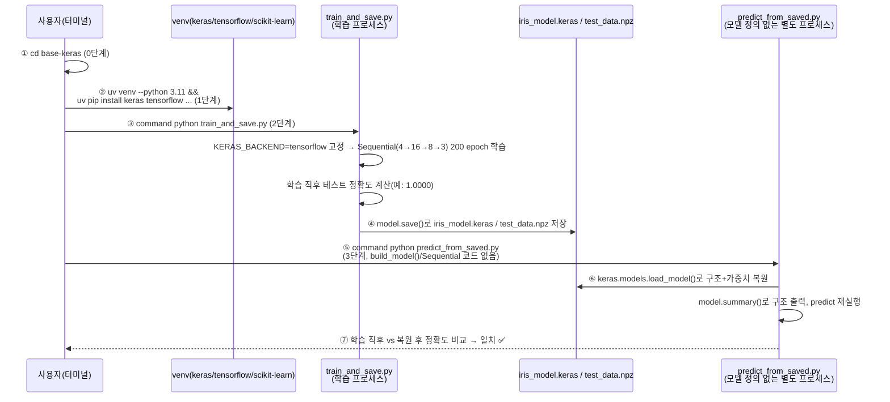

# followup.md — Keras(TF 백엔드) 모델 학습 → .keras 저장 → 모델 정의 없이 로드 → predict 한 줄씩 따라하기

Keras 3(TensorFlow 백엔드)로 붓꽃 분류 모델을 학습해 `.keras` 파일로 저장한 뒤,
**모델 정의 코드가 전혀 없는 완전히 새로운 python 프로세스**에서 그 파일만으로
모델을 복원해 predict까지 실행해본다. 핵심 질문은 하나다 — "재학습도, 모델 구조
재정의도 없이, 저장된 `.keras` 파일 하나만으로 학습 직후와 똑같은 결과를 재현할
수 있는가?"

### 전체 흐름 한눈에 보기



| 번호 | 단계 | 핵심 확인 포인트 |
|---|---|---|
| ①~② | 0~1단계 | 폴더 이동 + 가상환경/패키지 준비 |
| ③~④ | 2단계 | 같은 프로세스 안에서 학습 후 테스트 정확도 출력, `iris_model.keras`로 저장 |
| ⑤~⑥ | 3단계 | **모델 구조 정의 코드가 없는** 별도 프로세스가 `load_model()`만으로 복원 |
| ⑦ | 3단계 결과 | 두 프로세스의 테스트 정확도가 소수점까지 일치 + `summary()` 구조가 파일에서 읽혔는지 확인 |

## 필요한 파일

| 파일 | 역할 | 사용 단계 |
|---|---|---|
| `train_and_save.py` | TF 백엔드 고정, Iris 데이터로 `keras.Sequential`(4→16→8→3)을 학습하고 `iris_model.keras`·`test_data.npz`로 저장 | 2단계 |
| `predict_from_saved.py` | 모델 정의 코드 없이 `iris_model.keras`를 로드해(재학습 없이) predict 실행 + 학습 직후 정확도와 비교 | 3단계 |

추가로 필요한 것: Python 3.11, [uv](https://docs.astral.sh/uv/)(가상환경·패키지 설치용),
`keras`·`tensorflow`·`scikit-learn`·`numpy`(1단계에서 설치).

> ⚠️ **`python` 명령이 다른 곳을 가리키는 환경이라면**: 이 macOS 환경처럼
> `~/.zshrc`에 `alias python="/opt/homebrew/..."` 같은 별칭이 걸려 있으면,
> `source .venv/bin/activate`를 해도 `python`이 방금 만든 venv가 아니라 그
> 별칭이 가리키는 인터프리터로 실행될 수 있다(패키지가 우연히 같은 버전으로
> 전역에도 깔려 있으면 티가 안 나서 더 위험하다). 아래 모든 명령에서
> `command python`(별칭을 무시하고 PATH의 실제 실행 파일을 쓰라는 셸 내장
> 명령)을 쓰는 이유가 이것이다.

## 무엇을 확인해야 하는가

두 프로세스(학습 프로세스 / predict 프로세스)가 서로 다른 시점에 계산한 **테스트
정확도가 소수점까지 정확히 일치**하는지가 이 실습의 판정 기준이다. 추가로,
predict 프로세스가 출력하는 `model.summary()`의 모델 구조(4→16→8→3)는 그
프로세스가 정의한 것이 아니라 `.keras` 파일에서 읽어온 것이라는 점도 확인 대상이다.

| 값 | 학습 직후(2단계, 학습 프로세스) | .keras 복원 후(3단계, 별도 프로세스) | 판정 |
|---|---|---|---|
| 테스트 정확도 | 실행 시 출력됨 | 실행 시 출력됨 | 두 값이 **소수점까지 동일**해야 ✅ |
| `model.summary()` 구조 | (출력 안 함) | Dense 16→8→3, Total params 731 | 3단계 스크립트에 구조 정의 코드가 없는데도 출력되면 정상 |
| predict 소요 시간(ms) | (해당 없음) | 실행할 때마다 달라짐 | ❌ 비교 대상 아님 — 정확도 일치 여부만 본다 |

> ⚠️ **실행마다 달라지는 값**: 3단계의 `predict 소요 시간(ms)`은 머신 상태에 따라
> 매번 다르게 나온다(이 문서 캡처본에서는 42.535ms — TensorFlow 첫 predict 호출은
> 그래프 초기화 비용이 포함돼 sklearn/pytorch 예시보다 크게 나오는 게 정상이다).
> 그 숫자가 무엇이 나오든 상관없고, **정확도 두 값이 일치하는지**만 확인하면 된다.

## 0단계 — 이동

```bash
cd base-keras
```

## 1단계 — 가상환경 준비

```bash
uv venv --python 3.11 --clear .venv
source .venv/bin/activate
uv pip install --quiet keras tensorflow scikit-learn numpy
command python -c "import keras, tensorflow, sklearn; print('keras', keras.__version__); print('tensorflow', tensorflow.__version__); print('scikit-learn', sklearn.__version__)"
```

**실행 결과 예시**

```
Using CPython 3.11.15
Creating virtual environment at: .venv
Activate with: source .venv/bin/activate
keras 3.15.1
tensorflow 2.21.0
scikit-learn 1.9.0
```

## 2단계 — 모델 학습 + .keras 저장

```bash
command python train_and_save.py
```

`train_and_save.py`는 `keras`를 import하기 **전에** `KERAS_BACKEND=tensorflow`를
고정한 뒤(백엔드는 import 이후엔 바꿀 수 없다), Iris 데이터셋(150 샘플, 4 특성,
3 클래스)을 8:2로 나눠 작은 MLP(4→16→8→3)를 200 epoch 학습한다. 학습 직후(같은
프로세스) 테스트 정확도를 먼저 출력한 뒤 — `model.save()` 한 줄로 아키텍처+가중치+
컴파일 설정 전부를 `iris_model.keras` 파일 하나에 저장하고, 다음 단계가 재사용할
테스트셋을 `test_data.npz`로 저장한다.

**실행 결과 예시**

```
keras 3.15.1
tensorflow 2.21.0
scikit-learn 1.9.0

[Keras] 버전: 3.15.1, 백엔드: tensorflow
[학습 직후] 테스트 정확도: 1.0000 (30/30)
[Keras] 저장 완료: iris_model.keras
[데이터] 테스트셋 저장 완료: test_data.npz

총 소요 시간: 1.73s
```

이 시점의 테스트 정확도(`1.0000`)를 잘 기억해두자 — 3단계 마지막에 이 값과
다시 비교한다.


## 3단계 — .keras 복원 + predict + 비교

```bash
command python predict_from_saved.py
```

**여기서부터가 이 실습의 핵심이다.** 이 명령은 2단계와 **별도의 python
프로세스**로 실행된다 — 즉 2단계에서 메모리에 있던 model 객체는 이미 사라진
상태다. 더 중요한 건, 이 스크립트에는 `build_model()`도 `keras.Sequential([...])`도
없다는 점이다 — 모델 구조를 정의하는 코드가 한 줄도 없이,
`keras.models.load_model("iris_model.keras")` 하나로 완전한 모델을 복원해
predict를 실행한다.

**실행 결과 예시**

```
[Keras] 로드 완료: iris_model.keras (백엔드=tensorflow)
Model: "sequential"
┏━━━━━━━━━━━━━━━━━━━━━┳━━━━━━━━━━━━━━━━┳━━━━━━━━━━━┓
┃ Layer (type)        ┃ Output Shape   ┃   Param # ┃
┡━━━━━━━━━━━━━━━━━━━━━╇━━━━━━━━━━━━━━━━╇━━━━━━━━━━━┩
│ dense (Dense)       │ (None, 16)     │        80 │
│ dense_1 (Dense)     │ (None, 8)      │       136 │
│ dense_2 (Dense)     │ (None, 3)      │        27 │
└─────────────────────┴────────────────┴───────────┘
 Total params: 731 (2.86 KB)
 Trainable params: 243 (972.00 B)

[복원 모델] 테스트 정확도: 1.0000 (30/30)
[복원 모델] predict 소요 시간 (30개 샘플): 42.535 ms

[비교] 학습 직후 테스트 정확도      : 1.0000
[비교] .keras 복원 후 테스트 정확도  : 1.0000
[비교] 결과 일치 ✅ — 재학습도 모델 정의 코드도 없이 .keras 파일만으로 동일한 모델을 복원했다.
```

`[비교]` 줄 두 개(학습 직후 vs `.keras` 복원 후)가 소수점까지 동일하고, 마지막에
`결과 일치 ✅`가 찍혔다면 — 재학습·재정의 없이 `.keras` 파일만으로 완전히 동일한
모델을 복원했다는 뜻이다. 그리고 그 위에 출력된 `model.summary()`의 4→16→8→3
구조는 **이 프로세스가 정의한 것이 아니라 `.keras` 파일에서 읽어온 것**이다 —
`predict_from_saved.py`를 직접 열어 `Sequential`이라는 단어가 없다는 걸 확인해보자.


## 최종 비교표

| 항목 | 이 문서의 캡처값 | 직접 실행한 값 |
|---|---|---|
| 학습 직후 테스트 정확도 (2단계) | 1.0000 (30/30) | |
| .keras 복원 후 테스트 정확도 (3단계) | 1.0000 (30/30) | |
| 두 정확도 일치 여부 | ✅ 일치 | |
| `model.summary()`가 3단계에서 구조를 출력했는가 | ✅ (구조 정의 코드 없이) | |
| predict 소요 시간(3단계) | 42.535 ms *(참고용 — 실행마다 다름, 판정 기준 아님)* | |

두 정확도 값이 직접 실행에서도 소수점까지 똑같이 나왔다면 — 재학습도 모델 정의
코드도 없이, `.keras` 파일 하나만으로 학습된 모델을 그대로 재현할 수 있다는 것을
스스로 확인한 것이다.
