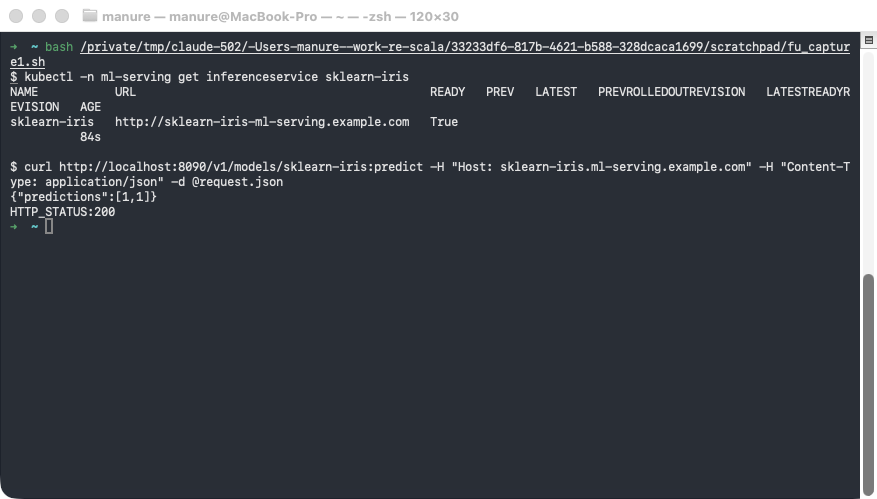
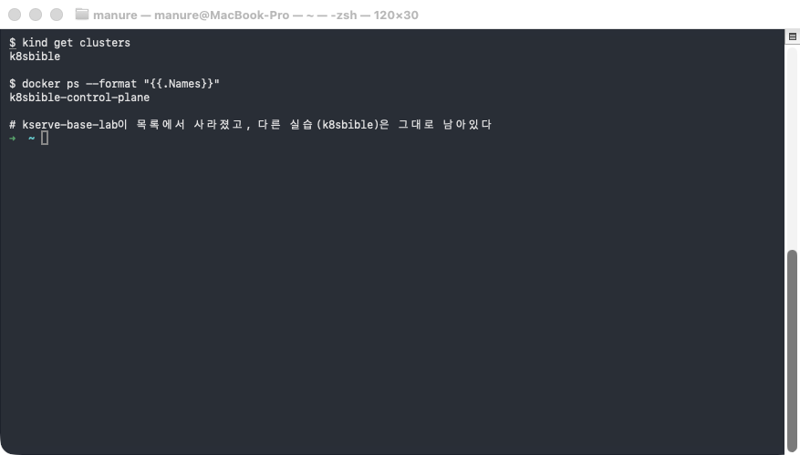

# followup.md — KServe InferenceService(Standard 모드) 처음부터 끝까지 따라 하기

전용 kind 클러스터를 새로 만들어 KServe를 설치하고, sklearn 모델 하나를 실제로
배포·추론까지 검증한 뒤 클러스터를 깨끗이 정리하는 과정을, 명령을 한 줄씩 직접
쳐보면서 따라간다.

## 필요한 파일

| 파일                      | 역할                                                                                                 | 몇 단계에서 쓰이나 |
| ------------------------- | ---------------------------------------------------------------------------------------------------- | ------------------ |
| `inferenceservice.yaml` | 배포할`InferenceService` CR — sklearn-iris 모델(`storageUri: gs://kfserving-examples/...`) 선언 | 4단계              |
| `request.json`          | V1 predict 요청 바디(Iris 샘플 2개)                                                                  | 7단계              |

**필요한 CLI 도구**: `docker`(구동 중이어야 함), `kind`, `kubectl`, `helm`, `curl`. 이 문서는
`docker 29.5.3`, `kind 0.32.0`, `kubectl 1.36`, `helm 4.2.2`(macOS)로 실제 검증했다.

## 무엇을 확인해야 하는가

| 단계              | 정상 신호                                                                                                                               |
| ----------------- | --------------------------------------------------------------------------------------------------------------------------------------- |
| 5단계(Ready 대기) | `READY` 컬럼이 `True`                                                                                                               |
| 6단계(로그 확인)  | storage-initializer가`Model downloaded in N.NN seconds.`을 출력, kserve-container가 `Uvicorn running on http://0.0.0.0:8080`을 출력 |
| 7단계(추론 요청)  | `{"predictions":[1,1]}` + `HTTP_STATUS:200`                                                                                         |
| 8단계(정리)       | `kind get clusters`에서 이 실습의 클러스터 이름이 더 이상 안 보임                                                                     |

**값이 아니라 패턴을 봐야 하는 항목**: `Model downloaded in N.NN seconds.`의 숫자(다운로드
소요 시간), `kubectl get inferenceservice`의 `AGE` 컬럼, Pod 이름 뒤의 해시(예:
`sklearn-iris-predictor-5c778b98c9-qtsfc`)는 **실행할 때마다 달라진다** — 숫자 자체가
아니라 "다운로드가 성공했는가"·"몇 초 안팎인가"·"Pod 이름 패턴이 `sklearn-iris-predictor-*`
인가"만 확인하면 된다. 반면 `{"predictions":[1,1]}`은 모델 아티팩트가 고정돼 있어 매번
동일하게 나와야 정상이다.

## 0단계 — 이동

```bash
cd base-kserve
```

## 1단계 — 전용 kind 클러스터 생성

```bash
kind create cluster --name kserve-base-lab
```

**실행 결과 예시**:

```
Creating cluster "kserve-base-lab" ...
 • Ensuring node image (kindest/node:v1.36.1) 🖼  ...
 ✓ Ensuring node image (kindest/node:v1.36.1) 🖼
 • Preparing nodes 📦   ...
 ✓ Preparing nodes 📦
 • Writing configuration 📜  ...
 ✓ Writing configuration 📜
 • Starting control-plane 🕹️  ...
 ✓ Starting control-plane 🕹️
 • Installing CNI 🔌  ...
 ✓ Installing CNI 🔌
 • Installing StorageClass 💾  ...
 ✓ Installing StorageClass 💾
Set kubectl context to "kind-kserve-base-lab"
You can now use your cluster with:

kubectl cluster-info --context kind-kserve-base-lab

Have a nice day! 👋
```

다른 실습에서 만든 클러스터와 이름이 겹치지 않는지 미리 확인하고 싶다면:

```bash
kind get clusters
```

## 2단계 — KServe 설치 스크립트 다운로드

```bash
KSERVE_VERSION=v0.18.0
curl -sL "https://github.com/kserve/kserve/releases/download/${KSERVE_VERSION}/kserve-standard-mode-full-install-with-manifests.sh" \
  -o "/tmp/kserve-standard-install-${KSERVE_VERSION}.sh"
chmod +x "/tmp/kserve-standard-install-${KSERVE_VERSION}.sh"
```

**실행 결과 예시**: 별도 출력 없음(다운로드만 수행). 성공 여부는 파일 크기로 확인한다:

```bash
ls -la "/tmp/kserve-standard-install-${KSERVE_VERSION}.sh"
```

```
-rwxr-xr-x  1 manure  wheel  1692781 Sep  3 15:10 /tmp/kserve-standard-install-v0.18.0.sh
```

## 3단계 — cert-manager + KServe 설치 (가장 오래 걸리는 단계, 1~3분)

```bash
bash "/tmp/kserve-standard-install-${KSERVE_VERSION}.sh"
```

**실행 결과 예시** (실제로 나온 출력을 순서대로 발췌 — 총 90여 줄 중 각 구간의 핵심만):

```
[INFO] Installing Helm v3.16.3 for darwin/arm64...
[SUCCESS] Successfully installed Helm v3.16.3 to ...
[INFO] Installing Kustomize v5.8.1 for darwin/arm64...
[INFO] Installing yq v4.52.1 for darwin/arm64...
[INFO] Adding cert-manager Helm repository...
[INFO] Installing cert-manager v1.17.0...
...
[SUCCESS] Successfully installed cert-manager v1.17.0 via Helm
pod/cert-manager-556d7b4d8c-qw48w condition met
pod/cert-manager-cainjector-676796597b-jcwb7 condition met
pod/cert-manager-webhook-7c65796f99-h2tjv condition met
[SUCCESS] cert-manager is ready!
[INFO] Installing KServe CRDs...
customresourcedefinition.apiextensions.k8s.io/inferenceservices.serving.kserve.io serverside-applied
...
[INFO] Installing KServe core components...
deployment.apps/kserve-controller-manager serverside-applied
...
[INFO] Adding deployment mode update: Standard
[INFO]   ✓ deploy.defaultDeploymentMode = "Standard"
[SUCCESS] Deployment 'kserve-controller-manager' in namespace 'kserve' is available!
[SUCCESS] KServe is ready!
[INFO] Installing ClusterServingRuntimes...
clusterservingruntime.serving.kserve.io/kserve-sklearnserver serverside-applied
clusterservingruntime.serving.kserve.io/kserve-tritonserver serverside-applied
... (총 11종 ClusterServingRuntime 등록)
==========================================
✅ Installation completed successfully!
==========================================
```

**확인할 것**: 맨 마지막 줄이 `✅ Installation completed successfully!`인지, 그리고
`clusterservingruntime.../kserve-sklearnserver`가 등록 목록에 있는지(7단계에서 이
런타임이 자동 매칭돼 sklearn 모델을 서빙한다).

## 4단계 — 네임스페이스 생성 + InferenceService 적용

```bash
kubectl create namespace ml-serving
kubectl apply --server-side --dry-run=server -f inferenceservice.yaml
kubectl apply -f inferenceservice.yaml
```

**실행 결과 예시**:

```
namespace/ml-serving created
inferenceservice.serving.kserve.io/sklearn-iris serverside-applied (server dry run)
inferenceservice.serving.kserve.io/sklearn-iris created
```

## 5단계 — Ready 대기 + 상태 확인

```bash
kubectl -n ml-serving wait --for=condition=Ready inferenceservice/sklearn-iris --timeout=5m
kubectl -n ml-serving get inferenceservice sklearn-iris
```

**실행 결과 예시**:

```
inferenceservice.serving.kserve.io/sklearn-iris condition met
NAME           URL                                          READY   PREV   LATEST   PREVROLLEDOUTREVISION   LATESTREADYREVISION   AGE
sklearn-iris   http://sklearn-iris-ml-serving.example.com   True                                                                  36s
```

`READY`가 `True`가 아니면 다음 단계로 넘어가지 말고 `kubectl -n ml-serving describe inferenceservice sklearn-iris`로 원인을 먼저 확인한다.

## 6단계 — storage-initializer / kserve-container 로그 확인

```bash
POD=$(kubectl -n ml-serving get pods -l serving.kserve.io/inferenceservice=sklearn-iris -o jsonpath='{.items[0].metadata.name}')
echo "$POD"
kubectl -n ml-serving logs "$POD" -c storage-initializer
kubectl -n ml-serving logs "$POD" -c kserve-container
```

**실행 결과 예시**:

```
sklearn-iris-predictor-5c778b98c9-qtsfc

--- storage-initializer ---
... Initializing, args: (src_uri, dest_path): [('gs://kfserving-examples/models/sklearn/1.0/model', '/mnt/models')]
... Copying contents of gs://kfserving-examples/models/sklearn/1.0/model to local
... Downloading: /mnt/models/model.joblib
... Successfully copied gs://kfserving-examples/models/sklearn/1.0/model to /mnt/models
... Model downloaded in 10.47547508700518 seconds.

--- kserve-container ---
.../sklearn/base.py:376: InconsistentVersionWarning: Trying to unpickle estimator SVC from version 1.0.1 when using version 1.5.2. ...
... Registering model: sklearn-iris
... Starting uvicorn with 1 workers
... Starting gRPC server on [::]:8081
INFO:     Uvicorn running on http://0.0.0.0:8080 (Press CTRL+C to quit)
```

`InconsistentVersionWarning`은 학습 당시 scikit-learn 버전(1.0.1)과 서빙 컨테이너의
scikit-learn 버전(1.5.2)이 달라서 나오는 경고이지 에러가 아니다 — 아래 7단계 추론은
정상적으로 성공한다. Pod 이름 뒤 해시와 다운로드 초 단위 숫자는 실행마다 달라진다(위
"무엇을 확인해야 하는가" 참고).

## 7단계 — port-forward + 실제 추론 요청

```bash
kubectl -n ml-serving port-forward svc/sklearn-iris-predictor 8090:80 &
sleep 4
curl http://localhost:8090/v1/models/sklearn-iris:predict \
  -H "Host: sklearn-iris.ml-serving.example.com" \
  -H "Content-Type: application/json" \
  -d @request.json
```

**실행 결과 예시**:

```
Forwarding from 127.0.0.1:8090 -> 8080
Forwarding from [::1]:8090 -> 8080
{"predictions":[1,1]}
HTTP_STATUS:200
```



**주의**: `-d @request.json`처럼 파일로 바디를 보낼 때 `-H "Content-Type: application/json"`을
반드시 붙여야 한다. 이 헤더 없이 보내면 curl이 기본값(`application/x-www-form-urlencoded`)으로
보내서 서버가 입력을 숫자 배열이 아닌 스칼라로 잘못 해석해 500 에러(`Expected 2D array, got scalar array instead`)가 난다.

요청을 다 보냈으면 port-forward를 종료한다(다음 단계로 넘어가기 전 필수):

```bash
lsof -ti:8090 | xargs kill -9
```

## 8단계 — 정리 (네임스페이스 + kind 클러스터 삭제)

```bash
kubectl delete namespace ml-serving --wait=true
kind delete cluster --name kserve-base-lab
```

**실행 결과 예시**:

```
namespace "ml-serving" deleted
Deleting cluster "kserve-base-lab" ...
Deleted nodes: ["kserve-base-lab-control-plane"]
```

정리가 끝났으면 이 실습의 클러스터만 없어지고 다른 클러스터·컨테이너는 그대로인지 확인한다:

```bash
kind get clusters
docker ps --format "{{.Names}}"
```



## 최종 비교표

실제로 나온 값을 직접 채워보고, 아래 예시값과 같은 **패턴**인지 비교한다.

| 확인 항목                                    | 예시(이 문서 실행 시)                      | 내가 실행한 결과 | 판정 기준                                        |
| -------------------------------------------- | ------------------------------------------ | ---------------- | ------------------------------------------------ |
| `kubectl get inferenceservice`의 `READY` | `True`                                   | `True` ✅         | ✅ 반드시`True`(값 고정)                       |
| storage-initializer 다운로드 소요 시간       | 10.48초                                    | 10.47547508700518초 ✅ | ✅ 숫자는 달라도 됨(수 초~수십 초대면 정상)      |
| kserve-container 기동 로그                   | `Uvicorn running on http://0.0.0.0:8080` | `Uvicorn running on http://0.0.0.0:8080` ✅ | ✅ 이 문자열 그대로 나와야 함(고정)              |
| 추론 응답                                    | `{"predictions":[1,1]}`                  | `{"predictions":[1,1]}` ✅ | ✅ 모델이 고정 아티팩트라 항상 동일해야 함(고정) |
| HTTP 상태 코드                               | `200`                                    | `200` ✅         | ✅ 반드시`200`(값 고정)                        |
| 정리 후`kind get clusters`                 | `kserve-base-lab` 없음                   | `k8sbible`만 남음 ✅ | ✅ 이 실습 클러스터 이름이 안 보여야 함          |

## 더 읽어보기

전체 실행 요약과 검증 배경, 겪었던 문제(500 에러 원인)는 [README.md](README.md)를 참고한다.
