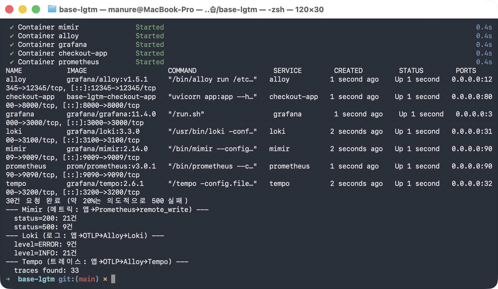
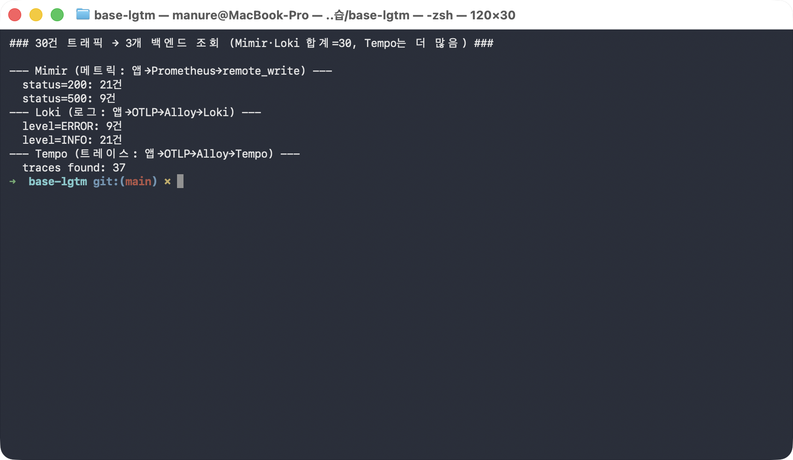
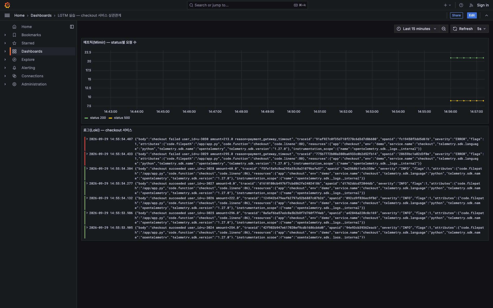

# followup.md — LGTM 스택 메트릭·로그·트레이스 상관관계 직접 따라하기

이 가이드는 checkout 서비스 하나가 만들어내는 메트릭·로그·트레이스가 Prometheus→Mimir,
Grafana Alloy→Loki/Tempo라는 서로 다른 두 경로를 거쳐 각각 저장된 뒤, 정말로 같은
요청 수를 담고 있는지 직접 손으로 확인하는 실습입니다.

## 필요한 파일

| 파일/폴더                                                             | 역할                                                                           |
| --------------------------------------------------------------------- | ------------------------------------------------------------------------------ |
| `docker-compose.yml`                                                | checkout-app·Prometheus·Mimir·Loki·Tempo·Alloy·Grafana 7개 컨테이너 정의 |
| `app/`                                                              | checkout 서비스(FastAPI) —`/metrics`, `/checkout`, `/healthz`           |
| `prometheus/prometheus.yml`                                         | checkout-app 스크레이핑 + Mimir로`remote_write`                              |
| `mimir/mimir.yaml`, `loki/loki-config.yaml`, `tempo/tempo.yaml` | 각 백엔드의 로컬 저장 설정                                                     |
| `alloy/config.alloy`                                                | OTLP(로그+트레이스) 수신 → Loki/Tempo로 분기 라우팅                           |
| `grafana/provisioning/`                                             | 데이터소스 3개 + 상관관계 대시보드 자동 등록                                   |

**필요한 도구**: Docker(+Compose), `curl`, `python3`(응답 JSON을 보기 좋게 뽑아내는 용도).

## 무엇을 확인해야 하는가

checkout 엔드포인트에 요청을 N번 보내면, **서로 다른 경로로 저장된 두 백엔드(Mimir·Loki)의
합계가 정확히 N과 같아야 정상**입니다.

| 백엔드 | 경로                                                     | 정상 패턴                                                                                                              |
| ------ | -------------------------------------------------------- | ---------------------------------------------------------------------------------------------------------------------- |
| Mimir  | 앱 → Prometheus(스크레이핑) →`remote_write` → Mimir | `status=200` + `status=500` 합계 = 보낸 요청 수                                                                    |
| Loki   | 앱 → OTLP push → Alloy → Loki                         | `level=INFO` + `level=ERROR` 합계 = 보낸 요청 수                                                                   |
| Tempo  | 앱 → OTLP push → Alloy → Tempo                        | 요청 수보다**더 많이** 나오는 게 정상(Prometheus가 `/metrics`를 스크레이핑할 때도 트레이스가 함께 생기기 때문) |

> ⚠️ **컨테이너를 재시작하면 값이 어긋날 수 있습니다** — Mimir 쪽 숫자는 checkout 앱
> 프로세스의 메모리에만 있는 카운터를 스크레이핑한 값이라, 앱 컨테이너가 재시작되면
> 0부터 다시 세지만, Loki에 이미 쌓인 로그는 재시작과 무관하게 영속적으로 남아 있습니다.
> 그래서 **컨테이너를 새로 띄운 직후 한 번에 트래픽을 보내고 바로 조회**해야 두 숫자가
> 깨끗하게 일치하는 걸 볼 수 있습니다(아래 단계 순서를 그대로 따르면 됩니다).

---

## 0단계 — 폴더 이동

```bash
cd base-lgtm
```

## 1단계 — 스택 빌드·기동

```bash
docker compose up -d --build
```

실제 실행 결과(마지막 부분):

```
 Container alloy Starting
 Container mimir Started
 Container grafana Starting
 Container alloy Started
 Container checkout-app Starting
 Container grafana Started
 Container checkout-app Started
 Container prometheus Starting
 Container prometheus Started
```

## 2단계 — checkout-app이 요청을 받을 준비가 됐는지 확인

```bash
for i in $(seq 1 30); do
  if curl -s -o /dev/null "http://localhost:8000/healthz"; then break; fi
  sleep 1
done
docker compose ps
```

7개 컨테이너 모두 `Up`으로 뜬 것을 확인합니다:

```
NAME           IMAGE                    STATUS         PORTS
alloy          grafana/alloy:v1.5.1     Up 1 second    0.0.0.0:12345->12345/tcp
checkout-app   base-checkout-app        Up 1 second    0.0.0.0:8000->8000/tcp
grafana        grafana/grafana:11.4.0   Up 1 second    0.0.0.0:3000->3000/tcp
loki           grafana/loki:3.3.0       Up 1 second    0.0.0.0:3100->3100/tcp
mimir          grafana/mimir:2.14.0     Up 1 second    0.0.0.0:9009->9009/tcp
prometheus     prom/prometheus:v3.0.1   Up 1 second    0.0.0.0:9090->9090/tcp
tempo          grafana/tempo:2.6.1      Up 1 second    0.0.0.0:3200->3200/tcp
```

### 스크린샷 — 1~2단계를 실제로 이어서 실행한 화면



## 3단계 — checkout 엔드포인트에 실제 트래픽 발생

```bash
for i in $(seq 1 30); do
  curl -s "http://localhost:8000/checkout?user_id=u-$((3000+i))&amount=$((RANDOM % 300))" > /dev/null
done
echo "30건 요청 완료 (약 20%는 의도적으로 500 실패)"
```

```
30건 요청 완료 (약 20%는 의도적으로 500 실패)
```

## 4단계 — Mimir에 실제로 쌓인 메트릭 확인 (`remote_write` 반영까지 잠시 대기)

Prometheus 쿼리 API는 raw JSON을 반환하므로, `python3`로 바로 보기 좋게 뽑아냅니다.

```bash
sleep 15
curl -s "http://localhost:9009/prometheus/api/v1/query?query=sum(http_requests_total)+by+(status)" \
  | python3 -c "
import json, sys
d = json.load(sys.stdin)
for r in sorted(d['data']['result'], key=lambda r: r['metric']['status']):
    print(f\"  status={r['metric']['status']}: {r['value'][1]}건\")
"
```

실제 결과:

```
  status=200: 21건
  status=500: 9건
```

## 5단계 — Loki에 실제로 쌓인 로그 개수 확인

```bash
curl -s -G "http://localhost:3100/loki/api/v1/query" \
  --data-urlencode 'query=sum by (level) (count_over_time({service_name="checkout"}[15m]))' \
  | python3 -c "
import json, sys
d = json.load(sys.stdin)
for r in sorted(d['data']['result'], key=lambda r: r['metric']['level']):
    print(f\"  level={r['metric']['level']}: {r['value'][1]}건\")
"
```

실제 결과:

```
  level=ERROR: 9건
  level=INFO: 21건
```

**4단계(21+9=30)와 5단계(21+9=30)가 정확히 3단계에서 보낸 요청 수(30)와 일치**합니다 —
서로 다른 두 경로(Prometheus→Mimir / Alloy→Loki)로 갔는데도 같은 숫자가 나온 것이
이 실습의 핵심입니다. (`status=200`/`status=500` 비율은 앱이 20% 확률로 무작위
실패하도록 만들어져 있어 실행마다 달라집니다 — 아래 "값이 실행마다 달라지는 것들"
참고.)

## 6단계 — Tempo에 실제로 쌓인 트레이스 개수 확인

```bash
curl -s "http://localhost:3200/api/search?tags=service.name%3Dcheckout&limit=200" \
  | python3 -c "
import json, sys
d = json.load(sys.stdin)
print(f\"  traces found: {len(d.get('traces', []))}\")
"
```

실제 결과:

```
  traces found: 37
```

30보다 많이 나온 건 정상입니다 — Prometheus가 `/metrics`를 스크레이핑할 때마다
FastAPI 자동계측이 그 요청 자체의 트레이스도 만들기 때문입니다(`/checkout` 30건 +
`/metrics` 스크레이핑 여러 건, 조회 시점까지 대기한 시간에 따라 개수가 달라집니다).

### 스크린샷 — 3~6단계를 실제로 이어서 실행한 화면



## 7단계 — Grafana에서 같은 데이터를 화면으로 직접 확인

4~6단계는 API로 숫자만 확인했는데, 같은 데이터를 Grafana 대시보드로 보면 "메트릭이 튀는
구간"과 "그 순간의 실제 로그"를 한 화면에서 바로 연결해 볼 수 있습니다. 이 스택은
`docker-compose.yml`을 띄울 때 Mimir·Loki·Tempo 데이터소스와 대시보드 하나가 자동으로
등록되도록(provisioning) 구성돼 있어, 별도 설정 없이 바로 열어보면 됩니다.

```bash
open "http://localhost:3000/d/lgtm-checkout/acfaf14?orgId=1&from=now-15m&to=now"
```

브라우저가 열리면 "LGTM 실습 — checkout 서비스 상관관계" 대시보드가 보이고, 위쪽
**메트릭(Mimir) — status별 요청 수** 패널에 `status 200`(녹색)과 `status 500`(노란색)
두 선이, 아래쪽 **로그(Loki) — checkout 서비스** 패널에 방금 보낸 요청들의 실제 로그
한 줄 한 줄이 뜹니다.

실제 확인한 화면:



로그 한 줄을 펼쳐보면 `"checkout failed user_id=u-3030 amount=213.0 reason=payment_gateway_timeout"`처럼 사람이 읽을 수 있는 메시지와 함께, 그 요청의
`traceid`(예: `91af927c0f35d718f278c6d3d786680`)가 같이 찍혀 있습니다 — 이 traceid로
Tempo를 조회하면 같은 요청의 트레이스(구간별 소요 시간)를 찾을 수 있고, 그 트레이스의
`user_id`·`amount` 속성이 로그의 값과 정확히 일치하는지 대조해보는 것이 "로그·메트릭·
트레이스 상관관계"를 눈으로 확인하는 방법입니다.

> 💡 Grafana는 `GF_AUTH_ANONYMOUS_ENABLED=true`로 띄워져 있어 로그인 없이 바로 조회
> 화면을 볼 수 있습니다. 다만 대시보드를 수정·저장하려면 우측 상단 **Sign in**으로
> 로그인해야 합니다(기본 계정은 이 실습에서 별도로 만들지 않았습니다 — 조회만으로
> 충분합니다).

---

## 값이 실행마다 달라지는 것들 (숫자가 아니라 패턴을 확인하세요)

| 값                                 | 왜 매번 달라지나                                                         | 무엇을 확인해야 하나                                                                                        |
| ---------------------------------- | ------------------------------------------------------------------------ | ----------------------------------------------------------------------------------------------------------- |
| `status=200`/`status=500` 비율 | 20% 확률로 무작위 실패하도록 만들어져 있음                               | 정확히 20%가 아니라 "0건은 아닌지"(둘 다 나와야 정상)                                                       |
| Mimir·Loki 합계 자체              | 몇 번 요청을 보냈는지에 따라 달라짐                                      | **두 백엔드의 합계가 서로 같은지**(요청 수와 일치하는지)                                              |
| Tempo 트레이스 개수                | 스크레이핑 주기(5초)와 대기 시간에 따라`/metrics` 트레이스 개수가 다름 | Mimir·Loki 합계보다**같거나 많은지**                                                                 |
| traceid·spanid                    | 요청마다 새로 생성되는 고유값                                            | 로그에 찍힌 traceid로 Tempo를 조회했을 때**같은 user_id·amount가 나오는지**(7단계 Grafana 화면 참고) |

## 최종 확인표

| 확인 항목                  | 정상 기준             | 이 실행에서 실제로 확인한 값 |
| -------------------------- | --------------------- | ---------------------------- |
| Mimir 합계 = 3단계 요청 수 | 일치해야 함           | 21 + 9 =**30** = 30 ✅ |
| Loki 합계 = 3단계 요청 수  | 일치해야 함           | 21 + 9 =**30** = 30 ✅ |
| Mimir 합계 = Loki 합계     | 일치해야 함           | 30 = 30 ✅                   |
| Tempo 트레이스 수          | Mimir·Loki 합계 이상 | 37 ≥ 30 ✅                  |

---

## 정리

```bash
docker compose down -v
```

Grafana 대시보드로 직접 상관관계를 확인하는 방법은 위 7단계를 참고하세요.
