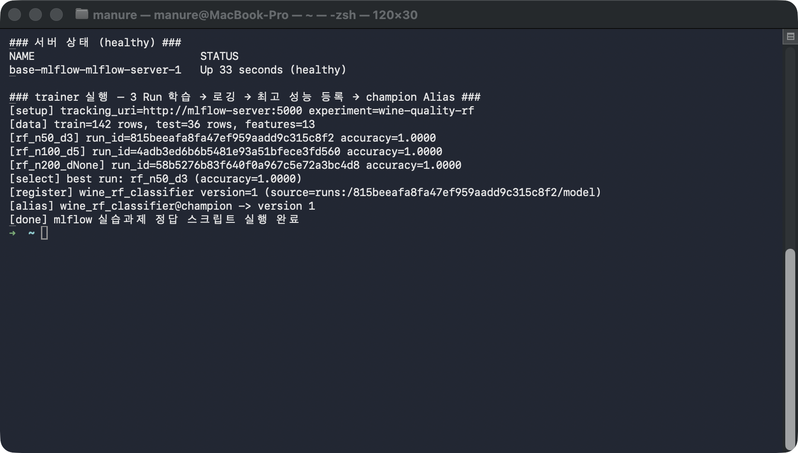
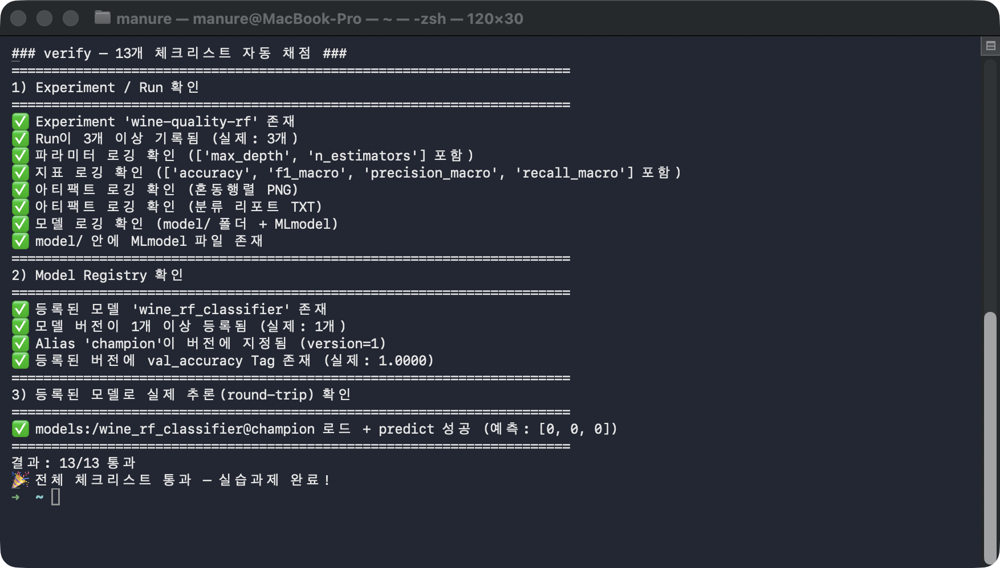
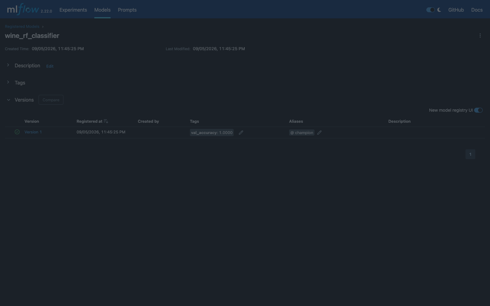

# followup.md — Docker MLflow로 모델 개발 → 로깅 → 등록 한 줄씩 따라하기

MLflow Tracking Server + Model Registry를 Docker로 띄우고, Wine 데이터셋으로
`RandomForestClassifier` 3종을 학습하면서 **①모델 개발 → ②지표/성능 로깅 →
③아티팩트 로깅 → ④모델 등록(champion Alias)** 을 한 줄씩 직접 실행한다. 마지막에
자동 채점 스크립트로 "정말 서버에 다 남았는지" 13개 항목을 확인한다.

## 필요한 파일

| 파일                   | 역할                                                                       | 몇 단계에서 쓰이나 |
| ---------------------- | -------------------------------------------------------------------------- | ------------------ |
| `Dockerfile`         | `python:3.11-slim` + mlflow/scikit-learn/matplotlib(+curl)               | 1단계(빌드)        |
| `docker-compose.yml` | `mlflow-server`(Tracking+Registry) / `trainer` / `verify` 3개 서비스 | 1~5단계            |
| `requirements.txt`   | mlflow 2.22.0, scikit-learn 1.9.0, pandas, numpy, matplotlib               | 1단계              |
| `solution.py`        | 정답 — 4기능 전부 구현(3 Run 학습→로깅→등록→Alias)                     | 3단계              |
| `exercise.py`        | 빈칸(TODO 11개) 버전 — 학습자가 채운다                                    | 3단계(대체 실행)   |
| `verify.py`          | 13개 체크리스트 자동 채점                                                  | 5단계              |

**필요한 CLI 도구**: `docker`(구동 중), `docker compose`, `curl`. 호스트에 Python·MLflow
설치는 필요 없다(전부 이미지 안). 이 문서는 mlflow 2.22.0(Docker Compose, macOS)로 검증했다.

## 무엇을 확인해야 하는가

| 확인 항목          | 정상 패턴                                                            | 변동 여부                              |
| ------------------ | -------------------------------------------------------------------- | -------------------------------------- |
| 서버 STATUS        | `Up ... (healthy)`                                                 | ✅ 고정                                |
| trainer 로그       | `[register] ... version=1` + `[alias] ...@champion -> version 1` | ✅ 패턴 고정                           |
| verify 결과        | **13/13 통과** 🎉                                              | ✅ 고정                                |
| Registry Alias/Tag | `@champion` + `val_accuracy: 1.0000`                             | ✅ 고정                                |
| `run_id`(각 Run) | 매번 다른 32자리 hex                                                 | ⚠️ 값이 아니라 "3개 생겼는지"만 본다 |

> ℹ️ **Wine 데이터셋은 쉬워서 세 조합 모두 accuracy 1.0000**이 나온다 — 이 실습의
> 목적은 성능 튜닝이 아니라 "로깅·등록 파이프라인이 실제로 동작하는가"의 검증이다.
> `run_id`는 매 실행마다 다른 UUID이므로, 숫자를 맞추는 게 아니라 **Run 3개 생성 →
> 최고 1개 등록 → champion Alias**라는 흐름이 재현되는지 본다.

## 0단계 — 이동

```bash
cd base-mlflow
```

## 1단계 — 이미지 빌드 + Tracking Server 기동

```bash
docker compose up -d --build mlflow-server

# healthy가 될 때까지 대기
until [ "$(docker compose ps mlflow-server --format '{{.Health}}')" = "healthy" ]; do
  echo "  ...대기 중"; sleep 2
done
echo "healthy!"
```

`mlflow-server` 컨테이너가 Tracking Server + Model Registry를 함께 띄운다. 메타데이터는
SQLite, 아티팩트는 named volume `mlflow-data`에 저장된다.

**실행 결과 예시**

```
[+] Running 2/2
 ✔ Network base-mlflow_default          Created
 ✔ Container base-mlflow-mlflow-server-1  Started
healthy!
```

## 2단계 — 웹 UI 접속 확인

```bash
curl -s -o /dev/null -w "MLflow UI HTTP %{http_code}\n" http://localhost:5555/health
# 브라우저로도: open http://localhost:5555
```

호스트 5555 → 컨테이너 5000으로 매핑돼 있다(macOS는 AirPlay가 5000을 점유하는 경우가
많아 5555로 옮겼다). `HTTP 200`이면 서버 준비 완료다.

**실행 결과 예시**

```
MLflow UI HTTP 200
```

## 3단계 — 학습 + 로깅 + 등록 실행 (trainer)

```bash
docker compose run --rm trainer
#   학습자 버전으로 하려면 exercise.py의 TODO 11개를 채운 뒤:
#   docker compose run --rm trainer python exercise.py
```

`trainer` 컨테이너가 `MLFLOW_TRACKING_URI=http://mlflow-server:5000`으로 서버에 붙어
`solution.py`를 실행한다. 하이퍼파라미터 3종을 각각 별도 Run으로 학습하면서 파라미터·
지표·아티팩트·모델을 로깅하고, 최고 성능 Run을 골라 Model Registry에 등록한 뒤
`champion` Alias와 `val_accuracy` Tag를 붙인다.

**실행 결과 예시**

```
[setup] tracking_uri=http://mlflow-server:5000 experiment=wine-quality-rf
[data] train=142 rows, test=36 rows, features=13
[rf_n50_d3]     run_id=815beeafa8fa47ef959aadd9c315c8f2 accuracy=1.0000
[rf_n100_d5]    run_id=4adb3ed6b6b5481e93a51bfece3fd560 accuracy=1.0000
[rf_n200_dNone] run_id=58b5276b83f640f0a967c5e72a3bc4d8 accuracy=1.0000
[select] best run: rf_n50_d3 (accuracy=1.0000)
[register] wine_rf_classifier version=1 (source=runs:/815beeafa.../model)
[alias] wine_rf_classifier@champion -> version 1
[done] mlflow 실습과제 정답 스크립트 실행 완료
```



## 4단계 — 자동 채점 (verify)

```bash
docker compose run --rm verify
```

`verify` 컨테이너가 `MlflowClient`로 **실제 서버 상태를 조회**해 13개 항목을
채점한다. 코드가 에러 없이 끝났어도 실제로 서버에 안 남았으면 여기서 걸린다.
(1)Experiment/Run·파라미터·지표·아티팩트·모델, (2)Registry 등록·Alias·Tag,
(3)`models:/wine_rf_classifier@champion` 로드 + predict round-trip을 전부 확인한다.

**실행 결과 예시**

```
1) Experiment / Run 확인
✅ Experiment 'wine-quality-rf' 존재
✅ Run이 3개 이상 기록됨 (실제: 3개)
✅ 파라미터 로깅 확인 / ✅ 지표 로깅 확인
✅ 아티팩트 로깅 확인 (PNG) / ✅ (TXT) / ✅ 모델 로깅 (model/ + MLmodel)
2) Model Registry 확인
✅ 등록된 모델 'wine_rf_classifier' 존재 / ✅ 버전 1개 이상
✅ Alias 'champion' 지정됨 (version=1) / ✅ val_accuracy Tag 존재 (1.0000)
3) 등록된 모델로 실제 추론(round-trip) 확인
✅ models:/wine_rf_classifier@champion 로드 + predict 성공 (예측: [0, 0, 0])

결과: 13/13 통과
🎉 전체 체크리스트 통과 — 실습과제 완료!
```



## 5단계 — 웹 UI에서 등록 결과 확인 (선택)

```bash
open "http://localhost:5555/#/models/wine_rf_classifier"
```

Model Registry에서 Version 1이 `val_accuracy: 1.0000` Tag와 `@champion` Alias를 달고
등록된 것을 시각적으로 확인할 수 있다.



## 6단계 — 정리

```bash
docker compose down          # 컨테이너만 종료 (mlflow-data 볼륨 유지 → 기록 보존)
# docker compose down -v     # 볼륨까지 초기화(다시 처음부터)
```

## 최종 비교표

| 확인 항목           | 이 문서의 값 | 직접 실행한 값                   |
| ------------------- | ------------ | -------------------------------- |
| 서버 STATUS         | Up (healthy) | **Up (healthy), HTTP 200** |
| 학습된 Run 개수     | 3            | **6**                      |
| 등록된 모델 버전    | version=1    | **version=1, 2**           |
| champion Alias 지정 | ✅           | ✅                               |
| val_accuracy Tag    | 1.0000       | **1.0000**                 |
| verify 결과         | 13/13 통과   | **13개 항목 모두 ✅**      |

verify가 직접 실행에서도 13/13으로 나왔다면 — 컨테이너로 띄운 MLflow에 대고 모델
개발·지표/성능 로깅·아티팩트 로깅·모델 등록(Alias/Tag)까지 전 과정이 실제로 서버에
남는 것을 스스로 확인한 것이다.

---

전체 배경·아키텍처(왜 `--serve-artifacts`인가)·개념 링크는 [README.md](README.md) 참고.
