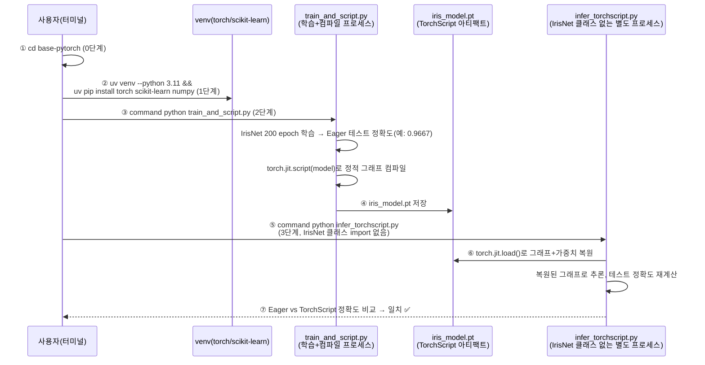
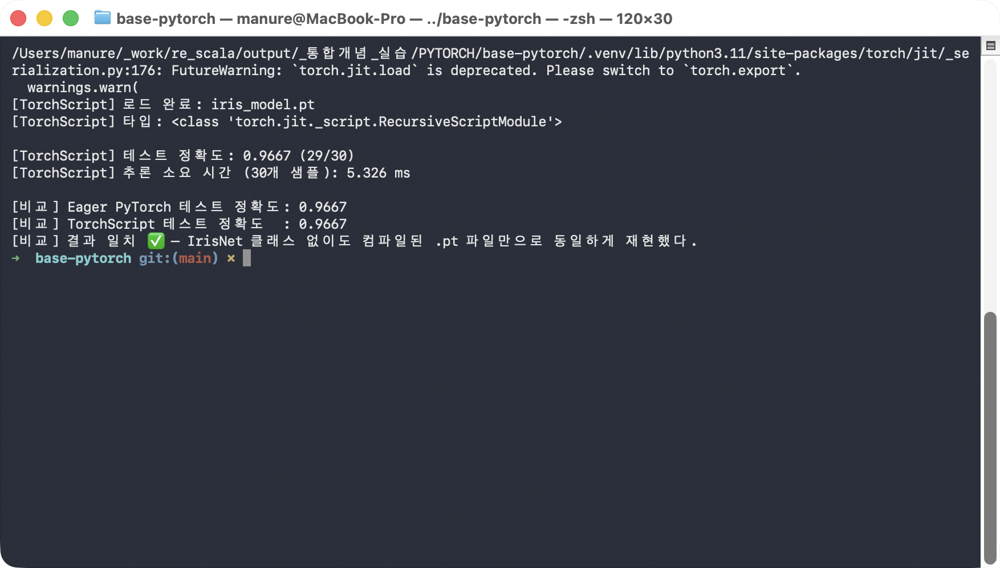

# followup.md — PyTorch 모델 학습 → TorchScript 컴파일 → 클래스 정의 없이 로드 → 추론 한 줄씩 따라하기

`IrisNet`(PyTorch `nn.Module`)을 학습해 `torch.jit.script`로 TorchScript(`.pt`)로
컴파일한 뒤, **`IrisNet` 클래스 정의를 어디에도 import하지 않는** 완전히 새로운
프로세스에서 그 `.pt` 파일만으로 추론해본다. 핵심 질문은 하나다 — "모델 클래스
코드를 몰라도, 컴파일된 아티팩트 하나만으로 학습 때와 똑같은 정확도를 재현할
수 있는가?"

### 전체 흐름 한눈에 보기



| 번호 | 단계 | 핵심 확인 포인트 |
|---|---|---|
| ①~② | 0~1단계 | 폴더 이동 + 가상환경/패키지 준비 |
| ③~④ | 2단계 | 같은 프로세스 안에서 학습 후 Eager 정확도 확인, `torch.jit.script`로 컴파일해 `.pt` 저장 |
| ⑤~⑥ | 3단계 | **`IrisNet` 클래스 정의가 없는** 별도 프로세스가 `torch.jit.load()`만으로 그래프 복원 |
| ⑦ | 3단계 결과 | Eager PyTorch와 TorchScript의 테스트 정확도가 소수점까지 일치해야 ✅ |

## 필요한 파일

| 파일 | 역할 | 사용 단계 |
|---|---|---|
| `train_and_script.py` | Iris 데이터로 `IrisNet`을 학습하고 `torch.jit.script`로 컴파일해 `iris_model.pt`로 저장 | 2단계 |
| `infer_torchscript.py` | `IrisNet` 클래스를 import하지 않고 `iris_model.pt`만 로드해 추론 + 학습 시 정확도와 비교 | 3단계 |

추가로 필요한 것: Python 3.11, [uv](https://docs.astral.sh/uv/), `torch`·`scikit-learn`·
`numpy`(1단계에서 설치).

> ⚠️ **`python` 명령이 다른 곳을 가리키는 환경이라면**: 이 macOS 환경처럼
> `~/.zshrc`에 `alias python="/opt/homebrew/..."` 같은 별칭이 걸려 있으면,
> `source .venv/bin/activate`를 해도 `python`이 방금 만든 venv가 아니라 그
> 별칭이 가리키는 인터프리터로 실행될 수 있다(패키지가 우연히 같은 버전으로
> 전역에도 깔려 있으면 티가 안 나서 더 위험하다). 아래 모든 명령에서
> `command python`(별칭을 무시하고 PATH의 실제 실행 파일을 쓰라는 셸 내장
> 명령)을 쓰는 이유가 이것이다.

## 무엇을 확인해야 하는가

두 프로세스(학습+컴파일 프로세스 / TorchScript 전용 프로세스)가 서로 다른
시점에 계산한 **테스트 정확도가 소수점까지 정확히 일치**하는지가 판정 기준이다.

| 값 | Eager PyTorch(2단계, 학습 프로세스) | TorchScript(3단계, `IrisNet` 클래스 없는 별도 프로세스) | 판정 |
|---|---|---|---|
| 테스트 정확도 | 실행 시 출력됨 | 실행 시 출력됨 | 두 값이 **소수점까지 동일**해야 ✅ |
| 추론 소요 시간(ms) | (해당 없음) | 실행할 때마다 달라짐 | ❌ 비교 대상 아님 — 정확도 일치 여부만 본다 |

> ⚠️ **실행마다 달라지는 값**: 3단계의 `추론 소요 시간(ms)`은 머신 상태에 따라
> 매번 다르게 나온다(이 문서 캡처본에서는 5.326ms). 그 숫자가 무엇이 나오든
> 상관없고, **두 정확도가 일치하는지**만 확인하면 된다.
>
> ℹ️ 콘솔에 `FutureWarning: torch.jit.script is deprecated. Please switch to
> torch.compile or torch.export.` 같은 경고가 함께 찍힐 수 있는데, 이건
> PyTorch 버전이 올라가며 생기는 안내일 뿐 — 결과에는 영향을 주지 않으므로
> 무시하고 진행하면 된다.

## 0단계 — 이동

```bash
cd base-pytorch
```

## 1단계 — 가상환경 준비

```bash
uv venv --python 3.11 --clear .venv
source .venv/bin/activate
uv pip install --quiet torch scikit-learn numpy
command python -c "import torch, sklearn; print('torch', torch.__version__); print('scikit-learn', sklearn.__version__)"
```

**실행 결과 예시**

```
Using CPython 3.11.15
Creating virtual environment at: .venv
Activate with: source .venv/bin/activate
torch 2.14.0
scikit-learn 1.9.0
```

## 2단계 — 모델 학습 + TorchScript 컴파일

```bash
command python train_and_script.py
```

Iris 데이터셋(150 샘플, 4 특성, 3 클래스)을 8:2로 나눠 `IrisNet`을 200 epoch
학습한 뒤, 평범한 PyTorch eager mode로 테스트 정확도를 먼저 확인한다. 그다음
`torch.jit.script(model)`이 `forward()`의 Python 코드를 직접 분석해 정적
그래프(`ScriptModule`)로 컴파일하고, 그 결과를 `iris_model.pt`로 저장한다.

**실행 결과 예시**

```
torch 2.14.0
scikit-learn 1.9.0

  epoch  50/200  loss=0.0423
  epoch 100/200  loss=0.0361
  epoch 150/200  loss=0.0324
  epoch 200/200  loss=0.0053
[Eager PyTorch] 테스트 정확도: 0.9667 (29/30)
[TorchScript] 컴파일된 그래프(code):
def forward(self,
    x: Tensor) -> Tensor:
  net = self.net
  return (net).forward(x, )

[TorchScript] 저장 완료: iris_model.pt
[TorchScript(같은 프로세스)] 테스트 정확도: 0.9667
[데이터] 테스트셋 저장 완료: test_data.npz

총 소요 시간: 0.62s
```

이 시점의 테스트 정확도(`0.9667`)를 잘 기억해두자 — 3단계 마지막에 이 값과
다시 비교한다. `[TorchScript(같은 프로세스)]` 줄은 컴파일 직후 같은 프로세스
안에서 한 번 더 확인한 값으로, 3단계로 넘어가기 전 "컴파일 자체는 정상"이라는
중간 확인일 뿐 최종 판정 대상은 아니다.


## 3단계 — TorchScript(.pt)만으로 추론 + 비교

```bash
command python infer_torchscript.py
```

**여기서부터가 이 실습의 핵심이다.** 이 스크립트는 `IrisNet` 클래스를 어디에도
import하지 않는다 — 정의 자체가 이 프로세스에 없다. `torch.jit.load()`만으로
`.pt` 파일 안에 저장된 그래프와 가중치를 그대로 복원해 추론을 실행한다.

**실행 결과 예시**

```
[TorchScript] 로드 완료: iris_model.pt
[TorchScript] 타입: <class 'torch.jit._script.RecursiveScriptModule'>

[TorchScript] 테스트 정확도: 0.9667 (29/30)
[TorchScript] 추론 소요 시간 (30개 샘플): 5.326 ms

[비교] Eager PyTorch 테스트 정확도: 0.9667
[비교] TorchScript 테스트 정확도  : 0.9667
[비교] 결과 일치 ✅ — IrisNet 클래스 없이도 컴파일된 .pt 파일만으로 동일하게 재현했다.
```

`[비교]` 줄 두 개(Eager PyTorch vs TorchScript)가 소수점까지 동일하고, 마지막에
`결과 일치 ✅`가 찍혔다면 — `IrisNet` 클래스 코드 없이 컴파일된 `.pt` 파일
하나만으로 완전히 동일한 모델을 복원했다는 뜻이다.



## 최종 비교표

| 항목 | 이 문서의 캡처값 | 직접 실행한 값 |
|---|---|---|
| Eager PyTorch 테스트 정확도 (2단계) | 0.9667 (29/30) | |
| TorchScript 테스트 정확도 (3단계) | 0.9667 (29/30) | |
| 두 정확도 일치 여부 | ✅ 일치 | |
| 추론 소요 시간(3단계) | 5.326 ms *(참고용 — 실행마다 다름, 판정 기준 아님)* | |

두 정확도 값이 직접 실행에서도 소수점까지 똑같이 나왔다면 — 모델 클래스 코드
없이도 컴파일된 TorchScript 아티팩트 하나만으로 학습된 모델을 그대로 재현할
수 있다는 것을 스스로 확인한 것이다.
