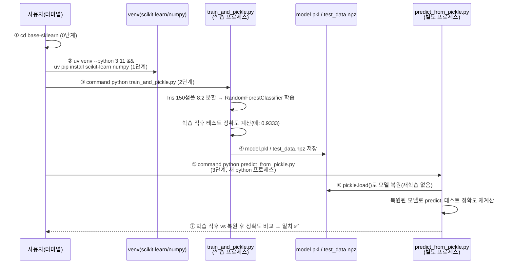
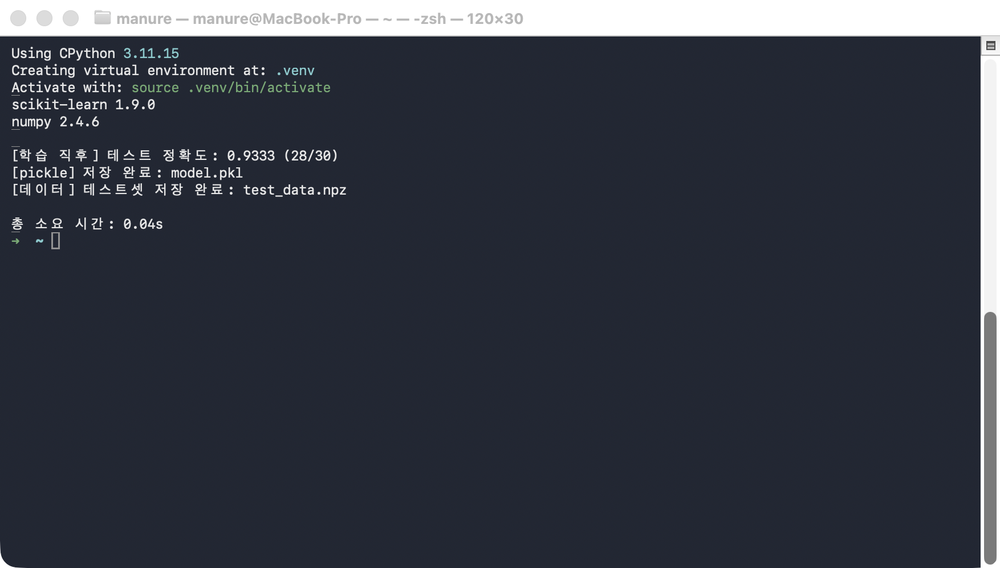
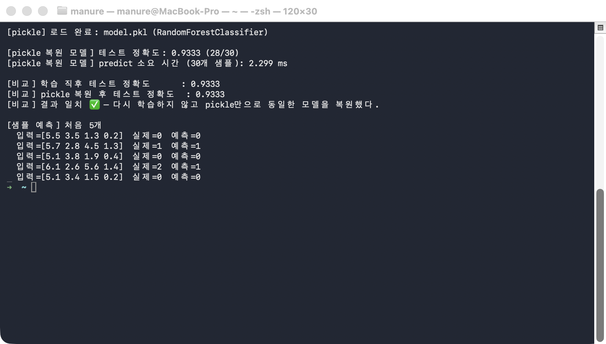

# followup.md — scikit-learn 모델 학습 → pickle 저장 → pickle 복원 → predict 한 줄씩 따라하기

`RandomForestClassifier`를 학습해 `pickle`로 저장한 뒤, **완전히 새로운 python
프로세스**에서 그 파일만으로 모델을 복원해 predict까지 실행해본다. 핵심 질문은
하나다 — "다시 학습하지 않고도, 저장된 pickle 파일만으로 학습 직후와 똑같은
결과를 재현할 수 있는가?"

### 전체 흐름 한눈에 보기



| 번호 | 단계 | 핵심 확인 포인트 |
|---|---|---|
| ①~② | 0~1단계 | 폴더 이동 + 가상환경/패키지 준비 |
| ③~④ | 2단계 | 같은 프로세스 안에서 학습 후 테스트 정확도 출력, `model.pkl`로 저장 |
| ⑤~⑥ | 3단계 | **별도 프로세스**가 `fit()` 호출 없이 `pickle.load()`만으로 모델 복원 |
| ⑦ | 3단계 결과 | 두 프로세스의 테스트 정확도가 소수점까지 일치해야 ✅ |

## 필요한 파일

| 파일 | 역할 | 사용 단계 |
|---|---|---|
| `train_and_pickle.py` | Iris 데이터로 `RandomForestClassifier`를 학습하고 `model.pkl`·`test_data.npz`로 저장 | 2단계 |
| `predict_from_pickle.py` | `model.pkl`을 로드해(재학습 없이) predict 실행 + 학습 직후 정확도와 비교 | 3단계 |

추가로 필요한 것: Python 3.11, [uv](https://docs.astral.sh/uv/)(가상환경·패키지 설치용),
`scikit-learn`·`numpy`(1단계에서 설치).

> ⚠️ **`python` 명령이 다른 곳을 가리키는 환경이라면**: 이 macOS 환경처럼
> `~/.zshrc`에 `alias python="/opt/homebrew/..."` 같은 별칭이 걸려 있으면,
> `source .venv/bin/activate`를 해도 `python`이 방금 만든 venv가 아니라 그
> 별칭이 가리키는 인터프리터로 실행될 수 있다(패키지가 우연히 같은 버전으로
> 전역에도 깔려 있으면 티가 안 나서 더 위험하다). 아래 모든 명령에서
> `command python`(별칭을 무시하고 PATH의 실제 실행 파일을 쓰라는 셸 내장
> 명령)을 쓰는 이유가 이것이다.

## 무엇을 확인해야 하는가

두 프로세스(학습 프로세스 / predict 프로세스)가 서로 다른 시점에 계산한 **테스트
정확도가 소수점까지 정확히 일치**하는지가 이 실습의 판정 기준이다.

| 값 | 학습 직후(2단계, 학습 프로세스) | pickle 복원 후(3단계, 별도 프로세스) | 판정 |
|---|---|---|---|
| 테스트 정확도 | 실행 시 출력됨 | 실행 시 출력됨 | 두 값이 **소수점까지 동일**해야 ✅ |
| predict 소요 시간(ms) | (해당 없음) | 실행할 때마다 달라짐 | ❌ 비교 대상 아님 — 숫자 자체가 아니라 "정확도 일치 여부"만 본다 |

> ⚠️ **실행마다 달라지는 값**: 3단계의 `predict 소요 시간(ms)`은 머신 상태에 따라
> 매번 다르게 나온다(이 문서 캡처본에서는 2.299ms). 그 숫자가 무엇이 나오든 상관없고,
> **정확도 두 값이 일치하는지**만 확인하면 된다.

## 0단계 — 이동

```bash
cd base-sklearn
```

## 1단계 — 가상환경 준비

```bash
uv venv --python 3.11 --clear .venv
source .venv/bin/activate
uv pip install --quiet scikit-learn numpy
command python -c "import sklearn, numpy; print('scikit-learn', sklearn.__version__); print('numpy', numpy.__version__)"
```

**실행 결과 예시**

```
Using CPython 3.11.15
Creating virtual environment at: .venv
Activate with: source .venv/bin/activate
scikit-learn 1.9.0
numpy 2.4.6
```

## 2단계 — 모델 학습 + pickle 저장

```bash
command python train_and_pickle.py
```

Iris 데이터셋(150 샘플, 4 특성, 3 클래스)을 8:2로 나눠 `RandomForestClassifier`를
학습하고, 학습 직후(같은 프로세스) 테스트 정확도를 먼저 출력한 뒤 — 학습된 model
객체 전체(트리 구조·가중치)를 `model.pkl`로, 다음 단계가 재사용할 테스트셋을
`test_data.npz`로 각각 저장한다.

**실행 결과 예시**

```
scikit-learn 1.9.0
numpy 2.4.6

[학습 직후] 테스트 정확도: 0.9333 (28/30)
[pickle] 저장 완료: model.pkl
[데이터] 테스트셋 저장 완료: test_data.npz

총 소요 시간: 0.04s
```

이 시점의 테스트 정확도(`0.9333`)를 잘 기억해두자 — 3단계 마지막에 이 값과
다시 비교한다.



## 3단계 — pickle 복원 + predict + 비교

```bash
command python predict_from_pickle.py
```

**여기서부터가 이 실습의 핵심이다.** 이 명령은 2단계와 **별도의 python
프로세스**로 실행된다 — 즉 2단계에서 메모리에 있던 `model` 변수는 이미
사라진 상태이고, 이 프로세스는 `RandomForestClassifier(...).fit(...)`을 단
한 번도 호출하지 않는다. 오직 `model.pkl`을 `pickle.load()`로 읽어 복원한
객체만으로 predict를 실행한다.

**실행 결과 예시**

```
[pickle] 로드 완료: model.pkl (RandomForestClassifier)

[pickle 복원 모델] 테스트 정확도: 0.9333 (28/30)
[pickle 복원 모델] predict 소요 시간 (30개 샘플): 2.299 ms

[비교] 학습 직후 테스트 정확도      : 0.9333
[비교] pickle 복원 후 테스트 정확도  : 0.9333
[비교] 결과 일치 ✅ — 다시 학습하지 않고 pickle만으로 동일한 모델을 복원했다.

[샘플 예측] 처음 5개
  입력=[5.5 3.5 1.3 0.2]  실제=0  예측=0
  입력=[5.7 2.8 4.5 1.3]  실제=1  예측=1
  입력=[5.1 3.8 1.9 0.4]  실제=0  예측=0
  입력=[6.1 2.6 5.6 1.4]  실제=2  예측=1
  입력=[5.1 3.4 1.5 0.2]  실제=0  예측=0
```

`[비교]` 줄 두 개(학습 직후 vs pickle 복원 후)가 소수점까지 동일하고, 마지막에
`결과 일치 ✅`가 찍혔다면 — 재학습 없이 pickle 파일만으로 완전히 동일한 모델을
복원했다는 뜻이다. (참고: `실제=2 예측=1`처럼 개별 샘플 하나가 틀리는 것은 정상이다 —
30개 중 28개를 맞혀 정확도 0.9333이 나온 것이지 100%가 아니다. 여기서 확인할 것은
"개별 예측이 다 맞는가"가 아니라 "두 프로세스의 정확도가 서로 일치하는가"다.)



## 최종 비교표

| 항목 | 이 문서의 캡처값 | 직접 실행한 값 |
|---|---|---|
| 학습 직후 테스트 정확도 (2단계) | 0.9333 (28/30) | |
| pickle 복원 후 테스트 정확도 (3단계) | 0.9333 (28/30) | |
| 두 정확도 일치 여부 | ✅ 일치 | |
| predict 소요 시간(3단계) | 2.299 ms *(참고용 — 실행마다 다름, 판정 기준 아님)* | |

두 정확도 값이 직접 실행에서도 소수점까지 똑같이 나왔다면 — 재학습 없이 pickle
파일 하나만으로 학습된 모델을 그대로 재현할 수 있다는 것을 스스로 확인한 것이다.
