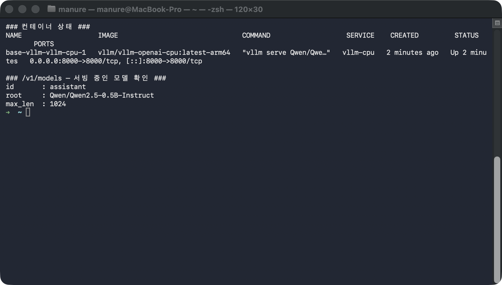
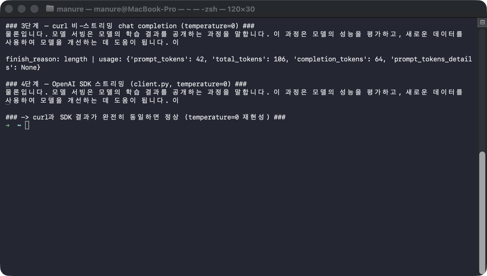

# followup.md — Docker로 vLLM OpenAI 호환 API 띄우고 curl·SDK로 확인하기

NVIDIA GPU 없이(Apple Silicon Mac의 Docker Linux VM **ARM CPU**만으로) vLLM의
OpenAI 호환 API 서버를 Docker로 띄운 뒤, **①모델 목록 조회 → ②curl 비-스트리밍
chat completion → ③OpenAI SDK 스트리밍 chat completion** 을 한 줄씩 직접 실행해
전부 실제 HTTP 응답을 확인한다. 세 번째까지 가면 "curl로 받은 답과 SDK 스트리밍으로
받은 답이 완전히 같은가"를 눈으로 대조한다.

## 필요한 파일

| 파일 | 역할 | 몇 단계에서 쓰이나 |
|---|---|---|
| `compose.yaml` | `vllm/vllm-openai-cpu:latest-arm64` 이미지로 `Qwen2.5-0.5B-Instruct`를 ARM CPU 백엔드로 서빙 | 1단계 |
| `client.py` | OpenAI SDK로 `stream=True` chat completion — 토큰을 하나씩 스트리밍 수신 (`temperature=0`으로 재현성 고정) | 4단계 |

**필요한 CLI 도구**: `docker`(구동 중이어야 함), `docker compose`, `curl`,
[`uv`](https://docs.astral.sh/uv/)(4단계에서 openai SDK용 venv 생성), `python3`.
이 문서는 macOS(Apple Silicon) + Docker Desktop으로 실제 검증했다.

## 무엇을 확인해야 하는가

| 확인 항목 | 정상 패턴 | 변동 여부 |
|---|---|---|
| 컨테이너 STATUS | `Up ...` | ✅ 고정 |
| `/v1/models`의 `id` / `root` | `assistant` / `Qwen/Qwen2.5-0.5B-Instruct` | ✅ 고정 |
| curl 응답 텍스트 | "물론입니다. 모델 서빙은 ..." | ✅ 고정 (`temperature=0` greedy decoding) |
| **curl 텍스트 == SDK 스트리밍 텍스트** | **완전히 동일** | ✅ 이게 핵심 판정 |
| `finish_reason` / `completion_tokens` | `length` / `64` | ✅ 고정(64토큰 제한) |

> ⚠️ **`temperature=0`이 없으면 매번 달라진다**: 샘플링 파라미터를 지정하지 않으면
> vLLM 기본 샘플링 때문에 "그 컨테이너에서 몇 번째 추론 요청인가"에 따라 답이 크게
> 흔들린다(같은 컨테이너에서 curl을 3번 부르면 3번 다 다른 답이 나온 사례가 있다).
> 이 실습은 `client.py`와 curl 양쪽에 `temperature=0`을 넣어 **curl과 SDK가 토씨
> 하나 안 틀리고 같은 답**을 내는 것을 판정 기준으로 삼는다. (배경은 README의
> "원인 분석" 참고.)
>
> ℹ️ **최초 실행은 오래 걸린다**: 모델을 처음 내려받을 때는 50~150초가 걸리고
> (이 문서 검증 시 112초), 이후로는 캐시 볼륨(`hf-cache-cpu`)을 재사용해 빨라진다.

## 0단계 — 이동 + API 키 설정

```bash
cd base-vllm
export VLLM_API_KEY="vllm-base-practice-secret-key"   # compose가 요구하는 키(임의 값 가능)
```

`compose.yaml`이 `--api-key=${VLLM_API_KEY}`를 요구하므로, 컨테이너를 올리거나
내리는 모든 `docker compose` 명령에서 이 환경변수가 설정돼 있어야 한다.

## 1단계 — vLLM 서버 기동 + 준비 대기

```bash
docker compose up -d

# 서버가 준비될 때까지 대기 (모델 최초 다운로드 포함, 최대 180초)
BASE_URL="http://127.0.0.1:8000/v1"
for i in $(seq 1 180); do
  if curl -s -f -H "Authorization: Bearer ${VLLM_API_KEY}" "${BASE_URL}/models" >/dev/null 2>&1; then
    echo "준비 완료 (${i}초)"; break
  fi
  sleep 1
done
```

`docker compose up -d`가 ARM CPU용 vLLM 컨테이너를 띄운다. `/v1/models`가 200을
줄 때까지(=모델 로딩 완료) 폴링한다.

**실행 결과 예시**

```
[+] Running 2/2
 ✔ Network base-vllm_default          Created
 ✔ Container base-vllm-vllm-cpu-1     Started
준비 완료 (112초)
```

## 2단계 — /v1/models 로 서빙 중인 모델 확인

```bash
curl -s -H "Authorization: Bearer ${VLLM_API_KEY}" "http://127.0.0.1:8000/v1/models" \
  | python3 -c 'import json,sys; d=json.load(sys.stdin)["data"][0]; print("id      :", d["id"]); print("root    :", d["root"]); print("max_len :", d["max_model_len"])'
```

요청한 대로 `Qwen/Qwen2.5-0.5B-Instruct`를 `assistant`라는 이름으로, context
길이 1024로 서빙 중임을 확인한다.

**실행 결과 예시**

```
id      : assistant
root    : Qwen/Qwen2.5-0.5B-Instruct
max_len : 1024
```



## 3단계 — curl 비-스트리밍 chat completion (`temperature=0`)

```bash
curl -s -X POST "http://127.0.0.1:8000/v1/chat/completions" \
  -H "Authorization: Bearer ${VLLM_API_KEY}" -H "Content-Type: application/json" \
  -d '{"model":"assistant","messages":[{"role":"user","content":"모델 서빙을 한 문장으로 설명해줘."}],"max_tokens":64,"temperature":0}' \
  | python3 -c 'import json,sys; d=json.load(sys.stdin); print(d["choices"][0]["message"]["content"]); print(); print("finish_reason:", d["choices"][0]["finish_reason"], "| usage:", d["usage"])'
```

원시 HTTP로 chat completion을 한 번 요청한다. `max_tokens=64` 제한에 걸려
`finish_reason: length`로 끊긴다. 이 답 텍스트를 **4단계 결과와 비교**할 기준으로
기억해두자.

**실행 결과 예시**

```
물론입니다. 모델 서빙은 모델의 학습 결과를 공개하는 과정을 말합니다. 이 과정은 모델의 성능을 평가하고, 새로운 데이터를 사용하여 모델을 개선하는 데 도움이 됩니다. 이

finish_reason: length | usage: {'prompt_tokens': 42, 'total_tokens': 106, 'completion_tokens': 64, 'prompt_tokens_details': None}
```

## 4단계 — OpenAI SDK 스트리밍 chat completion (`temperature=0`)

```bash
# openai SDK용 격리 venv 준비 (최초 1회)
[ -d .venv ] || uv venv --python 3.11 .venv
.venv/bin/python3 -c "import openai" 2>/dev/null || uv pip install --python .venv/bin/python3 'openai>=1.60,<3'

# 같은 질문을 이번엔 OpenAI SDK로 stream=True 요청 — 토큰이 하나씩 도착
export OPENAI_BASE_URL="http://127.0.0.1:8000/v1"
.venv/bin/python3 client.py
```

`client.py`는 실제 OpenAI SDK로 `stream=True` 요청을 보내 토큰을 하나씩 받아
출력한다. **3단계 curl 결과와 완전히 같은 텍스트**가 나오면, "curl과 SDK가 다른
답을 낸다"는 흔한 오해가 실은 샘플링 파라미터 미지정 탓이었고, `temperature=0`으로
고정하면 클라이언트·스트리밍 여부와 무관하게 같은 답이 나온다는 걸 확인한 것이다.

**실행 결과 예시**

```
물론입니다. 모델 서빙은 모델의 학습 결과를 공개하는 과정을 말합니다. 이 과정은 모델의 성능을 평가하고, 새로운 데이터를 사용하여 모델을 개선하는 데 도움이 됩니다. 이
```



## 5단계 — 정리

```bash
docker compose down          # 컨테이너 종료 (VLLM_API_KEY가 export돼 있어야 함)
# 모델 캐시 볼륨(hf-cache-cpu)은 남겨둬 다음 실행이 빨라진다.
# 캐시까지 지우려면: docker compose down -v
```

## 최종 비교표

| 확인 항목 | 이 문서의 값 | 직접 실행한 값 |
|---|---|---|
| `/v1/models` id / root | assistant / Qwen2.5-0.5B-Instruct | |
| curl 응답 첫 문장 | 물론입니다. 모델 서빙은 ... | |
| curl `finish_reason` / `completion_tokens` | length / 64 | |
| SDK 스트리밍 응답 | curl과 **동일** | |
| curl == SDK 텍스트 | ✅ 완전히 같음 | |

curl 응답과 SDK 스트리밍 응답이 직접 실행에서도 완전히 같은 텍스트로 나왔다면 —
GPU 없이 Docker ARM CPU만으로 vLLM OpenAI 호환 API가 실제로 동작하고,
`temperature=0`이 curl·SDK 양쪽에서 재현성을 보장한다는 것을 스스로 확인한 것이다.
