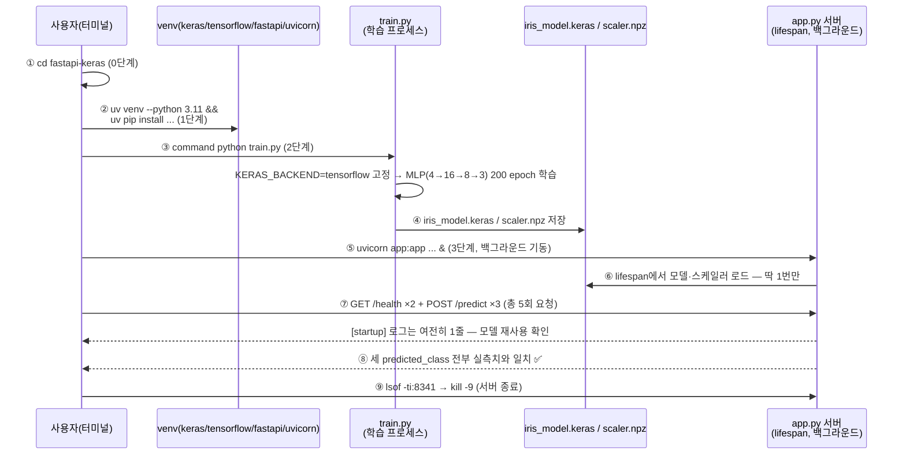
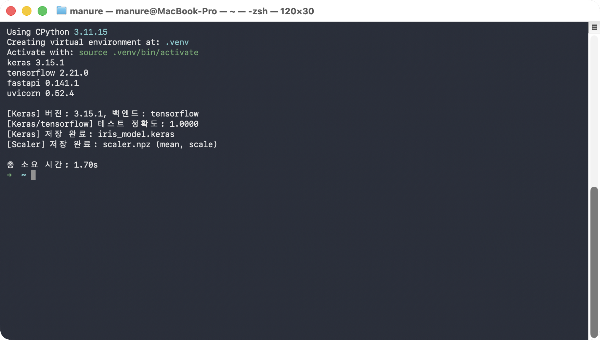

# followup.md — FastAPI + Keras(TensorFlow 백엔드) 서빙 한 줄씩 따라하기

Keras(TensorFlow 백엔드)로 학습한 모델을 `.keras` 파일로 저장한 뒤, FastAPI
서버의 `lifespan`에서 그 파일을 **프로세스 생애주기 동안 딱 한 번만** 로드하고,
이후 들어오는 모든 `/predict` 요청이 그 하나의 모델 객체를 재사용하는지
확인한다. 핵심 질문은 하나다 — "요청마다 모델을 다시 로드하지 않고도, 서로
다른 세 가지 입력을 전부 정확히 예측할 수 있는가?"

### 전체 흐름 한눈에 보기



| 번호 | 단계 | 핵심 확인 포인트 |
|---|---|---|
| ①~② | 0~1단계 | 폴더 이동 + 가상환경/패키지 준비 |
| ③~④ | 2단계 | 별도 프로세스에서 학습 후 `iris_model.keras`/`scaler.npz` 저장 |
| ⑤~⑥ | 3단계 | `lifespan`이 서버 기동 시점에 모델을 **딱 한 번만** 로드 |
| ⑦ | 3단계 결과 | `/health`·`/predict` 총 5회를 불러도 `[startup]` 로그는 1줄 그대로 — 재로드 없음 |
| ⑧ | 3단계 결과 | 같은 모델 객체로 서로 다른 입력 3건을 모두 정확히 분류 |
| ⑨ | 3단계 종료 | 확인이 끝나면 서버 프로세스 종료 |

## 필요한 파일

| 파일 | 역할 | 사용 단계 |
|---|---|---|
| `train.py` | `KERAS_BACKEND=tensorflow`로 고정해 Iris 모델을 학습하고 `iris_model.keras`·`scaler.npz`로 저장 | 2단계 |
| `app.py` | `lifespan`에서 모델·스케일러를 한 번만 로드해 `/health`·`/predict`로 서빙하는 FastAPI 앱 | 3단계 |

추가로 필요한 것: Python 3.11, [uv](https://docs.astral.sh/uv/), `curl`,
`keras`·`tensorflow`·`scikit-learn`·`numpy`·`fastapi`·`uvicorn[standard]`
(1단계에서 설치).

> ⚠️ **`python` 명령이 다른 곳을 가리키는 환경이라면**: 이 macOS 환경처럼
> `~/.zshrc`에 `alias python="/opt/homebrew/..."` 같은 별칭이 걸려 있으면,
> `source .venv/bin/activate`를 해도 `python`이 방금 만든 venv가 아니라 그
> 별칭이 가리키는 인터프리터로 실행돼 `ModuleNotFoundError`가 나거나(이 문서에서
> 실제로 `keras` 모듈을 못 찾는 것으로 확인됨), 조용히 다른 버전의 패키지로
> 실행될 수 있다. 아래 모든 명령에서 `command python`(별칭을 무시하고 PATH의
> 실제 실행 파일을 쓰라는 셸 내장 명령)을 쓰는 이유가 이것이다 — `python` 앞에
> `command`를 붙이면 별칭 유무와 상관없이 항상 지금 활성화된 venv의 인터프리터가
> 실행된다.

## 무엇을 확인해야 하는가

| 값 | 기대값 | 확인 방법 |
|---|---|---|
| `server.log`의 `[startup]` 로그 등장 횟수 | **정확히 1번** — `/health`를 몇 번 부르든 늘어나지 않아야 정상 | 3단계 `server.log` 출력 |
| `/predict` 3회 각각의 `predicted_class` | 입력한 실측치대로 `setosa`/`versicolor`/`virginica` **전부 정확히 일치** | 3단계 각 응답 |
| `latency_ms` | 실행할 때마다 값이 다름 | ❌ 비교 대상 아님 — 판정 기준은 `predicted_class`뿐 |

> ⚠️ **실행마다 달라지는 값**: 각 `/predict` 응답의 `latency_ms`는 머신 상태에
> 따라 매번 다르게 나온다(이 문서 캡처본에서는 13~58ms). 그 숫자가 무엇이든
> 상관없고, `[startup]` 로그가 1번만 찍혔는지와 세 예측이 전부 맞았는지만
> 확인하면 된다.

## 0단계 — 이동

```bash
cd fastapi-keras
```

## 1단계 — 가상환경 준비

```bash
uv venv --python 3.11 --clear .venv
source .venv/bin/activate
uv pip install --quiet keras tensorflow scikit-learn numpy fastapi "uvicorn[standard]"
command python -c "import keras, tensorflow, fastapi, uvicorn; print('keras', keras.__version__); print('tensorflow', tensorflow.__version__); print('fastapi', fastapi.__version__); print('uvicorn', uvicorn.__version__)"
```

**실행 결과 예시**

```
Using CPython 3.11.15
Creating virtual environment at: .venv
Activate with: source .venv/bin/activate
keras 3.15.1
tensorflow 2.21.0
fastapi 0.141.1
uvicorn 0.52.4
```

## 2단계 — 모델 학습 + 저장

```bash
command python train.py
```

`train.py`는 `keras`를 import하기 **전에** `KERAS_BACKEND=tensorflow`를
고정한 뒤(백엔드는 import 이후엔 바꿀 수 없다), Iris 데이터셋으로 작은
MLP(4→16→8→3)를 200 epoch 학습한다. 학습이 끝나면 `iris_model.keras`로
저장하고, `app.py`가 sklearn 없이도 같은 표준화를 재현할 수 있도록
`StandardScaler`의 `mean_`/`scale_`도 `scaler.npz`로 함께 저장한다.

**실행 결과 예시**

```
keras 3.15.1
tensorflow 2.21.0
fastapi 0.141.1
uvicorn 0.52.4

[Keras] 버전: 3.15.1, 백엔드: tensorflow
[Keras/tensorflow] 테스트 정확도: 1.0000
[Keras] 저장 완료: iris_model.keras
[Scaler] 저장 완료: scaler.npz (mean, scale)

총 소요 시간: 1.70s
```



## 3단계 — FastAPI 서버 기동 + /health + /predict 3회 + 서버 종료

```bash
command uvicorn app:app --host 127.0.0.1 --port 8341 > server.log 2>&1 &

# 서버가 뜰 때까지 대기 (최대 20초)
for i in $(seq 1 40); do
  if curl -s -o /dev/null "http://127.0.0.1:8341/health"; then break; fi
  sleep 0.5
done

curl -s "http://127.0.0.1:8341/health" | command python -m json.tool

curl -s -X POST "http://127.0.0.1:8341/predict" \
  -H "Content-Type: application/json" \
  -d '{"sepal_length_cm": 5.1, "sepal_width_cm": 3.5, "petal_length_cm": 1.4, "petal_width_cm": 0.2}' \
  | command python -m json.tool
# versicolor(7.0,3.2,4.7,1.4), virginica(6.3,3.3,6.0,2.5)도 같은 방식으로 확인

cat server.log

# 확인이 끝나면 서버 종료
lsof -ti:8341 | xargs kill -9
```

`uvicorn`을 백그라운드(`&`)로 띄우면 `app.py`의 `lifespan`이 서버 기동
시점에 `iris_model.keras`를 **딱 한 번** 로드한다. 아래 `server.log`에서
`[startup]` 로그가 정확히 한 줄만 찍힌 것을 확인하자 — `/health` 2회 +
`/predict` 3회, 총 5번 요청했는데도 `[startup]` 로그는 늘어나지 않는다.

**실행 결과 예시**

```
--- GET /health ---
{
    "status": "ok",
    "keras_version": "3.15.1",
    "keras_backend": "tensorflow"
}

--- POST /predict x3 ---
  [setosa] predicted_class=setosa  top_prob=1.0000  latency_ms=57.8766
  [versicolor] predicted_class=versicolor  top_prob=1.0000  latency_ms=13.4419
  [virginica] predicted_class=virginica  top_prob=1.0000  latency_ms=13.9032

--- server.log (startup 로그 확인) ---
INFO:     Started server process [42957]
INFO:     Waiting for application startup.
INFO:     Application startup complete.
INFO:     Uvicorn running on http://127.0.0.1:8341 (Press CTRL+C to quit)
[startup] Keras 모델 로드 완료 (keras 3.15.1, 백엔드=tensorflow)
INFO:     127.0.0.1:62964 - "GET /health HTTP/1.1" 200 OK
INFO:     127.0.0.1:62965 - "GET /health HTTP/1.1" 200 OK
INFO:     127.0.0.1:62966 - "POST /predict HTTP/1.1" 200 OK
INFO:     127.0.0.1:62967 - "POST /predict HTTP/1.1" 200 OK
INFO:     127.0.0.1:62968 - "POST /predict HTTP/1.1" 200 OK

=== 서버 종료 ===
서버 종료 완료
```

`[startup]` 로그는 정확히 1줄, 그 아래 5개의 요청 로그(`GET /health` 2건 +
`POST /predict` 3건)가 남아있다 — 서버가 켜져 있는 동안 모델은 재로드되지
않고 계속 재사용된다는 뜻이다. 그리고 세 요청이 입력한 실측치의 실제
품종(setosa/versicolor/virginica)과 `predicted_class`가 전부 정확히
일치했다.

> ℹ️ 서버 종료 시 셸이 `Killed: 9` 메시지를 출력할 수 있는데, `kill -9`로
> 백그라운드 작업을 종료했다는 정상적인 알림일 뿐 에러가 아니다.


## 최종 비교표

| 항목 | 이 문서의 캡처값 | 직접 실행한 값 |
|---|---|---|
| `[startup]` 로그 등장 횟수 | 1번 | |
| setosa 요청의 `predicted_class` | setosa ✅ | |
| versicolor 요청의 `predicted_class` | versicolor ✅ | |
| virginica 요청의 `predicted_class` | virginica ✅ | |
| `latency_ms` | 13~58 ms *(참고용 — 실행마다 다름, 판정 기준 아님)* | |

세 예측이 직접 실행에서도 전부 정확히 일치했다면 — `.keras` 파일로 저장된
모델을 서버 기동 시 한 번만 로드해 모든 요청에서 재사용하는 서빙 패턴을
스스로 확인한 것이다.
