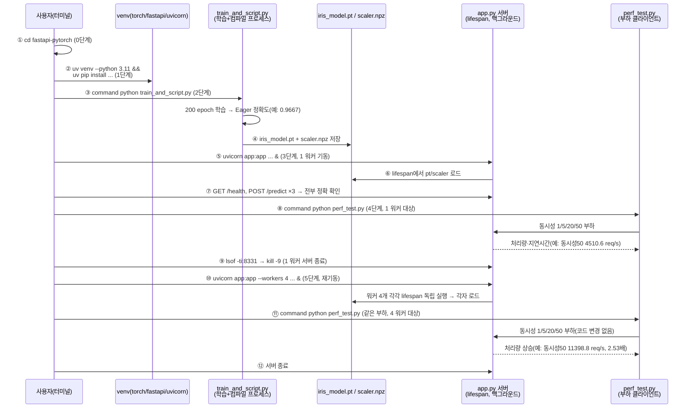
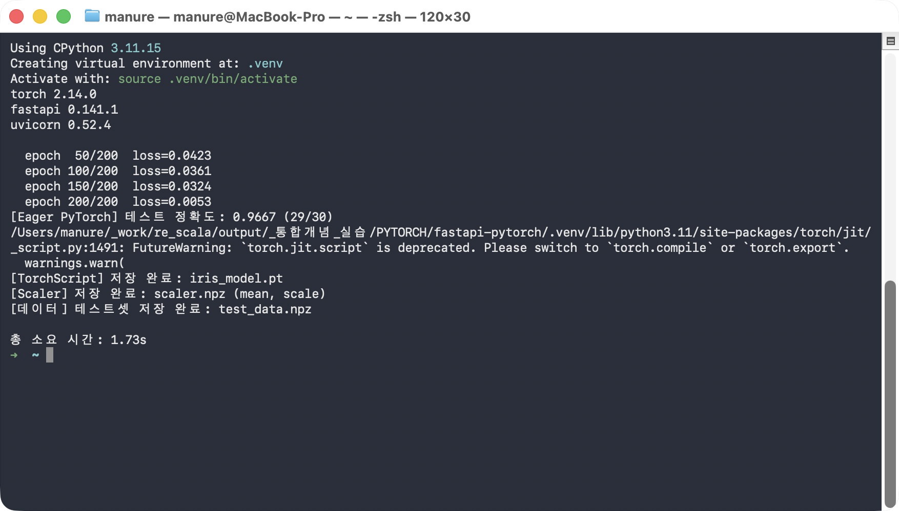
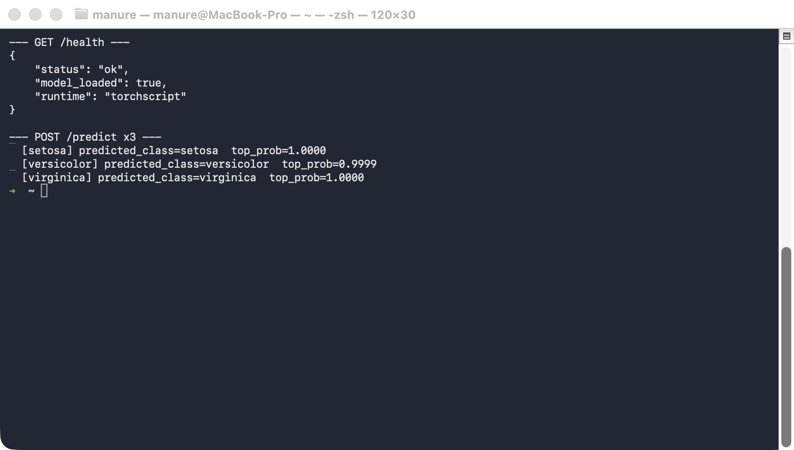
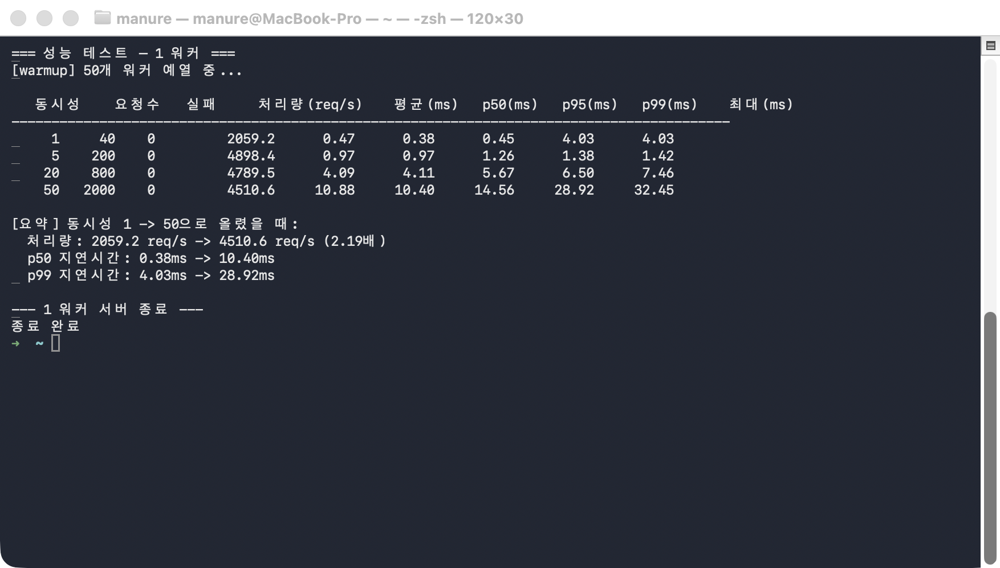
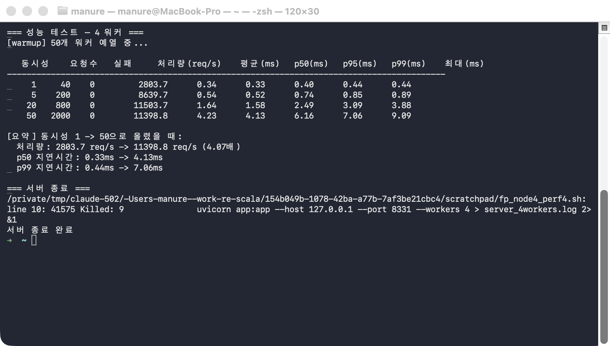

# followup.md — FastAPI + TorchScript 서빙, 1 워커 vs 4 워커 성능 비교 한 줄씩 따라하기

TorchScript(`.pt`)로 컴파일한 모델을 FastAPI로 서빙하면서, **코드를 한 글자도
바꾸지 않고** `uvicorn` 워커 수만 1개 → 4개로 늘렸을 때 처리량과 지연시간이
어떻게 달라지는지 실제 부하 테스트로 확인한다. 핵심 질문은 하나다 — "같은
서빙 코드인데, 프로세스(워커) 수만 늘리면 정말로 처리량이 배로 늘어나는가?"

## 필요한 파일

| 파일 | 역할 | 사용 단계 |
|---|---|---|
| `train_and_script.py` | Iris 데이터로 모델을 학습, `torch.jit.script`로 컴파일해 `iris_model.pt`로 저장 + `scaler.npz`(표준화 파라미터) 저장 | 2단계 |
| `app.py` | `lifespan`에서 `iris_model.pt`·`scaler.npz`를 한 번만 로드해 `/health`·`/predict`로 서빙하는 FastAPI 앱 | 3~5단계 |
| `perf_test.py` | 멀티프로세스 클라이언트로 동시성 1/5/20/50 부하를 걸어 처리량·지연시간(p50/p95/p99)을 측정 | 4~5단계 |

추가로 필요한 것: Python 3.11, [uv](https://docs.astral.sh/uv/), `curl`,
`torch`·`scikit-learn`·`numpy`·`fastapi`·`uvicorn[standard]`(1단계에서 설치).

> ⚠️ **`python` 명령이 다른 곳을 가리키는 환경이라면**: 이 macOS 환경처럼
> `~/.zshrc`에 `alias python="/opt/homebrew/..."` 같은 별칭이 걸려 있으면,
> `source .venv/bin/activate`를 해도 `python`이 방금 만든 venv가 아니라 그
> 별칭이 가리키는 인터프리터로 실행될 수 있다(패키지가 우연히 같은 버전으로
> 전역에도 깔려 있으면 티가 안 나서 더 위험하다). 아래 모든 명령에서
> `command python`(별칭을 무시하고 PATH의 실제 실행 파일을 쓰라는 셸 내장
> 명령)을 쓰는 이유가 이것이다.

## 무엇을 확인해야 하는가

**같은 부하(동시성 1/5/20/50)를 1 워커와 4 워커에 각각 걸어, 동시성 50 지점의
처리량을 비교**하는 것이 이 실습의 핵심 축이다.

| 값 | 1 워커(4단계) | 4 워커(5단계) | 판정 |
|---|---|---|---|
| 동시성 50 처리량(req/s) | 실행 시 출력됨 | 실행 시 출력됨 | 4 워커 쪽이 **뚜렷하게 높아야** ✅ (코드 변경 없이 워커 수만 늘렸을 때의 효과) |
| 실패(errors) 건수 | 0 | 0 | 두 경우 모두 0이어야 정상 |
| p50/p99 지연시간(ms) | 실행마다 다름 | 실행마다 다름 | ❌ 절대값 비교 대상 아님 — "늘었는지/줄었는지 방향"만 참고 |

> ⚠️ **실행마다 달라지는 값**: 처리량(req/s)과 지연시간(ms)은 머신 부하 상태에
> 따라 매번 상당히 다르게 나온다(이 문서 캡처본에서는 1 워커 4510.6 req/s,
> 4 워커 11398.8 req/s). 절대 숫자 자체가 아니라, **"4 워커가 1 워커보다
> 확실히 처리량이 높다"는 방향성**이 재현되는지를 확인하면 된다.
>
> ℹ️ 4 워커 서버를 종료할 때 셸이 `Killed: 9` 메시지를 출력할 수 있는데,
> `kill -9`로 백그라운드 작업을 종료했다는 정상적인 알림일 뿐 에러가 아니다.
> 콘솔에 `FutureWarning: torch.jit.script is deprecated...` 경고가 뜨는 것도
> 마찬가지로 결과에 영향 없는 안내이므로 무시하고 진행하면 된다.

### 전체 흐름 한눈에 보기



| 번호 | 단계 | 핵심 확인 포인트 |
|---|---|---|
| ①~② | 0~1단계 | 폴더 이동 + 가상환경/패키지 준비 |
| ③~④ | 2단계 | 학습 후 TorchScript 컴파일, `iris_model.pt`/`scaler.npz` 저장 |
| ⑤~⑦ | 3단계 | 1 워커 서버 기동 + `/health`·`/predict` 3건 정상 확인(부하 테스트 신뢰 전제) |
| ⑧ | 4단계 | 1 워커에 동시성 1/5/20/50 부하 → 동시성 50 처리량 기록 |
| ⑨ | 4단계 종료 | 5단계 진입 전 **반드시** 서버 종료(포트 점유 방지) |
| ⑩ | 5단계 | 코드 변경 없이 `--workers 4`만 추가해 재기동 |
| ⑪~⑫ | 5단계 | 동일 부하 재실행 → 처리량 비교, 서버 종료 |

## 0단계 — 이동

```bash
cd fastapi-pytorch
```

## 1단계 — 가상환경 준비

```bash
uv venv --python 3.11 --clear .venv
source .venv/bin/activate
uv pip install --quiet torch scikit-learn numpy fastapi "uvicorn[standard]"
command python -c "import torch, fastapi, uvicorn; print('torch', torch.__version__); print('fastapi', fastapi.__version__); print('uvicorn', uvicorn.__version__)"
```

**실행 결과 예시**

```
Using CPython 3.11.15
Creating virtual environment at: .venv
Activate with: source .venv/bin/activate
torch 2.14.0
fastapi 0.141.1
uvicorn 0.52.4
```

## 2단계 — 모델 학습 + TorchScript 컴파일 + 스케일러 저장

```bash
command python train_and_script.py
```

Iris 데이터셋을 학습해 `torch.jit.script`로 컴파일한 뒤 `iris_model.pt`로
저장하고, 학습 때 쓴 `StandardScaler`의 `mean_`/`scale_`도 `scaler.npz`로 함께
저장한다 — `app.py`는 `scikit-learn`을 아예 import하지 않고 이 두 배열만으로
표준화를 재현한다.

**실행 결과 예시**

```
torch 2.14.0
fastapi 0.141.1
uvicorn 0.52.4

  epoch  50/200  loss=0.0423
  epoch 100/200  loss=0.0361
  epoch 150/200  loss=0.0324
  epoch 200/200  loss=0.0053
[Eager PyTorch] 테스트 정확도: 0.9667 (29/30)
[TorchScript] 저장 완료: iris_model.pt
[Scaler] 저장 완료: scaler.npz (mean, scale)
[데이터] 테스트셋 저장 완료: test_data.npz

총 소요 시간: 1.73s
```



## 3단계 — FastAPI 서버 기동(1 워커) + /health + /predict 3회

```bash
command uvicorn app:app --host 127.0.0.1 --port 8331 > server.log 2>&1 &

for i in $(seq 1 20); do
  if curl -s -o /dev/null "http://127.0.0.1:8331/health"; then break; fi
  sleep 0.5
done

curl -s "http://127.0.0.1:8331/health" | command python -m json.tool

curl -s -X POST "http://127.0.0.1:8331/predict" \
  -H "Content-Type: application/json" \
  -d '{"sepal_length_cm": 5.1, "sepal_width_cm": 3.5, "petal_length_cm": 1.4, "petal_width_cm": 0.2}' \
  | command python -m json.tool
# versicolor(7.0,3.2,4.7,1.4), virginica(6.3,3.3,6.0,2.5)도 같은 방식으로 확인
```

먼저 서버가 정상 기동했는지, 그리고 세 가지 서로 다른 실측치에 대해 정확히
예측하는지부터 확인한다 — 이게 정상이어야 4~5단계의 부하 테스트 결과를
신뢰할 수 있다.

**실행 결과 예시**

```
--- GET /health ---
{
    "status": "ok",
    "model_loaded": true,
    "runtime": "torchscript"
}

--- POST /predict x3 ---
  [setosa] predicted_class=setosa  top_prob=1.0000
  [versicolor] predicted_class=versicolor  top_prob=0.9999
  [virginica] predicted_class=virginica  top_prob=1.0000
```



## 4단계 — 성능 테스트(1 워커) + 서버 종료

```bash
command python perf_test.py

# 확인이 끝나면 1 워커 서버 종료 (5단계에서 4 워커로 다시 띄우기 전에 반드시 종료)
lsof -ti:8331 | xargs kill -9
```

동시성 1/5/20/50 각 구간에서 별도 프로세스(워커)들이 요청을 나눠 보내고,
처리량(req/s)과 지연시간 분포(p50/p95/p99/최대)를 측정한다. **5단계로
넘어가기 전에 반드시 이 서버를 종료**해야 한다 — 포트가 남아있으면 4 워커
서버 기동이 실패한다.

**실행 결과 예시**

```
=== 성능 테스트 — 1 워커 ===
[warmup] 50개 워커 예열 중...

   동시성    요청수   실패     처리량(req/s)    평균(ms)   p50(ms)   p95(ms)   p99(ms)    최대(ms)
------------------------------------------------------------------------------------------
     1     40    0         2059.2      0.47      0.38      0.45      4.03      4.03
     5    200    0         4898.4      0.97      0.97      1.26      1.38      1.42
    20    800    0         4789.5      4.09      4.11      5.67      6.50      7.46
    50   2000    0         4510.6     10.88     10.40     14.56     28.92     32.45

[요약] 동시성 1 -> 50으로 올렸을 때:
  처리량: 2059.2 req/s -> 4510.6 req/s (2.19배)
  p50 지연시간: 0.38ms -> 10.40ms
  p99 지연시간: 4.03ms -> 28.92ms

--- 1 워커 서버 종료 ---
종료 완료
```

**동시성 50에서 처리량이 오히려 정체(4789.5 → 4510.6)되는 지점**을 눈여겨보자
— uvicorn의 단일 워커 프로세스 하나가 그 이상의 동시 요청을 처리 못 해 줄을
서기 시작하는 지점이다. 이 값을 5단계의 4 워커 결과와 비교한다.



## 5단계 — 4 워커로 재기동 + 같은 성능 테스트 + 서버 종료

```bash
command uvicorn app:app --host 127.0.0.1 --port 8331 --workers 4 > server_4workers.log 2>&1 &

for i in $(seq 1 40); do
  if curl -s -o /dev/null "http://127.0.0.1:8331/health"; then break; fi
  sleep 0.5
done

command python perf_test.py

# 확인이 끝나면 서버 종료
lsof -ti:8331 | xargs kill -9
```

`app.py` 코드는 한 글자도 바꾸지 않고 `--workers 4` 플래그만 추가해 같은
`perf_test.py` 부하를 다시 건다. 워커마다 `lifespan`이 독립적으로 다시
실행되어(=각자 모델을 한 번씩 로드) 4개의 독립 프로세스가 요청을 나눠
받는다.

**실행 결과 예시**

```
=== 성능 테스트 — 4 워커 ===
[warmup] 50개 워커 예열 중...

   동시성    요청수   실패     처리량(req/s)    평균(ms)   p50(ms)   p95(ms)   p99(ms)    최대(ms)
------------------------------------------------------------------------------------------
     1     40    0         2803.7      0.34      0.33      0.44      0.44      0.44
     5    200    0         8639.7      0.54      0.52      0.85      0.89      0.89
    20    800    0        11503.7      1.64      1.58      3.09      3.88      3.88
    50   2000    0        11398.8      4.23      4.13      7.06      9.09      9.09

[요약] 동시성 1 -> 50으로 올렸을 때:
  처리량: 2803.7 req/s -> 11398.8 req/s (4.07배)
  p50 지연시간: 0.33ms -> 4.13ms
  p99 지연시간: 0.44ms -> 7.06ms

=== 서버 종료 ===
서버 종료 완료
```



## 최종 비교표

| 항목 | 1 워커(4단계) | 4 워커(5단계) | 배수 |
|---|---|---|---|
| 동시성 50 처리량(req/s) | 4510.6 | **11398.8** | **2.53배** |
| 동시성 1→50 처리량 증가폭(자체 배율) | 2.19배 | 4.07배 | — |
| 동시성 50 p50 지연시간(ms) | 10.40 | 4.13 | 4 워커가 더 낮음 |
| 동시성 50 p99 지연시간(ms) | 28.92 | 7.06 | 4 워커가 더 낮음 |
| 실패 건수 | 0 | 0 | 둘 다 정상 |

| 항목 | 이 문서의 캡처값 | 직접 실행한 값 |
|---|---|---|
| 1 워커, 동시성 50 처리량(req/s) | 4510.6 | |
| 4 워커, 동시성 50 처리량(req/s) | 11398.8 | |
| 4 워커가 1 워커보다 처리량이 높은가 | ✅ 예 (2.53배) | |

절대 숫자는 머신마다 다르게 나오지만, "코드 변경 없이 워커 수만 늘렸는데
동시성 50 지점의 처리량이 뚜렷하게(2배 이상) 올라간다"는 방향성이 직접
실행에서도 재현됐다면 — 병목이 TorchScript 연산 자체가 아니라 uvicorn의
**단일 프로세스(=단일 GIL)** 였다는 것을 스스로 확인한 것이다.
