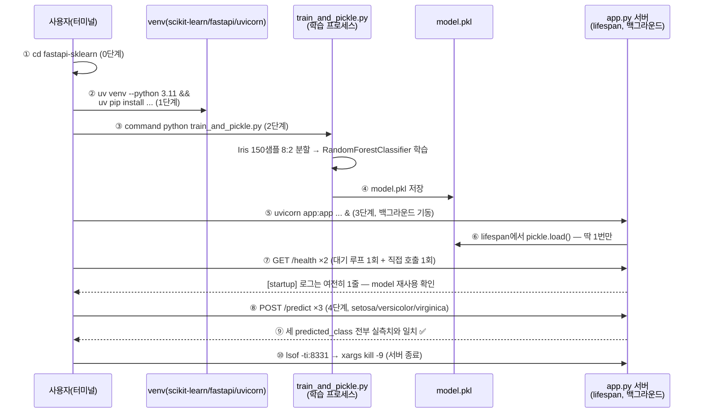
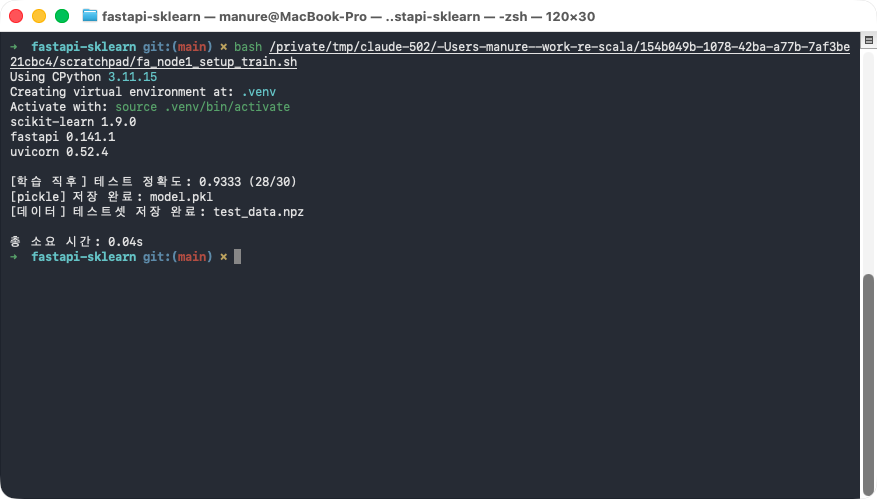
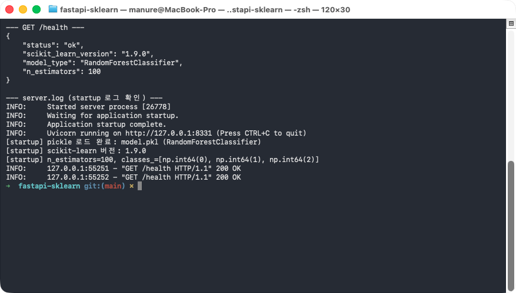
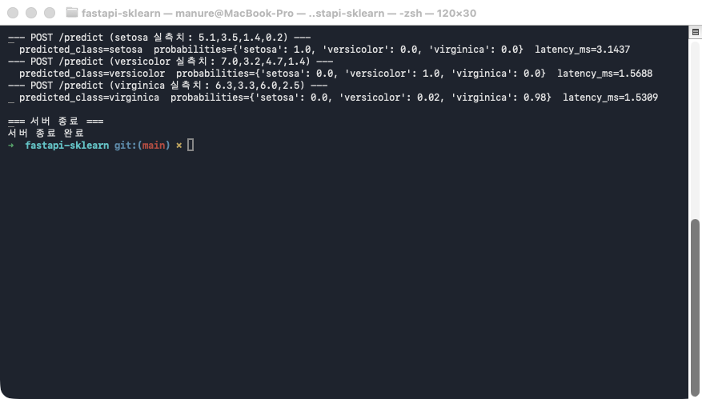

# followup.md — FastAPI + scikit-learn(pickle) 서빙 한 줄씩 따라하기

`RandomForestClassifier`를 학습해 `pickle`로 저장한 뒤, FastAPI 서버의
`lifespan`에서 그 파일을 **프로세스 생애주기 동안 딱 한 번만** 로드하고, 이후
들어오는 모든 `/predict` 요청이 그 하나의 model 객체를 재사용하는지 확인한다.
핵심 질문은 하나다 — "요청마다 pickle을 다시 읽지 않고도, 서로 다른 세 가지
입력을 전부 정확히 예측할 수 있는가?"

### 전체 흐름 한눈에 보기



| 번호 | 단계 | 핵심 확인 포인트 |
|---|---|---|
| ①~② | 0~1단계 | 폴더 이동 + 가상환경/패키지 준비 |
| ③~④ | 2단계 | 별도 프로세스에서 학습 후 `model.pkl`로 저장 |
| ⑤~⑥ | 3단계 | `lifespan`이 서버 기동 시점에 `model.pkl`을 **딱 한 번만** 로드 |
| ⑦ | 3단계 결과 | `/health`를 여러 번 불러도 `[startup]` 로그는 1줄 그대로 — 재로드 없음 |
| ⑧~⑨ | 4단계 | 같은 model 객체로 서로 다른 입력 3건을 모두 정확히 분류 |
| ⑩ | 4단계 종료 | 확인이 끝나면 서버 프로세스 종료 |

## 필요한 파일

| 파일 | 역할 | 사용 단계 |
|---|---|---|
| `train_and_pickle.py` | Iris 데이터로 `RandomForestClassifier`를 학습하고 `model.pkl`로 저장 | 2단계 |
| `app.py` | `lifespan`에서 `model.pkl`을 한 번만 로드해 `/health`·`/predict`로 서빙하는 FastAPI 앱 | 3~4단계 |

추가로 필요한 것: Python 3.11, [uv](https://docs.astral.sh/uv/), `curl`,
`scikit-learn`·`numpy`·`fastapi`·`uvicorn[standard]`(1단계에서 설치).

> ⚠️ **`python` 명령이 다른 곳을 가리키는 환경이라면**: 이 macOS 환경처럼
> `~/.zshrc`에 `alias python="/opt/homebrew/..."` 같은 별칭이 걸려 있으면,
> `source .venv/bin/activate`를 해도 `python`이 방금 만든 venv가 아니라 그
> 별칭이 가리키는 인터프리터로 실행될 수 있다(패키지가 우연히 같은 버전으로
> 전역에도 깔려 있으면 티가 안 나서 더 위험하다). 아래 모든 명령에서
> `command python`(별칭을 무시하고 PATH의 실제 실행 파일을 쓰라는 셸 내장
> 명령)을 쓰는 이유가 이것이다.

## 무엇을 확인해야 하는가

| 값 | 기대값 | 확인 방법 |
|---|---|---|
| `server.log`의 `[startup]` 로그 등장 횟수 | **정확히 1번** — `/health`를 몇 번 부르든 늘어나지 않아야 정상 | 3단계 `server.log` 출력 |
| `/predict` 3회 각각의 `predicted_class` | 입력한 실측치대로 `setosa`/`versicolor`/`virginica` **전부 정확히 일치** | 4단계 각 응답 |
| `latency_ms` | 실행할 때마다 값이 다름 | ❌ 비교 대상 아님 — 판정 기준은 `predicted_class`뿐 |

> ⚠️ **실행마다 달라지는 값**: 각 `/predict` 응답의 `latency_ms`는 머신 상태에
> 따라 매번 다르게 나온다. 그 숫자가 무엇이든 상관없고, `[startup]` 로그가
> 1번만 찍혔는지와 세 예측이 전부 맞았는지만 확인하면 된다.

## 0단계 — 이동

```bash
cd fastapi-sklearn
```

## 1단계 — 가상환경 준비

```bash
uv venv --python 3.11 --clear .venv
source .venv/bin/activate
uv pip install --quiet scikit-learn numpy fastapi "uvicorn[standard]"
command python -c "import sklearn, fastapi, uvicorn; print('scikit-learn', sklearn.__version__); print('fastapi', fastapi.__version__); print('uvicorn', uvicorn.__version__)"
```

**실행 결과 예시**

```
Using CPython 3.11.15
Creating virtual environment at: .venv
Activate with: source .venv/bin/activate
scikit-learn 1.9.0
fastapi 0.141.1
uvicorn 0.52.4
```

## 2단계 — 모델 학습 + pickle 저장

```bash
command python train_and_pickle.py
```

Iris 데이터셋(150 샘플, 4 특성, 3 클래스)을 8:2로 나눠 `RandomForestClassifier`를
학습하고, 테스트 정확도를 출력한 뒤 학습된 model 객체 전체를 `model.pkl`로
저장한다. `app.py`가 3단계에서 이 파일을 그대로 로드한다.

**실행 결과 예시**

```
scikit-learn 1.9.0
fastapi 0.141.1
uvicorn 0.52.4

[학습 직후] 테스트 정확도: 0.9333 (28/30)
[pickle] 저장 완료: model.pkl
[데이터] 테스트셋 저장 완료: test_data.npz

총 소요 시간: 0.04s
```



## 3단계 — FastAPI 서버 기동 + /health 확인

```bash
command uvicorn app:app --host 127.0.0.1 --port 8331 > server.log 2>&1 &

# 서버가 뜰 때까지 대기 (최대 10초)
for i in $(seq 1 20); do
  if curl -s -o /dev/null "http://127.0.0.1:8331/health"; then break; fi
  sleep 0.5
done

curl -s "http://127.0.0.1:8331/health" | command python -m json.tool
cat server.log
```

`uvicorn`을 백그라운드(`&`)로 띄우면, `app.py`의 `lifespan`이 서버 기동 시점에
`model.pkl`을 **딱 한 번** 로드한다. 아래 `server.log`에서 `[startup]` 로그가
정확히 한 줄만 찍힌 것을 확인하자 — `/health`를 두 번 호출했는데도(대기 루프의
확인 1회 + 직접 호출 1회) `[startup]` 로그는 늘어나지 않는다.

**실행 결과 예시**

```
--- GET /health ---
{
    "status": "ok",
    "scikit_learn_version": "1.9.0",
    "model_type": "RandomForestClassifier",
    "n_estimators": 100
}

--- server.log (startup 로그 확인) ---
INFO:     Started server process [26778]
INFO:     Waiting for application startup.
INFO:     Application startup complete.
INFO:     Uvicorn running on http://127.0.0.1:8331 (Press CTRL+C to quit)
[startup] pickle 로드 완료: model.pkl (RandomForestClassifier)
[startup] scikit-learn 버전: 1.9.0
[startup] n_estimators=100, classes_=[np.int64(0), np.int64(1), np.int64(2)]
INFO:     127.0.0.1:55251 - "GET /health HTTP/1.1" 200 OK
INFO:     127.0.0.1:55252 - "GET /health HTTP/1.1" 200 OK
```

`[startup]` 로그는 정확히 1줄, 그 아래 `GET /health` 로그는 2줄 — 서버가 켜져
있는 동안 model은 재로드되지 않고 계속 재사용된다는 뜻이다.



## 4단계 — POST /predict 3회 호출 + 서버 종료

세 가지 서로 다른 붓꽃 실측치로 예측을 요청해, 하나의 model 객체가 세 품종을
전부 정확히 구분하는지 확인한다.

```bash
curl -s -X POST "http://127.0.0.1:8331/predict" \
  -H "Content-Type: application/json" \
  -d '{"sepal_length_cm": 5.1, "sepal_width_cm": 3.5, "petal_length_cm": 1.4, "petal_width_cm": 0.2}' \
  | command python -m json.tool

curl -s -X POST "http://127.0.0.1:8331/predict" \
  -H "Content-Type: application/json" \
  -d '{"sepal_length_cm": 7.0, "sepal_width_cm": 3.2, "petal_length_cm": 4.7, "petal_width_cm": 1.4}' \
  | command python -m json.tool

curl -s -X POST "http://127.0.0.1:8331/predict" \
  -H "Content-Type: application/json" \
  -d '{"sepal_length_cm": 6.3, "sepal_width_cm": 3.3, "petal_length_cm": 6.0, "petal_width_cm": 2.5}' \
  | command python -m json.tool

# 확인이 끝나면 서버 종료
lsof -ti:8331 | xargs kill -9
```

**실행 결과 예시** (setosa 실측치 요청의 원본 JSON 응답)

```json
{
    "predicted_class": "setosa",
    "probabilities": {
        "setosa": 1.0,
        "versicolor": 0.0,
        "virginica": 0.0
    },
    "latency_ms": 3.1437
}
```

세 요청 전체를 한 줄씩 요약하면:

```
--- POST /predict (setosa 실측치: 5.1,3.5,1.4,0.2) ---
  predicted_class=setosa      probabilities={'setosa': 1.0, 'versicolor': 0.0, 'virginica': 0.0}   latency_ms=3.1437
--- POST /predict (versicolor 실측치: 7.0,3.2,4.7,1.4) ---
  predicted_class=versicolor  probabilities={'setosa': 0.0, 'versicolor': 1.0, 'virginica': 0.0}   latency_ms=1.5688
--- POST /predict (virginica 실측치: 6.3,3.3,6.0,2.5) ---
  predicted_class=virginica   probabilities={'setosa': 0.0, 'versicolor': 0.02, 'virginica': 0.98} latency_ms=1.5309

=== 서버 종료 ===
서버 종료 완료
```

세 요청이 입력한 실측치의 실제 품종(setosa/versicolor/virginica)과
`predicted_class`가 전부 정확히 일치했다 — 서버를 한 번도 재시작하지 않고,
3단계에서 로드된 그 하나의 model 객체만으로 세 가지 다른 입력을 모두 올바르게
분류했다는 뜻이다.



## 최종 비교표

| 항목 | 이 문서의 캡처값 | 직접 실행한 값 |
|---|---|---|
| `[startup]` 로그 등장 횟수 | 1번 | |
| setosa 요청의 `predicted_class` | setosa ✅ | |
| versicolor 요청의 `predicted_class` | versicolor ✅ | |
| virginica 요청의 `predicted_class` | virginica ✅ | |
| `latency_ms` | 1.5~3.1 ms *(참고용 — 실행마다 다름, 판정 기준 아님)* | |

세 예측이 직접 실행에서도 전부 정확히 일치했다면 — pickle로 저장된 model을
서버 기동 시 한 번만 로드해 모든 요청에서 재사용하는 서빙 패턴을 스스로
확인한 것이다.
