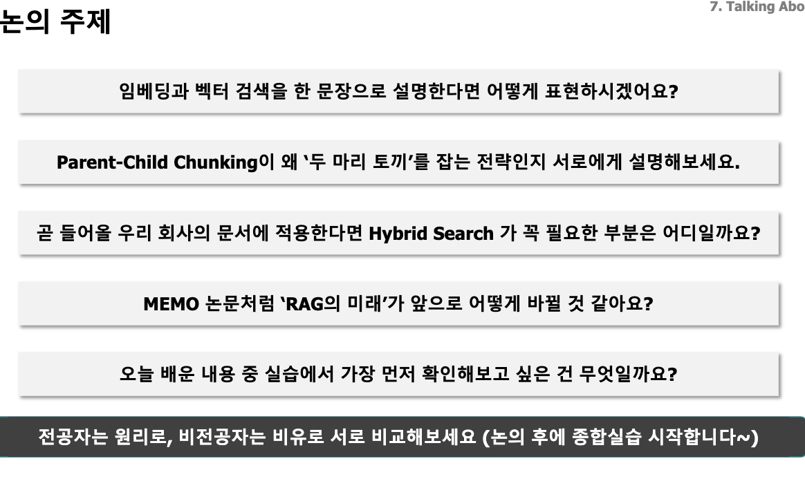

# RAG

> RAG는 문서를 임베딩해서 벡터 db에 올리고 검색할 때 유사도 검색을 통해 응답하는 구조를 만든다.

**임베딩 : 문장을 벡터로 바꾸는 개념**

**벡터 DB : 유사도 검색 DB (FAISS)**    *FAISS :수많은 벡터 중에서 질문과 비슷한 벡터를 빠르게 찾아주는 라이브러리

**청킹 : 정해진 크기로 자르기**

**검색품질 : Top - K 결과를 상위 몇 개를 설정할지**

---

### 심화

- 다국어 지원, 상황별 모델 선탠
- Qdrant 운영 : HNSW 튜닝, 필터 검색
- 의미 단위 차르기, 부모 자식 전략
- Dense + 키워드 합치는 하이브리드 search
- Re-ranking 으로 순위를 한 번 더 다듬기

---

### 기초에서 발전된 RAG

1. 두꺼운 책(내용이 많으면) 어떻게 해결할까?
2. 엉뚱한 책(자료)가 있을 떄 오답을 내지 않게 하려면?
3. 여러 책을 넘나들면서 여러가지 답변을 참고하고 병합해야하는 경우는?
4. 책에 없는 고유한 단어를 놓치면 검색에 실패한다. 대처 방법은?

### 해결 방법

| 문제                         | 핵심 대응                             | 책으로 비유하면                           |
| ---------------------------- | ------------------------------------- | ----------------------------------------- |
| 책이 너무 두꺼움             | **청킹 + Parent-Child**         | 필요한 문단을 찾고, 그 주변 내용까지 읽기 |
| 엉뚱한 자료가 섞임           | **필터 + 재순위화 + 근거 검증** | 책을 거른 뒤, 답의 근거가 되는지 확인하기 |
| 여러 책의 내용을 연결해야 함 | **질문 분해 + 다단계 검색**     | 작은 질문별로 찾아 근거를 연결하기        |
| 고유 단어를 놓침             | **Hybrid Search**               | 의미 검색과 정확한 단어 검색을 함께 하기  |

---

### 오늘 목표

> 임베딩 모델을 고르는 눈을 기르자. 어떤 모델을 사용할 것이냐?

* BGE-M3등최신임베딩모델을선택·적용할수있다.
* Semantic Chunking과Parent-Child전략을 실무에 적용할수있다
* BM25 + Dense Search Hybrid 파이프라인을 직접구축할수있다
* BGE-Reranker로 검색 품질을 추가 개선할수있다
* Agentic RAG 아키텍처를 설명하고 설계할수있다
* **MEMO** 논문의 핵심 아이디어를 이해하고 기존RAG와 비교할 수 있다
* Qdrant기반Production RAG시스템을구성할수있다

## 임베딩 모델 성능 테스트 방법

MassiveTextEmbeddingBenchmark - 사이트가서 성능 평가 받아볼 수 있음

# 유사도 거리 확인 방법

- 점진적으로 임베딩 모델도 바꿔보고 지속적인 성능 테스트 해보기
- 정규화가 핵심인다. 벡터 10과 1의 차이 의미를 어떻게 비교할까?

| 방법                        | 무엇을 비교하나?                      | 계산 방법                         | 값의 해석                                                              | 특징                                            |
| --------------------------- | ------------------------------------- | --------------------------------- | ---------------------------------------------------------------------- | ----------------------------------------------- |
| **코사인 유사도**     | 두 벡터의**방향**               | 내적 ÷ 두 벡터 길이의 곱         | **1** : 같은 방향, **0** : 직각, **−1** : 반대 방향 | 벡터 크기의 영향을 제거                         |
| **내적(Dot Product)** | **방향 + 크기**                 | 같은 위치의 성분끼리 곱한 뒤 합산 | 클수록 높은 유사도, 고정된 범위 없음                                   | 방향이 비슷하면 큰 벡터가 높은 점수를 받기 쉬움 |
| **유클리드 거리(L2)** | 두 점 사이**직선 거리**         | 성분 차이를 제곱해 합한 뒤 제곱근 | **0**이면 같은 점, 작을수록 가까움                               | 큰 좌표 차이의 영향이 상대적으로 큼             |
| **맨해튼 거리(L1)**   | 각 축으로 이동하는**거리의 합** | 성분 차이의 절댓값을 합산         | **0**이면 같은 점, 작을수록 가까움                               | 바둑판 도로처럼 대각선 이동 없이 계산           |

## HNSW - 실무 표준 ANN

| 개념                   | 역할                                                        |
| ---------------------- | ----------------------------------------------------------- |
| **코사인·L2등** | 두벡터가**얼마나가까운지**계산                        |
| **ANN**          | 모든벡터를비교하지않고**가까운이웃을근사적으로검색**  |
| **HNSW**         | ANN을구현하는방법중**계층형그래프를사용하는알고리즘** |
| **FAISS**        | HNSW같은검색알고리즘을사용할수있는라이브러리                |

### 품질 지표

**0~1 사이이며 높을수록 좋아요**

| 지표                                      | 핵심 질문                                      | 계산·판정 기준                                            |
| ----------------------------------------- | ---------------------------------------------- | ---------------------------------------------------------- |
| **Recall@K — 재현율**              | 필요한 문서를**얼마나 빠짐없이 찾았나?** | 상위 K개에서 찾은 관련 문서 수 ÷ 전체 관련 문서 수        |
| **Precision@K — 정밀도**           | 가져온 문서가**얼마나 알찬가?**          | 상위 K개에서 찾은 관련 문서 수 ÷ K                        |
| **MRR — 평균 역순위**              | **첫 관련 문서가 얼마나 빨리 나오나?**   | 질문마다`1 ÷ 첫 관련 문서 순위`를 계산하고 평균         |
| **nDCG@K — 정규화 할인 누적 이득** | **더 유용한 문서가 위에 배치됐나?**      | 관련도에 순위별 가중치를 주고, 이상적인 순서의 점수로 나눔 |

# 청킹 사이즈는?

Chunking을 통한 효율성 극대화 **LLM에 책전체를 넣을수없다.**

| 크기                        | 장점                                         | 단점                                                             | 잘 맞는 질문                         |
| --------------------------- | -------------------------------------------- | ---------------------------------------------------------------- | ------------------------------------ |
| **작음: 100~300토큰** | 한 주제에 집중되어 구체적인 내용을 찾기 좋음 | 조건·예외·앞뒤 설명이 분리될 수 있음. 청크와 벡터 개수 증가    | “보증기간은 몇 년이야?”            |
| **중간: 300~500토큰** | 검색의 구체성과 맥락 사이의 균형             | 문서 구조에 따라 여전히 내용이 잘릴 수 있음                      | 일반적인 설명·질의응답              |
| **큼: 700~1,000토큰** | 조건·이유·절차를 함께 담기 좋음            | 여러 주제가 섞여 검색이 모호해지고, LLM에 불필요한 내용도 전달됨 | “신청 절차와 예외 조건을 설명해줘” |

### 청킹 전략

| 전략                   | 어떻게 나누나?                                                    | 장점                                               | 단점                                         |
| ---------------------- | ----------------------------------------------------------------- | -------------------------------------------------- | -------------------------------------------- |
| **Fixed Size**   | 일정한 문자·토큰 수로 자름                                       | 단순하고 크기가 예측 가능                          | 문장·표·주제 중간에서 잘릴 수 있음         |
| **Recursive**    | 문단→줄바꿈→공백 등 경계를 순서대로 적용하고, 큰 부분을 더 나눔 | 자연스러운 경계를 최대한 보존하면서 크기 제한 적용 | 텍스트의 의미 자체를 판단하지는 않음         |
| **Semantic**     | 문장 사이 의미 변화가 큰 지점에서 나눔                            | 같은 주제의 내용을 묶기 좋음                       | 추가 임베딩 비용·시간, 청크 크기 불균일     |
| **Parent-Child** | 작은 Child로 검색하고, 해당 Child가 속한 큰 Parent를 전달         | 세밀한 검색과 넓은 맥락을 함께 확보                | 부모·자식 연결 관리, 전달량·중복 관리 필요 |

> **Parent-Child는 다른 전략과 함께 사용할 수 있어요.** 예를 들어 큰 절을 Parent로 삼고, 그 안을 Recursive로 잘라 Child를 만들면 됩니다.

실제로 선택할 때는 이렇게 접근하면 돼요

- 일반 문서: Recursive를 기준으로 크기와 overlap을 비교.
- 제목·절이 뚜렷한 매뉴얼: 먼저 제목·절 경계를 보존하고, 긴 절만 추가 분할. 제품명·제목·페이지도 함께 유지.
- 검색은 잘되는데 답변에 조건이 빠짐: 청크 크기 확대나 Parent-Child 검토.
- 검색 결과에 여러 주제가 뒤섞임: 청크 축소나 구조·의미 단위 분할 검토.
- 비슷한 결과만 반복됨: overlap을 줄이고 중복 검색 여부 확인.

### 참고

**코드에서는 단위를 꼭 확인하세요.** LangChain의 `RecursiveCharacterTextSplitter(chunk_size=500)`은 기본적으로 **500문자 기준**이에요. 500토큰을 뜻하지 않습니다. 또한 `chunk_overlap`은 목표 중복량이라 분할 경계에 따라 실제 중복량이 달라질 수 있어요.

### 전체 정리

- 문서 제작 및 청킹 세팅
- 메타 데이터 태그 만들기
- 필터 필요하면 Qdrant

# 문서 검색 방법

## Dense vs BM25

ense가 데이터베이스 설치 방법, SQL 오류 일반 가이드처럼 의미만 비슷한 문서를 가져올 수 있습니다. 42P01이나 17.2 같은 정확한 식별자를 의미적으로 잘 표현하지 못할 수 있기 때문이에요.
BM25는 단어가 문서에 실제로 있는지를 봅니다.

- 검색어가 문서에 많이 나올수록 점수 증가
- 여러 문서에 흔한 단어보다 특정 문서에만 드문 단어가 나오면 점수 증가
  그래서 42P01, Llama 3.1 405B, 개인정보보호법 제17조 같은 코드·버전·법령 번호·고유명사를 찾는 데 강합니다.
  하지만 BM25는 의미를 이해하지 못해요.
  질문: 휴대폰을 공짜로 고칠 수 있나?
  문서: 무상 수리 조건
  문서에 공짜가 없으면 무상을 같은 뜻으로 판단하지 못할 수 있습니다.
  그래서 실무에서는 둘을 합친 Hybrid Search를 자주 사용합니다.

| 구분                 | Dense Search                      | BM25                                    |
| -------------------- | --------------------------------- | --------------------------------------- |
| 기준                 | 문장의**의미와 문맥**       | 단어의**정확한 등장 여부와 빈도** |
| 표현이 달라도 검색   | 강함                              | 약함                                    |
| 숫자·코드·고유명사 | 놓칠 수 있음                      | 강함                                    |
| 학습 필요            | 임베딩 모델 필요                  | 별도 학습 없이 통계로 계산              |
| 대표 질문            | “휴대폰을 공짜로 고칠 수 있나?” | “42P01 오류”, “Python 3.11.2”       |

ense가 데이터베이스 설치 방법, SQL 오류 일반 가이드처럼 의미만 비슷한 문서를 가져올 수 있습니다. 42P01이나 17.2 같은 정확한 식별자를 의미적으로 잘 표현하지 못할 수 있기 때문이에요.
BM25는 단어가 문서에 실제로 있는지를 봅니다.

- 검색어가 문서에 많이 나올수록 점수 증가
- 여러 문서에 흔한 단어보다 특정 문서에만 드문 단어가 나오면 점수 증가 그래서 42P01, Llama 3.1 405B, 개인정보보호법 제17조 같은 코드·버전·법령 번호·고유명사를 찾는 데 강합니다.
- 하지만 BM25는 의미를 이해하지 못해요.
  질문: 휴대폰을 공짜로 고칠 수 있나?
  문서: 무상 수리 조건
- 문서에 공짜가 없으면 무상을 같은 뜻으로 판단하지 못할 수 있습니다. 그래서 실무에서는 둘을 합친 Hybrid Search를 자주 사용합니다.

> 결과가 순위가 완벽하지 않다? 그러면 리랭킹!!

---

## Re-ranking

Re-ranking은 **1차 검색 결과를 다시 정밀하게 평가해 순서를 고치는 단계**예요.

Dense나 BM25, Hybrid Search는 많은 문서 중 후보를 빠르게 고르는 데 강하지만, 1위부터 정확한 순서로 정렬한다는 보장은 없습니다. 특히 Hybrid는 Dense와 BM25의 서로 다른 신호를 합친 결과라서, 의미상 비슷하거나 특정 키워드가 포함된 문서가 실제 질문 의도보다 위에 올라올 수 있어요.

- Hybrid Search: 서류 전형으로 후보 50명을 빠르게 추림
- Re-ranking: 질문과 문서를 하나씩 직접 비교해 최종 10명을 선발

```text
사용자 질문
   ↓
Dense/BM25/Hybrid로 후보 Top-50 검색
   ↓
질문-청크 쌍을 Reranker에 입력
   ↓
각 후보의 관련도 점수 계산
   ↓
점수순으로 재정렬 후 Top-5~10만 LLM에 전달
```

각 단계를 풀면 다음과 같아요.

1. **질문 입력**

   사용자의 원래 질문을 준비합니다.

   ```text
   PostgreSQL 17.2 설치 중 42P01 오류가 발생했을 때 어떻게 해결하나?
   ```
2. **빠른 1차 검색**

   Dense, BM25 또는 Hybrid Search로 후보를 넓게 가져옵니다.

   ```text
   Top-50 후보
   ```

   여기서는 속도를 우선해도 됩니다. 최종 답변에 50개를 모두 전달하려는 것이 아니라, 좋은 문서가 후보에서 빠지지 않도록 넓게 확보하는 단계예요.
3. **질문과 청크를 함께 입력**

   Reranker는 질문 벡터와 문서 벡터를 따로 만든 뒤 비교하는 방식보다, 보통 질문과 문서를 **한 쌍으로 함께 읽고** 관련도를 계산합니다.

   ```text
   (질문, 청크 1) → 0.97
   (질문, 청크 2) → 0.31
   (질문, 청크 3) → 0.89
   ```

   이런 방식은 더 정밀하지만 후보 50개를 각각 비교해야 하므로 1차 검색보다 느립니다. 보통 Cross-encoder 계열 모델을 이 단계에 사용합니다.
4. **점수순 재정렬**

   Reranker 점수를 기준으로 후보 순서를 다시 정렬합니다.

   ```text
   청크 1: 0.97
   청크 3: 0.89
   청크 7: 0.82
   ...
   ```

   1차 검색에서 15위였던 문서가 실제 질문과 더 잘 맞으면 최종 1위로 올라올 수 있어요.
5. **상위 결과만 LLM에 전달**

   최종 Top-5~10만 LLM에 넘겨 답변을 생성합니다. 불필요한 문서를 줄여 답변의 노이즈와 컨텍스트 비용을 낮추는 목적입니다.

중요한 한계도 있어요.

- Reranker는 **1차 후보에 들어오지 못한 문서를 새로 찾아내지 못합니다.**
- 따라서 후보 검색의 Recall이 너무 낮으면 Re-ranking만으로 해결할 수 없습니다.
- 후보 수를 너무 크게 잡으면 정확도는 좋아질 수 있지만 지연 시간과 비용이 증가합니다.
- 한국어·법률·의료·사내 용어처럼 도메인이 특수하면 Reranker가 해당 표현을 잘 이해하는지 별도 검증이 필요합니다.

실무에서는 대략 다음처럼 시작해볼 수 있습니다.

```text
1차 검색: Top-20~50
Re-ranking: 후보 전체 재평가
최종 전달: Top-5~10
```

단, 이 숫자는 고정 규칙이 아니에요. 질문셋으로 다음을 비교해야 합니다.

- Re-ranking 전후 Recall@K, Precision@K, MRR, nDCG
- 최종 답변의 근거성
- 검색 지연 시간
- Reranker 호출 비용
- LLM에 전달되는 컨텍스트 크기

한 문장으로 정리하면, **Retriever는 넓고 빠르게 후보를 찾고, Reranker는 그 후보를 느리지만 정밀하게 다시 줄 세우는 역할**입니다.

## 하이브리드 서치 사용 경우

- 검색어에 버전번호·에러코드·모델명이자주포함된다
- 법률·의료·금융규정처럼정확한용어가중요한문서를다룬다
- Dense만으로Recall@5가0.7미만이다
- 사용자가'정확한 내용이 안나와요'라고자주불만을제기한다

---

# MEMO 아이디어

- 소규모 LLM 만들어서 파라미터 학습한 전문

1. 3분 : 가장 인상 깊었던 것


