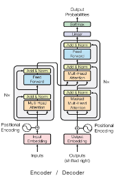
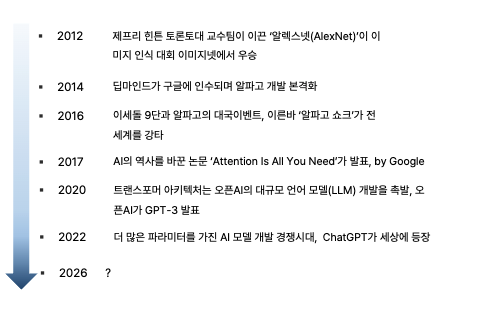

# 실습 1. LLM 모델 이해 및 활용

## 목차

1. Practice 1-1: LSTM
2. Practice 1-2: Transformer
3. LLM
4. 기술 적용 방안
5. Practice 2: Agent

---

# Practice 1-1. LSTM

## LSTM이란?

LSTM(Long Short-Term Memory)은 이전 내용을 기억하고 순서대로 다음 토큰을 예측하는 순환신경망(RNN)의 한 종류다.

- 지금까지 읽은 내용을 내부 상태에 요약해 다음 단계로 전달한다.
- 단어나 문자가 등장한 순서를 자연스럽게 반영한다.
- 기존 RNN보다 정보를 오래 유지할 수 있다.
- 문장이 길어지면 앞부분의 정보가 점차 희석될 수 있다.

## 실습 코드

```python
input_data = []
target_data = []

for i in range(0, len(text) - seq_length):
    # 입력 문자열
    input_seq = text[i:i + seq_length]

    # 한 글자씩 앞으로 이동한 정답 문자열
    target_seq = text[i + 1:i + seq_length + 1]

    # 문자를 숫자로 변환하여 저장
    input_data.append([char_to_idx[c] for c in input_seq])
    target_data.append([char_to_idx[c] for c in target_seq])

# LSTM이 처리할 수 있도록 PyTorch Tensor로 변환
input_data = torch.LongTensor(input_data)
target_data = torch.LongTensor(target_data)
```

## 코드 리뷰

1. 원문에서 일정 길이의 입력 문자열을 자른다.
2. 입력보다 한 글자 앞선 문자열을 정답으로 만든다.
3. 각 문자를 숫자 인덱스로 변환한다.
4. 리스트를 PyTorch 모델이 처리할 수 있는 Tensor로 변환한다.
5. 모델은 현재 입력을 바탕으로 다음 문자를 순차적으로 예측한다.

## 실습 결과

```text
hello world machine learning is fun is fun is fun is fu
```

## 한계 및 결론

LSTM으로 생성한 문장은 길어질수록 `is fun`과 같은 일부 표현을 반복하며 자연스러움이 떨어졌다.

1. 토큰을 순차적으로 처리하므로 문장이 길어지면 앞부분의 정보를 잊기 쉽다.
2. 한 단계씩 계산해야 하므로 병렬처리가 어렵고 학습 속도가 느리다.
3. 긴 문맥의 멀리 떨어진 단어 관계를 직접 확인하기 어렵다.

---

# Practice 1-2. Transformer

## 실습 설정

- GPT-2 기반 모델 사용
- LSTM의 순차처리 한계를 Transformer가 어떻게 개선하는지 확인
- 지식베이스를 추가해 환각을 줄이는 방법 실습

## Transformer란?

Transformer는 문장 속 토큰들이 어떤 관계를 갖는지 한 번에 파악하는 딥러닝 구조다. LSTM처럼 이전 상태만 순서대로 전달하지 않고, Attention을 이용해 결과를 생성하는 시점에 문장 전체에서 중요한 정보를 찾는다.

> 핵심: 문장 전체를 보고 현재 처리에 중요한 토큰에 집중한다.

## 기존 RNN·LSTM과 Transformer 비교

| 구분 | RNN·LSTM | Transformer |
|---|---|---|
| 처리 방식 | 토큰을 순서대로 처리 | 여러 토큰을 병렬로 처리 |
| 문맥 이해 | 이전 정보를 순차적으로 전달 | 모든 토큰의 관계를 직접 계산 |
| 장문 처리 | 앞부분을 잊기 쉬움 | 멀리 떨어진 토큰 관계도 확인 |
| 병렬 학습 | 어려움 | GPU 병렬 학습에 유리 |
| 순서 정보 | 모델 구조에 포함 | 위치 인코딩을 별도로 사용 |
| 확장성 | 긴 문장에서 학습이 느림 | 대규모 모델 학습에 유리 |

## Transformer 처리 흐름

```text
입력 문장
→ 토큰화
→ 임베딩
→ 위치 정보 추가
→ Self-Attention
→ Feed Forward Network
→ 다음 토큰 또는 결과 출력
```



## 주요 구성 요소

| 구성 요소 | 역할 |
|---|---|
| 토큰화 | 문장을 모델이 처리할 수 있는 작은 단위로 분할 |
| 임베딩 | 토큰을 의미를 담은 숫자 벡터로 변환 |
| 위치 인코딩 | 각 토큰의 순서와 위치 정보 추가 |
| Self-Attention | 문장 내부의 모든 토큰 관계와 중요도 계산 |
| Multi-Head Attention | 여러 관점에서 토큰 관계를 동시에 분석 |
| Feed Forward Network | Attention 결과를 변환해 특징 추출 |
| 잔차 연결·정규화 | 학습을 안정화하고 정보 손실 방지 |

## Attention과 Self-Attention

### Self-Attention

Self-Attention은 하나의 입력 안에서 토큰 간 관계를 계산한다.

> 철수는 사과를 먹었다. 그는 배가 고팠다.

`그`를 처리할 때 같은 문장에 있는 `철수`에 높은 중요도를 부여할 수 있다.

```text
입력 문장
 ├─ Query ─┐
 ├─ Key ───┼→ Attention 계산
 └─ Value ─┘
```

Query, Key, Value가 모두 동일한 입력에서 만들어진다.

### Cross-Attention

Cross-Attention은 서로 다른 두 데이터 사이의 관계를 계산한다. 번역에서 디코더가 단어를 생성할 때 인코더가 이해한 원문 중 어떤 부분을 참고할지 결정하는 방식이다.

```text
Query     ← 디코더의 현재 상태
Key/Value ← 인코더가 이해한 입력 문장
```

| 구분 | Attention·Cross-Attention | Self-Attention |
|---|---|---|
| 관계 | 서로 다른 데이터 간 관계 | 같은 입력 내부의 관계 |
| Query 출처 | 현재 처리 중인 데이터 | 동일한 입력 |
| Key·Value 출처 | 다른 입력 또는 표현 | 동일한 입력 |
| 목적 | 입력과 출력 연결 | 입력 내부 문맥 파악 |
| 예시 | 번역문과 원문 연결 | 대명사와 앞선 명사 연결 |

## 인코더와 디코더

| 구분 | 인코더(Encoder) | 디코더(Decoder) |
|---|---|---|
| 핵심 역할 | 입력의 의미와 문맥 이해 | 이해한 문맥을 바탕으로 결과 생성 |
| 처리 방식 | 입력 전체를 동시에 참고 | 이전에 생성한 토큰을 참고해 순차 생성 |
| Attention | Self-Attention | Masked Self-Attention·Cross-Attention |
| 대표 모델 | BERT | GPT |
| 주요 활용 | 분류, 검색, 감정 분석 | 대화, 글쓰기, 코드 생성 |

## 한계: 환각

Transformer 기반 LLM은 자연스러운 문장을 생성하지만, 사실이 아닌 내용을 사실처럼 답할 수 있다. 이를 환각(Hallucination)이라고 한다.

## 개선 실습: 지식베이스 제공

```python
knowledge_base = {
    "South Korea": "The capital of South Korea is Seoul.",
    "France": "The capital of France is Paris.",
    "Italy": "The capital of Italy is Rome."
}
```

모델이 답변에 필요한 근거를 먼저 제공받으면, 학습 과정에서 기억한 불확실한 정보에만 의존하는 문제를 줄일 수 있다.

## 결론

- Transformer는 Attention으로 전체 문맥의 관계를 계산한다.
- 병렬처리가 가능해 대규모 모델 학습에 적합하다.
- 자연스러운 생성 능력과 별개로 사실성 검증이 필요하다.
- 외부 지식과 출처를 제공하는 방식으로 환각을 줄일 수 있다.

---

# LLM

## LLM 발전 과정



사람의 언어를 컴퓨터가 처리하고 다시 자연어로 생성할 수 있도록 인코더·디코더 구조, Attention, Transformer가 발전했다. Transformer의 병렬처리와 문맥 이해 능력을 바탕으로 매우 큰 데이터와 파라미터를 학습한 언어모델이 LLM이다.

## LLM의 핵심 단위

- **토큰:** 모델이 입력과 출력을 처리하는 기본 단위
- **임베딩:** 토큰을 의미적 관계가 반영된 숫자 벡터로 변환한 표현
- **컨텍스트:** 모델이 현재 응답을 만들 때 참고할 수 있는 입력 범위
- **파라미터:** 학습을 통해 조정된 모델 내부의 값

> 임베딩은 언어를 단순히 0과 1로 바꾸는 것이 아니라, 토큰의 의미와 관계를 숫자 벡터 공간에 표현하는 과정이다.

## 소프트웨어 개발 방식의 진화

```text
규칙을 직접 작성
→ 데이터에서 규칙을 학습
→ 자연어로 목표와 역할을 지시
→ AI가 추론하고 도구를 사용해 행동
```

### 단계별 요약

- **Software 1.0:** 사람이 모든 논리와 규칙을 프로그래밍 언어로 구현
- **Software 2.0:** 사람이 데이터와 모델 구조를 제공하고 신경망이 규칙을 학습
- **Software 3.0:** 사람이 목표와 역할을 자연어로 정의하고 AI Agent가 코드와 행동을 생성

## 전통적인 개발과 AI 소프트웨어 비교

| 구분 | 전통적 개발 | AI 소프트웨어 개발 |
|---|---|---|
| 핵심 개념 | 사람이 규칙을 코드로 작성 | 데이터와 목표를 바탕으로 모델이 판단 |
| 주요 산출물 | 함수, 코드, 프로그램 | 모델, 프롬프트, 컨텍스트, 평가 결과 |
| 입력 요소 | 요구사항, 알고리즘, 소스 코드 | 목표, 역할, 데이터, 프롬프트 |
| 동작 특성 | 같은 입력에 예측 가능한 결과 | 같은 입력에도 결과가 달라질 수 있음 |
| 주요 도구 | 언어, 라이브러리, 프레임워크 | ML·DL·LLM·Agent·데이터셋 |
| 개발자 역할 | 코드와 로직 구현 | 문제·데이터·사고·행동 과정 설계 |
| 장점 | 동작 예측과 원인 추적이 쉬움 | 복잡한 판단과 개발 자동화에 유리 |
| 한계 | 모든 규칙을 사람이 정의 | 편향, 환각, 불확실성 발생 가능 |
| 품질관리 | 코드와 함수 테스트 | 데이터·프롬프트·출력을 지속 평가 |

> 전통적 개발은 사람이 함수를 설계하고, AI 개발은 사람이 목표·데이터·평가기준을 설계한다.

---

# 기술 적용 방안

## 1. 지식베이스 연결

- 사내 규정, 제품 설명서, 업무 매뉴얼 등 신뢰할 수 있는 자료 제공
- 답변이 학습된 기억에만 의존하지 않도록 근거 추가
- 답변과 함께 사용한 출처 확인

## 2. 프롬프트 설계

- 역할과 목표를 명확하게 정의
- 사용할 데이터와 사용하지 않을 데이터를 구분
- 원하는 출력 형식을 예시로 제공
- 정보가 부족할 때 추측하지 않도록 제한

## 3. 결과 평가

- 정답 여부뿐 아니라 근거, 일관성, 형식 준수 여부 확인
- 동일한 입력을 반복 실행해 결과 변동 확인
- 실제 업무 전문가가 결과를 검토

## 4. Agent 활용

- 하나의 복잡한 작업을 여러 역할로 분리
- 각 Agent가 한 가지 관점에 집중하도록 설계
- 마지막 Agent가 결과를 종합하고 다음 행동을 제안
- 중요한 결정과 외부 실행은 사람이 승인

---

# Practice 2. Agent

## Agent란?

AI Agent는 주어진 목표를 달성하기 위해 상황을 판단하고, 필요한 작업과 도구를 선택해 행동하는 AI 시스템이다.

- **AI Agent:** 정해진 목표에 따라 도구를 사용하고 작업을 수행
- **Agentic AI:** 상황을 분석해 계획을 세우고 여러 작업을 보다 자율적으로 수행

## Agent 정의

Agent를 설계할 때 다음 속성을 명확히 작성한다.

| 속성 | 설명 |
|---|---|
| Role | 어떤 담당자인가? |
| Goal | 무엇을 달성해야 하는가? |
| Backstory | 어떤 경험과 판단 태도를 가졌는가? |
| Guardrail | 무엇을 하면 안 되는가? |

## Task 정의

Task에는 다음 내용을 포함한다.

1. Agent가 수행할 구체적인 작업
2. 사용할 입력 데이터
3. 판단 순서와 기준
4. 결과에 반드시 포함할 항목
5. 예상 출력 형식
6. 다음 Agent에게 전달할 정보

## 출력 설계

- 장문의 설명보다 구조화된 표나 JSON 사용
- 판단 결과와 데이터 근거를 함께 표시
- 정보가 부족하면 `추가 확인 필요`로 표시
- 비교용 점수와 실제 확률을 구분
- 최종 승인 여부와 담당자를 명시

## 결론

Agent 개발의 핵심은 모델에 모든 판단을 맡기는 것이 아니다. 역할, 데이터 범위, 판단 기준과 출력 구조를 사람이 명확히 설계하고 결과를 지속적으로 검증해야 한다.
