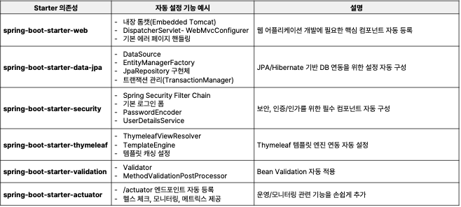
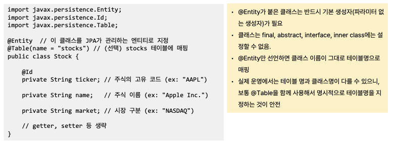
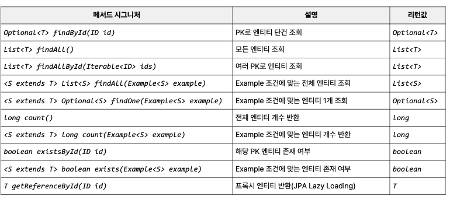
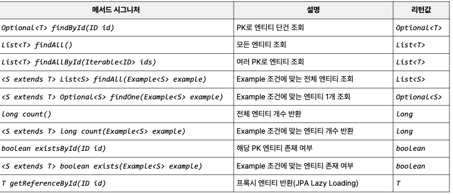
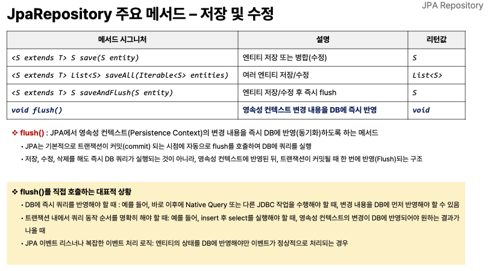
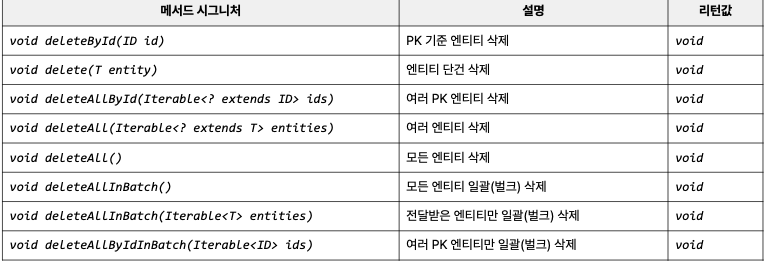
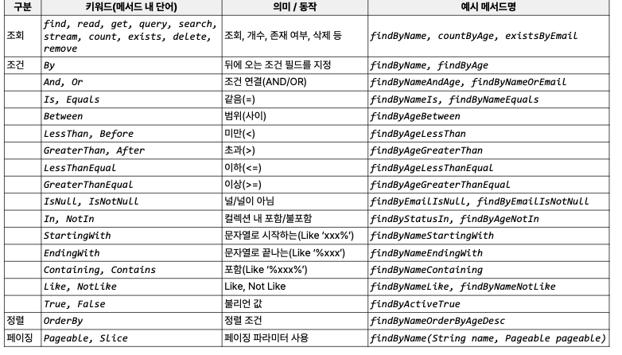
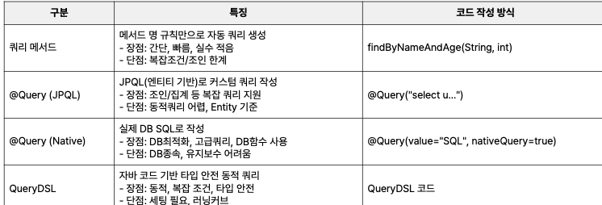
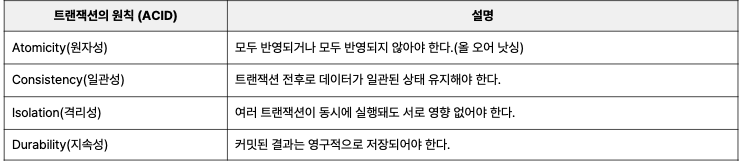

# 예외 처리

---

## 스프링의 예외 처리 방식

- 별도의 예외 처리를 설정하지 않으면 BasicErrorController를 사용해서 예외를 자동으로 처리하고 있음

## @ControllerAdvice와 @ExceptionHandler

- 스프링 부트에서 제공하는 강력하고 유연한 예외 처리 메커니즘
- 가장 일반적이고 권장되는 전역 예외 처리 방식임

> ### 예외 처리 우선 순위
>
> 1. 컨트롤러 내 @ExceptionHandler : 현재 컨트롤러에서 예외 처리하는 핸들러가 있는지 확인
> 2. @ControllerAdvice 내 @ExceptionHandler : 적절한 핸들러가 없으면 전역 핸들러 찾기
> 3. ResponseStatusException : 위 두 경우에 해당않고 ResponseStatusException이 던져지면 스프링 직접 처리

## @ControllerAdvice를 통한 예외처리

- 전역적으로 예외를 처리하는 어노테이션으로, @Order로 우선 순위를 설정함

  - 해당 컨트롤러에서 검증이 실패하면 전역적 예외 처리가 발생함
  - **RestControllerAdvice는 내부적으로 @ControllerAdvice, @ResponseBody기능을 모두 포함하고 있음**

## 결론

- @RestControllerAdvice 사용하자

---

# 자동 설정(Auto-configuration)

- build.gradle 파이렝다가 스타터를 사용해서 자동 설정 기능을 통해 필요한 빈(??)들을 자동으로 등록하고 설정함

### 종류

---

# AOP (관점 지향 프로그래밍) 

- OOP의 한계를 보완하는 방법임
- AOP는 공통 관심사를 모듈화하여 코드 중복 줄이고 유지보수를 줄이는 방법

### 공통 관심사

- 로깅
- 트랜잭션처리
- 보안
- 성능 측정

## Spring Boot의 AOP

- 별도의 설정 없이 spring-boot-starter-aop 의존성만 추가하면 사용 가능함
- 선언적 AOP 지원 :  @어노테이션 기반으로 작성함
- 시점, 방법, 대상을 세팅하는 방식으로 코딩함 (되게 좋은데???)

### 어떻게 구현했는가?

- 스프링 프록시(Proxy)가 원본 빈을 감싸 부가기능을 수행함
  - 결국엔 이 작동을 프록시가 중간에서 작업해서 기능하게 함

---

# JPA와 JDBC 비교

## JPA

- ORM을 활용해 RDBMS에 CRUD를 할 수 있도록 표준화한 Java API 프레임워크

  - SQL을 작성하지 않는다!!
  - 객체 지향적 (Entity, Repository, Service 계층)을 지정하여 최소화
- ORM

  - 객체와 데이터베이스 테이블을 매핑하는 기술로 SQL이 아닌 자바 객체로 컨트롤함
  - 인터페이스와 어노테이션만 제공하고 구현체가 별도로 Hibernate, EclipseLink 등 존재함

### 방법

- 엔티티(테이블)로 지정하여 설정함

- @Table
  - @Entity로 지정한 클래스가 어느 테이블과 매핑할지 설정됨
  - name : 테이블 이름
  - schema : 사용할 DB 스키마
  - uniqueConstraints : 복합 유니크 키 (columNames = {"")

## JDBC

- JAVA Database 자바에서 데이터베이스를 접근하기 위한 표준 API
- 자바에서 SQL을 직접 실행하는 방법
  - **벡엔드 개발자는 JPA로 쿼리를 작성 + SQL 도 가능해야함**
- JDBC  커넥션 풀 관리
  - 직접 관리해야함 try-finally 등으로 close가 명시돼야함

---

# JPA Repsitory 

- JPA 인터페이스에서 JPA를 더 쉽게 다룰 수 있게 함
- 개발자가 데이터베이스에 접근하는 코드 (DAO : SQL) 를 직접 구현 안해도 됨

## JpaRepository 주요 메서드

### 조회

### 저장 및 수정

### 삭제

### 조회,조건, 정렬

## 사용자 정의 메서드

- 쿼리 복잡도가 높으면 한계가 있으니 따로 추가한 메서드임
- 나는 @Query // Native SQL 사용하면 좋음

---

# JPA 트랜잭션

- 트랜잭션은 데이터베이스에서 일련의 작업들을 하나의 단위로 처리함

  - 어떤 건 성공하고 어떤 건 실패하면 안됨
  - 한 번에 모든 작업이 성공해야 데이터 정합성이 유지됨
- JPA의 변경 내용은 트랜잭션이 있을 때만 DB에 안전하게 반영됨

  - 트랜잭션 커밋 시점

    - 실제로 개발 될때 커밋 시점은 트랜잭션을 시작한 메서드가 종료될 때 진행됨
    - 엔티티를 호출하면 바로 DB에 저장되는게 아니라 영속성 컨텍스트에 저장되고 다음에 반영됨
    - 이후에 서비스 호출되면 **프록시가 커밋하고 저장됨!! 그렇기 때문에 중간에 롤백 가능함!!**

# Transactional

- 트랜잭션 관리를 지원하는 어노테이션
- 작업이 성공하면 commit해주고 예외 발생하면 rollback됨
- 설정 기준
  - 데이터 변경에는 반드시 사용하자!!
  - 단순 조회에는 @Transaction(readOnly = true)로 부분 사용
