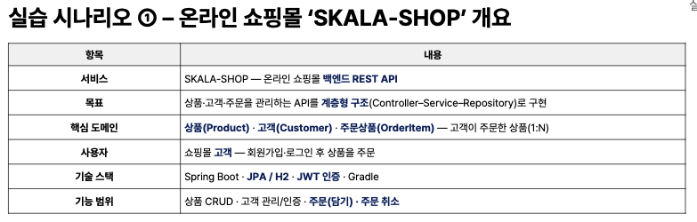
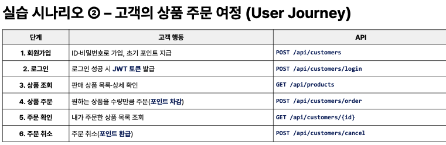
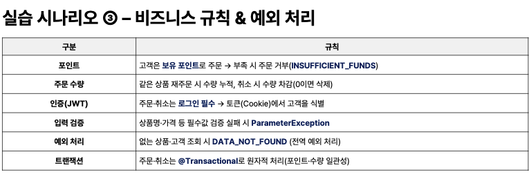
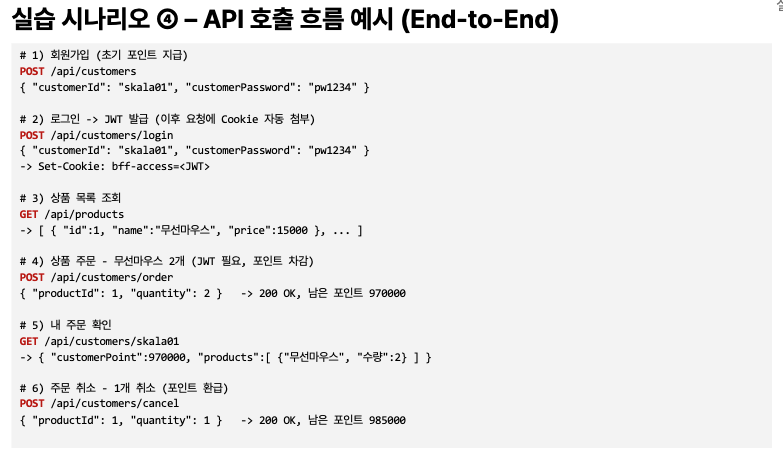
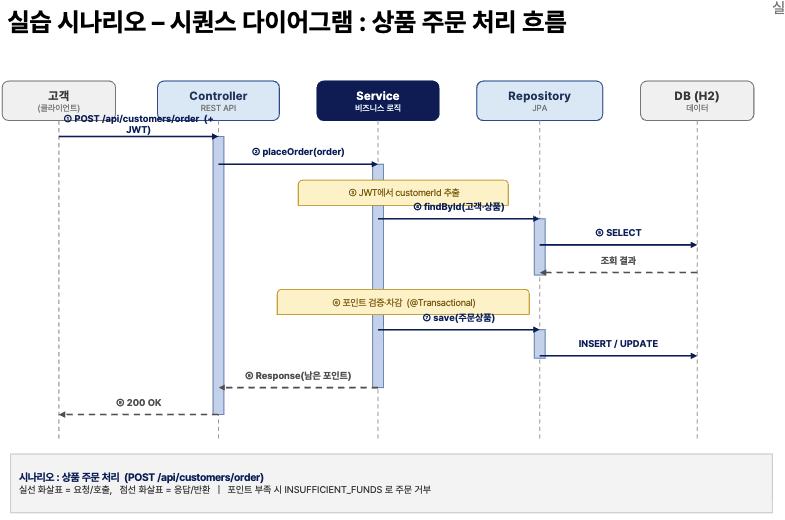
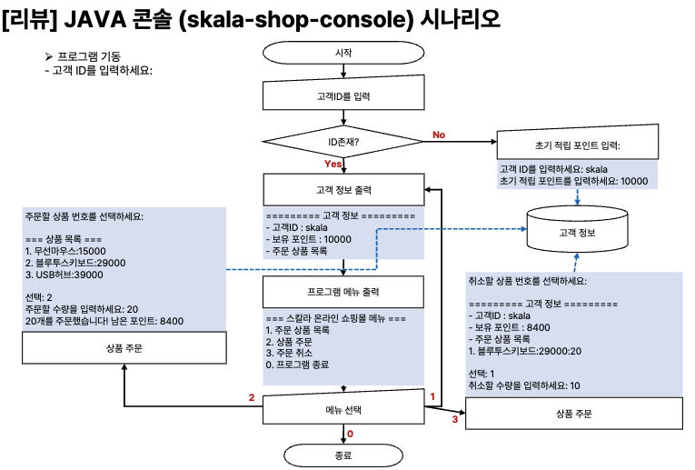
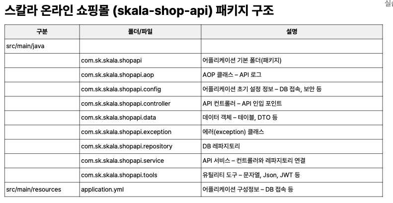
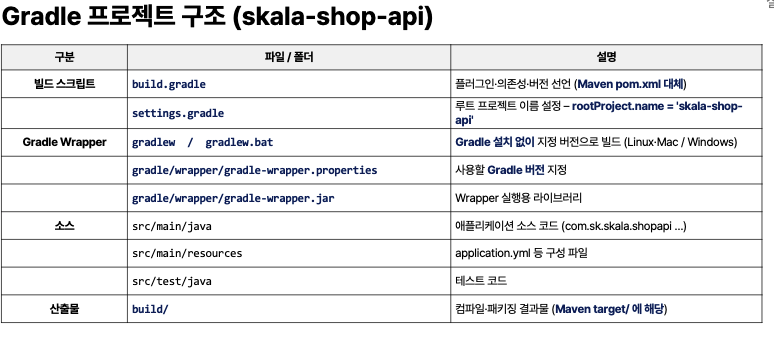
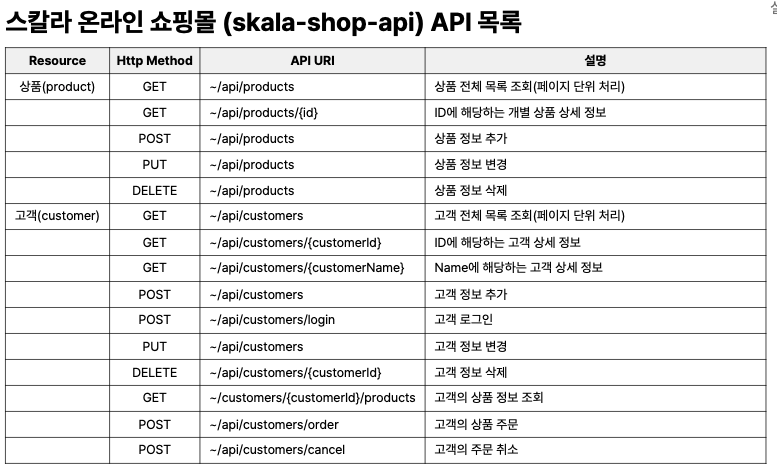

- JWT 인증은 구글 이메일인증이든 다양한 형태로 만들어보기
- 굳이 이걸로 안하고 ID, PW 으로 하셔도 됩니다.
- 자기 상상 발휘하기
  - 관리자 대쉬보드 만들기
  - 추가적으로 로그 활용하고 분석 클래스
- 평가 관점
  - API 개발했는가
  - JPA 로 잘 주고 받는가
  - JWT는 뭐 해도 되고 안해도 됨

---

# 진행 흐름

>  해당 작업이 향후 어떤 작업과 연동되는지 흐름을 집어가며 이해하고 싶다.
> 일단 만들어둔 부분까지만 고려했을 때 해야할 일을 병렬이 아닌 하나씩 해보기.

## 1장

1. java 패키지 생성함
   1. 의존성 설치함
   2. mvc-web, h2 dB, jpa, vaildation 추가함
   3. yml 파일로 db, jpa,jwt(토큰) 세팅함
2. main 내 디렉터리 만듦
   1. 기본적인 application을 만드는데 있어서 controller,data,service, MVC 구조 만듦
3. HealthController.java 만듦
   1. api 경로 만들어서 health api 띄움

## 2장 예외 로그 처리

1. 예외처리 다 둠
   1. 전역변수로 해서 한 바퀴 실행되면 생기는 문제들마다 케이스둠
   2. 추가 필요

## 3장 DTO와 Entity

db랑 소통하기 위한 DTO를 이용함

1. 엔티티 @어노가 있으면 Entity 폴더를 만들어서 각각 만들어진다.
   1. 예전 플젝에서는 entity를 따로 만들었는데 이렇게 해도되는거임
2. 지금 상태는 domain/product에서 entity를 선언해
