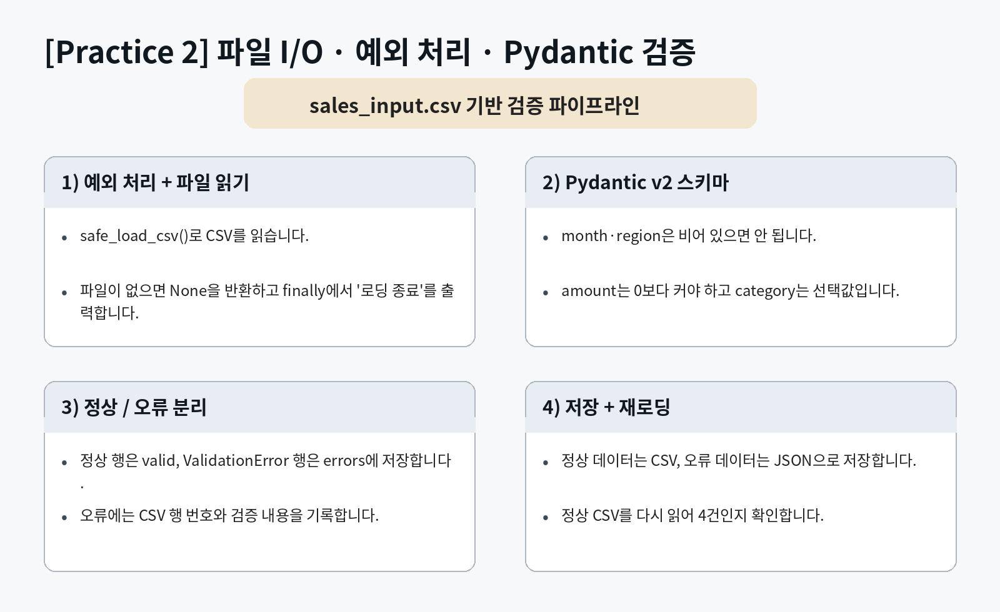
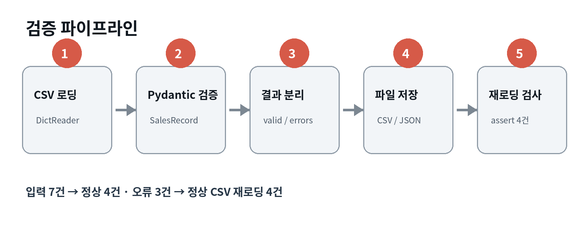
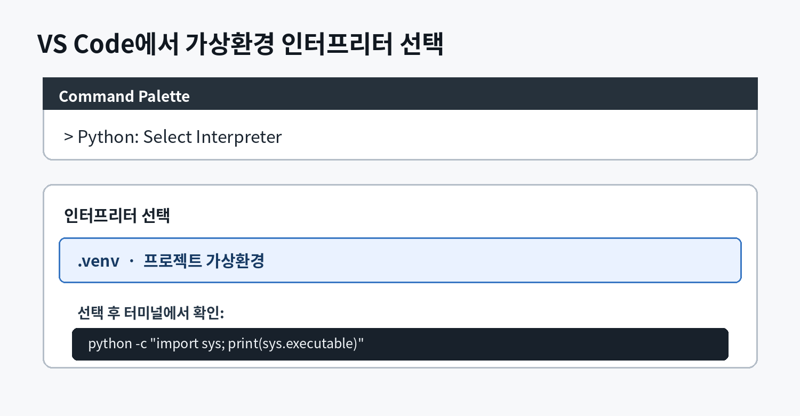
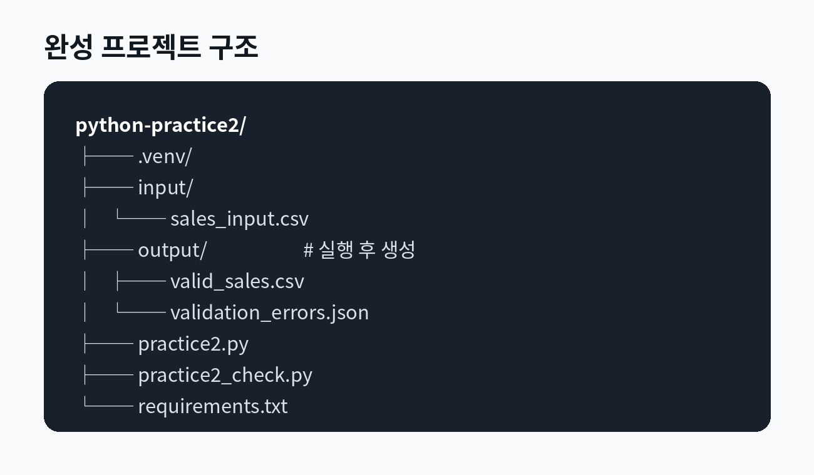
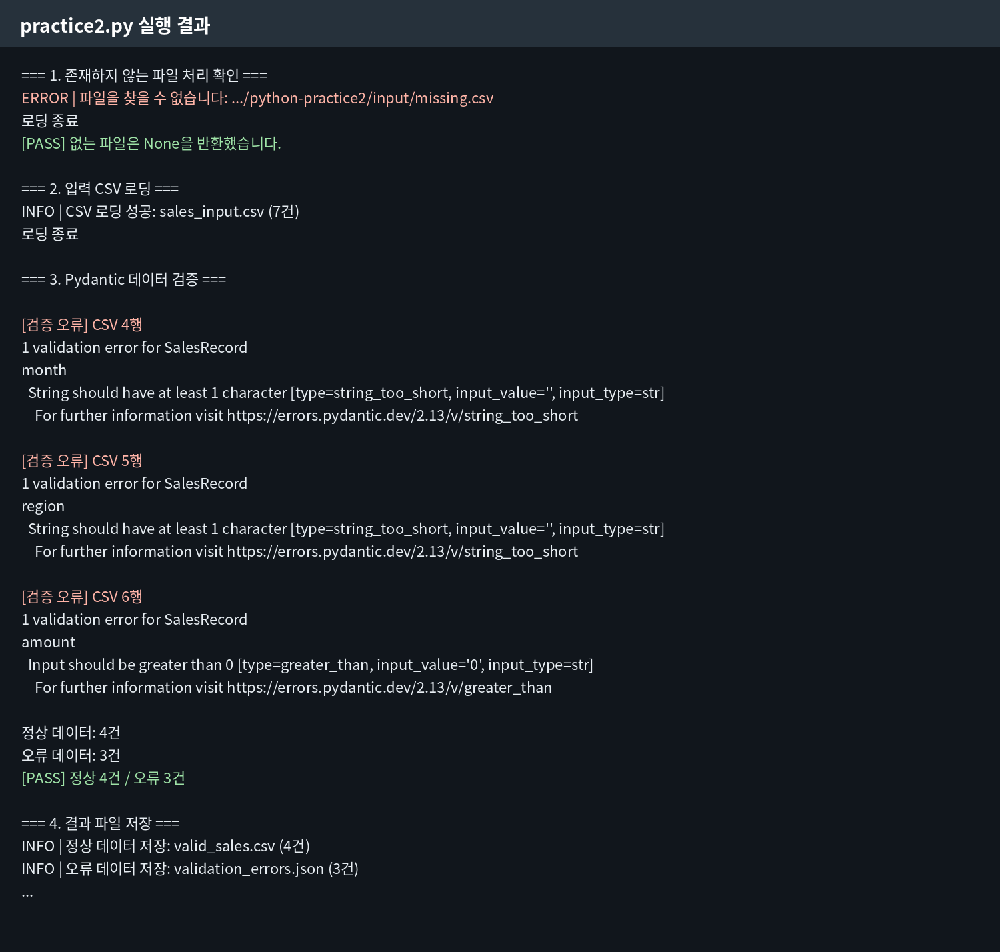
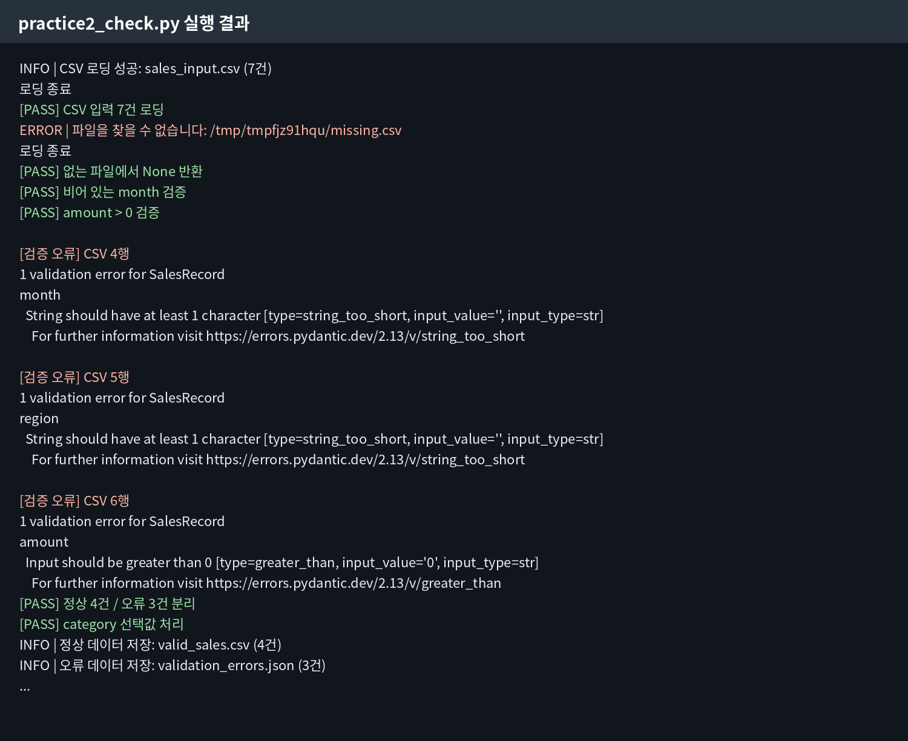
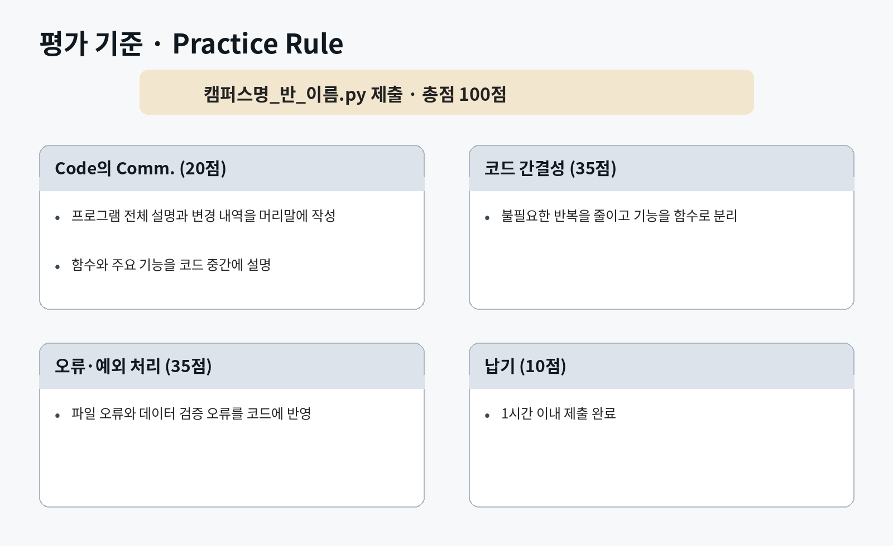

# 파이썬 종합 실습 2
## 파일 I/O, 예외 처리, Pydantic 검증 파이프라인

CSV 판매 데이터를 안전하게 읽고, Pydantic v2 모델로 각 행을 검증합니다. 정상 데이터와 오류 데이터를 분리해 각각 CSV와 JSON으로 저장한 뒤, 저장한 정상 CSV를 다시 읽어 결과를 확인합니다.

---

## 목차

1. [실습 목표와 최종 결과](#1-실습-목표와-최종-결과)
2. [개발 환경과 프로젝트 생성](#2-개발-환경과-프로젝트-생성)
3. [입력 CSV 작성](#3-입력-csv-작성)
4. [핵심 개념](#4-핵심-개념)
5. [검증 프로그램 작성](#5-검증-프로그램-작성)
6. [프로그램 실행](#6-프로그램-실행)
7. [결과 파일 확인](#7-결과-파일-확인)
8. [자동 검사 프로그램 작성](#8-자동-검사-프로그램-작성)
9. [자동 검사 실행](#9-자동-검사-실행)
10. [제출 방법과 평가 기준](#10-제출-방법과-평가-기준)
11. [오류 해결](#11-오류-해결)
12. [최종 확인](#12-최종-확인)

---

## 1. 실습 목표와 최종 결과

### 1.1 실습 목표

이번 실습을 마치면 다음 작업을 수행할 수 있습니다.

① `csv.DictReader`로 CSV 파일을 딕셔너리 목록으로 읽습니다.  
② `try-except-finally`로 파일 오류를 처리합니다.  
③ `logging`으로 성공과 실패 상태를 기록합니다.  
④ Pydantic v2 `BaseModel`로 데이터 규칙을 정의합니다.  
⑤ `ValidationError`가 발생한 행을 정상 데이터와 분리합니다.  
⑥ `model_dump()` 결과를 CSV로 저장합니다.  
⑦ 오류 내용을 한글이 깨지지 않는 JSON으로 저장합니다.  
⑧ 저장한 정상 CSV를 다시 읽어 건수를 검증합니다.  
⑨ `assert` 기반 검사 프로그램으로 구현 결과를 확인합니다.

### 1.2 실습 요구사항



### 1.3 전체 처리 흐름



입력 데이터는 7건입니다.

- 정상 데이터: 4건
- 오류 데이터: 3건
- 정상 CSV 재로딩 결과: 4건

### 1.4 최종 생성 파일

프로그램 실행이 끝나면 `output` 폴더에 다음 파일이 생성됩니다.

| 파일 | 내용 |
|---|---|
| `valid_sales.csv` | 검증을 통과한 판매 데이터 4건 |
| `validation_errors.json` | 검증에 실패한 행 번호와 오류 내용 3건 |

배포 파일의 `complete_project/` 폴더에는 전체 구현이 들어 있습니다. 실습은 교재를 따라 직접 작성하고, 오류가 해결되지 않을 때 완성 예제와 비교합니다.

---

## 2. 개발 환경과 프로젝트 생성

### 2.1 개발 환경

| 구분 | 사용 환경 |
|---|---|
| 운영체제 | Windows 10/11, macOS, Linux |
| 권장 Python | CPython 3.13 계열 |
| 교재 검증 환경 | CPython 3.13.5 |
| 최소 Python | CPython 3.11 이상 |
| 개발 도구 | Visual Studio Code |
| 외부 패키지 | Pydantic v2 |
| 데이터 형식 | CSV, JSON |
| 문자 인코딩 | UTF-8 |

완성 프로젝트는 CPython 3.13.5와 Pydantic 2.13.4에서 실행하고 검사했습니다. 실습 환경을 동일하게 재현하도록 `requirements.txt`에서 `pydantic==2.13.4`로 버전을 고정합니다.

### 2.2 Python 버전 확인

**Windows**

```powershell
py --version
```

**macOS 또는 Linux**

```bash
python3 --version
```

정상 실행 예시:

```text
Python 3.13.5
```

### 2.3 프로젝트 폴더 생성

```bash
mkdir python-practice2
cd python-practice2
mkdir input
```

Windows PowerShell, macOS, Linux에서 같은 명령을 사용할 수 있습니다. Windows 명령 프롬프트에서는 다음과 같이 실행합니다.

```bat
mkdir python-practice2
cd python-practice2
mkdir input
```

### 2.4 가상환경 생성

**Windows**

```powershell
py -m venv .venv
```

**macOS 또는 Linux**

```bash
python3 -m venv .venv
```

### 2.5 가상환경 활성화

**Windows PowerShell**

```powershell
.venv\Scripts\Activate.ps1
```

**Windows 명령 프롬프트**

```bat
.venv\Scripts\activate.bat
```

**macOS 또는 Linux**

```bash
source .venv/bin/activate
```

활성화되면 터미널 앞에 `(.venv)`가 표시됩니다.

### 2.6 VS Code에서 열기

```bash
code .
```

`code` 명령이 동작하지 않으면 VS Code에서 `File → Open Folder`를 선택하고 `python-practice2` 폴더를 엽니다.

### 2.7 VS Code 인터프리터 선택

가상환경을 생성했더라도 VS Code가 전역 Python을 사용하면 Pydantic을 찾지 못할 수 있습니다. 프로젝트의 `.venv` 인터프리터를 선택합니다.

① Windows에서는 `Ctrl+Shift+P`, macOS에서는 `Command+Shift+P`를 누릅니다.  
② `Python: Select Interpreter`를 선택합니다.  
③ 목록에서 프로젝트의 `.venv`를 선택합니다.



선택된 Python 경로를 확인합니다.

```bash
python -c "import sys; print(sys.executable)"
```

Windows에서는 `.venv\\Scripts\\python.exe`, macOS 또는 Linux에서는 `.venv/bin/python`이 포함된 경로가 출력되어야 합니다.

### 2.8 의존성 파일 작성

**파일 경로**

```text
python-practice2/requirements.txt
```

**전체 코드**

```text
pydantic==2.13.4
```

### 2.9 Pydantic 설치

가상환경이 활성화된 상태에서 다음 명령을 실행합니다.

```bash
python -m pip install -r requirements.txt
```

설치 결과를 확인합니다.

```bash
python -c "import pydantic; print(pydantic.__version__)"
```

정상 실행 결과:

```text
2.13.4
```

다른 버전이 출력되면 가상환경의 인터프리터가 선택되었는지 확인한 뒤 다시 설치합니다.

> Pydantic v2 참고: [Pydantic Migration Guide](https://docs.pydantic.dev/latest/migration/)

### 2.10 완성 프로젝트 구조



```text
python-practice2/
├── .venv/
├── input/
│   └── sales_input.csv
├── output/
│   ├── valid_sales.csv
│   └── validation_errors.json
├── practice2.py
├── practice2_check.py
└── requirements.txt
```

`output` 폴더와 결과 파일은 프로그램이 자동으로 생성합니다.

---

## 3. 입력 CSV 작성

### 3.1 CSV 구조

| 컬럼 | 의미 | 검증 규칙 |
|---|---|---|
| `month` | 판매 월 | 빈 문자열 불가 |
| `region` | 판매 지역 | 빈 문자열 불가 |
| `amount` | 판매 금액 | 0보다 커야 함 |
| `category` | 상품 카테고리 | 생략 가능 |

CSV는 첫 번째 행을 컬럼명으로 사용합니다. `csv.DictReader`는 각 행을 다음과 같은 딕셔너리로 변환합니다.

```python
{
    "month": "2026-01",
    "region": "서울",
    "amount": "1200",
    "category": "전자기기",
}
```

CSV에서 읽은 값은 기본적으로 문자열입니다. Pydantic이 `"1200"`을 `1200.0`으로 변환하고 규칙을 검사합니다.

### 3.2 파일 생성

**파일 경로**

```text
python-practice2/input/sales_input.csv
```

**전체 내용**

```csv
month,region,amount,category
2026-01,서울,1200,전자기기
2026-01,부산,800,식품
,경기,1500,생활용품
2026-02,,2000,전자기기
2026-02,대전,0,도서
2026-03,광주,1750,
2026-03,서울,980,의류
```

3개 행에는 의도적인 오류가 들어 있습니다.

| CSV 행 | 오류 |
|---:|---|
| 4행 | `month`가 비어 있음 |
| 5행 | `region`이 비어 있음 |
| 6행 | `amount`가 0임 |

`category`가 비어 있는 7행은 정상 데이터입니다.

---

## 4. 핵심 개념

### 4.1 `try-except-finally`

`try`에는 오류가 발생할 수 있는 코드를 작성합니다. `except`는 특정 오류를 처리하고, `finally`는 성공 여부와 관계없이 항상 실행됩니다.

```python
try:
    data = read_file()
except FileNotFoundError:
    data = None
finally:
    print("로딩 종료")
```

이번 실습에서는 파일이 없을 때 프로그램이 중단되지 않고 `None`을 반환해야 합니다.

### 4.2 `csv.DictReader`

`DictReader`는 CSV의 첫 행을 키로 사용하여 각 데이터 행을 딕셔너리로 반환합니다.

```python
with file_path.open("r", newline="") as file:
    rows = list(csv.DictReader(file))
```

CSV 파일은 공식 문서의 권장 방식에 따라 `newline=""`으로 엽니다.

> 참고: [Python csv 공식 문서](https://docs.python.org/3/library/csv.html)

### 4.3 Pydantic `BaseModel`

Pydantic 모델은 데이터의 필드와 검증 규칙을 선언합니다.

```python
class SalesRecord(BaseModel):
    month: str = Field(min_length=1)
    amount: float = Field(gt=0)
```

- `min_length=1`: 빈 문자열을 허용하지 않습니다.
- `gt=0`: 0보다 큰 값만 허용합니다.

### 4.4 `ValidationError`

데이터가 모델 규칙에 맞지 않으면 `ValidationError`가 발생합니다.

```python
try:
    record = SalesRecord.model_validate(row)
except ValidationError as exc:
    print(exc)
```

이번 실습에서는 일반 `Exception`으로 한꺼번에 처리하지 않고 `ValidationError`를 명시적으로 처리합니다.

### 4.5 `model_validate()`와 `model_dump()`

Pydantic v2에서는 입력 데이터를 검증할 때 `model_validate()`를 사용하고, 모델을 딕셔너리로 변환할 때 `model_dump()`를 사용합니다.

```python
record = SalesRecord.model_validate(row)
data = record.model_dump()
```

Pydantic v1의 `dict()` 대신 v2의 `model_dump()`를 사용합니다.

### 4.6 JSON 한글 저장

`json.dump()`의 기본값은 비ASCII 문자를 이스케이프합니다. 한글을 그대로 저장하려면 `ensure_ascii=False`를 지정합니다.

```python
json.dump(errors, file, ensure_ascii=False, indent=2)
```

> 참고: [Python json 공식 문서](https://docs.python.org/3/library/json.html)

---

## 5. 검증 프로그램 작성

### 5.1 파일 생성

**파일 경로**

```text
python-practice2/practice2.py
```

다음 전체 코드를 입력합니다.

```python
"""
Practice 2: 파일 I/O, 예외 처리, Pydantic 검증 파이프라인

변경 내역
- CSV 파일을 안전하게 읽는 safe_load_csv() 구현
- Pydantic v2 SalesRecord 모델로 판매 데이터 검증
- 정상 데이터와 오류 데이터를 분리해 CSV와 JSON으로 저장
- 저장한 정상 CSV를 다시 읽어 건수 검증
"""

from __future__ import annotations

import csv
import json
import logging
import sys
from pathlib import Path
from typing import Any

from pydantic import BaseModel, ConfigDict, Field, ValidationError, field_validator


BASE_DIR = Path(__file__).resolve().parent
INPUT_FILE = BASE_DIR / "input" / "sales_input.csv"
MISSING_FILE = BASE_DIR / "input" / "missing.csv"
OUTPUT_DIR = BASE_DIR / "output"
VALID_OUTPUT_FILE = OUTPUT_DIR / "valid_sales.csv"
ERROR_OUTPUT_FILE = OUTPUT_DIR / "validation_errors.json"

logging.basicConfig(
    level=logging.INFO,
    format="%(levelname)s | %(message)s",
    stream=sys.stdout,
)
logger = logging.getLogger(__name__)


class SalesRecord(BaseModel):
    """판매 데이터 한 행의 검증 규칙을 정의합니다."""

    model_config = ConfigDict(str_strip_whitespace=True)

    month: str = Field(min_length=1)
    region: str = Field(min_length=1)
    amount: float = Field(gt=0)
    category: str | None = None

    @field_validator("category", mode="before")
    @classmethod
    def blank_category_to_none(cls, value: Any) -> str | None:
        """비어 있는 category를 선택값인 None으로 변환합니다."""
        if value is None:
            return None

        text = str(value).strip()
        return text or None


def safe_load_csv(file_path: Path) -> list[dict[str, str]] | None:
    """CSV를 안전하게 읽고 실패하면 None을 반환합니다."""
    try:
        with file_path.open("r", encoding="utf-8-sig", newline="") as file:
            rows = list(csv.DictReader(file))

        logger.info("CSV 로딩 성공: %s (%d건)", file_path.name, len(rows))
        return rows
    except FileNotFoundError:
        logger.error("파일을 찾을 수 없습니다: %s", file_path)
        return None
    except (OSError, csv.Error) as exc:
        logger.error("CSV 로딩 실패: %s", exc)
        return None
    finally:
        print("로딩 종료")


def validate_records(
    raw_data: list[dict[str, str]],
) -> tuple[list[SalesRecord], list[dict[str, Any]]]:
    """원본 데이터를 검증하여 정상 목록과 오류 목록으로 분리합니다."""
    valid: list[SalesRecord] = []
    errors: list[dict[str, Any]] = []

    for row_number, row in enumerate(raw_data, start=2):
        try:
            valid.append(SalesRecord.model_validate(row))
        except ValidationError as exc:
            print(f"\n[검증 오류] CSV {row_number}행")
            print(exc)
            errors.append(
                {
                    "row": row_number,
                    "error": exc.errors(include_url=False),
                }
            )

    return valid, errors


def save_valid_csv(records: list[SalesRecord], file_path: Path) -> None:
    """정상 레코드를 CSV 파일로 저장합니다."""
    rows = [record.model_dump() for record in records]
    fieldnames = ["month", "region", "amount", "category"]

    with file_path.open("w", encoding="utf-8-sig", newline="") as file:
        writer = csv.DictWriter(file, fieldnames=fieldnames)
        writer.writeheader()
        writer.writerows(rows)

    logger.info("정상 데이터 저장: %s (%d건)", file_path.name, len(rows))


def save_errors_json(errors: list[dict[str, Any]], file_path: Path) -> None:
    """검증 오류를 한글이 깨지지 않는 JSON 파일로 저장합니다."""
    with file_path.open("w", encoding="utf-8") as file:
        json.dump(errors, file, ensure_ascii=False, indent=2)

    logger.info("오류 데이터 저장: %s (%d건)", file_path.name, len(errors))


def main() -> None:
    """파일 로드, 검증, 저장, 재로딩 검사를 순서대로 실행합니다."""
    OUTPUT_DIR.mkdir(exist_ok=True)

    print("=== 1. 존재하지 않는 파일 처리 확인 ===")
    missing_result = safe_load_csv(MISSING_FILE)
    assert missing_result is None
    print("[PASS] 없는 파일은 None을 반환했습니다.\n")

    print("=== 2. 입력 CSV 로딩 ===")
    raw_data = safe_load_csv(INPUT_FILE)
    if raw_data is None:
        print("입력 파일을 읽지 못해 프로그램을 종료합니다.")
        return

    print("\n=== 3. Pydantic 데이터 검증 ===")
    valid, errors = validate_records(raw_data)
    print(f"\n정상 데이터: {len(valid)}건")
    print(f"오류 데이터: {len(errors)}건")

    assert len(valid) == 4
    assert len(errors) == 3
    print("[PASS] 정상 4건 / 오류 3건")

    print("\n=== 4. 결과 파일 저장 ===")
    save_valid_csv(valid, VALID_OUTPUT_FILE)
    save_errors_json(errors, ERROR_OUTPUT_FILE)

    print("\n=== 5. 정상 CSV 재로딩 확인 ===")
    reloaded = safe_load_csv(VALID_OUTPUT_FILE)
    assert reloaded is not None
    assert len(reloaded) == 4
    print("[PASS] 재로딩 후 정상 데이터 4건")

    print("\n실습을 완료했습니다.")
    print(f"정상 데이터: {VALID_OUTPUT_FILE}")
    print(f"오류 데이터: {ERROR_OUTPUT_FILE}")


if __name__ == "__main__":
    main()
```

### 5.2 코드 연결 관계

```text
main()
 ├─ safe_load_csv()
 ├─ validate_records()
 │   └─ SalesRecord.model_validate()
 ├─ save_valid_csv()
 │   └─ SalesRecord.model_dump()
 ├─ save_errors_json()
 └─ safe_load_csv() 재호출
```

---

## 6. 프로그램 실행

### 6.1 실행 명령어

프로젝트 루트에서 실행합니다.

**Windows**

```powershell
py practice2.py
```

**macOS 또는 Linux**

```bash
python3 practice2.py
```

가상환경에서 `python` 명령을 사용할 수 있다면 운영체제와 관계없이 다음 명령을 사용해도 됩니다.

```bash
python practice2.py
```

### 6.2 정상 실행 확인

다음 항목을 확인합니다.

① 존재하지 않는 파일에서 `None`을 반환합니다.  
② 실제 CSV 7건을 읽습니다.  
③ `ValidationError`가 3번 출력됩니다.  
④ 정상 4건, 오류 3건이 출력됩니다.  
⑤ 두 결과 파일이 생성됩니다.  
⑥ 정상 CSV를 다시 읽었을 때 4건입니다.



핵심 출력은 다음과 같습니다.

```text
[PASS] 없는 파일은 None을 반환했습니다.
정상 데이터: 4건
오류 데이터: 3건
[PASS] 정상 4건 / 오류 3건
[PASS] 재로딩 후 정상 데이터 4건
실습을 완료했습니다.
```

---

## 7. 결과 파일 확인

### 7.1 정상 데이터 CSV

**파일 경로**

```text
python-practice2/output/valid_sales.csv
```

예상 내용:

```csv
month,region,amount,category
2026-01,서울,1200.0,전자기기
2026-01,부산,800.0,식품
2026-03,광주,1750.0,
2026-03,서울,980.0,의류
```

### 7.2 오류 데이터 JSON

**파일 경로**

```text
python-practice2/output/validation_errors.json
```

오류 파일에는 CSV 행 번호와 Pydantic 오류가 저장됩니다.

```json
[
  {
    "row": 4,
    "error": [
      {
        "type": "string_too_short",
        "loc": ["month"],
        "msg": "String should have at least 1 character",
        "input": ""
      }
    ]
  }
]
```

실제 파일에는 오류 3건이 모두 기록됩니다.

### 7.3 JSON 형식 확인

**Windows**

```powershell
py -m json.tool output\validation_errors.json
```

**macOS 또는 Linux**

```bash
python3 -m json.tool output/validation_errors.json
```

정상이라면 JSON 내용이 들여쓰기되어 출력됩니다.

---

## 8. 자동 검사 프로그램 작성

### 8.1 파일 생성

**파일 경로**

```text
python-practice2/practice2_check.py
```

다음 전체 코드를 입력합니다.

```python
from __future__ import annotations

import csv
import json
import tempfile
from pathlib import Path

from pydantic import ValidationError

from practice2 import (
    INPUT_FILE,
    SalesRecord,
    safe_load_csv,
    save_errors_json,
    save_valid_csv,
    validate_records,
)


def pass_message(message: str) -> None:
    print(f"[PASS] {message}")


def main() -> None:
    raw_data = safe_load_csv(INPUT_FILE)
    assert raw_data is not None
    assert len(raw_data) == 7
    pass_message("CSV 입력 7건 로딩")

    with tempfile.TemporaryDirectory() as temp_dir:
        missing_file = Path(temp_dir) / "missing.csv"
        assert safe_load_csv(missing_file) is None
        pass_message("없는 파일에서 None 반환")

        try:
            SalesRecord(month="", region="서울", amount=1000)
        except ValidationError:
            pass_message("비어 있는 month 검증")
        else:
            raise AssertionError(
                "비어 있는 month가 ValidationError를 발생시키지 않았습니다."
            )

        try:
            SalesRecord(month="2026-01", region="서울", amount=0)
        except ValidationError:
            pass_message("amount > 0 검증")
        else:
            raise AssertionError(
                "amount=0이 ValidationError를 발생시키지 않았습니다."
            )

        valid, errors = validate_records(raw_data)
        assert len(valid) == 4
        assert len(errors) == 3
        pass_message("정상 4건 / 오류 3건 분리")

        assert valid[2].category is None
        pass_message("category 선택값 처리")

        valid_path = Path(temp_dir) / "valid_sales.csv"
        error_path = Path(temp_dir) / "validation_errors.json"

        save_valid_csv(valid, valid_path)
        save_errors_json(errors, error_path)

        with valid_path.open(
            "r",
            encoding="utf-8-sig",
            newline="",
        ) as file:
            reloaded = list(csv.DictReader(file))

        assert len(reloaded) == 4
        pass_message("정상 CSV 저장 및 재로딩")

        with error_path.open("r", encoding="utf-8") as file:
            error_data = json.load(file)

        assert len(error_data) == 3
        assert all(
            "row" in item and "error" in item
            for item in error_data
        )
        pass_message("오류 JSON 저장 및 구조 확인")

        dumped = valid[0].model_dump()
        assert dumped["month"] == "2026-01"
        pass_message("Pydantic v2 model_dump() 사용")

    print("\n전체 검사를 통과했습니다.")


if __name__ == "__main__":
    main()
```

검사 프로그램은 임시 폴더를 사용하므로 기존 `output` 파일을 변경하지 않습니다.

---

## 9. 자동 검사 실행

### 9.1 실행 명령어

**Windows**

```powershell
py practice2_check.py
```

**macOS 또는 Linux**

```bash
python3 practice2_check.py
```

### 9.2 예상 결과



마지막에 다음 문장이 출력되어야 합니다.

```text
전체 검사를 통과했습니다.
```

검사 항목은 다음과 같습니다.

- CSV 입력 7건 로딩
- 없는 파일에서 `None` 반환
- 빈 `month` 검증
- `amount > 0` 검증
- 정상 4건과 오류 3건 분리
- 빈 `category`를 `None`으로 처리
- 정상 CSV 저장 및 재로딩
- 오류 JSON 저장 및 구조 확인
- Pydantic v2 `model_dump()` 사용

---

## 10. 제출 방법과 평가 기준

### 10.1 제출 파일명

실행과 자동 검사는 제공된 프로젝트 폴더에서 진행합니다. `input/sales_input.csv`는 실습용 제공 파일이므로 내용을 수정하거나 별도로 제출하지 않습니다.

먼저 다음 명령을 실행하여 전체 검사를 통과합니다.

```bash
python practice2.py
python practice2_check.py
```

검사가 끝난 뒤 `practice2.py`의 **복사본**을 다음 규칙으로 만듭니다.

```text
캠퍼스명_반_이름.py
```

예시:

```text
판교_3반_김범준.py
```

**Windows PowerShell**

```powershell
Copy-Item practice2.py "판교_3반_김범준.py"
```

**Windows 명령 프롬프트**

```bat
copy practice2.py "판교_3반_김범준.py"
```

**macOS 또는 Linux**

```bash
cp practice2.py "판교_3반_김범준.py"
```

`practice2.py`의 원본 이름은 변경하지 않습니다. `practice2_check.py`가 해당 모듈을 가져와 검사하기 때문입니다. 제출 파일에는 머리말의 전체 설명과 변경 내역, 함수와 주요 기능 설명을 포함합니다.

### 10.2 평가 기준



| 평가 항목 | 배점 | 확인 내용 |
|---|---:|---|
| Code의 Comm. | 20 | 머리말의 전체 설명과 변경 내역, 함수와 기능 설명 |
| 코드 간결성 | 35 | 불필요한 반복 제거, 함수 분리 |
| 오류·예외 처리 | 35 | 파일 오류와 Pydantic 검증 오류 처리 |
| 납기 | 10 | 1시간 안에 제출 |
| 합계 | 100 |  |

### 10.3 주요 감점 대상

| 감점 대상 | 감점 |
|---|---:|
| `try-except` 없이 파일 읽기 | -3 |
| `finally` 블록 누락 | -1 |
| `ValidationError` 대신 일반 `Exception`만 사용 | -1 |
| `model_dump()` 대신 딕셔너리를 직접 다시 작성 | -1 |
| `json.dump()`에서 `ensure_ascii=False` 누락 | -1 |

---

## 11. 오류 해결

### 11.1 Pydantic을 찾을 수 없음

오류:

```text
ModuleNotFoundError: No module named 'pydantic'
```

해결:

```bash
python -m pip install -r requirements.txt
```

### 11.2 입력 CSV를 찾을 수 없음

오류 로그:

```text
ERROR | 파일을 찾을 수 없습니다: .../input/sales_input.csv
```

다음 구조인지 확인합니다.

```text
python-practice2/
├── input/
│   └── sales_input.csv
└── practice2.py
```

### 11.3 정상과 오류 건수가 다름

다음 데이터를 임의로 수정하지 않았는지 확인합니다.

- 4행: `month` 빈 값
- 5행: `region` 빈 값
- 6행: `amount` 0
- 7행: 빈 `category`는 정상

### 11.4 JSON 한글이 유니코드로 표시됨

다음 옵션을 확인합니다.

```python
json.dump(
    errors,
    file,
    ensure_ascii=False,
    indent=2,
)
```

### 11.5 PowerShell 가상환경 활성화 오류

다음 명령을 한 번 실행한 뒤 다시 활성화합니다.

```powershell
Set-ExecutionPolicy -ExecutionPolicy RemoteSigned -Scope CurrentUser
```

---

## 12. 최종 확인

### 12.1 실행 환경 확인

```bash
python --version
python -c "import pydantic; print(pydantic.__version__)"
```

다음 버전을 확인합니다.

```text
Python 3.13.x
2.13.4
```

### 12.2 프로그램과 자동 검사 실행

```bash
python practice2.py
python practice2_check.py
```

두 명령이 모두 정상적으로 종료되어야 합니다.

### 12.3 프로젝트 구조 확인

최종 프로젝트 구조를 확인합니다.

```text
python-practice2/
├── input/
│   └── sales_input.csv
├── output/
│   ├── valid_sales.csv
│   └── validation_errors.json
├── practice2.py
├── practice2_check.py
└── requirements.txt
```

### 12.4 제출용 복사본 생성

전체 검사가 끝난 뒤 제출용 복사본을 생성합니다. 원본 `practice2.py`는 유지합니다.

```text
캠퍼스명_반_이름.py
```

### 12.5 최종 출력 확인

다음 결과를 확인합니다.

```text
정상 데이터: 4건
오류 데이터: 3건
전체 검사를 통과했습니다.
```
