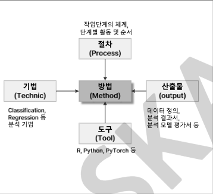

# 분석 프레임워크

## 분석 모델 개발을 위한 가이드라인

### 분석 방법론 프로세스

- 비즈니스 이해
  - 분석 목표 설정
  - 비즈니스 대상 설정
- 가설 수립
  - 가설 설정
  - 필요한 데이터 정의
- 데이터 준비
  - 데이터 분석 진행
  - 결측치 처리
- 분석 모델 정의
  - 모델 기술 정의
  - 모델 개발
  - **최신 개선되가는 모델 파악 후 적용해보기**
- 모델 평가
  - 성과 평가
  - **같은 계열 모델만하지 말고, 다양한 방법 시도하면 좋음 (결이 다른 딥러닝, 선형, 비선형 등)**
- 시스템 적용
  - 시스템에 적용할 방법 설계하기
  - 모니터링하기

> 돈으로 해결할 수 있다면 돈으로 데이터 수집을 진행한다! (컨소시엄)

### 분석 방법론 개요

# 피처엔지니어링이란?

데이터를 모델이 학습하기 좋은 피처로 만드는 과정이다.
