# DBMS 핵심 정리

## DBMS 선택 기준

DBMS는 데이터 구조, 조회 방식, 정합성, 트래픽과 운영 능력을 기준으로 선택한다. 일반적인 서비스는 PostgreSQL이나 MySQL로 시작하고, 명확한 필요가 생길 때 전문 DB를 추가하는 것이 안전하다.

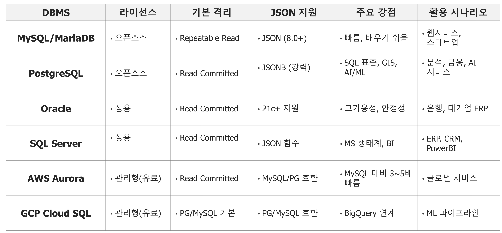

| DBMS          | 적합한 사례                          | 한줄평                                           |
| ------------- | ------------------------------------ | ------------------------------------------------ |
| PostgreSQL    | 복잡한 업무, 금융·정산, 범용 백엔드 | 특별한 이유가 없다면 가장 무난한 범용 선택       |
| MySQL         | 웹 서비스, 커머스, CRUD 중심 시스템  | 익숙하고 운영 사례가 풍부함                      |
| SQLite        | 모바일·PC 앱의 로컬 저장            | 작고 간단하지만 동시 쓰기가 많은 서버에는 부적합 |
| MongoDB       | 구조가 유동적인 문서 데이터          | 스키마 책임이 애플리케이션으로 이동함            |
| Redis         | 캐시, 세션, 순위표, 분산 락          | 원본 DB보다 보조 저장소로 사용할 때 효과적       |
| Elasticsearch | 전문 검색, 로그 검색                 | 검색엔진으로는 좋지만 원장 DB로는 부적합         |
| DynamoDB      | 키 기반 대규모 서비스, 서버리스 API  | 운영은 편하지만 조회 패턴을 먼저 설계해야 함     |
| ClickHouse    | 로그·이벤트 대규모 분석             | 집계는 빠르지만 일반 트랜잭션에는 맞지 않음      |

> 팀이 안정적으로 운영할 수 있는 DB가 벤치마크에서 가장 빠른 DB보다 낫다.

## DB도 서버가 필요한가?

- **직접 설치:** 서버에 PostgreSQL·MySQL을 설치하고 운영한다.
- **관리형 DB:** AWS RDS처럼 서버 관리를 클라우드에 일부 맡긴다.
- **서버리스 DB:** DynamoDB처럼 서버를 직접 생성하거나 관리하지 않는다.
- **로컬 DB:** SQLite처럼 애플리케이션 내부 파일로 저장한다.

서버리스 DB도 실제 물리 서버에서 실행되지만 사용자가 그 서버를 관리하지 않는다.

### 핵심 키

- `PK(Partition Key)`: 데이터가 저장될 파티션을 결정한다.
- `SK(Sort Key)`: 같은 PK의 데이터를 정렬하고 범위 조회에 사용한다.
- `GSI`: 기본 키가 아닌 다른 기준으로 조회하기 위한 보조 인덱스다.-d

```text
PK       = USER#42
SK       = ORDER#2026-08-11#1001
```

이 구조는 42번 사용자의 주문을 시간순으로 조회하기 좋다.

### Query와 Scan

- `Query`: 키를 이용해 필요한 데이터만 읽는다. 빠르고 비용 예측이 쉽다.
- `Scan`: 테이블 전체를 읽는다. 큰 테이블의 일반 API에서는 피하는 것이 좋다.

### 주의점

- 요청이 하나의 PK에 몰리면 핫 파티션이 발생할 수 있다.
- 조인과 자유로운 조건 검색에 약하다.
- GSI가 늘어나면 쓰기·저장 비용도 증가한다.
- 조회 패턴이 자주 바뀌는 초기 서비스는 PostgreSQL이 더 편할 수 있다.

> DynamoDB는 서버 확장을 AWS에 맡기는 대신 데이터 접근 방법을 개발자가 미리 설계하는 DB다.

## 트랜잭션과 ACID

트랜잭션은 하나의 논리적 작업으로 처리해야 하는 연산 묶음이다. ACID는 트랜잭션의 신뢰성을 보장하는 네 가지 속성이다.

| 속성                | 의미                      | 송금 예시                              |
| ------------------- | ------------------------- | -------------------------------------- |
| Atomicity(원자성)   | 모두 성공하거나 모두 취소 | 출금과 입금 중 하나만 실행되지 않음    |
| Consistency(일관성) | 데이터 규칙 유지          | 잔액과 제약조건이 깨지지 않음          |
| Isolation(격리성)   | 동시 작업의 간섭 방지     | 여러 송금이 서로의 결과를 망치지 않음  |
| Durability(지속성)  | 완료 결과를 영구 보존     | 완료 후 서버가 꺼져도 송금 결과가 남음 |

```text
부분 실행 방지   → Atomicity
데이터 규칙 유지 → Consistency
동시 실행 보호   → Isolation
장애 후 보존     → Durability
```

Consistency는 **데이터 규칙**, Isolation은 **동시에 실행되는 트랜잭션 사이의 간섭**에 관한 속성이라는 차이를 기억한다.

## 현업 관점 핵심

1. 주문·결제·재고 같은 원본 데이터는 관계형 DB에 두는 것이 기본이다.
2. Redis·검색엔진·분석 DB는 명확한 목적이 있을 때 보조로 추가한다.
3. DB가 늘어나면 백업, 보안, 모니터링과 장애 대응 대상도 늘어난다.
4. DB를 잘 안다는 것은 쿼리 작성뿐 아니라 동시 요청과 장애 상황에서도 데이터가 안전한 이유를 설명할 수 있다는 뜻이다.

---

# WAL 과 Consensus

- 데이터베이스 안전한 운영법 (백업)

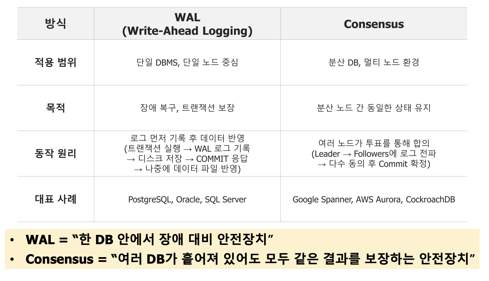

## 트랜잭션 발생 상황

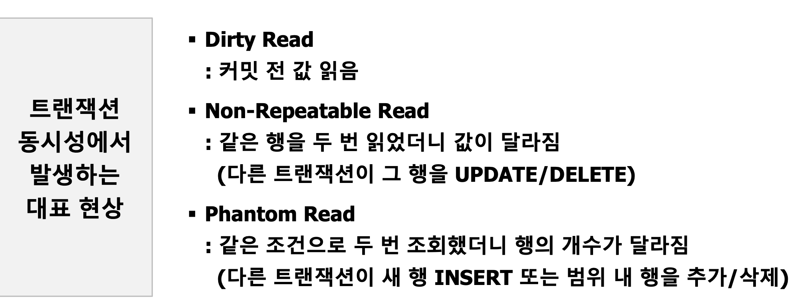

# 관계형 데이터 모델링

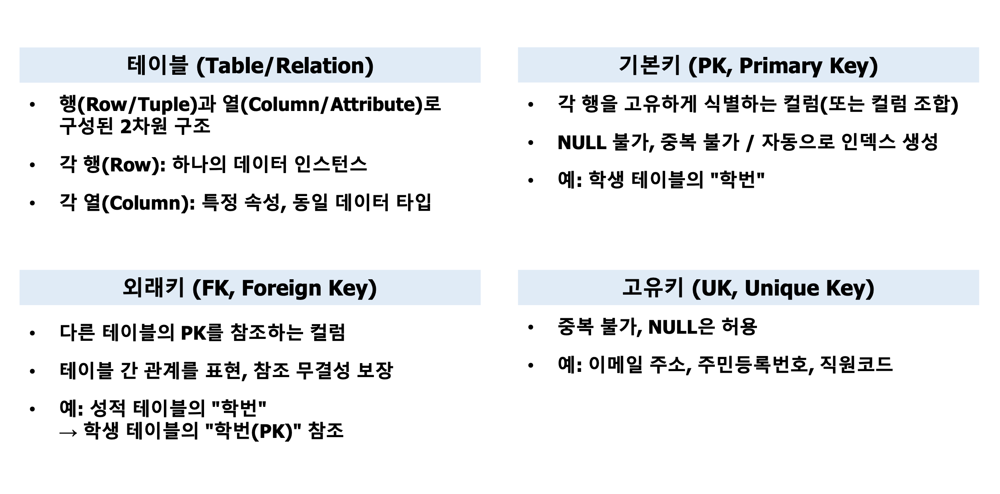

## 정규화 단계

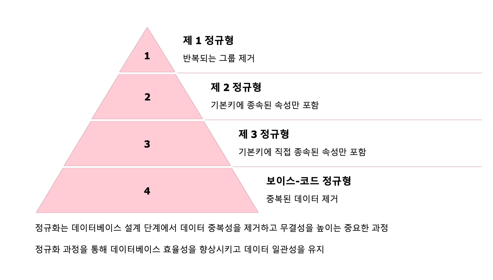

정규화를 통해 일단 뽑아서 분리할 수 있는 데이터는 최대한 나누는 것임

## 정규화 과정

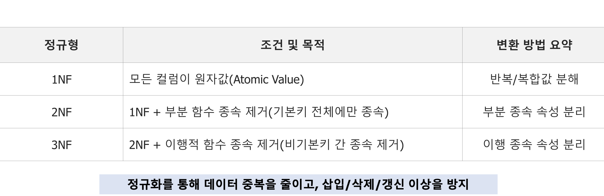

- 식별자(PK) - 고유키 (대체키))가 세팅 되면 1정규형임
- 식별자에 대해 종속된 부분을 분리하면 2정규형임 (이때 원래 테이블을 찾아갈 수 있게하는 키가 외래키)
- 식별자가 아닌데 부분 종속된 내용을 따로 분리하면 3정규형

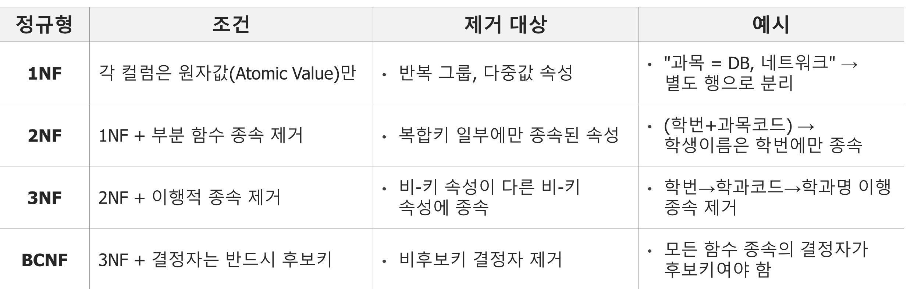

# ERD 작성

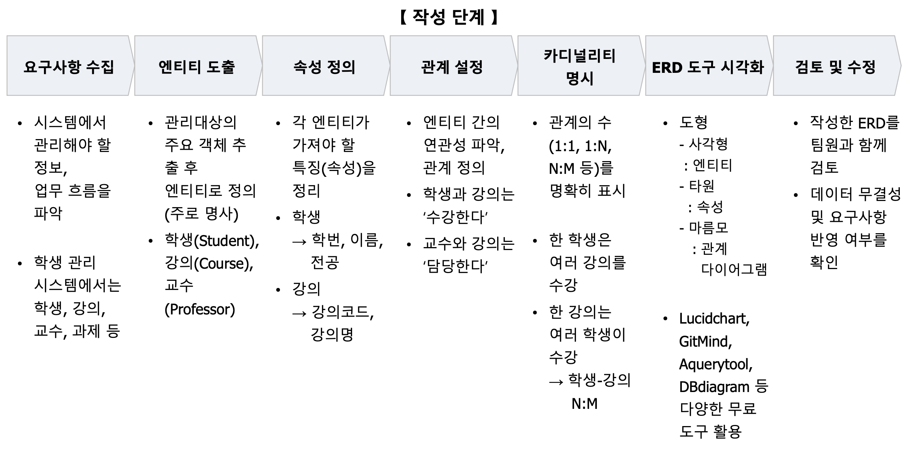

- 이런 요구 사항을 우리는 이렇게 구조화해서 구현하려고 해.
- ERD 설계 전부터 정말 빠진게 없는지 확인하기

# 개념적 / 논리적 / 물리적 데이터 모델링

**실제로 시스템을 넣기 전에 필요한 구조와 명사들을 끄집어 내는 과정(개념적 모델링)을 거쳐 실제 DBMS 에 맞게 개발하기전 기준 정하기(논리적 데이터 모델링) 이후 개발 (물리적 모델링)**

## 개념적 데이터 모델링

- 비즈니스 요구사항 추상화
- DBMS에 독립적인 수준
- 주요 활동
  - 엔터티 식별 (명사 추출)
  - 관계 정의
  - ERD 작성
  - 복합 속성 처리
  - 약/강 엔터티 구분
    - 강한 엔터티 : 혼자서 충분히 구분 되는 기준(학생, 성별)
    - 약한 엔터티 : 독자적으로 구분 못함
- 결과물
  - ERD 다이어 그램

## 논리적 데이터 모델링

- 개념 모델을 논리 구조로 변환하는 과정
- 주요 활동
  - 엔터티를 테이블 매핑
  - PK/FK 설정
  - 정규화 (1NF~3NF) 적용
  - 반정규화 전략 검토 ???
  - 상속 관계 모델링
- 결과물
  - 논리 ERD
  - 데이터 사전

## 물리적 데이터 모델링

1. 특정 DBMS 환경에 최적화된 물리적 스키마 설계
2. 데이터 타입 결정 : DBMS별 최적 타입 선택
3. **인덱스 설계 : where,join,order by  컬럼에 인덱스 추가**

> 실제로 원하는 형태를 생각하면서 초기 설계대로 인덱스를 잘 잡아야함

4. 파티셔닝 : 대용량 데이터를 연도,지역별로 분리해두기 (큰 규모를 일단 자르기)
5. 클러스터형 vs 비클러스터형 인덱스 (튜닝 방식 ??? - 인덱스 주차때 보완)
   * 클러스터형 : 인덱스 자동으로 설계 / 비클러스터형: 데이터 구조를 그대로두고 별도의 인덱스를 설계해서 이를 참조하는 방식으로 사용(바로가기)
6. 저장 공간 최적화
   * 압축, 컬럼 기반 저장하기
7. 트랜잭션 로드 테스트 : 동시 사용자를 고려한 **Lock 전략 (성능 테스트)**

### 낙관적 Lock vs 비관적 Lock

- 트랜잭션을 통해서 오류 대응
- 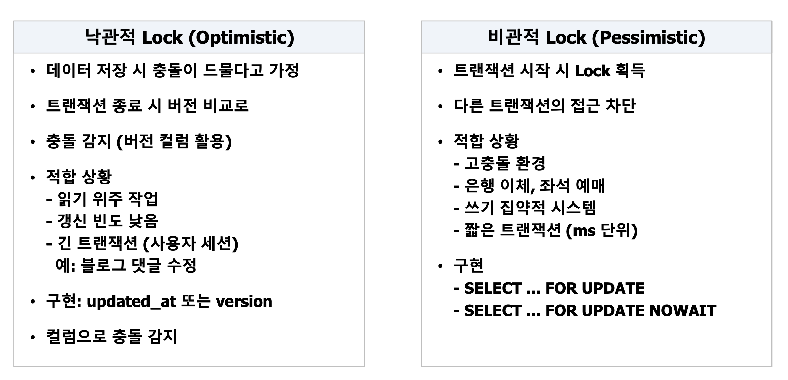

### 옵티마이저

- SQL 실행 방법을 선택하는 가장 효율적인 방법
- 인덱스를 쓰는 것보다 자기 스스로 생각했을 때 직관적인 설계 과정도 필요함

---

# 스키마 전략

### 스키마

- 테이블, 뷰, 함수 등 DB 객체를 그룹화하는 논리적 네임스페이스

### 멀티 테넌시 3가지 패턴

- silo Model : 완전 독립 DB 인스턴스, 영역별로 따로따로 구성함 -> 보안 최강, 그러나 데이터 운영 비용 최대! (권한, 이관 처리에 대한 리스크가 있음)
- Pool Model : 단일 DB + tenant_id 컬럼으로 구분됨 -> 운영 단순, 데이터 혼재 / 아이디로 DB를 나름 나눠진다. (테넌트 ID 별로 보안)
- Bridge Model : PostgreSQL 권장 방식 (silo + pool) 단일 DB안에 테넌트별 스키마를 분리함

| 구분       | 경로                 | 용도                                       | 포함 테이블                               |
| ---------- | -------------------- | ------------------------------------------ | ----------------------------------------- |
| 공통 영역  | `maindb/global`    | 여러 프로젝트에서 공통으로 사용하는 데이터 | `users`,`products`,`exchange_rates` |
| 프로젝트 A | `maindb/prj_alpha` | 프로젝트 A 전용 데이터                     | `orders`,`promotions`                 |
| 프로젝트 B | `maindb/prj_beta`  | 프로젝트 B 전용 데이터                     | `inventory`,`suppliers`               |

- 독립적으로 운영되는 prj_beta, prj_alpha를 구성하고 이를 관리하는 global에서 관리함
- 메인 db도 바꿔야하는 상황이 있는데 그때 Bridge Model이면 prj_alpha 를 작업하는 동안 prj_beta를 수정할 수 있음

### Bridge Model 활용의 장점

1. 물리적 자원 효율성, 스키마 단위 접근 제어
2. 성능 최적화 : 개별적인 인덱스, 파티셔닝 적용 가능
3. 벡터 db 연동 시 임베딩 저장 스키마 분리 설계 가능

---

# 컨테이너 만들기

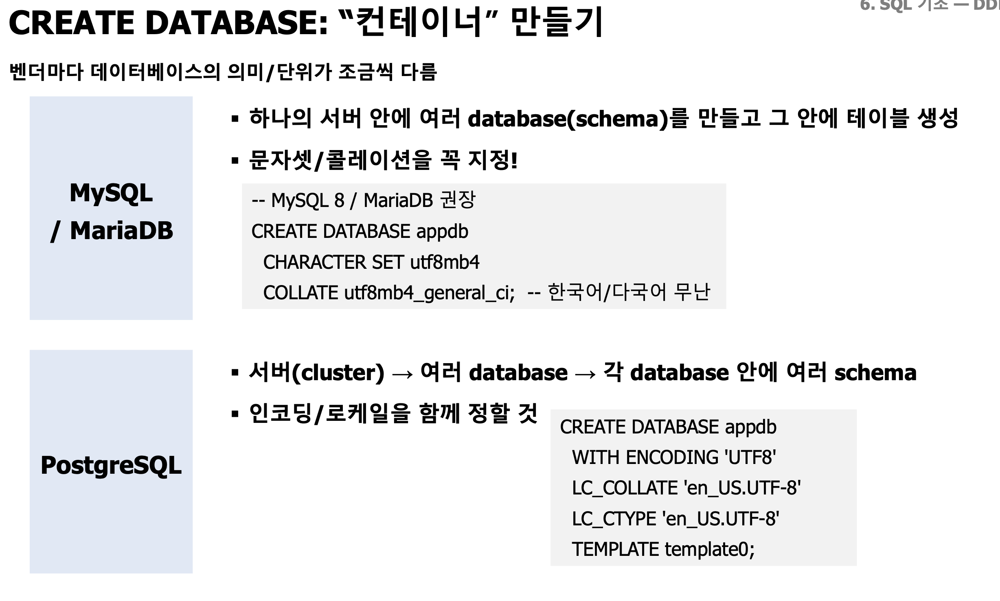

---

# 종합실습

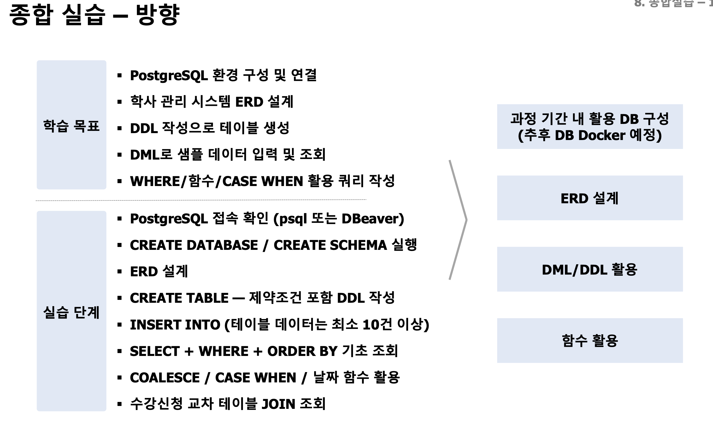

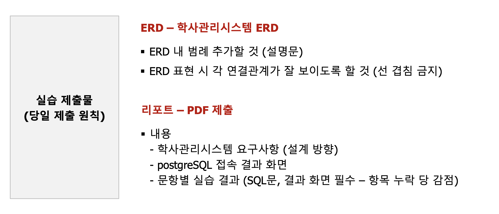

### 제출 형식

- 캠퍼스_반_ERD.pdf
  - 가독성 좋게 선 보이게 하기

[종합실습 1]
작업은 Local PC에 설치한 PostgreSQL에서 하시면 됩니다.

아래의 항목별로 결과 화면을 만들어주세요.(접속 결과는 결과화면만 있으면 됩니다.)

PostgreSQL 접속 확인 (psql 또는 DBeaver 아니면 설치하신 GUI 프로그램)
CREATE DATABASE / CREATE SCHEMA 실행
CREATE TABLE — 제약조건 포함 DDL 작성
INSERT INTO (테이블 데이터는 최소 10건 이상)
SELECT + WHERE + ORDER BY 기초 조회
COALESCE / CASE WHEN / 날짜 함수 활용
수강신청 교차 테이블 JOIN 조회

그리고 설계한 ERD 내용과 학사관리시스템에 대해 여러분들이 만든 요구사항 및 항목별 결과를 정리해주세요

학사관리시스템에 대한 요구사항 (설계 방향)
요구사항이 반영된 ERD
항목별 결과

정리된 결과는 PDF 파일(판교_**반_홍길동.PDF ) 로 제출해주시면 됩니다.
제출은 이 글에 댓글로 올려주세요.
(기한 : 2일차 오전 9시 전 - 08시 59분 59초...)

---

# 기능 설계

- 브릿지 모델 설계로 해보자
- global       → 여러 업무에서 공통으로 사용하는 기준 엔티티
  prj_academic → 학사관리 업무에 특화된 엔티티
  bridge       → 엔티티 사이의 관계와 업무 상태를 관리하는 연결 엔티티

| 사용자 | 주요 목적                              |
| ------ | -------------------------------------- |
| 학생   | 강좌 조회, 수강신청, 시간표·성적 확인 |
| 교수   | 담당 강좌와 수강생 조회, 성적 입력     |
| 관리자 | 학기·과목·강좌 개설 및 학사 운영     |

## 구조 설계

- 학사 관리 시스템을 위한 DB를 설계해보자.
- 우선 아래 db를 구조화해서 maindb와 prj_academic 나누

---

# ERD 설계도

## 1. 요구사항

학생·교수·관리자가 강좌 개설부터 수강신청과 성적 공개까지 관리하는 학사관리시스템

| 사용자 | 핵심 기능                      |
| ------ | ------------------------------ |
| 학생   | 강좌 조회, 수강신청, 성적 조회 |
| 교수   | 담당 강좌 조회, 성적 입력      |
| 관리자 | 학기·강좌 개설 및 교수 배정   |

## 2. 업무 시나리오

### 2.1. 강좌 개설

- 관리자가 특정 학기에 어떤 교수가, 정원 몇명, 어디 강의실과 사용하는 강좌를 개설한다.
- 관리자 로그인 -> 학기 선택 → 과목 선택 → 분반·정원·강의실 입력 → 개설 강좌 생성 → 담당 교수 배정 → 수강신청 가능 상태로 변경

### 2.2. 수강 신청

- 학생이 특정 학기에 개설된 강좌를 수강신청한다.
- 학생 로그인 → 현재 학기의 신청 가능한 강좌 조회 → 강좌 선택 → 정원 확인  → 수강신청 저장

### 2.3. 성적 처리

- 교수가 특정 학기 특정 강좌의 성적을 특정 학생에게 부여한다.
- 교수 로그인 → 담당 강좌 조회 → 해당 강좌의 수강생 조회 → 점수와 등급 입력
  → DRAFT 저장 → 학생에게 공개

## 3. 엔티티 도출

학생, 교수, 관리자

강좌, 성적, 강의실

학년, 학기, 이름, 전공

> 권한에 따라 역할을 나누고 역할에 맞춰 기능 구현하자

## 4.전체 기능 흐름

### [관리자]

users에서 ADMIN 확인 → terms·courses·교수 조회 → course_offerings 생성 → OPEN

### [학생]

1. users에서 STUDENT 확인 → OPEN 학기·강좌 조회 → enrollments 인원 확인 → enrollments 생성
2. 본인의 enrollments 조회→ PUBLISHED 성적만 확인

### [교수]

users에서 PROFESSOR 확인 → 담당 course_offerings 조회 → enrollments 수강생 조회
→ 점수·등급 DRAFT 저장 → PUBLISHED

## 5. 테이블 정의

| 테이블                        | 역할                                    |
| ----------------------------- | --------------------------------------- |
| `academic.users`            | 학생·교수·관리자의 로그인 및 기본정보 |
| `academic.terms`            | 연도, 학기와 수강신청 기간 관리         |
| `academic.courses`          | 과목 기본정보                           |
| `academic.course_offerings` | 특정 학기에 실제로 운영되는 분반        |
| `academic.enrollments`      | 학생의 수강신청 관계와 성적 처리        |

과목의 고정 정보는 `courses`, 학기마다 변경되는 교수·분반·정원·강의실은 `course_offerings`가 관리합니다.

### 학생 테이블

student_id (PK)
user_id
department_id
admission_year
status

### 강좌 테이블

course_id (PK )
course_code
name
credits
department_id

### 등록 테이블

- 현재 수강 인원을 파악할 수 있으면 좋겠음

enrollment_id
student_id
offering_id
status
enrolled_at
dropped_at

### 성적 테이블

enrollment_id
score
letter_grade
status
graded_at

---

## 산출물 정리

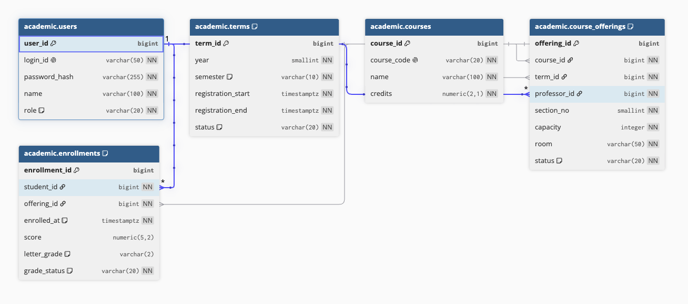
