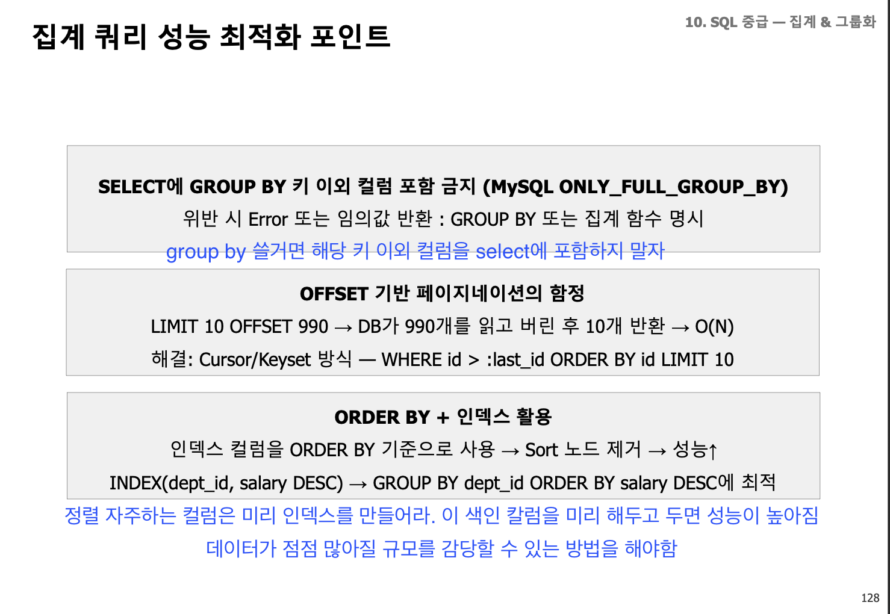

# Day 1 데이터베이스 설계 현업 방식

---

## 산출물 작성 과정에서 시간 리소스를 절약하는 방법

- 단계별로 산출물 내고 끝내기
- 산출물을 막판에 업데이트하기보다는

### 인덱스 설계 과정을 경험해봐라

- 쿼리에 따라 성능 개선 과정을 경험해보면 성장한다.
- 한 사람이 요청할 때 1초가 100명이 요청해서 100초가 안걸리게, 병목 없게 발생하는 구조를 쿼리 최적화를 해야함
- 조인이나 인덱스 설계를 잘해야한다

### 다대다 관계를 테이블 설정할때

- 교차 테이블 (다대다 가운데를 연결하는 테이블)
  - 추가 속성 넣어도 되긴 함
  - 두 엔티티 기본키를 모은 외래키로 교차 테이블 만들어두면 조회하고 관리하기
  - 목적이 뭐냐?
    - **이를 기반으로 관리하겠다고 선언을 한건지 아니면 단순히 다대다로도 충분한지 고민해보기**

### 인덱스 설정 기준

- 일일히 전체 테이블에서 값하나 찾는게 아니라 자주 쓰는 자주 조회할 때 사용되는 칼럼을 인덱스로 설정해서 관리하면 됨

### 실제 현업 때 겪는 일

- 타임존 혼선

### DML 주의사항

1. mysql은 자동 커밋됨
2. postgresql은 begin 없으면 자동 커밋
3. 대용량 딜리트는 루프로 나눠서 처리 권장

---

# Day2

## 실무 경험에서 주의할 사항

