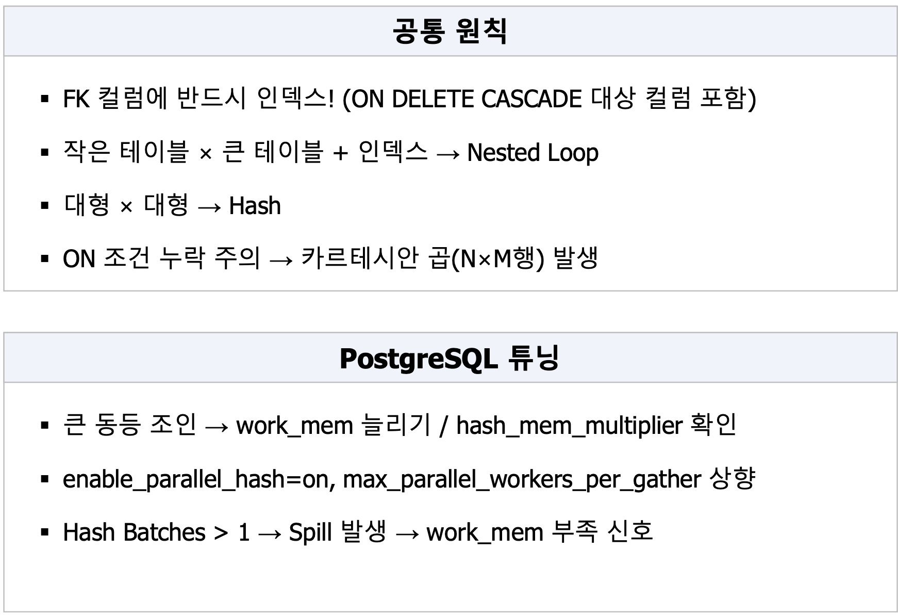
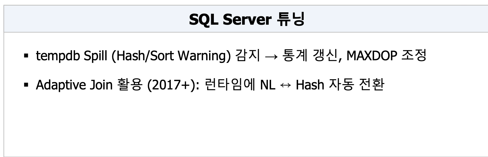
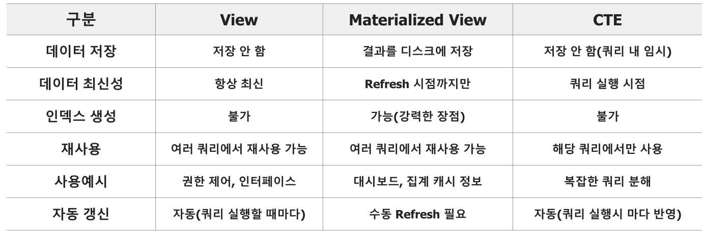

# [집계 & 그룹화] GROUP BY / HAVING / ROLLUP / CUBE / FILTER / 페이지네이션

---

## 1. 집계 함수

여러 행을 계산하여 하나의 결과를 만드는 함수입니다.

| 함수                    | 의미                  | NULL 처리 |
| ----------------------- | --------------------- | --------- |
| `COUNT(*)`            | 전체 행 개수          | NULL 포함 |
| `COUNT(col)`          | 특정 컬럼의 값 개수   | NULL 제외 |
| `COUNT(DISTINCT col)` | 중복을 제거한 값 개수 | NULL 제외 |
| `SUM(col)`            | 합계                  | NULL 제외 |
| `AVG(col)`            | 평균                  | NULL 제외 |
| `MIN(col)`            | 최솟값                | NULL 제외 |
| `MAX(col)`            | 최댓값                | NULL 제외 |

```sql
SELECT
    COUNT(*) AS total_count,
    COUNT(score) AS score_count,
    AVG(score) AS avg_score,
    MAX(score) AS max_score
FROM enrollments;
```

`AVG()`는 `NULL`을 0으로 계산하지 않고 제외합니다. 모든 값이 `NULL`이면 결과도 `NULL`입니다.

---

## 2. GROUP BY

지정한 컬럼의 값이 같은 행을 하나의 그룹으로 묶어 집계합니다.

```sql
SELECT
    department_id,
    COUNT(*) AS emp_count,
    ROUND(AVG(salary), 0) AS avg_salary,
    MAX(salary) AS max_salary,
    MIN(salary) AS min_salary
FROM employees
WHERE hire_date >= '2020-01-01'
GROUP BY department_id
ORDER BY avg_salary DESC;
```

#### 처리 과정

1. `WHERE`로 2020년 이후 입사자 선택
2. `department_id`가 같은 직원을 그룹으로 묶음
3. 부서별 인원·평균·최대·최소 급여 계산
4. 평균 급여가 높은 부서부터 정렬

### SELECT 작성 규칙

집계 쿼리의 `SELECT`에는 다음 두 종류만 사용할 수 있습니다.

- `GROUP BY`에 포함된 그룹 기준 컬럼
- `COUNT`, `SUM`, `AVG` 등의 집계함수

```sql
-- 잘못된 형태
SELECT department_id, emp_name, COUNT(*)
FROM employees
GROUP BY department_id;
```

`emp_name`은 그룹 기준도 아니고 집계 결과도 아니므로 어떤 직원 이름을 출력할지 결정할 수 없습니다.

```sql
-- 올바른 형태
SELECT department_id, COUNT(*)
FROM employees
GROUP BY department_id;
```

---

## 3. WHERE와 HAVING

두 구문 모두 데이터를 필터링하지만 적용 시점이 다릅니다.

| 구문       | 적용 시점 | 대상        |
| ---------- | --------- | ----------- |
| `WHERE`  | 그룹화 전 | 개별 행     |
| `HAVING` | 그룹화 후 | 집계된 그룹 |

```sql
SELECT
    department_id,
    COUNT(*) AS emp_count,
    ROUND(AVG(salary), 0) AS avg_salary
FROM employees
WHERE hire_date >= '2020-01-01'
GROUP BY department_id
HAVING COUNT(*) >= 3
   AND AVG(salary) >= 5000
ORDER BY avg_salary DESC;
```

- `WHERE`: 2020년 이후 입사한 직원만 집계에 참여
- `HAVING COUNT(*) >= 3`: 직원이 3명 이상인 부서만 선택
- `HAVING AVG(salary) >= 5000`: 평균 급여가 5,000 이상인 부서만 선택

```text
FROM → WHERE → GROUP BY → HAVING → SELECT → ORDER BY
```

> 개별 행 조건은 `WHERE`, `COUNT()`나 `AVG()` 같은 집계 결과 조건은 `HAVING`에 작성합니다.

---

## 4. ROLLUP

그룹별 상세 결과에 **계층적인 소계와 전체 합계**를 추가합니다.

예시 데이터:

| region | product | amount |
| ------ | ------- | -----: |
| East   | A       |    100 |
| East   | B       |    150 |
| West   | A       |    200 |
| West   | B       |     50 |

```sql
SELECT
    region,
    product,
    SUM(amount) AS total
FROM sales_summary
GROUP BY ROLLUP(region, product);
```

결과 구조:

| region   | product  | total | 의미      |
| -------- | -------- | ----: | --------- |
| East     | A        |   100 | 상세      |
| East     | B        |   150 | 상세      |
| East     | `NULL` |   250 | East 소계 |
| West     | A        |   200 | 상세      |
| West     | B        |    50 | 상세      |
| West     | `NULL` |   250 | West 소계 |
| `NULL` | `NULL` |   500 | 전체 합계 |

`ROLLUP(region, product)`의 계층은 다음과 같습니다.

```text
(region, product) 상세
        ↓
(region) 지역별 소계
        ↓
() 전체 합계
```

> 컬럼을 작성한 순서대로 상위 계층의 소계를 만듭니다.

---

## 5. CUBE

지정한 컬럼으로 만들 수 있는 **모든 조합의 소계**를 계산합니다.

```sql
SELECT
    region,
    product,
    SUM(amount) AS total
FROM sales_summary
GROUP BY CUBE(region, product);
```

`ROLLUP` 결과에 다음 상품별 소계가 추가됩니다.

| region   | product | total | 의미               |
| -------- | ------- | ----: | ------------------ |
| `NULL` | A       |   300 | 전체 지역의 A 합계 |
| `NULL` | B       |   200 | 전체 지역의 B 합계 |

```text
(region, product) 지역·상품별
(region)          지역별
(product)         상품별
()                전체
```

### ROLLUP과 CUBE 비교

| 구분      | `ROLLUP`      | `CUBE`                    |
| --------- | --------------- | --------------------------- |
| 집계 범위 | 계층적인 소계   | 가능한 모든 조합            |
| 예시      | 지역별 → 전체  | 지역별 + 상품별 + 전체      |
| 처리량    | 상대적으로 적음 | 조합이 많아 상대적으로 느림 |
| 용도      | 단계별 보고서   | 다차원 분석                 |

---

## 6. GROUPING 함수

`ROLLUP`과 `CUBE`가 만든 `NULL`과 원래 데이터의 `NULL`을 구분합니다.

```sql
SELECT
    CASE
        WHEN GROUPING(region) = 1 THEN '전체'
        ELSE region
    END AS region_label,
    CASE
        WHEN GROUPING(product) = 1 THEN '소계'
        ELSE product
    END AS product_label,
    SUM(amount) AS total
FROM sales_summary
GROUP BY ROLLUP(region, product);
```

- `GROUPING(컬럼) = 0`: 일반 상세 데이터
- `GROUPING(컬럼) = 1`: 집계 과정에서 생성된 소계·총계

---

## 7. ROLLUP/CUBE DBMS 지원 비교

| DBMS          |  ROLLUP | CUBE | GROUPING SETS | 교본의 특이사항                        |
| ------------- | ------: | ---: | ------------: | -------------------------------------- |
| PostgreSQL    |       O |    O |             O | `GROUPING()` 제공, SQL 표준에 가까움 |
| MySQL/MariaDB | O(5.7+) | 일부 |       O(8.0+) | 구버전은 CUBE 미지원, 버전 확인        |
| Oracle        |       O |    O |             O | `GROUPING_ID()` 제공                 |
| SQL Server    |       O |    O |             O | `GROUPING()`, `GROUPING_ID()` 제공 |

---

## 8. FILTER 절

하나의 집계 쿼리에서 조건별 집계값을 계산합니다.

```sql
SELECT
    COUNT(*) AS total,
    COUNT(*) FILTER (
        WHERE true_label = pred_label
    ) AS correct,
    ROUND(
        COUNT(*) FILTER (
            WHERE true_label = pred_label
        )::NUMERIC / COUNT(*),
        3
    ) AS accuracy
FROM prediction_results;
```

#### 해설

- `total`: 전체 예측 건수
- `correct`: 실제값과 예측값이 일치한 건수
- `accuracy`: 전체 중 정답 비율

`WHERE`는 전체 조회 대상을 제한하지만, `FILTER`는 특정 집계함수에만 조건을 적용합니다.

```sql
SELECT
    COUNT(*) AS total,
    COUNT(*) FILTER (WHERE score >= 80) AS high_score
FROM enrollments;
```

한 번의 조회로 전체 학생 수와 80점 이상 학생 수를 함께 계산합니다.

---

## 9. FILTER 절 DBMS 차이

교본에서는 `FILTER`를 PostgreSQL 전용 기능으로 설명하고, 다른 DBMS에서는 `CASE WHEN`으로 대체합니다.

```sql
-- PostgreSQL
COUNT(*) FILTER (WHERE score >= 80)
```

```sql
-- MySQL·Oracle·SQL Server 대체 방식
SUM(
    CASE
        WHEN score >= 80 THEN 1
        ELSE 0
    END
)
```

| 기능                | PostgreSQL     | MySQL/MariaDB      | Oracle             | SQL Server         |
| ------------------- | -------------- | ------------------ | ------------------ | ------------------ |
| `FILTER`          | 지원           | `CASE WHEN` 대체 | `CASE WHEN` 대체 | `CASE WHEN` 대체 |
| `STDDEV/VARIANCE` | 지원           | 지원               | 지원               | 지원               |
| 문자열 집계         | `STRING_AGG` | `GROUP_CONCAT`   | `LISTAGG`        | `STRING_AGG`     |

### 주요 집계함수 DBMS 차이

| 항목                | PostgreSQL                             | MySQL/MariaDB                           | Oracle           | SQL Server |
| ------------------- | -------------------------------------- | --------------------------------------- | ---------------- | ---------- |
| `COUNT(*)`        | 빠르지만 MVCC 특성상 다소 느릴 수 있음 | MyISAM은 메타데이터, InnoDB는 전체 스캔 | 인덱스 적극 활용 | 통계 기반  |
| `COUNT(DISTINCT)` | 일반적으로 빠름                        | 추가 정렬·해시 비용                    | Hash 집계        | Hash 집계  |
| `AVG(NULL)`       | NULL 제외                              | NULL 제외                               | NULL 제외        | NULL 제외  |

---

## 10. OFFSET 페이지네이션의 문제

```sql
SELECT *
FROM orders
ORDER BY id
LIMIT 10 OFFSET 9990;
```

10개만 반환하지만 DB는 앞의 9,990개를 읽고 버린 후 다음 10개를 반환합니다.

```text
OFFSET 증가
    ↓
읽고 버리는 행 증가
    ↓
응답 시간 증가: O(N)
```

페이지가 뒤로 갈수록 느려지는 구조입니다.

---

## 11. Cursor/Keyset 페이지네이션

이전 페이지의 마지막 값을 기억하고, 그 이후부터 조회합니다.

### 첫 페이지

```sql
SELECT *
FROM orders
ORDER BY id
LIMIT 10;
```

마지막 행의 `id`가 `1000`이었다고 가정합니다.

### 다음 페이지

```sql
SELECT *
FROM orders
WHERE id > 1000
ORDER BY id
LIMIT 10;
```

`id` 인덱스를 이용해 `1001` 이후부터 바로 접근합니다. 교본에서는 이를 항상 빠른 `O(log N)` 방식으로 설명합니다.

### 정렬값이 고유하지 않은 경우

`created_at`이 같은 주문이 여러 개면 `id`를 보조 정렬 기준으로 사용합니다.

```sql
SELECT *
FROM orders
WHERE (created_at, id) >
      ('2024-03-15', 500)
ORDER BY created_at, id
LIMIT 10;
```

마지막으로 조회한 `(created_at, id)` 조합보다 큰 행부터 다음 페이지를 가져옵니다.

### 두 방식 비교

| 구분             | OFFSET            | Cursor/Keyset          |
| ---------------- | ----------------- | ---------------------- |
| 기준             | 건너뛸 행 수      | 마지막으로 조회한 값   |
| 뒤 페이지 성능   | 점점 느려짐       | 일정하게 빠름          |
| 임의 페이지 이동 | 가능              | 어려움                 |
| 적합한 UI        | 페이지 번호       | 무한 스크롤, 다음 버튼 |
| 인덱스 활용      | 뒤쪽에서 비효율적 | 정렬 컬럼 인덱스 활용  |

### 핵심 정리

- `WHERE`: 집계 전 개별 행 필터
- `GROUP BY`: 같은 값을 가진 행을 그룹화
- `HAVING`: 집계 후 그룹 필터
- `ROLLUP`: 계층별 소계와 전체 합계
- `CUBE`: 모든 차원 조합의 소계
- `FILTER`: 하나의 쿼리에서 조건부 집계
- 대용량 페이지네이션: `OFFSET`보다 Cursor/Keyset 방식 권장

# SQL 고급 - join 알고리즘

---

## Nested Loop Join (NLJ)

- 외부 테이블 행마다 내부 테이블 탐색
- **인덱스 있으면 빠름**
- 외부 집합이 작을 때 내부 인덱스 있으면 적합

## Sort-Merge Join (SMJ)

- 양쪽 정렬 후 병합 매칭
- 이미 정렬된 데이터면 유리함

## Hash Join (HJ)

- 두 테이블 중  **작은 테이블로 해시 테이블을 만들고** , 큰 테이블을 읽으면서 일치하는 값을 찾는 조인 방식
- 동등 조인(=)에 강력
  - 조건중에 <,>, between 같은 범위 조인에는 어려움
- 메모리 부족하면 디스크 활용함
- 대용량 등가 조인, **인덱스 없을 때 적합**

## BNL/ BKA (참고)

* **BNL(Block Nested Loop):** 선행 테이블의 행을 버퍼에 모은 뒤, 후행 테이블을 스캔하며 한꺼번에 비교합니다.
* **BKA(Batched Key Access):** 선행 테이블의 조인 키를 버퍼에 모은 뒤, 후행 테이블의 **인덱스**를 일괄 조회합니다.

### 구분

| 구분               | BNL                     | BKA                     |
| ------------------ | ----------------------- | ----------------------- |
| 후행 테이블 인덱스 | 주로 사용하지 못할 때   | 사용 가능할 때          |
| 처리 방식          | 테이블 스캔 후 비교     | 인덱스 키 일괄 조회     |
| 핵심 목적          | 반복적인 전체 스캔 감소 | 랜덤 인덱스 접근 효율화 |

## JOIN 성능 튜닝 실전 체크리스트





# Join 종류

---

## 1. 논리적 Join

| 종류                 | 결과                                    |
| -------------------- | --------------------------------------- |
| `INNER JOIN`       | 양쪽 테이블에서 조건이 일치하는 행만    |
| `LEFT OUTER JOIN`  | 왼쪽 전체 + 오른쪽에서 일치하는 행      |
| `RIGHT OUTER JOIN` | 오른쪽 전체 + 왼쪽에서 일치하는 행      |
| `FULL OUTER JOIN`  | 양쪽 전체, 일치하지 않는 부분은`NULL` |
| `CROSS JOIN`       | 양쪽 행의 모든 조합                     |
| `SELF JOIN`        | 하나의 테이블을 자기 자신과 JOIN        |

## [JOIN 종류 상세] INNER / OUTER JOIN 예제 해설

### 예시 데이터

**student**

| id | name |
| -: | ---- |
|  1 | 철수 |
|  2 | 영희 |
|  3 | 민수 |

**enroll**

| student_id | course | grade |
| ---------: | ------ | ----- |
|          1 | SQL    | A     |
|          1 | Python | B     |
|          2 | SQL    | B+    |
|          4 | Java   | A     |

`student.id = enroll.student_id`를 기준으로 연결합니다.

---

### 1. INNER JOIN

```sql
SELECT s.name, e.course, e.grade
FROM student s
INNER JOIN enroll e
    ON s.id = e.student_id;
```

- `s`, `e`는 테이블의 별칭입니다.
- `ON`은 두 테이블을 연결할 조건입니다.
- 양쪽 테이블에 일치하는 데이터만 반환합니다.
- 철수는 수강 기록이 2개이므로 결과도 2행입니다.
- 수강 기록이 없는 민수와 학생 정보가 없는 `student_id = 4`는 제외됩니다.

| name | course | grade |
| ---- | ------ | ----- |
| 철수 | SQL    | A     |
| 철수 | Python | B     |
| 영희 | SQL    | B+    |

> `INNER JOIN`은 양쪽에 모두 존재하는 데이터만 필요할 때 사용합니다.

---

### 2. LEFT OUTER JOIN

```sql
SELECT s.name, e.course, e.grade
FROM student s
LEFT JOIN enroll e
    ON s.id = e.student_id;
```

- `LEFT`인 `student` 테이블의 모든 행을 보존합니다.
- 일치하는 수강 기록이 없으면 `enroll` 컬럼이 `NULL`이 됩니다.
- 학생 정보가 없는 `student_id = 4`는 왼쪽 테이블에 없으므로 제외됩니다.

| name | course   | grade    |
| ---- | -------- | -------- |
| 철수 | SQL      | A        |
| 철수 | Python   | B        |
| 영희 | SQL      | B+       |
| 민수 | `NULL` | `NULL` |

> “모든 학생을 조회하되, 수강 정보가 있으면 함께 표시”할 때 사용합니다.

---

### 3. RIGHT OUTER JOIN

```sql
SELECT s.name, e.course, e.grade
FROM student s
RIGHT JOIN enroll e
    ON s.id = e.student_id;
```

- `RIGHT`인 `enroll` 테이블의 모든 행을 보존합니다.
- 연결되는 학생이 없으면 `student` 컬럼이 `NULL`이 됩니다.

| name     | course | grade |
| -------- | ------ | ----- |
| 철수     | SQL    | A     |
| 철수     | Python | B     |
| 영희     | SQL    | B+    |
| `NULL` | Java   | A     |

> 모든 수강 기록을 확인하고, 학생 정보가 없는 고아 데이터도 찾을 때 사용할 수 있습니다.

실무에서는 읽기 편하도록 테이블 순서를 바꾸어 `LEFT JOIN`으로 표현하는 경우가 많습니다.

---

### 4. FULL OUTER JOIN

PostgreSQL, Oracle, SQL Server에서는 직접 사용할 수 있습니다.

```sql
SELECT s.name, e.course, e.grade
FROM student s
FULL OUTER JOIN enroll e
    ON s.id = e.student_id;
```

- 양쪽 테이블의 모든 데이터를 보존합니다.
- 일치하면 하나의 행으로 연결합니다.
- 수강하지 않은 학생과 학생 정보가 없는 수강 기록도 포함합니다.

| name     | course   | grade    |
| -------- | -------- | -------- |
| 철수     | SQL      | A        |
| 철수     | Python   | B        |
| 영희     | SQL      | B+       |
| 민수     | `NULL` | `NULL` |
| `NULL` | Java     | A        |

### MySQL 우회 방법

MySQL은 `FULL OUTER JOIN`을 직접 지원하지 않으므로 다음처럼 합칩니다.

```sql
SELECT s.name, e.course, e.grade
FROM student s
LEFT JOIN enroll e
    ON s.id = e.student_id

UNION

SELECT s.name, e.course, e.grade
FROM student s
RIGHT JOIN enroll e
    ON s.id = e.student_id;
```

`UNION`은 양쪽 결과에 중복된 일치 행을 제거하여 `FULL OUTER JOIN`과 같은 결과를 만듭니다.

### 핵심 정리

| JOIN                | 반드시 보존되는 데이터 |
| ------------------- | ---------------------- |
| `INNER JOIN`      | 양쪽에서 일치한 행     |
| `LEFT JOIN`       | 왼쪽 테이블 전체       |
| `RIGHT JOIN`      | 오른쪽 테이블 전체     |
| `FULL OUTER JOIN` | 양쪽 테이블 전체       |

> `LEFT`와 `RIGHT`는 SQL 문에서 테이블이 작성된 위치를 기준으로 판단합니다.

## [JOIN 종류 상세] SELF JOIN / Anti-Join / CROSS JOIN

### 1. SELF JOIN

하나의 테이블을 서로 다른 역할의 두 테이블처럼 연결하는 방식입니다.

```sql
SELECT
    e.name AS employee,
    m.name AS manager
FROM employees e
LEFT JOIN employees m
    ON m.id = e.manager_id
ORDER BY m.name NULLS FIRST, e.name;
```

예시 데이터:

| id | name   | manager_id |
| -: | ------ | ---------: |
|  1 | 김대표 |   `NULL` |
|  2 | 이팀장 |          1 |
|  3 | 박사원 |          2 |

동작 과정:

- `employees e`: 직원 역할
- `employees m`: 관리자 역할
- `e.manager_id`와 `m.id`를 연결
- `LEFT JOIN`이므로 관리자가 없는 대표도 결과에 포함
- `AS employee`, `AS manager`는 결과 컬럼의 이름을 지정

결과:

| employee | manager  |
| -------- | -------- |
| 김대표   | `NULL` |
| 이팀장   | 김대표   |
| 박사원   | 이팀장   |

```sql
ORDER BY m.name NULLS FIRST, e.name;
```

관리자가 없는 행을 먼저 배치하고, 이후 관리자명과 직원명 순으로 정렬합니다.

> `NULLS FIRST`는 PostgreSQL·Oracle 등에서 지원합니다. MySQL에서는 `ORDER BY m.name IS NOT NULL, m.name`처럼 표현할 수 있습니다.

---

### 2. Anti-Join

두 데이터 집합을 비교하여 **상대 테이블에 존재하지 않는 행**을 찾는 패턴입니다.

예시 목표:

> 수강 기록이 한 번도 없는 학생을 조회한다.

#### 방법 1: LEFT JOIN + IS NULL

```sql
SELECT s.name
FROM student s
LEFT JOIN enroll e
    ON e.student_id = s.id
WHERE e.student_id IS NULL;
```

동작 과정:

1. 모든 학생을 기준으로 수강 기록을 연결합니다.
2. 수강 기록이 없는 학생은 `e.student_id`가 `NULL`이 됩니다.
3. `WHERE ... IS NULL`로 해당 학생만 남깁니다.

> `LEFT JOIN`으로 전체 학생을 보존한 뒤, 연결에 실패한 행만 찾는 방식입니다.

#### 방법 2: NOT EXISTS — 권장

```sql
SELECT s.name
FROM student s
WHERE NOT EXISTS (
    SELECT 1
    FROM enroll e
    WHERE e.student_id = s.id
);
```

학생 한 명마다 조건에 맞는 수강 기록의 존재 여부를 확인합니다.

- 수강 기록이 존재하면 `NOT EXISTS`가 거짓 → 제외
- 수강 기록이 없으면 `NOT EXISTS`가 참 → 반환
- `SELECT 1`은 실제 값이 필요하지 않고 존재 여부만 확인한다는 뜻

> Anti-Join의 의도가 명확하고 `NULL`에도 안전하므로 일반적으로 `NOT EXISTS`를 우선 사용합니다.

#### 방법 3: NOT IN — NULL 주의

```sql
SELECT s.name
FROM student s
WHERE s.id NOT IN (
    SELECT student_id
    FROM enroll
);
```

서브쿼리 결과에 `NULL`이 없다면 정상적으로 동작합니다. 하지만 다음과 같다면 문제가 발생합니다.

```text
(1, 2, NULL)
```

SQL에서는 `3 <> NULL`의 결과를 참이나 거짓으로 확정할 수 없습니다. 따라서 전체 조건이 `UNKNOWN`이 되어 결과가 나오지 않을 수 있습니다.

NULL을 제거하면 사용할 수 있습니다.

```sql
SELECT s.name
FROM student s
WHERE s.id NOT IN (
    SELECT student_id
    FROM enroll
    WHERE student_id IS NOT NULL
);
```

그래도 같은 의미라면 `NOT EXISTS`가 더 명확합니다.

---

### 3. CROSS JOIN

두 테이블의 모든 행을 서로 조합하는 방식입니다. 연결 조건인 `ON`을 사용하지 않습니다.

```sql
SELECT
    s.id AS student_id,
    c.id AS course_id
FROM students s
CROSS JOIN courses c
LIMIT 100;
```

학생이 3명이고 강좌가 4개라면 다음과 같이 `3 × 4 = 12행`이 생성됩니다.

| student_id | course_id |
| ---------: | --------: |
|          1 |       101 |
|          1 |       102 |
|          1 |       103 |
|          1 |       104 |
|          2 |       101 |
|        ... |       ... |

활용 예:

- 전체 상품 × 전체 색상 조합
- 전체 학생 × 전체 강좌 추천 후보
- 날짜 × 지역 조합 생성

주의할 점:

- 10만 행과 1만 행을 연결하면 최대 10억 개의 조합이 만들어집니다.
- `LIMIT 100`은 반환 행을 제한하지만, 복잡한 쿼리에서는 내부 처리량까지 항상 안전하게 제한한다고 볼 수 없습니다.
- 실행 전 `행 개수 × 행 개수`를 확인해야 합니다.

### 핵심 정리

| 종류           | 핵심 의미                    |
| -------------- | ---------------------------- |
| `SELF JOIN`  | 동일한 테이블 내 관계를 조회 |
| `Anti-Join`  | 상대 테이블에 없는 행을 조회 |
| `CROSS JOIN` | 양쪽 테이블의 모든 조합 생성 |

> Anti-Join은 별도의 SQL 키워드가 아니라 `NOT EXISTS` 또는 `LEFT JOIN ... IS NULL` 등으로 구현하는 논리적 패턴입니다.

# 서브 쿼리

## [서브쿼리 & 집합 연산자] 서브쿼리 정리

교본의 **13. 서브쿼리 & 집합 연산자** 및 참고 심화 내용만 정리했습니다. :codex-file-citation{path="/Users/chltmddn5843/Downloads/skala/5주차/학습자료/1) Full-stack Engineering(AI캠퍼스, 4일)_4. 스마트 데이터 이해 및 활용_백정열.pdf" purpose="source"}

### 1. 서브쿼리란?

하나의 SQL 문 안에 포함된 또 다른 `SELECT` 문입니다. 서브쿼리의 위치와 반환되는 행의 수에 따라 사용 방법이 달라집니다.

```sql
SELECT ...
FROM ...
WHERE 컬럼 > (
    SELECT ...
);
```

---

### 2. 스칼라 서브쿼리

`SELECT` 절에서 사용하며, 반드시 하나의 값만 반환해야 합니다.

```sql
SELECT
    name,
    (
        SELECT COUNT(*)
        FROM orders o
        WHERE o.cust_id = c.id
    ) AS order_count
FROM customers c;
```

#### 해설

- 고객별로 해당 고객의 주문 건수를 계산합니다.
- 내부 쿼리의 `c.id`는 외부 쿼리의 고객 ID입니다.
- 외부 쿼리의 각 고객 행마다 서브쿼리가 실행될 수 있어 성능에 주의해야 합니다.
- 데이터가 많으면 집계 후 `JOIN`하는 방식을 검토합니다.

> 스칼라 서브쿼리가 여러 행을 반환하면 오류가 발생합니다.

---

### 3. 인라인 뷰

`FROM` 절에서 서브쿼리를 사용하여 임시 테이블처럼 다루는 방식입니다.

```sql
SELECT *
FROM (
    SELECT
        *,
        ROW_NUMBER() OVER (
            ORDER BY order_date DESC
        ) AS rn
    FROM orders
) sub
WHERE rn <= 5;
```

#### 해설

1. 내부 쿼리에서 주문을 정렬하고 행 번호 `rn`을 생성합니다.
2. 내부 쿼리 결과를 `sub`라는 임시 결과로 취급합니다.
3. 외부 쿼리에서 `rn <= 5`인 행만 선택합니다.

교본에서는 페이지네이션 등에 활용하는 유형으로 소개합니다.

---

### 4. WHERE 절 서브쿼리

서브쿼리의 결과를 조회 조건으로 사용합니다.

```sql
SELECT emp_name, salary
FROM employees
WHERE salary > (
    SELECT AVG(salary)
    FROM employees
);
```

전체 직원의 평균 급여보다 높은 급여를 받는 직원을 조회합니다.

- 단일 값 반환: `=`, `>`, `<` 등 사용
- 여러 행 반환: `IN`, `ANY`, `ALL`, `EXISTS` 사용

---

### 5. 상관 서브쿼리

내부 쿼리가 외부 쿼리의 컬럼을 참조하는 방식입니다.

```sql
SELECT
    e.emp_name,
    e.salary,
    e.dept_id
FROM employees e
WHERE e.salary > (
    SELECT AVG(salary)
    FROM employees
    WHERE dept_id = e.dept_id
);
```

#### 해설

- 외부 쿼리에서 직원 `e`를 한 명씩 확인합니다.
- 내부 쿼리의 `e.dept_id`를 이용해 해당 직원 부서의 평균 급여를 계산합니다.
- 직원 급여가 자신의 부서 평균보다 높으면 결과에 포함합니다.

```text
직원 한 명 선택
    ↓
해당 직원의 부서 평균 계산
    ↓
직원 급여와 부서 평균 비교
    ↓
다음 직원에 대해 반복
```

외부 행마다 내부 쿼리가 반복될 수 있으므로, 교본에서는 성능 문제가 있다면 `CTE` 또는 Window Function으로 대체하도록 권장합니다.

#### CTE로 변경

```sql
WITH dept_avg AS (
    SELECT
        dept_id,
        AVG(salary) AS avg_sal
    FROM employees
    GROUP BY dept_id
)
SELECT
    e.emp_name,
    e.salary,
    d.avg_sal
FROM employees e
JOIN dept_avg d
    ON d.dept_id = e.dept_id
WHERE e.salary > d.avg_sal;
```

부서 평균을 먼저 한 번 계산한 뒤 직원 테이블과 연결합니다.

---

## 조건별 서브쿼리

### 6. IN

서브쿼리가 반환한 목록에 값이 포함되는지 확인합니다.

```sql
SELECT name
FROM students
WHERE major_id IN (
    SELECT id
    FROM majors
    WHERE region = 'Seoul'
);
```

서울 지역 학과의 `id` 목록을 구한 뒤, 해당 학과에 속한 학생을 조회합니다.

> 교본에서는 소량 데이터의 포함 여부를 확인할 때 적합한 방식으로 설명합니다.

---

### 7. EXISTS

서브쿼리 결과에 행이 하나라도 존재하는지 확인합니다.

```sql
SELECT name
FROM students s
WHERE EXISTS (
    SELECT 1
    FROM enrollments e
    WHERE e.student_id = s.id
);
```

#### 해설

- 학생별 수강 기록이 존재하면 `TRUE`
- 수강 기록이 하나도 없으면 `FALSE`
- `SELECT 1`은 실제 데이터가 아니라 존재 여부만 확인한다는 의미

결과적으로 한 번 이상 수강한 학생을 조회합니다.

---

### 8. NOT EXISTS

관련 행이 존재하지 않는 데이터를 찾습니다.

```sql
SELECT name
FROM students s
WHERE NOT EXISTS (
    SELECT 1
    FROM enrollments e
    WHERE e.student_id = s.id
);
```

수강 기록이 한 번도 없는 학생을 조회합니다.

교본에서는 `NOT IN`보다 `NULL`에 안전하고 성능도 우수한 방식으로 `NOT EXISTS`를 권장합니다.

---

### 9. NOT IN의 NULL 함정

```sql
SELECT name
FROM students
WHERE id NOT IN (
    SELECT student_id
    FROM enrollments
);
```

서브쿼리 결과가 다음과 같다고 가정합니다.

```text
1, 2, NULL
```

`NULL`은 알 수 없는 값이므로 비교 결과가 확정되지 않습니다. 교본에서는 서브쿼리에 `NULL`이 하나라도 있으면 전체 결과가 빈 집합이 될 수 있다고 설명합니다.

따라서 제외 여부를 조회할 때는 다음 형태를 우선 사용합니다.

```sql
WHERE NOT EXISTS (
    SELECT 1
    FROM enrollments e
    WHERE e.student_id = s.id
)
```

---

### 10. ANY

서브쿼리 결과 중 **하나 이상**이 조건을 만족하면 참입니다.

```sql
SELECT emp_name, salary
FROM employees
WHERE salary > ANY (
    SELECT salary
    FROM employees
    WHERE dept = 'HR'
);
```

HR 부서 급여 중 하나보다라도 높은 직원, 즉 교본의 설명대로 `HR의 최솟값보다 높은 직원`을 찾습니다.

```text
> ANY ≈ 최솟값보다 큼
```

---

### 11. ALL

서브쿼리의 모든 결과가 조건을 만족해야 참입니다.

```sql
SELECT emp_name, salary
FROM employees
WHERE salary > ALL (
    SELECT salary
    FROM employees
    WHERE dept = 'HR'
);
```

모든 HR 직원보다 급여가 높은 직원, 즉 `HR의 최댓값보다 높은 직원`을 찾습니다.

```text
> ALL ≈ 최댓값보다 큼
```

---

## 서브쿼리 선택 기준

| 상황                                | 교본의 선택 기준   |
| ----------------------------------- | ------------------ |
| 단순하고 한 번만 사용하는 조건      | 서브쿼리           |
| 소량 데이터의 목록 포함 여부        | `IN`             |
| 관련 행의 존재 여부                 | `EXISTS`         |
| 관련 행이 없는 데이터               | `NOT EXISTS`     |
| 복잡한 쿼리를 단계별로 분리         | CTE                |
| 동일한 집계 결과를 여러 번 사용     | CTE                |
| 원래 행을 유지하며 순위·누적·비교 | Window Function    |
| 두 테이블의 컬럼을 함께 조회        | `JOIN` 우선 고려 |
| 서브쿼리가 3단계 이상 중첩          | CTE로 분리         |

### 핵심 정리

- 스칼라 서브쿼리: 하나의 값 반환
- 인라인 뷰: `FROM` 절에서 임시 테이블처럼 사용
- 상관 서브쿼리: 외부 행을 참조하며 반복 실행될 수 있음
- `EXISTS`: 존재하는 데이터 조회
- `NOT EXISTS`: 존재하지 않는 데이터 조회
- `NOT IN`: 서브쿼리 결과의 `NULL`에 주의
- 복잡하거나 반복되는 서브쿼리: CTE·JOIN·Window Function으로 대체 검토

# CTE, View, **Materialized View**

- 테이블인지, cte, view, materialized view를 명시한 쿼리 작성하자



# **Windows Function – **분석**함수**

### 1. 핵심 개념

- `GROUP BY`: 그룹별로 집계하면서 원래 행이 줄어듦
- Window Function: 원래 행을 유지하면서 각 행에 집계·순위·비교 결과를 추가

```sql
함수명() OVER (
    [PARTITION BY 컬럼]
    [ORDER BY 컬럼]
    [ROWS/RANGE 프레임]
)
```

| 구문             | 역할                    |
| ---------------- | ----------------------- |
| `PARTITION BY` | 분석 그룹 구분          |
| `ORDER BY`     | 그룹 내부 처리 순서     |
| `ROWS/RANGE`   | 계산에 포함할 행의 범위 |

---

### 2. 지역별 매출 순위

```sql
SELECT
    region,
    month,
    revenue,
    ROW_NUMBER() OVER (
        PARTITION BY region
        ORDER BY revenue DESC
    ) AS row_num,
    RANK() OVER (
        PARTITION BY region
        ORDER BY revenue DESC
    ) AS rank_r,
    DENSE_RANK() OVER (
        PARTITION BY region
        ORDER BY revenue DESC
    ) AS d_rank,
    NTILE(3) OVER (
        PARTITION BY region
        ORDER BY revenue DESC
    ) AS tier,
    RANK() OVER (
        ORDER BY revenue DESC
    ) AS overall_rank
FROM sales;
```

- `PARTITION BY region`: 지역별로 순위를 다시 1부터 계산
- `ORDER BY revenue DESC`: 매출이 높은 데이터부터 순위 부여
- `overall_rank`: `PARTITION BY`가 없으므로 전체 지역을 통합해 순위 계산

#### 동점 처리

| 함수             | 동점 결과  | 특징                         |
| ---------------- | ---------- | ---------------------------- |
| `ROW_NUMBER()` | 1, 2, 3, 4 | 동점도 서로 다른 번호        |
| `RANK()`       | 1, 2, 2, 4 | 동점 다음 순위를 건너뜀      |
| `DENSE_RANK()` | 1, 2, 2, 3 | 동점 다음 순위를 이어서 부여 |
| `NTILE(3)`     | 1~3        | 데이터를 3개 구간으로 분할   |

---

### 3. 전월 대비 매출 증감

```sql
SELECT
    region,
    month,
    revenue,
    LAG(revenue, 1) OVER (
        PARTITION BY region
        ORDER BY month
    ) AS prev_month_sales,

    revenue - LAG(revenue, 1) OVER (
        PARTITION BY region
        ORDER BY month
    ) AS mom_diff,

    ROUND(
        (revenue - LAG(revenue, 1) OVER (
            PARTITION BY region ORDER BY month
        ))
        / NULLIF(LAG(revenue, 1) OVER (
            PARTITION BY region ORDER BY month
        ), 0) * 100,
        1
    ) AS mom_growth_pct,

    LEAD(revenue, 1) OVER (
        PARTITION BY region
        ORDER BY month
    ) AS next_month_sales
FROM sales
ORDER BY region, month;
```

| 표현                     | 의미                     |
| ------------------------ | ------------------------ |
| `LAG(revenue, 1)`      | 같은 지역의 이전 달 매출 |
| `LEAD(revenue, 1)`     | 같은 지역의 다음 달 매출 |
| `revenue - LAG(...)`   | 전월 대비 매출 증감액    |
| `NULLIF(이전 매출, 0)` | 0으로 나누는 오류 방지   |

활용 사례:

- MoM: 전월 대비 성장률
- YoY: `LAG(revenue, 12)`를 이용한 전년 대비 성장률
- 이전 이벤트와 현재 이벤트의 시간 간격 계산
- 연속 이벤트 감지

---

### 4. 지역별 누적 매출

```sql
SELECT
    region,
    month,
    revenue,
    SUM(revenue) OVER (
        PARTITION BY region
        ORDER BY month
        ROWS BETWEEN UNBOUNDED PRECEDING
                 AND CURRENT ROW
    ) AS cumulative_revenue
FROM sales;
```

현재 행까지의 매출을 계속 더합니다.

- `UNBOUNDED PRECEDING`: 파티션의 첫 행부터
- `CURRENT ROW`: 현재 행까지

```text
월 매출: 10,000 → 13,000 → 12,500
누적합: 10,000 → 23,000 → 35,500
```

---

### 5. 최근 3개월 이동평균

```sql
SELECT
    region,
    month,
    revenue,
    ROUND(
        AVG(revenue) OVER (
            PARTITION BY region
            ORDER BY month
            ROWS BETWEEN 2 PRECEDING AND CURRENT ROW
        ),
        0
    ) AS ma_3month
FROM sales;
```

현재 달과 이전 2개 행을 합쳐 최근 3개월 평균을 계산합니다.

```text
2 PRECEDING + CURRENT ROW
= 이전 2개월 + 현재 1개월
```

초기 데이터가 3개월보다 적으면 존재하는 행만 사용합니다.

---

### 6. 카테고리별 누적 점유율

```sql
SELECT
    product,
    sales,
    SUM(sales) OVER (
        ORDER BY sales DESC
        ROWS UNBOUNDED PRECEDING
    ) AS cum_sales,
    SUM(sales) OVER () AS total_sales,
    ROUND(
        SUM(sales) OVER (
            ORDER BY sales DESC
            ROWS UNBOUNDED PRECEDING
        ) / SUM(sales) OVER () * 100,
        1
    ) AS cum_pct
FROM product_sales;
```

- `cum_sales`: 판매액이 큰 상품부터 누적한 매출
- `total_sales`: 전체 상품 매출
- `cum_pct`: 전체 매출에서 누적 매출이 차지하는 비율

상품별 매출 기여도를 분석할 때 사용합니다.

---

### 7. 성적 분포와 백분위

```sql
SELECT
    student_id,
    score,
    PERCENT_RANK() OVER (ORDER BY score) AS pct_rank,
    CUME_DIST() OVER (ORDER BY score) AS cume_dist,
    NTILE(4) OVER (ORDER BY score) AS quartile
FROM enrollments
WHERE course_id = 1;
```

| 함수               | 의미                              |
| ------------------ | --------------------------------- |
| `PERCENT_RANK()` | 순위를 0~1 범위로 표현            |
| `CUME_DIST()`    | 현재 값까지 포함되는 누적 행 비율 |
| `NTILE(4)`       | 데이터를 4개 구간으로 분할        |

교본의 상위 20% 추출 사례:

```sql
SELECT *
FROM (
    SELECT
        student_id,
        score,
        PERCENT_RANK() OVER (
            ORDER BY score DESC
        ) AS pct_rank
    FROM enrollments
    WHERE course_id = 1
) t
WHERE pct_rank <= 0.20;
```

Window Function 결과는 서브쿼리에서 먼저 계산하고, 바깥 쿼리에서 상위 20%를 필터링합니다.

---

### 8. 지역별 최초·마지막 매출

```sql
SELECT
    region,
    month,
    revenue,
    FIRST_VALUE(revenue) OVER (
        PARTITION BY region
        ORDER BY month
    ) AS first_rev,
    LAST_VALUE(revenue) OVER (
        PARTITION BY region
        ORDER BY month
        ROWS BETWEEN UNBOUNDED PRECEDING
                 AND UNBOUNDED FOLLOWING
    ) AS last_rev
FROM sales;
```

- `FIRST_VALUE`: 지역별 첫 달 매출
- `LAST_VALUE`: 지역별 마지막 달 매출
- 마지막 값을 구할 때 전체 파티션을 프레임으로 지정

---

### 9. 연속 로그인 구간 찾기

```sql
SELECT
    MIN(login_date) AS streak_start,
    MAX(login_date) AS streak_end,
    COUNT(*) AS streak_days
FROM (
    SELECT
        login_date,
        login_date
        - ROW_NUMBER() OVER (ORDER BY login_date)
          * INTERVAL '1 day' AS grp
    FROM user_logins
    WHERE user_id = 42
) t
GROUP BY grp
ORDER BY streak_start;
```

연속된 날짜는 `날짜 - 순번`의 결과가 같다는 성질을 이용합니다.

활용 사례:

- 연속 출석 기간
- 연속 품절 기간
- 장애 연속 발생 구간
- 비정상적으로 긴 연속 이벤트 탐지

---

### 핵심 구분

| 목적               | 함수                                |
| ------------------ | ----------------------------------- |
| 행별 순번          | `ROW_NUMBER()`                    |
| 동점 포함 순위     | `RANK()`, `DENSE_RANK()`        |
| 구간 분할          | `NTILE()`                         |
| 이전·다음 행 비교 | `LAG()`, `LEAD()`               |
| 최초·마지막 값    | `FIRST_VALUE()`, `LAST_VALUE()` |
| 누적합·이동평균   | `SUM()`, `AVG()` + `OVER()`   |
| 백분위 분석        | `PERCENT_RANK()`, `CUME_DIST()` |

---

# [SQL 성능 최적화] 쿼리 최적화의 기본 원칙

- 쿼리를 만들었다고 끝내지말고 이게 최적의 쿼리인가 검증, 검토하는 역량을 갖추자
- 실행 계획을 수립하고 하는 사람이 되자. 지금할 수 있는 것임(지금 고민하고 시간쓰라)

### 1. `SELECT *` 사용 금지

```sql
-- 지양
SELECT *
FROM students;

-- 권장
SELECT id, name, major_id
FROM students;
```

필요한 컬럼만 명시해야 합니다.

- 불필요한 데이터 전송 방지
- 조회할 데이터의 양 감소
- 커버링 인덱스 활용 가능

> 커버링 인덱스는 쿼리에 필요한 컬럼이 모두 인덱스에 있어, 테이블을 추가로 읽지 않고 인덱스만으로 처리하는 방식입니다.

---

### 2. 인덱스 컬럼에 함수 사용 금지

```sql
-- 인덱스가 무력화될 수 있음
SELECT *
FROM orders
WHERE YEAR(order_date) = 2024;
```

`order_date`에 `YEAR()` 함수를 적용하면 인덱스에 저장된 원래 값을 그대로 비교할 수 없어 인덱스 사용이 어려워집니다.

교본의 개선 방법은 함수 대신 범위 조건을 사용하는 것입니다.

```sql
SELECT *
FROM orders
WHERE order_date >= '2024-01-01'
  AND order_date <  '2025-01-01';
```

- 컬럼 원본 값을 그대로 비교
- `order_date` 인덱스 사용 가능
- 2024년 데이터만 범위로 검색

종료 조건을 `< '2025-01-01'`로 작성하면 시간 값이 포함된 경우에도 2024년 전체를 표현할 수 있습니다.

---

### 3. N+1 문제 방지

N+1 문제는 첫 번째 쿼리로 목록을 조회한 뒤, 각 행의 관련 데이터를 얻기 위해 추가 쿼리를 반복하는 상황입니다.

```text
학생 목록 조회: 1번
학생별 수강 정보 조회: N번
총 실행 횟수: 1 + N번
```

교본에서는 반복 쿼리를 한 번의 `JOIN`으로 처리하도록 설명합니다.

```sql
SELECT
    s.name,
    e.course_id,
    e.score
FROM students s
JOIN enrollments e
    ON e.student_id = s.id;
```

> 루프 안에서 개별 쿼리를 반복하지 말고, 관계가 있는 데이터는 `JOIN`으로 한 번에 조회합니다.

---

### 4. `EXPLAIN` 사용 습관화

```sql
EXPLAIN
SELECT
    s.name,
    AVG(e.score)
FROM students s
JOIN enrollments e
    ON e.student_id = s.id
WHERE s.major_id = 1
GROUP BY s.id, s.name;
```

`EXPLAIN`은 쿼리를 실제로 실행하지 않고 옵티마이저가 선택한 실행계획을 보여줍니다.

확인할 항목:

| 항목                | 의미                        |
| ------------------- | --------------------------- |
| `Seq Scan`        | 테이블 전체 스캔            |
| `Index Scan`      | 인덱스를 이용해 테이블 조회 |
| `Index Only Scan` | 인덱스만으로 처리           |
| `Hash Join`       | 해시 기반 JOIN              |
| `Nested Loop`     | 한쪽 행마다 다른 쪽 탐색    |
| `Merge Join`      | 정렬된 양쪽 데이터를 병합   |

교본에서는 `Seq Scan`이 나타나면 인덱스가 필요한 신호인지 확인하도록 안내합니다.

---

### 5. `EXPLAIN ANALYZE`로 실제 실행 확인

```sql
EXPLAIN (ANALYZE, BUFFERS)
SELECT
    s.name,
    AVG(e.score)
FROM students s
JOIN enrollments e
    ON e.student_id = s.id
WHERE s.major_id = 1
GROUP BY s.id, s.name;
```

`EXPLAIN ANALYZE`는 쿼리를 실제로 실행하여 예상치와 실제 결과를 함께 보여줍니다.

> `EXPLAIN`은 실행하지 않지만, `EXPLAIN ANALYZE`는 쿼리를 실제로 실행합니다.

#### 주요 확인 항목

| 실행계획 항목            | 의미                          |
| ------------------------ | ----------------------------- |
| `cost=0.00..45.3`      | 옵티마이저가 예상한 처리 비용 |
| `actual time=0.1..2.3` | 실제 실행 시간                |
| `rows=10`              | 예상 행 수                    |
| `actual rows=8`        | 실제 처리된 행 수             |
| `shared hit=5`         | 메모리 캐시에서 읽은 블록     |
| `read=2`               | 디스크에서 읽은 블록          |

특히 `rows`와 `actual rows` 차이가 크면 옵티마이저의 행 수 예측이 부정확한 상태입니다.

#### 인덱스 적용 전후

```text
-- 인덱스 적용 전
Seq Scan on students
(cost=0.00..45.00 rows=1000)

-- 인덱스 적용 후
Index Scan using idx_students_major on students
(cost=0.29..8.30 rows=50)
```

인덱스 적용 후 전체 스캔이 인덱스 스캔으로 변경되고 예상 비용과 조회 행이 감소했는지 확인합니다.

---

### 6. 통계 최신화

```sql
ANALYZE;
```

옵티마이저는 테이블 통계를 바탕으로 다음을 판단합니다.

- 예상 조회 행 수
- 테이블 접근 방식
- 인덱스 사용 여부
- JOIN 알고리즘과 순서

통계가 오래되면 실제 데이터 분포와 다른 정보를 사용하여 잘못된 실행계획을 선택할 수 있습니다. 따라서 교본에서는 `ANALYZE`를 주기적으로 실행하도록 안내합니다.

### 핵심 점검표

- 필요한 컬럼만 `SELECT`
- 인덱스 컬럼을 함수로 감싸지 않기
- 반복 조회를 `JOIN`으로 변경하여 N+1 방지
- `EXPLAIN`으로 실행계획 확인
- `EXPLAIN (ANALYZE, BUFFERS)`로 예상과 실제 비교
- `ANALYZE`로 통계 최신화

# 질문

1. 프로젝트 중간에 도입됐을 때 운영환경에 대한 이해를 제일 빨리하는 방법은?

- 조금 시간이 걸리더라도 내용을 파악한 후에 쿼리를 하나씩 실행하고 실무적인 데이터를 익혀가자
- 처음에는 시간이 걸리지만 적용하고 적응하는 능력은 길러진다.

2. 만들어 놓은 쿼리가 계속 쓰인다는 건 디렉터리를 어떻게 관리함?

- 쿼리를 잘만들어두면 계속해서 하나의 기능을 할 때 db 관점에서 최적화해둘 수 있음
- 작은 코드가 계속 사용되는 구조?
  - 실제 현직에서도 쿼리를 ai를 통해 생성할 수 있고 이를 사람이 평가 요인을 입력해서 최적화 여부를 파악한다고 하자

3. py 파일로 제작하고 주석달아서 목적별로 관리

- SQL 쿼리문을 만들고
- explain analyze 찍어서 시간, 행 개수 분석보고서 넣기
