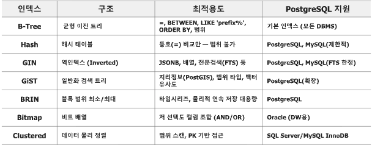
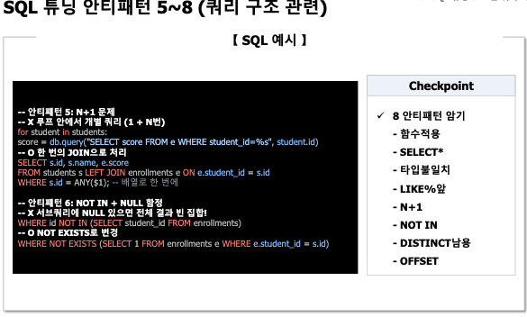
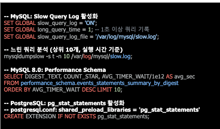

초

# 수업 전 인사이트

---

중소기업과 스타트업의 ai 인식 차이

- 중소기업 : roi 투자 대비 이익 얼마인지 산정하고 싶어함
- 스타트업 : 우리가 가진 데이터 가지고 ai 빠르게 도입할 수 있는 방법 알려달라 ->가지고 있는 데이터를 어떻게 활용할지, 데이터가 어떻게 흘러가게할지 고민해보자

> 가지고 있는 데이터 가지고 무엇을 할 수 있는지 시간을 더 고민하는게 중요한 것 같다. 할 수 있는 것에 대한 **점검**이 있으면 됨

# 인덱스 설계 및 최적화

---

## 인덱스 트레이드 오프

- 인덱스를 추가하면 트레이드 오프가 있음
  - 조회가 빨라짐
  - 그러나 쓰기 비용 증가
  - 저장 공간 증가함
- 그렇다면 으로 인덱스를 잘 설계해야한다.

## [인덱스 설계 및 최적화] 인덱스 설계 원칙 5가지

### 1. WHERE 조건에 자주 등장하는 컬럼 우선

인덱스는 검색 범위를 빠르게 줄이기 위한 구조이므로, 자주 검색하는 컬럼에 먼저 생성합니다.

```sql
SELECT *
FROM orders
WHERE customer_id = 100;
```

`customer_id`가 자주 사용된다면:

```sql
CREATE INDEX idx_orders_customer
ON orders(customer_id);
```

반대로 조회 조건에 거의 사용하지 않는 컬럼에 인덱스를 만들어도 효과가 적습니다.

---

### 2. 선택도가 높은 컬럼에 생성

선택도는 전체 데이터 중 고유한 값의 비율입니다.

```text
선택도 = 고유값 수 / 전체 행 수
```

| 컬럼           | 특징                  | 인덱스 효과  |
| -------------- | --------------------- | ------------ |
| `email`      | 값이 거의 모두 다름   | 좋음         |
| `student_id` | 행마다 고유함         | 좋음         |
| `gender`     | 값의 종류가 매우 적음 | 낮음         |
| `status`     | 값이 몇 종류뿐임      | 낮을 수 있음 |

선택도가 높을수록 적은 행으로 빠르게 좁힐 수 있습니다.

> 선택도가 낮은 컬럼도 다른 조건과 결합한 복합 인덱스나 부분 인덱스에서는 유용할 수 있습니다.

---

### 3. 외래키 컬럼에 인덱스 생성

FK 컬럼은 부모·자식 테이블 JOIN과 참조 무결성 검사에 자주 사용됩니다.

```sql
SELECT *
FROM orders o
JOIN customers c
    ON c.customer_id = o.customer_id;
```

```sql
CREATE INDEX idx_orders_customer
ON orders(customer_id);
```

효과:

- JOIN 성능 개선
- 부모 행 수정·삭제 시 자식 데이터 확인 속도 개선
- `ON DELETE CASCADE` 처리 속도 개선

> FK 제약조건을 만들었다고 해서 모든 DBMS가 자식 테이블의 FK 인덱스를 자동 생성하는 것은 아닙니다.

---

### 4. 읽기·쓰기 특성에 맞게 설계

인덱스는 조회를 빠르게 하지만 데이터 변경 비용을 증가시킵니다.

```text
INSERT / UPDATE / DELETE
        ↓
테이블 데이터 변경
        +
관련 인덱스도 함께 변경
```

- 읽기가 많은 시스템: 필요한 인덱스를 적극적으로 사용
- 쓰기가 많은 OLTP: 꼭 필요한 인덱스만 유지
- 분석 중심 OLAP: 집계·범위 조회에 맞는 인덱스 전략 사용

> 인덱스가 많다고 항상 좋은 것은 아닙니다.

---

### 5. 미사용 인덱스 제거

사용되지 않는 인덱스도 저장공간을 차지하고 쓰기 작업마다 갱신됩니다.

PostgreSQL 확인 예시:

```sql
SELECT
    indexrelname,
    idx_scan
FROM pg_stat_user_indexes
WHERE idx_scan = 0;
```

`idx_scan = 0`이면 해당 통계가 수집된 기간 동안 사용되지 않은 인덱스입니다.

다만 즉시 삭제하지 말고 다음을 먼저 확인합니다.

- 통계 초기화 이후 충분한 기간이 지났는지
- 월말·배치 등 가끔 실행되는 쿼리에서 사용하는지
- 제약조건 유지에 필요한 인덱스인지

### 한 줄 정리

> 자주 검색하고 값의 구분도가 높은 컬럼과 FK에 인덱스를 만들되, 쓰기 비용을 고려하고 사용하지 않는 인덱스는 정리한다.

## 인덱스 종류



# 실행계획

---

- 시각화 도구 : explain.dalibo.com 사용해보기
- BEGIN 사용해서 ROLLBACK 가능하도록
- 주로 실행계획 확인 시 DML 명령어를 넣었을 때 롤백이 중요함
- **SQL 튜닝 안티패턴을 지켜서 테스트 쿼리 작성하도록 하자**

## SQL 튜닝 안티패턴

| 안티패턴                   | 문제                                          | 올바른방법                         | 효과                               |
| -------------------------- | --------------------------------------------- | ---------------------------------- | ---------------------------------- |
| `SELECT *`               | 불필요한데이터전송,커버링인덱스사용불가       | 필요한컬럼만조회                   | 트래픽감소,`Index Only Scan`가능 |
| `WHERE YEAR(date)=2026`  | 인덱스컬럼에함수를적용해인덱스가무력화됨      | 날짜범위조건으로변경               | 인덱스`Range Scan`활용           |
| `WHERE LOWER(email)=...` | 함수적용으로일반인덱스를사용하기어려움        | `LOWER(email)`함수기반인덱스생성 | 함수조건에서도인덱스사용           |
| 서브쿼리과다사용           | 상관서브쿼리등이`N×M`으로반복실행될수있음  | `JOIN`또는CTE로변경              | 반복계산감소                       |
| `NOT IN`에`NULL`포함   | 비교결과가`UNKNOWN`이되어빈결과가나올수있음 | `NOT EXISTS`사용                 | `NULL`에안전                     |
| `LIKE '%keyword%'`       | 일반B-Tree인덱스를사용하지못하고전체스캔      | `pg_trgm`GIN또는전문검색인덱스   | 텍스트검색성능개선                 |
| 암묵적타입변환             | 컬럼과값의타입이달라인덱스가무력화될수있음    | 같은타입끼리비교                   | 인덱스사용가능                     |
| `COUNT(*)`과다사용       | 대량데이터전체집계비용발생                    | 필요한경우집계테이블별도관리       | 반복집계비용감소                   |

### 중요 안티 패턴



### 느린 쿼리 식별



## [SQL 튜닝 & 느린 쿼리 식별] 파티셔닝

### 핵심 개념

파티셔닝은 하나의 큰 테이블을 특정 기준에 따라 여러 개의 작은 물리 테이블로 나누어 저장하는 방법입니다.

```text
sales
├── sales_2024
├── sales_2025
└── sales_2026
```

사용자는 부모 테이블인 `sales`를 조회하지만, DBMS는 조건에 맞는 하위 파티션만 읽을 수 있습니다.

```sql
SELECT *
FROM sales
WHERE sale_date >= DATE '2025-01-01'
  AND sale_date <  DATE '2026-01-01';
```

이 경우 `sales_2025`만 읽고 나머지 파티션은 제외할 수 있습니다.

> 파티셔닝의 목적은 검색 자체를 빠르게 찾는 것보다, 불필요한 데이터 영역을 읽지 않게 만드는 것입니다.

---

## 1. Range 파티셔닝

날짜나 숫자의 연속된 범위를 기준으로 분리합니다.

```sql
CREATE TABLE sales (
    id        BIGSERIAL,
    sale_date DATE NOT NULL,
    amount    NUMERIC
)
PARTITION BY RANGE (sale_date);
```

```sql
CREATE TABLE sales_2024
PARTITION OF sales
FOR VALUES FROM ('2024-01-01') TO ('2025-01-01');

CREATE TABLE sales_2025
PARTITION OF sales
FOR VALUES FROM ('2025-01-01') TO ('2026-01-01');
```

적합한 사례:

- 연도·월별 주문
- 일자별 로그
- 분기별 매출
- 생성일 기준 이력 데이터

범위의 시작은 포함하고 끝은 포함하지 않습니다.

```text
FROM '2024-01-01'  → 포함
TO   '2025-01-01'  → 제외
```

---

## 2. List 파티셔닝

미리 정한 값 목록을 기준으로 나눕니다.

```sql
CREATE TABLE orders (
    order_id INT,
    region   TEXT,
    amount   NUMERIC
)
PARTITION BY LIST (region);
```

```sql
CREATE TABLE orders_kr
PARTITION OF orders
FOR VALUES IN ('KR', 'KO');

CREATE TABLE orders_us
PARTITION OF orders
FOR VALUES IN ('US', 'CA');
```

적합한 사례:

- 국가·지역별 데이터
- 서비스 유형
- 사업부
- 상태 코드

새로운 값이 들어올 가능성이 있다면 해당 값을 받을 파티션을 미리 만들어야 합니다.

---

## 3. Hash 파티셔닝

키를 해시 계산하여 여러 파티션에 균등하게 분산합니다.

```text
customer_id → hash 계산 → 파티션 번호 결정
```

적합한 사례:

- 특정 범위나 지역 기준은 없지만 데이터를 고르게 분산할 때
- 고객 ID나 사용자 ID 기준의 대량 데이터
- 특정 파티션에 데이터가 몰리는 현상을 줄일 때

장점은 균등 분산이고, 단점은 특정 기간을 파티션 단위로 삭제하거나 보관하기 어렵다는 점입니다.

---

## Partition Pruning

파티션 프루닝은 조회 조건과 관계없는 파티션을 실행계획에서 제외하는 기능입니다.

```sql
EXPLAIN
SELECT *
FROM sales
WHERE sale_date >= DATE '2024-06-01'
  AND sale_date <  DATE '2024-07-01';
```

실행계획 예시:

```text
Seq Scan on sales_2024
```

`Seq Scan`이더라도 전체 `sales`가 아닌 `sales_2024` 파티션만 스캔하므로 읽는 데이터 범위가 작아집니다.

### 프루닝이 동작하려면

`WHERE` 조건에 파티션 키가 포함되어야 합니다.

```sql
-- 프루닝 가능
WHERE sale_date >= DATE '2024-06-01'
  AND sale_date <  DATE '2024-07-01'
```

```sql
-- 파티션 키가 없어 전체 파티션을 읽을 수 있음
WHERE amount >= 100000
```

```text
파티션 키 있음 → 필요한 파티션만 스캔
파티션 키 없음 → 모든 파티션 스캔 가능
```

따라서 파티셔닝만 적용한다고 모든 쿼리가 빨라지는 것은 아닙니다.

---

## 파티셔닝과 인덱스의 차이

두 기능은 경쟁 관계가 아니라 함께 사용합니다.

| 구분     | 역할                                  |
| -------- | ------------------------------------- |
| 파티셔닝 | 읽을 데이터 덩어리를 선택             |
| 인덱스   | 선택된 덩어리 안에서 필요한 행을 탐색 |

```text
전체 데이터
    ↓ 파티션 프루닝
sales_2025만 선택
    ↓ 인덱스 탐색
customer_id = 100인 행 탐색
```

PostgreSQL에서 부모 파티션 테이블에 인덱스를 만들면 대응되는 인덱스가 각 파티션에 적용됩니다.

```sql
CREATE INDEX idx_sales_customer
ON sales(customer_id);
```

---

# 운영 관리 관점

## 1. 미래 파티션을 미리 생성

Range 파티셔닝에서는 데이터가 들어갈 파티션이 없으면 입력이 실패할 수 있습니다.

```text
현재 날짜: 2025년 12월
필요 작업: sales_2026 파티션 사전 생성
```

```sql
CREATE TABLE sales_2026
PARTITION OF sales
FOR VALUES FROM ('2026-01-01') TO ('2027-01-01');
```

운영 환경에서는 다음 달이나 다음 분기의 파티션을 미리 생성해야 합니다.

교본에서는 PostgreSQL의 `pg_partman` 확장을 이용한 생성·삭제 자동화도 소개합니다.

---

## 2. 오래된 데이터 빠르게 삭제

일반 테이블에서 오래된 수억 건을 삭제하면 행별 삭제 비용과 로그, 잠금 부담이 발생합니다.

```sql
DELETE FROM sales
WHERE sale_date < DATE '2023-01-01';
```

기간별 파티션이라면 오래된 파티션 자체를 제거할 수 있습니다.

```sql
DROP TABLE sales_2022;
```

```text
대량 DELETE → 행을 하나씩 삭제
파티션 DROP → 데이터 덩어리 자체를 제거
```

따라서 보관 기간이 명확한 로그·이력 데이터에 특히 효과적입니다.

---

## 3. 아카이빙

삭제 전에 오래된 파티션을 부모 테이블에서 분리해 보관할 수 있습니다.

```sql
ALTER TABLE sales
DETACH PARTITION sales_2022;
```

분리된 `sales_2022`는 일반 테이블로 남기 때문에 다음 작업이 가능합니다.

- 별도 저장소로 이동
- 백업 후 삭제
- 읽기 전용 보관
- 필요할 때 다시 연결

```sql
ALTER TABLE sales
ATTACH PARTITION sales_2022
FOR VALUES FROM ('2022-01-01') TO ('2023-01-01');
```

---

## 4. 파티션별 모니터링

운영에서는 다음을 확인해야 합니다.

- 특정 파티션에 데이터가 과도하게 몰리지 않았는지
- 다음 기간의 파티션이 생성되어 있는지
- 파티션별 인덱스가 정상인지
- 쿼리가 실제로 프루닝되는지
- 오래된 파티션의 보관·삭제 시점이 지났는지

실행계획 확인:

```sql
EXPLAIN (ANALYZE, BUFFERS)
SELECT *
FROM sales
WHERE sale_date >= DATE '2025-01-01'
  AND sale_date <  DATE '2025-02-01';
```

핵심은 실행계획에 불필요한 파티션이 나타나지 않는지 확인하는 것입니다.

---

## 5. 파티션 키 선택

파티션 키는 다음 조건을 만족하는 컬럼이 적합합니다.

- 대부분의 조회 조건에 포함됨
- 데이터 보관·삭제 기준과 일치함
- 값이 특정 파티션에 과도하게 몰리지 않음
- 앞으로도 기준이 쉽게 바뀌지 않음

예를 들어 주문 데이터의 운영 기준이 월별 보관이라면 `order_date`가 적합합니다.

반면 대부분의 쿼리가 `customer_id`로만 조회하는데 날짜로 파티셔닝하면, 날짜 조건이 없는 조회는 여러 파티션을 모두 확인할 수 있습니다.

---

## 운영상 주의점

### 파티션이 너무 많으면 안 됨

파티션이 지나치게 많으면 다음 비용이 커집니다.

- 실행계획 수립
- 메타데이터 관리
- 인덱스·통계 유지
- 파티션 생성과 삭제 자동화

데이터가 충분히 크지 않다면 월별 대신 연도별이나 분기별 파티션이 더 단순할 수 있습니다.

### 파티션별 통계 관리

옵티마이저가 적절한 실행계획을 선택할 수 있도록 통계를 최신화해야 합니다.

```sql
ANALYZE sales;
```

### 기본 파티션 고려

예상하지 못한 값을 임시로 받을 기본 파티션을 만들 수 있습니다.

```sql
CREATE TABLE sales_default
PARTITION OF sales DEFAULT;
```

다만 기본 파티션에 데이터가 계속 쌓이면 정상 파티션 생성이 누락된 사실을 놓칠 수 있으므로 모니터링이 필요합니다.

---

## 파티셔닝과 샤딩 비교

| 구분        | 파티셔닝                  | 샤딩                  |
| ----------- | ------------------------- | --------------------- |
| 저장 위치   | 하나의 DB 인스턴스        | 여러 DB 인스턴스      |
| 목적        | 스캔 범위·운영 관리 개선 | 수평 확장             |
| JOIN        | 비교적 쉬움               | 샤드 간 JOIN이 어려움 |
| 트랜잭션    | 단일 DB에서 처리          | 분산 트랜잭션이 복잡  |
| 운영 난이도 | 상대적으로 낮음           | 높음                  |

> 교본에서는 샤딩 전에 파티셔닝과 Read Replica만으로 충분한지 먼저 검토하도록 안내합니다.

### 한 줄 정리

> 파티셔닝은 큰 테이블을 관리 가능한 단위로 나누어 필요한 부분만 읽고, 오래된 데이터를 빠르게 삭제·보관하기 위한 전략이다. 효과를 얻으려면 쿼리에 파티션 키가 포함되어야 하고, 미래 파티션 생성과 오래된 파티션 정리를 자동화해야 한다.

# MVCC & 트랜잭션 격리 수준

1. Isolation Level 실습
   1. 두개의 DB 커넥션 두 개 띄어두고 쿼리 날려보기
2. BEGIN ISOLATION LEVEL REPEA TABLE READ

### 실습은 DBeaver SQL 편집기 탭을 두 개 열어 진행합니다.

```text
SQL 편집기 1 → Session A
SQL 편집기 2 → Session B
```

각 편집기가 서로 다른 DB 연결 세션인지 먼저 확인합니다.

```sql
SELECT pg_backend_pid();
```

두 탭의 결과가 달라야 정상입니다.

---

## 1. 실습 테이블 준비

한 세션에서 한 번만 실행합니다.

```sql
DROP TABLE IF EXISTS lab.bank;

CREATE TABLE lab.bank (
    id      SERIAL PRIMARY KEY,
    name    TEXT UNIQUE NOT NULL,
    balance INT NOT NULL
);

INSERT INTO lab.bank (name, balance)
VALUES
    ('Alice', 1000),
    ('Bob', 1000);

SELECT *
FROM lab.bank
ORDER BY id;
```

초기 상태:

| id | name  | balance |
| -: | ----- | ------: |
|  1 | Alice |    1000 |
|  2 | Bob   |    1000 |

실습을 다시 시작할 때는 다음 쿼리로 초기화합니다.

```sql
UPDATE lab.bank
SET balance = 1000;

COMMIT;
```

---

# 2. Read Committed 실습

PostgreSQL의 기본 격리 수준입니다.

### 핵심

> 하나의 트랜잭션 안에서도 SQL 문이 실행될 때마다 새로 커밋된 데이터를 읽습니다.

따라서 같은 행을 두 번 읽었는데 값이 달라지는 **Non-Repeatable Read**가 발생할 수 있습니다.

### Session A — 첫 번째 조회

```sql
BEGIN ISOLATION LEVEL READ COMMITTED;

SELECT balance
FROM lab.bank
WHERE name = 'Alice';
```

결과:

```text
1000
```

아직 `COMMIT`하지 말고 Session B로 이동합니다.

### Session B — 값 변경 후 커밋

```sql
BEGIN;

UPDATE lab.bank
SET balance = 800
WHERE name = 'Alice';

COMMIT;
```

### Session A — 같은 행 다시 조회

```sql
SELECT balance
FROM lab.bank
WHERE name = 'Alice';
```

결과:

```text
800
```

마무리:

```sql
COMMIT;
```

### 실행 흐름

```text
Session A: Alice 조회 → 1000
Session B: Alice를 800으로 변경 → COMMIT
Session A: Alice 재조회 → 800
```

Session A의 트랜잭션이 끝나지 않았지만 두 번째 `SELECT`는 Session B가 커밋한 최신 값을 봅니다.

> 같은 트랜잭션에서 반복 조회 결과가 달라졌으므로 Non-Repeatable Read입니다.

---

# 3. Repeatable Read 실습

실습 전 데이터를 초기화합니다.

```sql
UPDATE lab.bank SET balance = 1000;
COMMIT;
```

### 핵심

> 트랜잭션의 첫 조회 시 만들어진 스냅샷을 트랜잭션이 끝날 때까지 유지합니다.

따라서 다른 세션이 값을 변경하고 커밋해도 현재 트랜잭션에서는 이전 값을 계속 봅니다.

### Session A — 첫 번째 조회

```sql
BEGIN ISOLATION LEVEL REPEATABLE READ;

SELECT balance
FROM lab.bank
WHERE name = 'Alice';
```

결과:

```text
1000
```

### Session B — 값 변경 후 커밋

```sql
BEGIN;

UPDATE lab.bank
SET balance = 700
WHERE name = 'Alice';

COMMIT;
```

### Session A — 같은 행 다시 조회

```sql
SELECT balance
FROM lab.bank
WHERE name = 'Alice';
```

결과:

```text
1000
```

마무리:

```sql
COMMIT;
```

트랜잭션이 끝난 뒤 다시 조회합니다.

```sql
SELECT balance
FROM lab.bank
WHERE name = 'Alice';
```

결과:

```text
700
```

### 실행 흐름

```text
Session A: Alice 조회 → 1000, 스냅샷 생성
Session B: Alice를 700으로 변경 → COMMIT
Session A: Alice 재조회 → 여전히 1000
Session A: COMMIT 후 재조회 → 700
```

> Repeatable Read는 동일 트랜잭션 안에서 일관된 조회 결과를 보장합니다.

---

# 4. Read Committed와 Repeatable Read 비교

| 구분                  | Read Committed           | Repeatable Read                 |
| --------------------- | ------------------------ | ------------------------------- |
| 스냅샷 기준           | SQL 문마다 갱신          | 트랜잭션 동안 유지              |
| 다른 세션의 커밋 확인 | 다음 SQL부터 확인        | 현재 트랜잭션에서는 보이지 않음 |
| 반복 조회 결과        | 달라질 수 있음           | 동일하게 유지                   |
| Non-Repeatable Read   | 발생 가능                | 방지                            |
| 적합한 상황           | 일반 조회·짧은 트랜잭션 | 일관된 보고서·반복 집계        |

---

# 5. Phantom Read 형태 비교

Phantom Read는 같은 조건으로 재조회했을 때 다른 트랜잭션이 추가한 행이 나타나는 현상입니다.

먼저 초기화합니다.

```sql
DELETE FROM lab.bank WHERE name = 'Charlie';

UPDATE lab.bank SET balance = 1000;

COMMIT;
```

## Read Committed

### Session A

```sql
BEGIN ISOLATION LEVEL READ COMMITTED;

SELECT COUNT(*)
FROM lab.bank
WHERE balance >= 1000;
```

결과:

```text
2
```

### Session B

```sql
INSERT INTO lab.bank (name, balance)
VALUES ('Charlie', 1500);

COMMIT;
```

### Session A

```sql
SELECT COUNT(*)
FROM lab.bank
WHERE balance >= 1000;
```

결과:

```text
3
```

```sql
COMMIT;
```

조건에 맞는 새로운 행 `Charlie`가 나타났습니다.

## Repeatable Read

초기화:

```sql
DELETE FROM lab.bank WHERE name = 'Charlie';
COMMIT;
```

### Session A

```sql
BEGIN ISOLATION LEVEL REPEATABLE READ;

SELECT COUNT(*)
FROM lab.bank
WHERE balance >= 1000;
```

결과:

```text
2
```

### Session B

```sql
INSERT INTO lab.bank (name, balance)
VALUES ('Charlie', 1500);

COMMIT;
```

### Session A

```sql
SELECT COUNT(*)
FROM lab.bank
WHERE balance >= 1000;
```

결과:

```text
2
```

```sql
COMMIT;
```

PostgreSQL의 Repeatable Read는 동일한 스냅샷을 유지하므로 새로 추가된 행도 현재 트랜잭션에서 보이지 않습니다.

---

# 6. Serializable 실습

### 핵심

> 여러 트랜잭션이 동시에 실행되더라도 순서대로 하나씩 실행한 것과 동일한 결과를 보장합니다.

PostgreSQL은 위험한 동시 실행을 발견하면 트랜잭션 하나를 실패시킵니다. 따라서 애플리케이션에는 재시도 처리가 필요합니다.

## 확실하게 충돌을 재현하는 예제

초기화:

```sql
UPDATE lab.bank SET balance = 1000;
COMMIT;
```

Alice와 Bob 계좌 중 적어도 하나는 잔액이 `1000` 이상이어야 한다는 규칙을 가정합니다.

### Session A

```sql
BEGIN ISOLATION LEVEL SERIALIZABLE;

SELECT *
FROM lab.bank
ORDER BY id;
```

결과를 확인한 뒤 아직 수정하지 않습니다.

### Session B

```sql
BEGIN ISOLATION LEVEL SERIALIZABLE;

SELECT *
FROM lab.bank
ORDER BY id;
```

Session B도 같은 초기 상태를 읽습니다.

### Session A — Alice 변경

```sql
UPDATE lab.bank
SET balance = 0
WHERE name = 'Alice';

COMMIT;
```

Session A는 정상 커밋됩니다.

### Session B — Bob 변경

```sql
UPDATE lab.bank
SET balance = 0
WHERE name = 'Bob';

COMMIT;
```

Session B에서는 다음과 같은 오류가 발생할 수 있습니다.

```text
ERROR: could not serialize access due to read/write dependencies
SQLSTATE: 40001
```

두 트랜잭션이 모두 성공하면 Alice와 Bob이 모두 `0`이 되어 규칙을 위반합니다. PostgreSQL은 이를 감지해 하나를 강제로 롤백합니다.

실패한 세션에서는 정리합니다.

```sql
ROLLBACK;
```

### Serializable 사용 시 핵심

```text
동시 트랜잭션 충돌
        ↓
하나의 트랜잭션 실패
        ↓
ROLLBACK
        ↓
애플리케이션에서 전체 트랜잭션 재시도
```

---

# 7. 격리 수준별 이상 현상

| 격리 수준        | Dirty Read | Non-Repeatable Read | Phantom Read |
| ---------------- | ---------: | ------------------: | -----------: |
| Read Uncommitted |       허용 |                허용 |         허용 |
| Read Committed   |       방지 |                허용 |         허용 |
| Repeatable Read  |       방지 |                방지 |  표준상 허용 |
| Serializable     |       방지 |                방지 |         방지 |

PostgreSQL에서는:

- `READ UNCOMMITTED`를 요청해도 `READ COMMITTED`처럼 처리
- `REPEATABLE READ`가 스냅샷을 유지하므로 일반 조회에서 Phantom Read도 보이지 않음
- `SERIALIZABLE`은 충돌 트랜잭션을 실패시켜 직렬성을 보장

---

# 8. 현재 격리 수준 확인

```sql
SHOW transaction_isolation;
```

현재 트랜잭션의 격리 수준 변경:

```sql
BEGIN;

SET TRANSACTION ISOLATION LEVEL REPEATABLE READ;

SHOW transaction_isolation;

COMMIT;
```

트랜잭션 시작과 동시에 지정:

```sql
BEGIN ISOLATION LEVEL SERIALIZABLE;
```

세션의 기본값 변경:

```sql
SET SESSION CHARACTERISTICS
AS TRANSACTION ISOLATION LEVEL READ COMMITTED;
```

---

## 실무 적용 기준

| 작업                          | 권장 방식                                  |
| ----------------------------- | ------------------------------------------ |
| 일반 조회·짧은 CRUD          | Read Committed                             |
| 동일 기준의 반복 집계·보고서 | Repeatable Read                            |
| 금융 이체·재고·좌석 예약    | Serializable 또는 명시적 잠금              |
| 특정 행의 동시 수정 방지      | `SELECT ... FOR UPDATE`                  |
| Serializable 실패             | `SQLSTATE 40001` 확인 후 트랜잭션 재시도 |

### 핵심 정리

- **Read Committed:** 커밋된 최신 데이터를 SQL 문마다 다시 확인
- **Repeatable Read:** 트랜잭션 안에서 동일한 스냅샷 유지
- **Serializable:** 동시 실행이 위험하면 하나를 실패시키고 재시도 요구
- **MVCC:** 읽기와 쓰기의 직접적인 충돌을 줄이기 위해 여러 행 버전을 관리

# Rock & DeadLock 관리

---

# 고급 DB 설계

---

## 정규화 BCNF

```
X → Y
```

`X`가 `Y`를 결정할 때:

* `X`: 결정자 (교수)
* `Y`: 종속자 (담당 교과목, 강의실)

- 3NF를 만족하더라도 후보키가 아닌 결정자가 존재하면 BCNF 검토 대상이다.
- 모든 결정자가 후보키여야한다가 기준임 결정자가 후보키가 아니면 위반!!
- 교수를 알면 강의실, 과목이 정해짐
- 근데 교수가 후보키가 아닌데 강의실과 과목을 정하는 구조이면 BCNF 위반임!

## 3NF와 BCNF 차이

- 한 데이터가 나머지 데이터를 끌고 다닌다면 분리해라
- 3정규화보다 BCNF가 더 엄격함

| 구분 | 조건                                                                 |
| ---- | -------------------------------------------------------------------- |
| 3NF  | 결정자가 후보키이거나, 종속자가 후보키를 구성하는 주요 속성이면 허용 |
| BCNF | 모든 결정자가 반드시 후보키여야 함                                   |

## PostgreSQL 백업 및 복구

---

### 1. 3-2-1 백업 원칙

```text
3 Copies / 2 Media / 1 Offsite
```

| 원칙      | 의미                                    |
| --------- | --------------------------------------- |
| 3 Copies  | 원본을 포함하여 데이터를 총 3개 보유    |
| 2 Media   | 최소 2종류의 서로 다른 저장 매체에 보관 |
| 1 Offsite | 최소 1개는 운영 장소와 다른 위치에 보관 |

예시:

```text
1. 운영 PostgreSQL 데이터
2. 사내 백업 스토리지의 pg_dump
3. 외부 클라우드 스토리지의 암호화 백업
```

운영 서버와 같은 디스크에 백업 파일 하나만 저장하면 다음 장애에서 원본과 백업을 동시에 잃을 수 있습니다.

- 디스크 고장
- 서버 침해
- 랜섬웨어
- 파일시스템 손상
- 화재·침수 등 물리적 장애

### 2. 정기 복원 테스트 필수

> 백업 파일이 존재하는 것과 실제로 복구 가능한 것은 다릅니다.

백업 작업이 성공했다고 표시돼도 다음 문제가 있을 수 있습니다.

- 파일이 손상됨
- 일부 테이블이 누락됨
- 복구 권한이 부족함
- 필요한 Role·Extension이 없음
- PostgreSQL 버전이 호환되지 않음
- 암호화 키를 찾을 수 없음
- 복구 시간이 목표 RTO를 초과함

따라서 별도 테스트 DB에 주기적으로 복원해야 합니다.

```bash
createdb restore_test

pg_restore \
  -d restore_test \
  backup.dump
```

복원 후 확인:

```sql
SELECT COUNT(*) FROM 주요_테이블;
SELECT MAX(created_at) FROM 주요_테이블;
```

확인 항목:

- 주요 테이블 존재 여부
- 테이블별 데이터 건수
- 최근 데이터 포함 여부
- PK·FK·인덱스·시퀀스
- 사용자와 권한
- 애플리케이션 연결
- 실제 복구 소요 시간

### 핵심 정리

```text
백업 원칙
├── 3개 사본 유지
├── 2종류 매체에 저장
├── 1개는 외부 장소에 보관
└── 정기적으로 실제 복원 테스트
```

> 검증하지 않은 백업은 복구 가능 여부를 알 수 없으므로, 백업이 아니라 단순한 파일에 가깝습니다.

# 실행 계획의 주요 스캔 방식

| 노드                 | 의미                                           | 교본평가 | 확인및조치                                     |
| -------------------- | ---------------------------------------------- | -------- | ---------------------------------------------- |
| `Seq Scan`         | 테이블전체를순서대로읽음                       | 보통Bad  | 대용량테이블이면조건컬럼의인덱스검토           |
| `Index Scan`       | 인덱스로행을찾은후테이블에접근                 | Good     | `WHERE`,FK컬럼의인덱스확인                   |
| `Index Only Scan`  | 테이블접근없이인덱스만으로결과반환             | Best     | 커버링인덱스설계                               |
| `Bitmap Heap Scan` | 인덱스에서찾은위치를비트맵으로모은후테이블접근 | 양호     | 여러인덱스를조합하거나결과가어느정도많을때사용 |

소수 행 조회             → Index Scan
인덱스만으로 조회 가능    → Index Only Scan
중간 규모의 행 조회       → Bitmap Heap Scan
많은 행 또는 전체 조회    → Seq Scan
대용량 등가 조인          → Hash Join
작은 결과 + 내부 인덱스   → Nested Loop
정렬된 데이터 조인        → Merge Join


# 실습과제

1. 악성 쿼리 (느리게 실행될 쿼리 2개)
2. **리포트로 느린 이유**, **그에 따른 개선 방법 도출**, **개선 후 주요효과에 대해 실행 계획 이전/ 이후**
3. 결과 정리를 자세히 할 것 **최소** 2개이상쿼리를만들고쿼리에대한차이점을 분석 결과를 작성할것

### 작성해야할 쿼리

1. 실행 계획 맛보기 (사번이 100인 사람 검색) -제외
2. 인덱스 없는 느린 쿼리 작성 후 쿼리 튜닝
   (이메일 주소가 user1234@corp.com인 사람, lower(email) 사용)
3. LIKE 검색 쿼리 작성 후 쿼리 튜닝
   ( 대상 : '%gmail.com' 같은 접미사 검색)
4. 정렬(ORDER BY)과 필터가 결합된 쿼리 작성 후 쿼리 튜닝
   (hire_date >= CURRENT_DATE - INTERVAL '365 days’ 이면서
   재직중인 사람을 연봉순으로 상위 100명만 출력)
5. OR 조건 쿼리 작성 후 쿼리 튜닝
   (조건 : 부서코드가 10 또는 직무가 3, 4, 5 안에 있는 사람 검색)

5개의 쿼리에 대해 각 항목별로 다양한 방식으로 문항당 쿼리를 각각 3개씩 만든 후 그에 대한 쿼리 튜닝을 개별로 진행해주세요.

개별로 진행한 쿼리 튜닝에 결과에 대해서 각 조별로 서로 어느 부분에 대해서 개선했는지를 논의하시고 최적의 튜닝 Point를 도출해주세요.

튜닝 전 쿼리 최소 2개와 각각의 결과 화면 최소 2개, 튜닝 후 쿼리 최소 2개와 결과 화면 최소 2개 에 대해
문항별로 적어도 8개씩 총 32개(각 문항별 8개 * 4, 1번 문항은 제외)를 정리하시고 조별로 논의한 튜닝의 Point를 정리하셔서
튜닝 작업 내역 + 조별 의견 + 최적의 튜닝포인트를 정리하셔서 개별로 PDF 파일(판교_**반_홍길동.PDF ) 로 제출해주시면 됩니다.
제출은 이 글에 댓글로 올려주세요.

### 조건

- 결과에 대한 평균을 기반으로 진행하자

---
