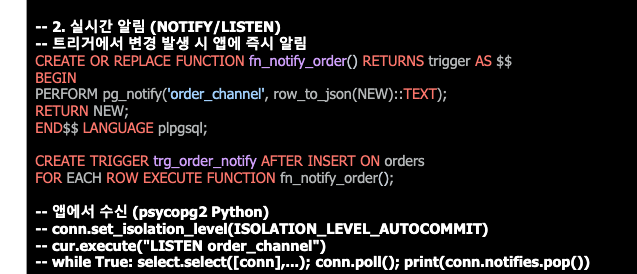

# Stored Procedure & 함수

사용 목적 : **반복되는 SQL 로직을 DB 안에 저장해 재사용하고, 일관되게 실행하기 위해서**다.

## Procedure와 Function 선택

| 구분      | Stored Procedure                     | Function                |
| --------- | ------------------------------------ | ----------------------- |
| 목적      | 작업 수행                            | 값 계산·반환           |
| 호출      | `CALL`                             | `SELECT 함수()`       |
| 주요 용도 | 데이터 변경, 트랜잭션, 배치          | 계산, 조회, 데이터 변환 |
| DML       | `INSERT`,`UPDATE`,`DELETE`중심 | 주로 읽기·계산 중심    |
| 비유      | 하나의 업무 절차                     | 재사용 가능한 계산기    |

## 인사이트 요약

여러 DB 작업을 하나로 묶는다 → Procedure
SQL 안에서 값을 계산한다     → Function

**-> 데이터베이스 쿼리보다 코드를 수정하는 편이 훨씬 테스트 하기 편함**

**-> 따라서 자주 바뀌는 로직은 코드로!**

**-> 공통으로 개발하는 코드는 SQL로**


## PostgreSQL 함수 기반 인덱스 예제

먼저 붙어 있는 SQL을 실행 가능한 형태로 정리하면 다음과 같다.

```sql
-- 1. 부가세 계산 함수 생성
CREATE OR REPLACE FUNCTION fn_vat(amount NUMERIC)
RETURNS NUMERIC
LANGUAGE sql
IMMUTABLE
AS $$
    SELECT amount * 0.1
$$;

-- 2. 함수 계산 결과를 인덱스로 생성
CREATE INDEX idx_tax
ON orders ((fn_vat(total_amount)));
```

## 1. `fn_vat()` 함수

```sql
CREATE OR REPLACE FUNCTION fn_vat(amount NUMERIC)
```

- `fn_vat`이라는 함수를 생성한다.
- 이미 존재하면 `OR REPLACE`를 통해 기존 함수를 교체한다.
- `amount`라는 `NUMERIC` 값을 입력받는다.

```sql
RETURNS NUMERIC
```

계산 결과도 `NUMERIC` 타입으로 반환한다.

```sql
LANGUAGE sql
```

함수 본문을 PostgreSQL의 SQL 언어로 작성한다는 의미다.

```sql
AS $$
    SELECT amount * 0.1
$$;
```

입력 금액의 10%를 계산해 반환한다.

```sql
SELECT fn_vat(10000);
```

```text
1000.0
```

## 2. `IMMUTABLE`

```sql
IMMUTABLE
```

**동일한 입력을 전달하면 항상 동일한 결과를 반환한다**는 선언이다.

```text
fn_vat(10000) → 항상 1000
```

PostgreSQL 함수의 안정성은 교본에서 다음 세 단계로 구분한다.

| 구분          | 의미                               | 예                                   |
| ------------- | ---------------------------------- | ------------------------------------ |
| `IMMUTABLE` | 같은 입력이면 항상 같은 결과       | 산술 계산                            |
| `STABLE`    | 하나의 SQL 실행 중에는 결과가 동일 | DB 조회 기반 함수                    |
| `VOLATILE`  | 호출할 때마다 달라질 수 있음       | `random()`, 시간·데이터 변경 함수 |

PostgreSQL은 인덱스에 저장된 계산 결과가 나중에도 동일하다는 보장이 필요하므로, **함수 기반 인덱스에는 `IMMUTABLE` 함수만 사용할 수 있다.**

> 실제로 결과가 변하는 함수에 `IMMUTABLE`을 잘못 선언하면 PostgreSQL이 잘못된 실행계획이나 결과를 만들 수 있다.

## 3. 함수 기반 인덱스

```sql
CREATE INDEX idx_tax
ON orders ((fn_vat(total_amount)));
```

일반 인덱스는 원본 컬럼 값을 저장한다.

```sql
CREATE INDEX idx_amount
ON orders (total_amount);
```

함수 기반 인덱스는 **함수를 적용한 계산 결과**를 저장한다.

```text
total_amount = 10,000
인덱스 저장값 = fn_vat(10,000) = 1,000
```

따라서 다음처럼 같은 함수 표현식을 조건에 사용하면 인덱스를 활용할 수 있다.

```sql
EXPLAIN (ANALYZE, BUFFERS)
SELECT order_id, total_amount
FROM orders
WHERE fn_vat(total_amount) = 1000;
```

예상 실행계획은 다음과 같다.

```text
Index Scan using idx_tax on orders
  Index Cond: (fn_vat(total_amount) = 1000)
```

## 체크포인트

### 1. 쿼리 조건과 인덱스 표현식이 일치해야 한다

```sql
-- 함수 기반 인덱스 활용 가능
WHERE fn_vat(total_amount) = 1000
```

함수나 표현식이 다르면 해당 인덱스를 사용하지 못할 수 있다.

### 2. `IMMUTABLE`은 최적화 옵션이 아닌 동작 보장이다

함수가 다음 요소에 의존하면 `IMMUTABLE`로 선언하면 안 된다.

- 현재 시간
- 난수
- 다른 테이블의 데이터
- 세션 설정에 따라 달라지는 값
- 함수 내부의 데이터 변경

### 3. 쓰기 비용이 증가한다

`total_amount`가 삽입되거나 변경될 때마다 PostgreSQL이 `fn_vat()`을 계산해 인덱스도 갱신해야 한다.

```text
조회 성능 향상
↔ INSERT·UPDATE 비용과 저장 공간 증가
```

### 4. 실행계획으로 사용 여부를 검증한다

```sql
EXPLAIN (ANALYZE, BUFFERS)
SELECT order_id
FROM orders
WHERE fn_vat(total_amount) = 1000;
```

확인할 항목:

- `Index Scan using idx_tax`가 나타나는가
- `Index Cond`에 `fn_vat(total_amount)`가 있는가
- 튜닝 전후 `Execution Time`과 `Buffers`가 줄었는가

### 5. 이 예제에서는 일반 인덱스도 검토한다 — 보충

`fn_vat(amount)`는 단순히 `amount * 0.1`을 계산하므로 다음처럼 조건을 원본 금액으로 바꿀 수 있다.

```sql
CREATE INDEX idx_orders_total_amount
ON orders (total_amount);

SELECT order_id, total_amount
FROM orders
WHERE total_amount = 10000;
```

실무에서는 단순 계산을 위한 함수 기반 인덱스를 바로 추가하기보다 **원본 컬럼 인덱스로 해결할 수 있는지 먼저 확인**한다. 함수 기반 인덱스는 `LOWER(email)`처럼 쿼리에서 함수 표현식을 반드시 반복 사용하는 경우에 특히 유용하다. 

# 보안 모델 - DEFINER vs INVOKER

- DEFINER : 작성자
- INVOKER : 호출자


# PostgreSQL 함수 안정성 3단계

함수 안정성은 PostgreSQL 옵티마이저에게 **“함수의 결과가 얼마나 자주 변하는가”**를 알려주는 속성이다.

| 구분          | 결과 변화 기준                     | 주요 특징                        |
| ------------- | ---------------------------------- | -------------------------------- |
| `IMMUTABLE` | 같은 입력이면 항상 같은 결과       | 함수 기반 인덱스·상수 폴딩 가능 |
| `STABLE`    | 하나의 SQL 실행 중에는 결과가 동일 | 조회 기반 함수에 사용            |
| `VOLATILE`  | 호출할 때마다 달라질 수 있음       | 기본값, 최적화 제한              |

### IMMUTABLE

```text
같은 입력 → 영구적으로 같은 결과
```

```sql
fn_vat(10000) -- 항상 1000
```

- 순수 계산 함수에 적합
- 인덱스 표현식에 사용 가능
- 상수 폴딩 가능: 실행 전에 결과를 미리 계산
- 시간, 난수, 테이블 데이터에 의존하면 사용하면 안 됨

### STABLE

```text
같은 SQL 문이 실행되는 동안에는 같은 결과
```

- 테이블 조회 결과나 세션 정보 등에 의존하는 함수에 적합
- SQL 실행이 끝난 후에는 결과가 달라질 수 있음
- 함수 기반 인덱스에는 사용할 수 없음

### VOLATILE

```text
호출할 때마다 결과가 달라질 수 있음
```

```sql
random()
```

- 지정하지 않았을 때의 기본값
- 데이터 변경 또는 변동 가능한 결과를 가진 함수
- PostgreSQL이 호출을 생략하거나 미리 계산할 수 없음
- 행마다 다시 실행될 수 있어 비용이 커질 수 있음

> 교본에는 `now()`가 `VOLATILE` 예시로 기재되어 있지만, PostgreSQL에서 `now()`의 실제 안정성은 `STABLE`이다. 하나의 트랜잭션 안에서는 동일한 시간을 반환한다.

### 암기

```text
IMMUTABLE = 영원히 동일 → 인덱스 가능
STABLE    = SQL 실행 중 동일
VOLATILE  = 호출마다 변경 가능
```


# Trigger & 이벤트 처리


