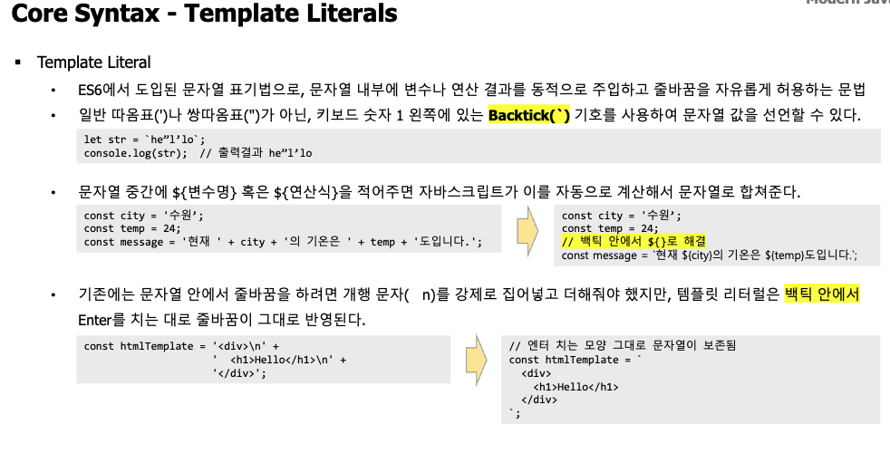
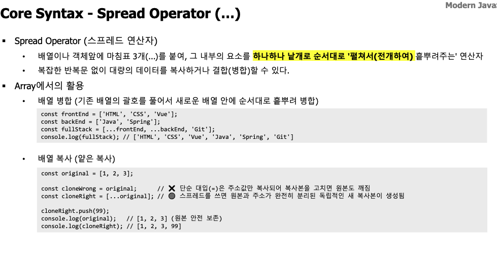

# 2026-08-24 학습 노트

| 개념         | 의미                             | 핵심                               |
| ------------ | -------------------------------- | ---------------------------------- |
| `function` | 재사용 가능한 코드 묶음          | 입력을 받아 처리하고 결과를 반환   |
| `object`   | `key: value`형태의 데이터 묶음 | 속성과 메서드로 하나의 대상을 표현 |
| `array`    | 순서가 있는 값의 목록            | 인덱스는`0`부터 시작             |

```JavaScript
// Function
function add(a, b) {
  return a + b;
}

// Object
const user = {
  name: "Kim",
  age: 20
};
console.log(user.name);

// Array
const fruits = ["apple", "banana"];
console.log(fruits[0]);
```

### Datatypes (Json)직렬화

JavaScript 값을 전송·저장 가능한 **JSON 문자열**로 변환합니다.

```javascript
const user = { name: "Kim", age: 20 };
const json = JSON.stringify(user);

console.log(json);
// '{"name":"Kim","age":20}'
```

#### 역직렬화

JSON 문자열을 다시 **JavaScript 값**으로 변환합니다. (파싱한다.)

```javascript
const user = JSON.parse(json);

console.log(user.name);
// "Kim"
```

```text
JavaScript 값 → JSON.stringify() → JSON 문자열
JSON 문자열 → JSON.parse()     → JavaScript 값
```

### 하는 이유

- 기본적으로 자바스크립트에서는 스트링(문자열)로 입출력되는데 서버에서 주고 받은 문자열을 자바스크립트 객체로 바꿔 값을 조회, 수정하려고 한다.

## DOM

**DOM(Document Object Model)** 은 HTML 문서를 JavaScript가 다룰 수 있도록 만든 **객체 구조**입니다.

```html
<h1 id="title">안녕하세요</h1>
```

```javascript
const title = document.querySelector("#title");

title.textContent = "반갑습니다";
title.style.color = "blue";
```

DOM을 통해 할 수 있는 일:

- HTML 요소 선택
- 내용·스타일 변경
- 요소 추가·삭제
- 클릭 등의 이벤트 처리

정리 : `HTML 문서 → DOM 객체 구조 → JavaScript로 조작`

## DOM 이벤트 타입

| 이벤트        | 발생 시점                 |
| ------------- | ------------------------- |
| `click`     | 한 번 클릭                |
| `dblclick`  | 두 번 클릭                |
| `mouseover` | 마우스가 요소 위로 이동   |
| `mouseout`  | 마우스가 요소 밖으로 이동 |
| `keydown`   | 키를 누름                 |
| `keyup`     | 누른 키를 뗌              |
| `change`    | 입력값·선택값 변경       |
| `focus`     | 요소가 포커스를 얻음      |
| `blur`      | 요소가 포커스를 잃음      |
| `load`      | 페이지·이미지 로딩 완료  |
| `unload`    | 페이지를 떠남             |

## DOM APIs - Event Listener()

| 개념          | 의미                                 |
| ------------- | ------------------------------------ |
| 이벤트 리스너 | 이벤트 발생 시 실행할 함수를 등록    |
| 이벤트 버블링 | 발생한 이벤트가 자식에서 부모로 전파 |

```javascript
parent.addEventListener("click", () => {
  console.log("부모 실행");
});

child.addEventListener("click", (event) => {
  console.log("자식 실행");
  event.stopPropagation(); // 부모로 전파 중단
});
```

핵심 흐름:

```text
자식 클릭
→ 자식의 이벤트 리스너 실행
→ 버블링
→ 부모의 이벤트 리스너 실행
```

### 웹 페이지에서 이벤트가 있을 때 실행할 함수(handler)로 DOM APIs로 조작한다.

## 비동기 처리

**비동기 처리**는 시간이 걸리는 작업을 기다리는 동안 다른 코드를 먼저 실행하는 방식입니다.

자바 스크립트는 싱글쓰레드로 처리하는 자바스크립트는 빠르게 실행할 수 있어야함

```javascript
console.log("1");

setTimeout(() => {
  console.log("2");
}, 1000);

console.log("3");
```

결과:

```text
1 → 3 → 2
```

주요 사용처:

- 서버 데이터 요청
- 타이머
- 파일 처리

주요 처리 방법:

```text
Callback → Promise → async/await
```

```javascript
async function loadData() {
  const response = await fetch("/api/users");
  const users = await response.json();

  console.log(users);
}
```

`await`는 비동기 작업의 완료를 기다리며, 해당 `async` 함수 내부만 잠시 멈춥니다.

## 비동기 처리의 발전

```text
Callback → Promise → async/await
```

### 1. Callback

비동기 작업이 끝난 후 실행할 함수를 전달합니다.

```javascript
getData((data) => {
  saveData(data, () => {
    console.log("완료");
  });
});
```

문제: 작업이 이어지면 코드가 깊어지는 **콜백 지옥**과 복잡한 오류 처리가 발생합니다.

### 2. Promise

미래에 완료될 작업의 결과를 나타내는 객체입니다. (Chaining 비동기 처리의 순서를 설정하기)

**콜백 지옥(Callback Hell)**은 비동기 작업을 순서대로 처리하려고 콜백을 계속 중첩한 상태입니다.
login(user, () => {
  getProfile(() => {
    getPosts(() => {
      saveData(() => {
        console.log("완료");
      });
    });
  });
});

- 등장 배경: 다음 작업이 이전 비동기 작업의 결과를 기다려야 했기 때문
- 문제: 코드가 깊어지고 실행 순서와 오류 처리가 어려움
- 해결: Promise 또는 async/await 사용

```javascript
fetch("/api/users")
  .then(response => response.json())
  .then(users => console.log(users))
  .catch(error => console.error(error));
```

상태:

```text
pending → fulfilled
        → rejected
```

Promise가 중요한 이유:

- 비동기 작업의 성공과 실패를 표준화
- `.then()`으로 작업을 순서대로 연결
- `.catch()`로 오류를 한곳에서 처리
- 여러 작업을 `Promise.all()` 등으로 조합
- `async/await`도 내부적으로 Promise를 사용

### 3. async/await

Promise를 동기 코드처럼 읽기 쉽게 작성하는 문법입니다.

```javascript
async function loadUsers() {
  try {
    const response = await fetch("/api/users");
    const users = await response.json();
  } catch (error) {
    console.error(error);
  }
}
```

핵심: **Promise가 비동기 처리의 기반이고, `async/await`는 Promise를 편하게 사용하는 문법**입니다. 이를 통해서 비동기가 끝나는 것과 안 기다리고 제어권을 주는 것

### + callback hell

**콜백 지옥(Callback Hell)** 은 비동기 작업을 순서대로 처리하려고 콜백을 계속 중첩한 상태입니다.

```javascript
login(user, () => {
  getProfile(() => {
    getPosts(() => {
      saveData(() => {
        console.log("완료");
      });
    });
  });
});
```

- 등장 배경: 다음 작업이 이전 비동기 작업의 결과를 기다려야 했기 때문
- 문제: 코드가 깊어지고 실행 순서와 오류 처리가 어려움
- 해결: `Promise` 또는 `async/await` 사용

```javascript
login(user)
  .then(getProfile)
  .then(getPosts)
  .then(saveData)
  .catch(console.error);
```

---

# Vue.js를 위한 Modern JavaScript 총요약

등장 배경: Vue는 ES6 이후의 간결한 문법과 모듈 구조를 기반으로 작성됩니다.

## 1. 변수: `const`, `let`

```javascript
const name = "Kim"; // 재할당 불가
let count = 0;      // 재할당 가능
count++;
```

- 기본은 `const`
- 값이 바뀌는 변수만 `let`
- `var`는 사용하지 않음

## 2. 화살표 함수

콜백과 배열 처리에서 자주 사용합니다.

```javascript
const add = (a, b) => a + b;

users.map(user => user.name);
```

## 3. 템플릿 리터럴

문자열에 값을 넣을 때 사용합니다.

```javascript
const message = `${name}님의 점수는 ${score}점입니다.`;
```

## 4. 구조 분해 할당

객체나 배열에서 필요한 값을 꺼냅니다.

```javascript
const user = { name: "Kim", age: 20 };
const { name, age } = user;

const colors = ["red", "blue"];
const [first, second] = colors;
```

Vue에서 `props`, 반응형 객체, API 응답을 다룰 때 자주 사용합니다.

## 5. Spread와 Rest

### Spread: 펼치기·복사하기

```javascript
const newUser = { ...user, age: 21 };
const all = [...frontEnd, ...backEnd];
```

### Rest: 나머지 묶기

```javascript
const { name, ...userInfo } = user;

function sum(...numbers) {
  return numbers.reduce((total, n) => total + n, 0);
}
```

## 6. Promise와 `async/await`

API 요청처럼 결과가 나중에 오는 작업을 처리합니다.

```javascript
async function loadUsers() {
  try {
    const response = await fetch("/api/users");
    const users = await response.json();
    return users;
  } catch (error) {
    console.error(error);
  }
}
```

```text
Promise: 미래의 비동기 결과
async: Promise를 반환하는 함수
await: Promise의 완료를 기다림
```

## 7. 배열 메서드

목록을 화면에 표시하거나 검색할 때 사용합니다.

```javascript
users.find(user => user.id === 1);
users.findIndex(user => user.id === 1);
users.includes("Kim");
users.at(-1);
```

원본 보존 메서드:

```javascript
const sorted = users.toSorted();
const reversed = users.toReversed();
```

Vue 상태에서는 원본을 직접 변경하지 않는 방식이 안전합니다.

## 8. 객체 문법

```javascript
const name = "Kim";

const user = {
  name,              // 단축 속성명
  greet() {},        // 메서드 축약
  ["user" + "Id"]: 1 // 계산된 속성명
};
```

객체 순회:

```javascript
Object.keys(user);
Object.values(user);
Object.entries(user);
```

## 9. Optional Chaining `?.`

API 데이터의 중간 값이 없어도 오류를 막습니다.

```javascript
const city = user?.profile?.address?.city;
```

## 10. Null 병합 `??`

값이 `null`이나 `undefined`일 때만 기본값을 사용합니다.

```javascript
const city = user?.address?.city ?? "주소 없음";
```

`0`, `false`, `""`도 정상 데이터로 유지한다는 점이 `||`과 다릅니다.

## 핵심 우선순위

```text
const/let
→ 화살표 함수
→ 구조 분해
→ Spread
→ 배열 메서드
→ Promise와 async/await
→ ?.와 ??
```

이 문법들이 익숙하면 Vue의 `<script setup>`, `props`, 반응형 상태, API 통신 코드를 읽을 수 있습니다.



---



### Spread Operator `...`

배열이나 객체의 내부 값을 **펼치는 문법**입니다.

- 등장 배경: 반복문 없이 데이터를 쉽게 복사·결합하기 위해
- 사용 상황: Vue 상태 변경, 배열 추가, API 요청 데이터 구성

#### 배열 복사·결합

```javascript
const front = ["HTML", "CSS"];
const all = [...front, "Vue"];

console.log(all);
// ["HTML", "CSS", "Vue"]
```

#### 객체 복사·수정

```javascript
const user = { name: "Kim", age: 20 };

const updatedUser = {
  ...user,
  age: 21
};

console.log(updatedUser);
// { name: "Kim", age: 21 }
```

뒤에 작성한 값이 기존 속성을 덮어씁니다.

```text
Spread: 값을 펼침
Rest: 나머지 값을 묶음
```

---

# Vue.js MVVM

Model : 프론트 웹에 있는 스크립트에 있는 데이터

Vue model : 프론트 view와 모델 model 을 이어준다.

view : 프론트

## Vue 데이터 바인딩

**바인딩**은 JavaScript 데이터와 화면(DOM)을 연결하는 것입니다.

- 등장 배경: 데이터를 변경할 때 DOM을 직접 수정하는 작업을 줄이기 위해
- 사용 상황: 텍스트, HTML 속성, 입력값, 스타일을 동적으로 변경할 때

## 1. 텍스트 바인딩

```vue
<script setup>
const name = "Kim"
</script>

<template>
  <p>{{ name }}</p>
</template>
```

`name` 값을 화면에 출력합니다.

## 2. 속성 바인딩: `v-bind`

JavaScript 값을 HTML 속성에 연결합니다.

```vue


```

보통 축약형 `:`을 사용합니다.

```vue
<button :disabled="isDisabled">저장</button>
<div :class="{ active: isActive }"></div>
```

## 3. 양방향 바인딩: `v-model`

화면 입력값과 JavaScript 데이터를 서로 연결합니다.

```vue
<script setup>
import { ref } from "vue"

const message = ref("")
</script>

<template>
  <input v-model="message">
  <p>{{ message }}</p>
</template>
```

```text
데이터 변경 → 화면 변경
화면 입력 → 데이터 변경
```

핵심:

```text
{{ }}    → 텍스트 출력
:속성    → HTML 속성 바인딩
v-model → 입력값 양방향 바인딩
```

## Component(컴포넌트)

화면을 기능별로 나눈 **독립적이고 재사용 가능한 UI 조각**입니다.

- 등장 배경: 큰 화면을 하나의 파일로 만들면 관리와 재사용이 어려움
- 사용 상황: 버튼, 내비게이션, 검색창, 상품 카드처럼 반복되거나 독립적인 UI

```text
App
├── Header
├── SearchBar
└── ProductCard
```

Vue 컴포넌트는 보통 `.vue` 파일 하나로 작성합니다.

```vue
<!-- Greeting.vue -->
<script setup>
const message = "안녕하세요"
</script>

<template>
  <h2>{{ message }}</h2>
</template>

<style scoped>
h2 {
  color: blue;
}
</style>
```

부모에서 사용:

```vue
<script setup>
import Greeting from "./Greeting.vue"
</script>

<template>
  <Greeting />
</template>
```

핵심:

- `template`: 화면 구조
- `script`: 데이터와 동작
- `style`: 디자인
- `props`: 부모가 자식에게 데이터 전달
- `emit`: 자식이 부모에게 이벤트 전달

---


### Rendering(렌더링)

핵심: Vue에서는 데이터를 변경하면 화면을 직접 조작하지 않아도 자동으로 다시 렌더링됩니다. :

### CSR과 SSR

웹페이지를 **어디에서 HTML로 렌더링하는가**의 차이입니다.

| 구분           | CSR                   | SSR                        |
| -------------- | --------------------- | -------------------------- |
| 의미           | Client-Side Rendering | Server-Side Rendering      |
| 렌더링 위치    | 사용자의 브라우저     | 서버                       |
| 첫 화면        | 비교적 느릴 수 있음   | 빠름                       |
| 이후 화면 전환 | 빠름                  | 서버 요청이 필요할 수 있음 |
| SEO            | 상대적으로 불리       | 유리                       |
| 사용 예        | 관리자 페이지, 웹 앱  | 쇼핑몰, 뉴스, 블로그       |

### CSR

서버가 최소 HTML과 JavaScript를 보내고 브라우저가 화면을 만듭니다.

```text
서버 → 빈 HTML + JavaScript → 브라우저 렌더링
```

Vue의 일반적인 SPA가 여기에 해당합니다.

### SSR

서버가 완성된 HTML을 만들어 브라우저에 전달합니다.

```text
서버에서 HTML 생성 → 브라우저에 완성된 화면 전달
```

Vue에서는 주로 **Nuxt**로 구현합니다.

- 등장 배경: CSR의 느린 첫 화면과 SEO 문제를 개선하기 위해 SSR 사용
- 선택 기준: 내부 웹 앱은 CSR, 검색 노출과 첫 화면 속도가 중요하면 SSR

SSR도 이후에는 JavaScript가 연결되는 **Hydration** 과정을 거쳐 화면이 동작합니다. :codex-file-citation{path="/Users/chltmddn5843/Downloads/skala/7주차/학습자료/1) Full-stack Engineering_3.Frontend-framework_Vue.js_강병호_0807.pdf" purpose="source"}

Vue의 데이터와 템플릿을 계산하여 **실제 화면에 표시하는 과정**입니다.

- 등장 배경: JavaScript 데이터를 사용자가 볼 수 있는 HTML로 변환해야 함
- 사용 상황: 첫 화면 표시 또는 반응형 데이터 변경

```vue
<script setup>
import { ref } from "vue"

const count = ref(0)
</script>

<template>
  <button @click="count++">
    {{ count }}
  </button>
</template>
```

실행 흐름:

```text
컴포넌트 데이터
→ 템플릿 계산
→ 가상 DOM 생성·비교
→ 실제 DOM에서 변경된 부분만 갱신
```

종류:

- 초기 렌더링: 컴포넌트를 처음 화면에 표시
- 리렌더링: `count` 같은 반응형 데이터가 바뀌면 화면 갱신
- 조건부 렌더링: `v-if`로 조건에 따라 표시
- 목록 렌더링: `v-for`로 데이터를 반복 표시


---


### SPA(Single Page Application)

하나의 HTML 페이지에서 필요한 부분만 바꾸며 동작하는 웹 애플리케이션입니다.

- 등장 배경: 페이지를 이동할 때마다 전체 화면을 새로 받는 방식의 깜빡임과 대기 시간을 줄이기 위해
- 사용 상황: 관리자 페이지, 대시보드, 이메일 등 화면 전환이 많은 웹 앱

```text
최초 접속 → index.html 로딩
화면 이동 → 필요한 컴포넌트만 교체
데이터 요청 → API 사용
```

Vue SPA의 주요 구성:

- Vue Component: 화면 구성
- Vue Router: URL에 맞는 컴포넌트 표시
- Axios·Fetch: 서버 데이터 요청
- Pinia: 여러 컴포넌트가 사용하는 상태 관리

장점:

- 빠르고 부드러운 화면 전환
- 컴포넌트 재사용
- 서버와 화면 역할 분리

단점:

- 최초 JavaScript 로딩이 클 수 있음
- 기본 CSR 방식은 SEO에 불리할 수 있음
- 브라우저의 뒤로 가기와 URL을 Router로 관리해야 함

핵심: **페이지를 새로 불러오는 것이 아니라 JavaScript가 현재 화면의 컴포넌트를 교체합니다.** 

### Vue SPA의 주요 기술 요소

| 기술       | 역할                            | 사용하는 상황          |
| ---------- | ------------------------------- | ---------------------- |
| Vue Router | URL에 맞는 컴포넌트 표시        | 페이지 이동            |
| Pinia      | 공통 데이터를 중앙에서 관리     | 로그인 정보, 장바구니  |
| Axios      | 백엔드 API와 데이터 통신        | 조회, 등록, 수정, 삭제 |
| Vite       | 개발 서버 실행과 배포 파일 생성 | 개발 및 빌드           |

### Vue Router

페이지를 새로고침하지 않고 URL에 따라 화면 컴포넌트를 교체합니다.

```text
/users → UserList.vue
/login → LoginView.vue
```

### Pinia

여러 컴포넌트가 함께 사용하는 데이터를 Store에서 관리합니다.

```text
Header ─┐
Main ───┼→ 사용자 Store
Profile ┘
```

### Axios

Vue와 백엔드 서버 사이에서 JSON 데이터를 주고받습니다.

```javascript
const response = await axios.get("/api/users");
```

### Vite

개발 중에는 빠른 개발 서버를 제공하고, 배포할 때 파일을 최적화합니다.

```bash
npm run dev    # 개발 서버
npm run build  # 배포 파일 생성
```

전체 흐름:

```text
Vite가 Vue 앱 실행
→ Router가 화면 선택
→ Axios가 서버 데이터 요청
→ Pinia가 공통 데이터 관리
→ Component가 화면 렌더링
```

:codex-file-citation{path="/Users/chltmddn5843/Downloads/skala/7주차/학습자료/1) Full-stack Engineering_3.Frontend-framework_Vue.js_강병호_0807.pdf" purpose="source"}
