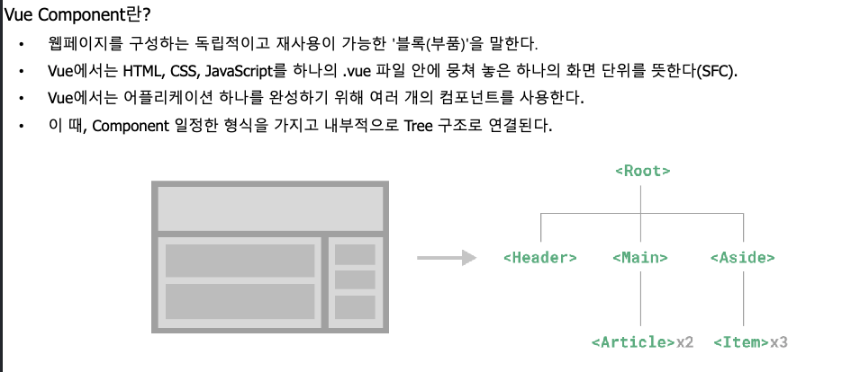
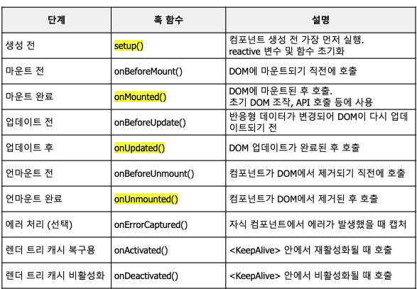

1. v-on에서 envet handler의 두 종류, 인라인과 메소드 방법이 있다

   1. 인라인 헤더 태그 안에 간단한 자바 연산 가능할때
   2. 메소드 헤더  함수와 같은 js 함수로 복잡한 기능도 넣어서 깔끔하게 정리 가능하겠다
2. 이벤트 오브젝트 주요 항목들 e.type, e.button. e.shiftkey로 설정 가능

---

# Componet

>  부품이야. 독립적으로 교체 가능한 모듈 부분

## Lifecycle

- 각 마운트 되는 영역에 따라 Hook을 걸어서 조작한다.

---

# Props & Emits

기존에 Store/ Pinia을 통해 변수를 선언해두면 전체 어디서든 쉽게 사용이 가능함

대신 컴포넌트에서는 templet 내부에 계속 자식이 자식을 만드는 구조를 만들게 됨 이를 좀 하지말자 싶어서 나온 개념이 부모 - 자식 구조를 만든다.

계속 구조를 가다보면 복잡하니까 바로 뚫자 provide

## Props

- 부모가 자식한테 데이터 반응형 정보 보내기
- 수정 불가!!
- defineProps()

### Emits

- 자식이 부모에게 이벤트 변경 사항을 전달하기 위한 매크로 함수
- 변경 가능!!
- defineEmits()
- 자식 컴퍼넌트의 표준 이벤트나 내부 로직을 따라서 처리
- 부모 컴포넌트가 등록된 이벤트 리스너 (v-on) 같은걸 호출해서 콜백으로 전달하기

### Payload

- 자식이 emit(이벤트 식별 문자열, 부모 컨포넌트로 보낼 데이터) 설정해서 부모한테 넘긴다(이벤트)
- 자식이 이벤트를 발생한 것(나 클릭됐어요!)을 부모한테 보내서 부모가(너 클릭된 것으로 인한 이벤트 데이터) 출력

## Provide & Inject

- Props Drilling 현상 : 계속 필요한 컨포넌트를 뚫어가면서 만들면 계층 구조가 복잡해짐

import {ref,provide} from 'vue' 로 선언하고 

const temecolor = ref('dark')

provide('global', temecolor)

이렇게 해버리면

import { inject } from 'vue'

로 선언해서 냅다 써버림 이러면 그냥 **일단** 쓸 수 있음

-> 그러나 문제가 있음 : 계층 구조도 데이터 emit도 구조를 모르고 그냥 냅다 사용하는 것임

- vue에서 provide는 사용 위치와 목적에 따라 2가지 방법이 있음
- store로 데이터 설정하냐 vue 파일에서 하냐 main.js에서 사용하냐에 따라 다름
