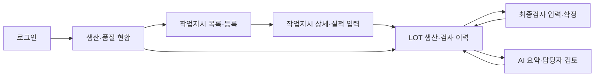

# 현재 합의 — 기본 MES 학습과 품질 대응 (2026-09-08)

- 목적: 기본 MES를 개발하며 작업지시·생산실적·LOT·검사 로직을 이해하고, 기록을 활용한 품질 문제 대응 방법을 고안한다.
- 기본 흐름: 작업지시 → LOT 생산실적 → 치수 검사 → LOT 기록 조회.
- 품질 대응: 이상 LOT에서 같은 설비·사용자가 지정한 생산 시간 범위의 다른 LOT을 조회한다. 결과는 ‘추가 확인 후보’이며 불량·영향 범위 확정이 아니다. 시간 기준과 경계 포함 여부 등은 사용자 백엔드 설계에서 정한다.
- AI 보조: 선택한 기록·메모를 근거와 함께 요약한다. 관련 LOT 선정·수치 판정은 일반 로직으로 처리한다.
- 범위 관리: 새로운 담당 배정·확인 상태 관리 절차는 현재 우선 구현에서 보류한다. 기존 품목·규격·권한·입력 검증은 유지한다.
- 분담 유지: 사용자 백엔드 설계, 어시스턴트 설계 리뷰·코드 작성·프론트 연결·검증.
- 발표 순서: 생산·품질 기록을 연결할 필요성 → 기본 MES의 구현 흐름 → 품질 이상 발생 시 관련 LOT 조회 → 보조 기능인 메모 요약 → 배운 점·한계. 산업 전반의 미해결 문제나 불량률 감소를 입증한 것처럼 말하지 않는다.
- 다음 설계: LOT의 생산 설비·시간 표현과 검사 관계, 관련 LOT 조회 입력/출력. 자재 추적·공정 확장은 추가하지 않는다.

아래는 이전 설계 기록이며 충돌 시 위 합의를 우선한다. 코드·최종 OAS/DBML은 아직 미작성이다.

---

> 최신 기획 우선순위: 기본 MES 범위를 가볍게 유지하고 [페인포인트 기획](MES_페인포인트_기획.md)에서 핵심 문제를 먼저 선택한다. 아래 상세 설계 작업은 그 선택에 맞춰 조정하며, 백엔드 설계는 사용자가 맡는다.

> **2026-09-08 최신 범위 변경 — 품질 우선**
> 사용자 조건: 9/10(목) 제출, 하루 4시간. 사용자가 백엔드를 설계하고 어시스턴트가 코드 작성·프론트 연결을 맡는다.
> 아래 본문은 초기 v1 설계 기록이다. 현재는 [백엔드 설계 워크시트](MES_백엔드설계_워크시트.md)의 치수 검사 흐름을 우선 적용하며, 사용자 설계가 나온 후 본문을 통합 개정한다.
>
> 변경점: F05·S06의 유형별 부적합수량 직접 입력을 **LOT 내 대상별 구멍 지름 측정값 입력**으로 대체. 서버가 LOT에 고정된 규격으로 판정·집계한다. S05는 측정값·사용 규격·판정 근거를 보여준다. DB/API의 검사 부분은 기존 표 그대로 구현하지 않고 규격 버전·측정값 관계를 사용자 설계로 확정한다. AI는 계산된 결과와 메모만 요약한다. 생산 기능은 기존 최소 범위를 유지한다.
> 데모는 BR-A LOT 5개 전수검사(9.90/10.00/10.10/9.89/10.11mm), 가상 규격 9.90~10.10mm로 제안한다. 이전 100개·치수/외관 집계 사례는 v1 예시이며 이번 대표 시나리오를 대체하지 않는다. 외관·기타 유형 집계는 현재 범위에서 제외한다.

# PartFlow — 자동차·가전 부품 생산·품질관리

상태: 2026-09-08 기획·설계 초안. 사용자는 자동차·가전 부품 생산·품질관리 방향으로 진행하는 데 동의했다. 프로젝트명, 금속 브래킷 사례, 아래 업무 규칙은 진행을 위한 설계 가정이며 실제 업체의 규정이 아니다. 구현·제출 완료를 의미하지 않는다.

수업 근거: [학습계획](학습계획.md), [Drive 자료 분석 및 MES 적용](MES_주제검토.md). 교재 목차인 서비스 개요·액터·UI·데이터 모델·API·고려사항을 따른다.

## 1. 서비스 개요

**자동차·가전 부품 제조 현장에서 작업지시, LOT별 생산실적, 품질검사 결과를 연결하고 AI가 검사 메모를 요약하는 웹 서비스.**

가상 현장의 문제: 작업지시는 별도 표에 있고 생산량과 검사 결과는 따로 기록되어, 특정 LOT의 생산·검사 진행 상황과 부적합 내역을 한 번에 찾기 어렵다. 담당자는 여러 메모를 읽어 인수인계 내용을 다시 작성한다.

핵심 가치: 어느 작업지시로 생산한 LOT인지, 생산과 검사가 어디까지 끝났는지, 부적합 제품이 몇 개인지와 관련 메모를 함께 조회한다. AI는 근거 기록을 연결한 인수인계 초안을 제공한다.

### 범위와 학습용 가정

- 한 공장·한 생산라인, 금속 브래킷 품목군. 자동차용 BR-A와 가전용 BR-B를 별도 품목으로 준비한다. 실제 규격을 공유한다는 뜻은 아니다.
- 제조 세부 공정은 이번에는 하나의 생산 작업으로 묶는다. 생산 완료 후 최종검사 결과를 기록한다.
- 작업지시 하나에서 여러 LOT 생산 가능. LOT별 생산실적은 한 번 확정한다.
- 최종검사는 전수검사이며 LOT당 한 번 확정한다. 샘플링·재검사·재작업·LOT 분할/병합은 후속 범위다.
- 품목과 역할별 계정은 사전 등록한다. 이번 화면에는 품목 관리·회원가입 기능을 추가하지 않는다.
- 제품 개별 측정값 대신 검사 집계와 메모를 기록한다. 치수·외관은 부적합의 대표 분류이며 자동 측정이나 실제 규격 판정을 구현한 것으로 설명하지 않는다.
- ERP·PLC·출하 연동은 범위 밖이다. LOT 내부 생산·검사 이력을 다루며 원자재부터 고객까지의 전체 추적성은 아니다.

### AI 도입 목적

1. 작업 메모와 검사 의견은 자유문장으로 기록되어 읽고 정리하는 시간이 든다.
2. AI는 이 기록을 관찰 사실·미확인 사항·다음 확인 질문으로 정리해 인수인계 초안을 만든다.
3. 담당자는 근거 기록을 열어 내용을 검토·수정하며, 원기록과 AI 초안·검토본을 구분해 보존한다.

AI가 불량 원인, 합불, 출하 가능 여부를 결정하지 않는다. 수량과 비율은 서버에서 계산하고 AI에 전달한다.

## 2. 액터와 요구사항

생산관리자: 작업지시 생성·종료, 전체 현황 조회. 작업자: 지시 시작, LOT 실적 등록. 품질 담당자: 검사 등록, AI 요약 생성·검토. 외부 AI 서비스: 서버가 전달한 기록을 요약. 모든 내부 역할은 현황·LOT 이력 조회가 가능하다.

| ID  | 요구사항·액터                   | 입력 → 출력                                        | 완료 기준·주요 예외                                   |
| --- | -------------------------------- | --------------------------------------------------- | ------------------------------------------------------ |
| F01 | 로그인·로그아웃 / 내부 역할     | 계정·비밀번호 → 세션·역할                        | 서버에서 권한 확인. 인증 실패 401, 권한 없음 403       |
| F02 | 작업지시 등록 / 관리자           | 품목·목표수량·예정일 → 지시번호                  | 수량은 양의 정수, 없는 품목은 거절                     |
| F03 | 작업 시작·종료 / 작업자·관리자 | 지시 ID·종료 사유 → 상태                          | 작업자가 시작, 관리자가 종료. 불가능한 상태 전이는 409 |
| F04 | LOT 생산실적 등록 / 작업자       | 진행 중 지시·LOT번호·생산수량·메모 → LOT        | LOT번호 고유, 수량 양의 정수, 지시 누적 목표 초과 거절 |
| F05 | 최종검사 확정 / 품질 담당자      | LOT·검사수량·유형별 부적합수량·메모 → 검사 기록 | 검사수량=LOT 생산수량. 중복 검사 409, 수량 오류 400    |
| F06 | 현황·LOT 이력 조회 / 내부 역할  | 기간·품목·LOT번호 → 현황·관련 이력              | 조회 조건·집계 기준 표시, 빈 결과 안내                |
| F07 | AI 요약 생성 / 품질 담당자       | 검사완료 LOT ID → 근거 포함 초안                   | 검사 전 생성 거절. AI 장애 시 원기록 유지·재시도 안내 |
| F08 | 요약 검토본 저장 / 품질 담당자   | 요약 ID·검토문 → 검토자·시각·검토본             | AI 원문 유지, 이력으로 추가 저장                       |

### 상태·수량 규칙

- 작업지시: `대기 → 진행 → 종료`. 대기에서 작업자가 시작한다. 생산량이 목표에 도달해도 관리자 종료 전까지 진행 상태다. 종료 시 생산량이 목표보다 적으면 사유 필수. 종료 이후 LOT 추가 불가.
- 생산 LOT은 생산 완료된 수량을 등록하는 기록이다. 검사 상태는 검사 기록 존재 여부로 `검사대기/검사완료`를 계산한다. 생산 종료와 검사 완료는 별도다.
- 목표 초과 여부는 서버에서 지시별 기존 실적과 합산해 검사한다. 동시에 실적이 등록되어도 목표를 초과하지 않도록 등록을 원자적으로 처리한다.
- 검사수량 N, 치수 부적합 D, 외관 부적합 A, 기타 O. 모두 정수이고 N>0, D/A/O≥0, D+A+O≤N.
- 부적합수량=D+A+O, 적합수량=N−부적합수량. 한 제품은 대표 사유 한 가지로만 분류한다. 치수·외관 중복이면 치수를 대표로 기록하고 나머지는 메모한다. 이는 집계 단순화를 위한 프로젝트 정책이며 실제 공장 표준이 아니다.
- 전체 부적합품률은 Σ부적합/Σ검사수량×100. LOT별 비율의 단순 평균을 쓰지 않는다. 검사 0개이면 0% 대신 ‘검사 데이터 없음’으로 표시한다.
- 확정된 생산·검사 기록의 수정·삭제는 초안 범위에서 제공하지 않는다. 입력 확인 단계를 두고, 운영 확장 시 원본을 보존하는 정정 기능을 추가한다.

## 3. 전체 화면과 이동 흐름

아래는 화면 설계 초안이다. 제출용 개요 PDF에는 각 화면을 실제 와이어프레임 이미지와 설명으로 넣어야 한다.

| 화면 ID | 화면·요소                                                          | 행동과 이동                                                              | 요구사항    |
| ------- | ------------------------------------------------------------------- | ------------------------------------------------------------------------ | ----------- |
| S01     | 로그인: 계정·비밀번호·오류 안내                                   | 성공→S02, 실패→입력 화면 유지                                          | F01         |
| S02     | 현황: 기간·품목 필터, 생산수량·검사수량·부적합품률, 검사대기 LOT | 지시 메뉴→S03, LOT 선택→S05, 공통 로그아웃→S01                        | F01/F06     |
| S03     | 작업지시 목록 + 등록 패널: 품목·목표수량·예정일                   | 관리자 저장→목록 갱신, 행 선택→S04                                     | F02/F06     |
| S04     | 지시 상세: 목표·누적 생산·진행 상태·LOT 목록, 실적 입력 패널     | 작업 시작, LOT번호·수량·메모 확인 후 저장, 관리자 종료, LOT 선택→S05  | F03/F04/F06 |
| S05     | LOT 상세: 생산정보·작업자·검사상태·검사 집계·AI 요약·검토 이력 | 품질 담당자 검사 입력→S06, 검사 후 AI 생성·검토본 저장, 지시 링크→S04 | F06/F07/F08 |
| S06     | 검사 입력: LOT·생산량(읽기 전용), 유형별 수량·메모·자동 합계     | 확인 단계에서 수량 점검→검사 확정→S05                                  | F05         |

공통 상태: 처리 중 버튼 잠금, 성공 안내, 입력 오류 위치 표시, 조회 결과 없음, 인증 만료, 서버/통신 오류. 실패 시 입력을 유지하되 재로그인·새로고침 후까지 보존된다고 보장하지 않는다. 화면 숨김과 별개로 서버에서 역할을 검사한다.

AI 노드는 S05 내부 기능이며 별도 페이지가 아니다.

## 4. 데이터 모델 초안

| 엔터티          | 핵심 속성                                                                                                                                  | 관계·제약                                               |
| --------------- | ------------------------------------------------------------------------------------------------------------------------------------------ | -------------------------------------------------------- |
| users           | id, login_id, password_hash, name, role                                                                                                    | login_id 고유, 역할 허용값 제한                          |
| products        | id, code, name, application                                                                                                                | code 고유. application은 자동차/가전                     |
| work_orders     | id, order_no, product_id, target_qty, due_date, status, created_by, started_by, closed_by, created_at, started_at, closed_at, close_reason | 품목 1:N 지시. 담당자는 users FK, 수량 양수              |
| production_lots | id, lot_no, work_order_id, produced_qty, operator_id, produced_at, memo                                                                    | 지시 1:N LOT, lot_no 고유, 수량 양수                     |
| inspections     | id, lot_id, inspected_qty, dimensional_reject_qty, visual_reject_qty, other_reject_qty, memo, inspector_id, inspected_at                   | LOT 1:0..1 검사, lot_id UNIQUE. 수량 제약 및 생산량 대조 |
| ai_summaries    | id, inspection_id, generated_text, model, created_at, requested_by                                                                         | 검사 1:N 요약, 근거 검사는 FK로 고정                     |
| summary_reviews | id, summary_id, reviewed_text, reviewer_id, reviewed_at                                                                                    | 요약 1:N 검토 이력. 원문 수정 없이 추가                  |

작업지시 품목을 통해 LOT 품목을 조회한다. 적합수량·부적합수량·비율·검사상태는 계산하므로 중복 저장하지 않는다. AI 요청은 변경 불가한 검사·생산기록과 서버 계산값을 사용한다. 실패 결과는 정상 요약 행으로 저장하지 않고 재시도를 안내한다.

기간 필터는 LOT 생산일 기준으로 통일한다. 해당 LOT들의 생산수량, 검사완료 수량과 품질 지표를 보여주며 당일 검사 처리량으로 이름 붙이지 않는다. 상태별 작업지시 건수는 이 초안 현황 지표에서 제외한다.

## 5. API 목록 초안

스택 전제: Vue 3 → Spring Boot REST API → PostgreSQL, AI 호출은 Spring AI. 아래는 목록이며 제출용 완전한 OAS YML은 별도 작성해야 한다.

| 화면     | Method·Path                                                       | 주요 데이터·처리                                                         |
| -------- | ------------------------------------------------------------------ | ------------------------------------------------------------------------- |
| S01/공통 | POST /api/auth/login; POST /api/auth/logout; GET /api/auth/me      | 세션 생성·종료·현재 역할                                                |
| S02/S03  | GET /api/products                                                  | 선택 가능한 품목 ID·코드·이름                                           |
| S02      | GET /api/dashboard                                                 | from/to/productId → 생산·검사수량·부적합품률·검사대기수               |
| S02/S05  | GET /api/lots                                                      | from/to/productId/lotNo/inspectionStatus/page/size → LOT 목록·전체 건수 |
| S03      | GET /api/work-orders; POST /api/work-orders                        | 목록 조회·등록(productId/targetQty/dueDate)                              |
| S04      | GET /api/work-orders/{id}                                          | 지시와 누적 생산량·연결 LOT                                              |
| S04      | POST /api/work-orders/{id}/start; POST /api/work-orders/{id}/close | 역할·현재 상태 검증, 종료 시 부족 사유 확인                              |
| S04      | POST /api/work-orders/{id}/lots                                    | lotNo/producedQty/memo → 생성 LOT                                        |
| S05      | GET /api/lots/{id}                                                 | 생산·검사·AI 요약·검토 이력 통합 조회                                  |
| S06      | POST /api/lots/{id}/inspection                                     | inspectedQty/유형별 수량/memo → 확정 검사와 계산 결과                    |
| S05      | POST /api/lots/{id}/ai-summaries                                   | 검사·생산 기록을 서버가 조회해 요약 생성                                 |
| S05      | POST /api/ai-summaries/{id}/reviews                                | reviewedText → 새 검토 이력                                              |

공통 오류: 400 입력 오류, 401 인증 필요, 403 권한 부족, 404 대상 없음, 409 상태·중복 충돌, 500 내부 오류. AI 공급자 실패는 502, 제한시간 초과는 504. 오류 응답은 code/message/fieldErrors를 정의한다. 등록 응답에는 생성 ID와 화면에 필요한 결과를 포함한다. 최종 OAS에서 타입·필수값·성공/오류 응답 스키마를 완성한다.

## 6. 대표 사례·검증·발표

가상 데이터: BR-A 작업지시 100개 → LOT-A 100개 생산 → 검사 100개, 치수 부적합 3개·외관 부적합 1개·기타 0개 → 적합 96개, 부적합품률 4%. 검사 메모는 ‘치수 부적합 3개 확인. 원인은 미확인’처럼 사실과 추정을 구분한다.

AI 기대 결과: ‘100개 중 4개가 부적합으로 기록됨. 치수 3개, 외관 1개. 기록만으로 원인을 알 수 없음. 담당자에게 측정·작업 기록 확인 필요 여부를 문의.’ AI가 기록에 없는 설비 고장을 사실로 쓰면 검토 대상이다.

설계·구현 시 확인할 사례:

- 정상: 위 입력에서 적합 96개·부적합품률 4%, LOT→작업지시·검사·요약 연결.
- 입력 오류: 100개 생산에 검사 101개, 유형별 합계 101개, 음수·소수 수량 거절.
- 중복·상태: 같은 LOT번호·같은 LOT 검사 중복, 종료된 지시에 실적 등록, 목표 초과 생산 거절.
- 집계: 100개 중 4개와 900개 중 9개 부적합이면 전체 13/1000=1.3%. 4%와 1%의 단순 평균 사용 금지.
- AI 장애: 검사 기록과 조회 유지, 실패 안내 후 생성 재시도 가능.
- 권한: 작업자가 검사 확정 또는 지시 종료 API를 직접 호출해도 거절.

발표 5분 제안: 문제·목적 40초 → 역할·화면 흐름 100초 → 대표 기능의 API·DB 연결 100초 → AI 역할·고려사항 60초.

## 진행 상태

- 완료: 방향 확정, 정의서 초안, 요구사항·화면·API·데이터 대응 및 검증 사례 정리.
- 다음 작업: 이 초안을 기준으로 6개 화면 와이어프레임 작성, 완전한 OAS YML·DBML 구체화, 기술서·발표대본 PDF 제작 및 교차 검증.
- 미확인: 실제 달력 마감 날짜, 제출 ZIP에 사용할 학생 고유번호. 기존 파일명만 보고 개인 식별값을 확정하지 않는다.
- 아직 수행하지 않음: 앱 구현·실행 검증·배포·제출. 실제 제조 적합성 검증도 수행하지 않음.
