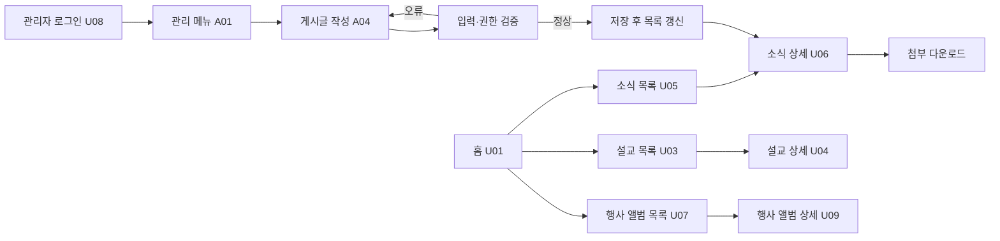

# 원당교회 웹사이트 — 웹 서비스 프로젝트 정의서

> 2026-09-08 추가 참고자료: Drive `submission_guide.pdf`는 **발표대본 PDF를 더한 4종을 `{고유번호}_AI_web.zip`으로 제출**하도록 안내한다. 아래 기존 3종 안내는 최초 교재 기준 기록이다. AI 도입 필요성·Vue/Spring Boot(+Spring AI) 전제도 추가로 나타나므로 적용 여부 확인이 필요하다. 자세한 비교는 [Drive 참고자료 분석](드라이브_참고자료_분석.md)을 참고한다.

기획·설계 검토본 | 2026-09-08 | 교재 4쪽 목차 및 5~6쪽 평가 기준 반영

## 검토 기준

- 사용자 요구: 일반 성도의 교회 정보·소식 조회, 관리자의 예배 링크·공지·활동 사진·동향 소개 업로드.
- 코드: `/Users/chltmddn5843/Documents/GitHub/church`, 기준 커밋 `edd6a17`. `lib/church.ts`에 기존 미커밋 변경이 있어 현재 작업 파일을 기준으로 읽었다. 코드는 수정하지 않았다.
- [GitHub 저장소](https://github.com/chltmddn5843/church): 연결 도구에서는 404가 반환되어 원격 최신 상태와 로컬의 일치는 검증하지 못했다.
- [운영 홈페이지](https://church.chltmddn5843.workers.dev/): 공개 홈 접속·메뉴·최근 말씀·예배 안내 확인. 관리자 로그인이나 등록·수정·삭제는 실행하지 않았다.
- [UI 참고 사이트](https://www.cheonsan.or.kr/): 홈의 흰색 헤더, 대분류 메뉴, 큰 영상 배경과 중앙 메시지, 최신글 영역을 확인했다.
- 아래 **현재**는 코드에서 확인한 구현, **설계안**은 과제용 제안이다. 코드 존재와 운영 검증 완료는 다르다. 이 문서는 최종 제출 PDF/YML/DBML이 아니다.

## 1. 서비스 개요

### 1.1 서비스 이름과 목적

**원당교회 웹사이트 — 교회 정보와 예배·공동체 소식을 제공하는 콘텐츠 서비스**

일반 성도는 교회 소개, 예배 정보와 최신 소식을 한곳에서 확인한다. 관리자는 예배 영상 링크, 공지, 교회 활동 사진과 소식을 직접 등록·관리한다.

### 1.2 배경과 해결할 문제

사용자가 밝힌 요구를 다음과 같이 문제와 기능으로 연결한다. 정보가 실제로 여러 채널에 흩어져 있는지, 운영자가 얼마나 자주 갱신하는지는 아직 인터뷰로 검증하지 않은 기획 가설이다.

| 사용자 문제·필요 | 대응 기능 | 확인할 성공 기준 |
| --- | --- | --- |
| 교회·예배 정보를 찾고 싶다 | 교회소개, 예배시간, 오시는 길 | 홈 메뉴·바로가기에서 해당 정보를 찾을 수 있음 |
| 예배 영상을 보고 싶다 | 생방송 링크, 설교 목록·상세 | 관리자가 저장한 영상이 지정 위치에서 열림 |
| 최근 공지와 활동을 알고 싶다 | 분류별 게시글, 사진 갤러리 | 게시한 제목·본문·사진이 성도 화면과 일치 |
| 관리자가 정보를 갱신해야 한다 | 관리자 콘텐츠 등록·수정·삭제 | 권한 있는 관리자만 변경하고 결과를 확인 가능 |

### 1.3 이번 과제 범위 — 제안

**핵심 범위:** 교회정보 조회, 예배 링크·설교 관리 및 조회, 공지·교회소식 관리 및 조회, 행사별 다중 사진 앨범 등록·조회, 관리자 인증. 기존 제한 공개 정책은 유지해 설명한다.

**기존에 있으나 상세 설계 범위에서 우선 제외할 후보:** 헌금 보고서, 외부 결제·식권, 팝업 관리, 회원 승인·특수 열람 그룹 관리, 통계, 별도 교육 콘텐츠 관리. 삭제 대상이 아니라 5분 발표와 설계 문서의 범위를 좁히기 위한 제안이다. 최종 포함 여부는 사용자 확인 후 확정한다.

교회 동향은 우선 기존 `posts`의 `교회소식` 분류로 표현한다(설계 제안). 별도 활동 시스템은 사용자 필요가 확인되면 추가한다.

## 2. 시스템 액터 정의

| 액터 | 목적 | 허용 기능 | 제한 |
| --- | --- | --- | --- |
| 일반 성도 | 교회 정보와 소식 확인 | 공개 소개·예배·설교·소식·사진 조회 | 콘텐츠 작성·수정 불가 |
| 관리자 | 교회 정보 게시와 유지 | 생방송 저장, 설교·게시글 CRUD, 사진 등록·삭제, 소개 콘텐츠 저장 | 인증과 DB의 관리자 역할 확인 필요 |

일반 성도는 업무상의 그룹이고 로그인 상태와 동일한 뜻은 아니다. 현재 코드는 미로그인, 승인 대기(`pending`), 승인 회원(`member`), 관리자(`admin`)를 구분한다. 게시글·관리형 소개 페이지에는 `public/member/bylaws/offering/committee` 공개 범위가 있다. 갤러리에는 공개 범위 필드가 없고 현재 조회는 공개다.

외부 시스템: YouTube는 영상 재생·일부 최신 영상 정보의 출처다. Cloudflare는 실행·저장 인프라로 액터와 구분한다.

### 기능 요구사항과 현재 구현

| ID | 기능 | 현재 확인 | 기획에서 정할 내용 |
| --- | --- | --- | --- |
| F01 | 교회 정보 조회 | `/about`, 홈 예배시간, 정적 정보와 `content_pages` 기반 별도 소개 페이지 | 어떤 소개 정보까지 관리자가 수정해야 하는가 |
| F02 | 공지·교회소식 조회 | `/community` 분류 필터, `/community/[id]` 본문·첨부 | 동향 소개를 교회소식에 포함하는 제안 |
| F03 | 예배 링크 등록·조회 | `/admin/live` 저장 → 홈 생방송, `/admin/sermons` → 설교 목록·상세 | 생방송 한 건과 누적 설교의 구분 유지 |
| F04 | 공지·동향 게시 | `/admin/posts` 등록·수정·삭제, 분류·고정·공개 범위·첨부 | 현재 기능을 활용; 새 기능이라고 표기하지 않음 |
| F05 | 활동 사진 관리·조회 | `/admin/gallery` 단일 사진 등록·삭제, `/gallery` 조회 | **사용자 확정: 행사별 여러 장 앨범 필요. 현재 단일 사진 구조에서 확장 설계** |
| F06 | 소개 콘텐츠 저장 | `/admin/pages`에서 페이지 번호 기준 저장 → `/Page/Index/[id]` | `/about`의 모든 정적 내용을 편집하는 기능은 아님 |
| F07 | 관리자 로그인·접근 제어 | Better Auth, 관리자 레이아웃·각 Action의 `requireAdmin` | 계정 준비·운영 검증은 별도 수행 |

## 3. UI 흐름 (와이어프레임)

### 3.1 화면 목록과 동작

다음은 범위 제안에 따른 화면 정의다. 코드 경로가 있는 화면도 실제 사용자 테스트를 완료했다는 의미는 아니다.

| 화면 ID | 화면·경로 | 주요 표시·입력 | 행동과 다음 상태 |
| --- | --- | --- | --- |
| U01 | 홈 `/` | 대표 이미지, 소개 문구, 생방송(등록 시), 최근 말씀, 예배시간, 바로가기, 사진 미리보기 | 소개→U02, 설교→U03, 소식→U05, 사진→U07 |
| U02 | 소개 `/about`, `/Page/Index/[id]` | 인사말·교역자·연혁·비전·위치 또는 관리형 제목·본문 | 메뉴·섹션 이동. 비공개 콘텐츠는 권한에 따라 제한 |
| U03 | 말씀 목록 `/sermons` | 분류, 제목, 설교자, 날짜, 썸네일 | DB 설교→U04, 외부 영상→YouTube |
| U04 | 말씀 상세 `/sermons/[id]` | 제목·분류·설교자·본문 구절·영상·요약 | 영상 재생, 목록 복귀; 없는 ID는 찾을 수 없음 |
| U05 | 소식 목록 `/community` | 분류, 제목, 작성 정보, 고정 여부 | 필터 변경, 게시글→U06 |
| U06 | 소식 상세 `/community/[id]` | 제목·본문·작성 정보·조회수·첨부명/크기 | 첨부 다운로드, 목록 복귀; 권한 없는 글은 미노출 |
| U07 | 행사 앨범 목록 `/gallery` (목표) | 행사명·행사일·대표 사진·사진 수 | 앨범 선택→U09, 관리자에게 등록 진입 제공 |
| U09 | 행사 앨범 상세 `/gallery/[albumId]` (신규 설계) | 행사명·일자·설명·사진 목록·사진 설명 | 사진 확대, 앨범 목록 복귀; 없는 앨범은 404 |
| U08 | 로그인 `/sign-in` | 이메일·비밀번호 | 인증 후 관리 메뉴 진입; 오류 표시 |
| A01 | 관리자 `/admin` | 관리 메뉴·홈페이지 보기 | 콘텐츠 관리 화면 선택 |
| A02 | 생방송 `/admin/live` | YouTube URL·현재 미리보기 | 저장, 홈에서 결과 확인 |
| A03 | 설교 `/admin/sermons` | 제목·설교자·성경본문·분류·날짜·YouTube·요약 | 등록·수정·삭제 후 목록 갱신 |
| A04 | 게시글 `/admin/posts` | 제목·본문·분류·고정·공개 범위·등록 첨부 | 등록·수정·삭제 후 관리 목록, 공개 상세 확인 |
| A05 | 행사 앨범 `/admin/gallery` (확장 설계) | 행사명·행사일·분류·설명·다중 사진 선택·미리보기 | 앨범 등록, 행사 정보 수정, 사진 추가·삭제, 앨범 삭제 후 목록 확인 |
| A06 | 소개 `/admin/pages` | 기존 페이지 번호·제목·내용·내부 이미지 경로·게시 여부·공개 범위 | 동일 번호 저장 시 갱신, 해당 소개 페이지 확인 |

별도 첨부 관리, 회원가입·비밀번호 재설정 등 기존 보조 화면은 존재하지만 위 핵심 화면 세트의 상세화 대상과 분리했다. 최종 범위에 포함할 경우 화면·API·모델을 함께 추가한다.

### 3.2 대표 사용자 흐름

### 3.3 UI 참고 방향

천산교회 홈의 **흰색 헤더, 대분류 탐색, 넓은 대표 비주얼과 큰 중앙 메시지, 최신글 노출**을 참고한다. 이는 관찰한 구성이고 아래 적용은 제안이다. [참고 사이트](https://www.cheonsan.or.kr/)

- 홈은 기존 교회 이미지와 메시지를 활용하고 예배·소식 접근 버튼을 명확히 둔다.
- 기존 메뉴 체계를 유지하되 모바일에서도 하위 메뉴에 접근할 수 있게 설계한다.
- 현재 홈에는 소식 바로가기가 있으나 최신 게시글 목록은 없다. **최신 공지·교회소식 요약 영역**을 개선 후보로 추가한다. 기존 게시글 데이터만 사용하면 새 테이블은 필요 없다.
- 갤러리 목록은 행사별 대표 사진 카드로 표현하고 행사명·행사일·사진 수를 제공한다. 상세에서 해당 행사의 여러 사진과 설명을 보여준다.
- 영상 배경은 필수로 보지 않는다. 사용자 선호 확인 후 정적 대표 사진으로도 같은 구성을 적용할 수 있다.

홈 배치 제안: `로고·메뉴 → 대표 사진·메시지 → 예배 바로가기/생방송 → 최신 공지·소식 → 최근 말씀 → 예배시간 → 활동 사진 → 연락처·위치`.

### 3.4 예외 상태와 제출 화면

설계안: 필수값 누락은 해당 필드 옆에 안내, 저장 실패 시 입력 유지와 재시도, 업로드 중 중복 제출 방지, 삭제 전 대상 제목 확인, 빈 목록은 등록된 내용이 없음을 표시한다. 현재 각 화면에 모두 구현됐다고 가정하지 않는다.

**최종 PDF에는 제공하기로 확정한 전체 화면의 와이어프레임/캡처와 위 동작 설명을 넣어야 한다.** 현재는 흐름과 화면 정의까지 작성한 단계이며 전체 시각 와이어프레임과 제출 PDF는 아직 미완료다.

## 4. 데이터 모델 설계

### 4.1 현재 시스템 구성

`브라우저 → Next.js 화면/Server Action → Drizzle → Cloudflare D1`

파일은 R2에 저장하고 DB에는 경로·메타데이터를 저장한다. 인증은 Better Auth와 D1, 보조 저장소 AUTH_KV를 사용한다. OpenNext Worker 설정이 있으며 Pages 배포라고 표현하지 않는다. 근거: `wrangler.toml`, `lib/db/index.ts`, `lib/auth.ts`, `lib/uploads.ts`.

### 4.2 핵심 엔터티 — 현재 코드 기준

`!`는 NOT NULL, `?`는 NULL 허용. 날짜는 현재 SQLite 정수 timestamp이며 설계 API에서는 ISO 8601 문자열로 직렬화한다.

| 테이블 | 주요 속성·타입·제약조건 | 용도 |
| --- | --- | --- |
| user | id text PK; name/email text!; email UNIQUE; role text! 기본 pending; emailVerified boolean!; image text?; createdAt/updatedAt timestamp! | 사용자·관리자 역할 |
| posts | id int PK 증가; title/content/category text!; authorId text?; authorName text!; pinned boolean!; visibility text!; views int!; createdAt/updatedAt timestamp!; legacyBoard/legacyId int? | 공지·동향 등 게시글 |
| attachments | id int PK 증가; postId int! FK; name/url/contentType text!; size int!; createdAt timestamp! | 게시글 첨부 메타데이터 |
| sermons | id int PK 증가; title/preacher/category text!; scripture/youtubeId/summary text?; preachedAt/createdAt timestamp! | 누적 설교 |
| live_stream | id int PK 기본 1; youtubeId text!; updatedAt timestamp! | 현재 생방송 영상 |
| gallery | id int PK 증가; title/imageUrl/category text!; description text?; createdAt timestamp! | 활동 사진 한 장 |
| content_pages | id int PK 증가; legacyId int! UNIQUE; title/content text!; imageUrl text?; published boolean!; visibility text!; updatedAt timestamp! | 관리형 소개 페이지 |
| user_groups | userId text! FK; group text!; 두 열 복합 PK | 제한 콘텐츠 열람 그룹 |

부가 인증 테이블은 session/account/verification이며 실제 전체 DBML 작성 시 인증 범위에 맞춰 포함한다. popups/offering_reports는 이번 핵심 범위 밖의 기존 테이블이다.

### 4.3 관계와 주의점

- `posts 1:N attachments`: `attachments.postId → posts.id`, 게시글 삭제 시 DB 첨부 레코드는 cascade. R2 파일 삭제는 별도 애플리케이션 동작이다.
- `user 1:N user_groups`, `user 1:N session/account`: 사용자 삭제 cascade가 스키마에 있다.
- `posts.authorId`는 논리적으로 작성자를 가리키지만 **현재 FK 제약은 없다**. 현재 ERD에서 강제 FK처럼 표시하지 않는다. FK 추가가 필요하면 기존 데이터와 삭제 정책을 먼저 정한다.
- `live_stream`은 Action에서 id=1로 저장한다. 기본값만으로 다른 행 삽입이 DB에서 금지되는 것은 아니다.
- 현재 gallery는 한 행당 한 사진이다. 사용자 확정 요구인 행사별 다중 사진은 아래 목표 모델로 확장한다.
- 정적 `/about`·예배시간은 코드 데이터다. 관리자 편집 대상으로 확대할 때만 해당 데이터 모델을 추가한다.
- YouTube에서 가져온 영상은 D1에 저장된 설교와 구분한다. 화면의 모든 영상이 sermons 행에서 온다고 설명하지 않는다.

### 4.4 행사 앨범 목표 모델 — 사용자 요구 반영

**확정 요구:** 한 행사에 여러 사진을 등록한다. 아래 필드·정렬·실패 정책은 이를 지원하기 위한 설계 제안이다.

| 엔터티 | 필드·제약 | 설명 |
| --- | --- | --- |
| gallery_albums (신규) | id int PK 증가; title text!; eventDate date!; category text!; description text?; createdAt/updatedAt timestamp! | 행사 정보는 앨범에 한 번 저장 |
| gallery (기존 확장) | 기존 id/imageUrl/description/createdAt 유지; albumId int! FK; sortOrder int! 기본 0 | 사진마다 소속 앨범과 표시 순서 저장 |

관계: `gallery_albums 1:N gallery`, FK는 `gallery.albumId → gallery_albums.id`. 목록의 대표 사진은 `(sortOrder, id)` 순 첫 사진으로 계산하고 사진 수는 COUNT로 계산한다. 중복 대표사진 경로나 사진 수 저장 필드는 두지 않는다. 상세는 같은 순서로 사진을 반환한다. 정렬 변경 UI는 아직 요구되지 않았다.

신규 앨범 등록 시 사진 1장 이상을 받으며 여러 장 선택을 지원한다. 사진 없는 앨범은 공개 목록에서 제외하는 것으로 제안한다. `eventDate`는 행사가 열린 날짜이고 `createdAt`은 등록 시각이므로 구분한다.

기존 자료 전환: 현재 사진을 임의로 행사별로 묶지 않는다. 행사 매핑을 확인한 뒤 albumId를 채우고 NOT NULL을 적용한다. 이전 title/category는 행사 정보와의 중복 여부를 확인해 이관하며, 이전 제목은 필요하면 사진 설명으로 보존한다. 실제 마이그레이션은 아직 수행하지 않는다.

파일 처리: 사진별 기존 20MiB 상한과 이미지 형식 검증을 적용한다. 앨범당 최대 사진 수·요청 총용량은 다중 업로드 구현 전 배포 환경에 맞춰 정한다. 신규 등록은 파일 업로드와 DB 기록이 모두 성공해야 공개한다. 실패 시 생성한 레코드·파일을 정리하며 정리 실패는 재처리 대상으로 남긴다. 앨범 삭제의 FK cascade는 DB 행에만 적용되므로 R2 파일은 별도 삭제해야 한다.

## 5. API 명세 정의

### 5.1 현재 구현과 과제 설계의 차이

현재 콘텐츠 조회는 서버 컴포넌트가 `lib/queries.ts`로 DB를 읽고, 관리는 `app/actions/*.ts`의 Server Action을 호출한다. `/api/posts`와 같은 콘텐츠 REST 경로는 현재 없다.

`lib/openapi.ts`는 인증·팝업 이미지·명세 조회 위주다. 실제 파일 조회 라우트는 gallery/attachments도 처리하므로 기존 명세를 그대로 최종 제출하면 **화면 기능 및 파일 조회 범위가 빠진다**.

과제용 명세는 아래 **목표 REST 계약 설계안**을 OAS로 구체화한다. 이는 아직 배포된 API가 아니며, Server Action을 실제 REST로 변경하는 작업도 요청하지 않았다. 현재 동작과 목표 계약의 매핑을 함께 제출해 오해를 방지한다.

### 5.2 화면에 대응하는 API 목록 — 목표 설계안

| 화면 | Method·Path | 입력 → 출력 | 현재 대응 |
| --- | --- | --- | --- |
| U01/U05 | GET /api/posts | query category?, limit? → PostSummary[] | getPosts |
| U06 | GET /api/posts/{id} | 양의 정수 id → Post + Attachment[] | getPost |
| A04 | POST /api/posts | multipart 제목·본문·분류·고정·공개범위·files[] → 생성 Post | createPost |
| A04 | PATCH /api/posts/{id} | 수정 필드 → 갱신 Post | updatePost; 현재는 폼 전체 전달 |
| A04 | DELETE /api/posts/{id} | id → 204 | deletePost |
| U01/U03 | GET /api/sermons | category?, limit? → Sermon[] (DB 등록분) | getSermons |
| U04 | GET /api/sermons/{id} | id → Sermon | getSermon |
| A03 | POST /api/sermons | 제목·설교자·분류·영상URL·일시·본문구절?·요약? → Sermon | createSermon |
| A03 | PATCH /api/sermons/{id} | 수정 필드 → Sermon | updateSermon |
| A03 | DELETE /api/sermons/{id} | id → 204 | deleteSermon |
| U01/A02 | GET /api/live-stream | 없음 → LiveStream 또는 null | 현재 DB 직접 조회 |
| A02 | PUT /api/live-stream | youtubeUrl → youtubeId·updatedAt | saveLiveStream |
| U07/U01 | GET /api/gallery-albums | limit? → AlbumSummary[] | 기존 getGallery를 앨범 조회로 확장 설계 |
| U09 | GET /api/gallery-albums/{id} | 앨범 id → Album + photos[] | 신규 설계 |
| A05 | POST /api/gallery-albums | multipart title/eventDate/category/description?/images[] → Album | 다중 사진 등록으로 확장 설계 |
| A05 | PATCH /api/gallery-albums/{id} | 행사 정보 수정 → Album | 신규 설계 |
| A05 | POST /api/gallery-albums/{id}/photos | multipart images[] → Photo[] | 기존 앨범에 사진 추가 설계 |
| A05 | DELETE /api/gallery-albums/{id}/photos/{photoId} | 앨범·사진 id → 204 | 소속 일치 확인 후 사진 삭제 설계 |
| A05 | DELETE /api/gallery-albums/{id} | 앨범 id → 204 | 소속 사진과 파일 정리 설계 |
| U02 | GET /api/pages/{legacyId} | 기존 페이지 번호 → ContentPage | 관리형 페이지 조회 |
| A06 | PUT /api/pages/{legacyId} | title/content/imageUrl?/published/visibility → ContentPage | saveContentPage |
| U06/U07/U09 | GET /api/uploads/{folder}/{fileName} | folder·fileName → 파일 바이너리 | 현재 /api/uploads/[...key] 실제 HTTP |
| U08 | POST /api/auth/sign-in/email | email/password → 인증 결과 | 기존 Better Auth HTTP |
| A01 | GET /api/auth/get-session | 세션 쿠키 → 세션 또는 null | 기존 Better Auth HTTP |
| 공통 | POST /api/auth/sign-out | 세션 쿠키 → 성공 여부 | 기존 Better Auth HTTP |

추가 화면 데이터: 정적 교회소개·예배시간에는 현재 API가 없다. 관리형으로 전환할 경우 별도 계약을 추가한다. 홈/설교 목록의 YouTube 최신 영상은 기존 외부 조회 어댑터를 유지하며, 프론트 분리 설계로 확장하면 `/api/youtube-videos` 등의 계약을 별도로 정의해야 한다. 이번 REST 목록에 이를 구현 완료로 넣지 않는다.

### 5.3 입력·출력·오류 계약 기준

- 목록은 `{items: [...]}`, 상세·생성은 해당 객체를 반환하는 목표 계약으로 통일한다. ID는 정수, boolean은 JSON boolean, 날짜는 date-time 문자열로 명시한다.
- PostSummary는 id/title/category/authorName/pinned/createdAt/views. Post는 content/visibility/updatedAt 및 attachments를 추가한다. 첨부에는 id/name/url/contentType/size를 제공한다.
- Sermon은 스키마의 공개 필드, AlbumSummary는 id/title/eventDate/category/coverImageUrl/photoCount, Album은 description/createdAt/updatedAt/photos를 추가한다. Photo는 id/albumId/imageUrl/description/sortOrder/createdAt, ContentPage는 id/legacyId/title/content/imageUrl/published/visibility/updatedAt을 사용한다.
- POST 성공 201, 조회·수정 200, 삭제 204를 설계 기준으로 삼는다. 현재 Action의 리다이렉트 응답과 다르다.
- 공통 오류 객체 제안: `{code, message, field?}`. 입력 오류 400, 관리자 미인증 401, 권한 부족 403, 없는 리소스 404, 파일 크기 초과 413, 미지원 파일 415, 저장 실패 500.
- 제한 콘텐츠와 첨부 조회는 존재를 노출하지 않도록 404로 통일하는 현재 정책을 유지한다.
- 파일은 기존 20MiB 상한을 반영한다. 갤러리 설계에서는 이미지 형식만 허용한다. 현재 공용 업로드 함수는 PDF·오디오도 허용하므로 서버 측 갤러리별 제한은 구현 차이로 기록한다.
- 생방송 URL은 유효한 YouTube ID 추출 가능 여부로 검증한다. 설교도 같은 검증을 적용하는 목표로 명시하되 현재 모든 입력 검증이 동일하다고 가정하지 않는다.
- OAS의 Security Schemes는 평가 제외이지만 관리자 권한과 오류 응답은 설명한다.

## 6. 고려사항

### 6.1 기능·화면·데이터 연결 검토

| 요구사항 | 화면 | 서비스 처리 | 저장·출처 | 실패 상황 |
| --- | --- | --- | --- | --- |
| 공지 등록과 읽기 | A04→U05→U06 | createPost/getPosts/getPost | posts, attachments, R2 | 제목·본문 누락, 업로드 실패, 비공개 접근 |
| 예배 링크 갱신 | A02→U01 | saveLiveStream | live_stream | 잘못된 URL, 저장 실패 |
| 설교 등록과 재생 | A03→U03→U04 | createSermon/getSermon | sermons, YouTube | 없는 설교, 영상 재생 불가 |
| 행사 사진 공개 | A05→U07→U09 | 목표 앨범 등록·상세 조회 | gallery_albums 1:N gallery, R2 | 사진 미선택, 형식·크기 오류, 부분 업로드 실패, 다른 앨범의 사진 ID |
| 소개 콘텐츠 갱신 | A06→U02 | saveContentPage | content_pages | 잘못된 번호, 내용 누락, 미게시·권한 제한 |
| 관리자만 변경 | U08→A01~A06 | Better Auth/requireAdmin | user, session, 인증 보조 저장소 | 로그인 만료, 관리자 역할 없음 |

### 6.2 평가 기준별 현재 준비 상태

| 항목 | 반영 내용 | 남은 작업 |
| --- | --- | --- |
| 서비스 정의 30점 관련 | 사용자 목적·문제·기능·액터·범위 연결 | 범위 제안과 운영 정책 확정 |
| UI 흐름 | 핵심 화면 목록과 동작, 대표 흐름, 참고 UI 방향 | 전체 시각 와이어프레임·오류 화면, PDF 삽입 |
| 데이터 모델 20점 | 주요 필드·타입·관계·실제 FK 여부 | 범위 확정 후 전체 DBML 및 관계 검증 |
| API 명세 20점 | 현재 Action과 목표 REST 연결, 요청·응답·오류 기준 | 전체 OAS YML, 모든 입력 필드·스키마·외부 데이터 경로 확정 |
| 납기 20점 | 3일차 14시, PDF/YML/DBML | 실제 날짜·제출 경로 확인, 세 파일 최종 검사 |
| 발표 10점 | 공지 등록→성도 조회 흐름을 중심 시나리오로 사용 가능 | 개인별 5분 리허설 |

### 6.3 우선 결정할 사항

1. 일반 공지·사진은 전체 공개로 유지하고, 기존 일부 제한 게시물만 회원 권한을 적용할지.
2. **확정: 행사별 여러 장 앨범.** 앨범 필드·사진 표시·실패 처리는 4.4절의 설계안을 기준으로 구체화한다.
3. 동향 소개를 기존 교회소식 게시판에 포함할지, 별도 분류가 필요한지.
4. 홈 최신 공지 영역을 이번 개선 범위에 넣을지.

미확정 항목은 사용자 확인 후 확정한다. 행사별 다중 사진 요구는 확정되었으며 실제 구현은 아직 변경하지 않았다. 코드·운영 데이터·배포는 이번 문서화에서 변경하지 않았다.

## 근거 파일

모든 코드 경로는 `/Users/chltmddn5843/Documents/GitHub/church` 기준이다.

- 구조·데이터: `wrangler.toml`, `lib/db/schema.ts`, `lib/db/index.ts`, `lib/queries.ts`.
- 인증·권한: `lib/auth.ts`, `lib/access.ts`, `lib/admin.ts`, `app/admin/layout.tsx`.
- 기능: `app/actions/posts.ts`, `sermons.ts`, `live-stream.ts`, `gallery.ts`, `pages.ts`.
- 업로드·API: `lib/uploads.ts`, `app/api/uploads/[...key]/route.ts`, `lib/openapi.ts`.
- 화면: `app/(public)`, `app/admin`, `components/home`, `lib/church.ts`.
