* AI 웹서비스 미니 프로젝트는 아래의 일정으로 진행되니 참고로 보시고요
* 이 과정은 주로 Front End 중심으로한 서비스 기획을 위주로 합니다.
* 이전 Agile 방법론과 MSA 개발은 아키텍처를 만들어 보는 관점이라면 이번에는 여러 가지 실제로 쓸 수 있는 서비스를 기획하고 그것에 맞춰서 Front End를 구성해보는 과정입니다.
* 다만 Back End 중 DB 설계도 같이 진행되는데 화면에 필요한 데이터 저장 목적으로 봐주시면 됩니다.

이번 시간은 개인별 진행 시간이 많습니다.
어떤 서비스를 만들 지 이전부터 이런 거 해봤으면 좋겠다..라는 게 있음 그걸로 하셔도 좋습니다.
(이번엔 퀴즈 없이 개인별 발표로 마무리할 예정이고 각 반별로 진행됩니다.)

---

1일차
09:00 ~ 10:00 과정 소개 및 진행 방향 안내
10:00 ~ 11:00 산출물, 평가 기준 및 예시
11:00 ~ 12:00 AI 웹서비스 미니 프로젝트 진행 (서비스 기획)
13:00 ~ 18:00 AI 웹서비스 미니 프로젝트 진행 (서비스 기획 conti.)

2일차
09:00 ~ 18:00 AI 웹서비스 미니 프로젝트 진행 (시스템 설계)

3일차
09:00 ~ 12:00 AI 웹서비스 미니 프로젝트 진행 (서비스 기획 및 시스템 설계 보완)
13:00 ~ 14:00 자료 정리 및 제출 (프로젝트 기술서 PDF, API 명세서, DB 다이어그램)
14:30 ~ 17:00 개인별 발표 ( ***개인별 5분 - 시간 준수요망*** )
17:00 ~ 18:00 Wrap-up

참고로 개인별 발표는 반별로 진행 예정입니다.
다른 분이 발표하실 때는 잘 들어주시고 멋지면 yarrrr 라고 외쳐주심 됩니다.

---

### 발표 자료

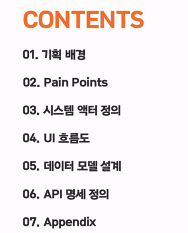

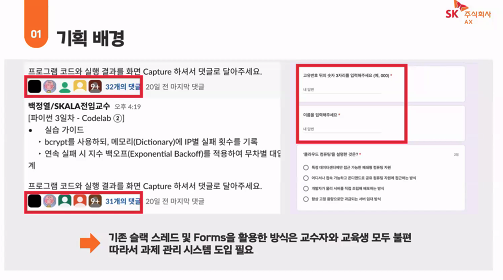

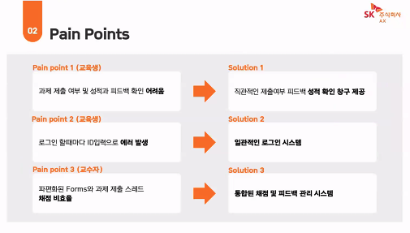

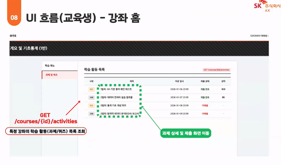

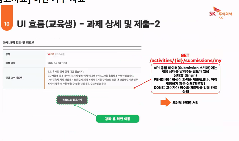

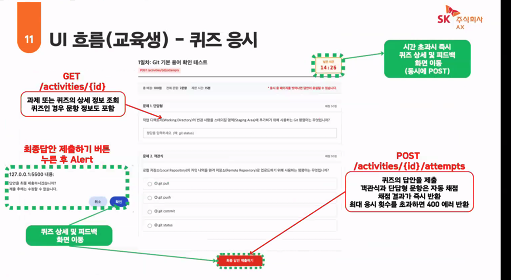

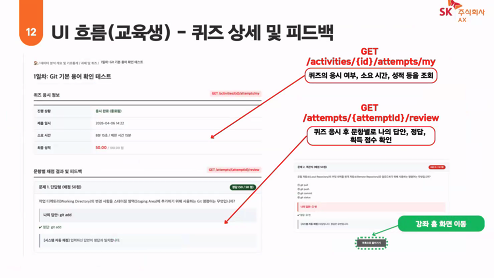

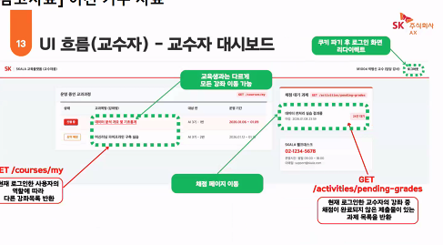

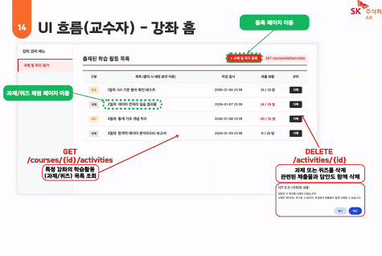

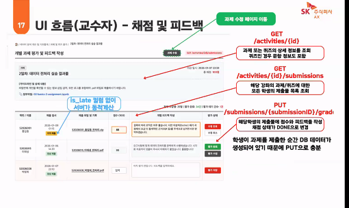

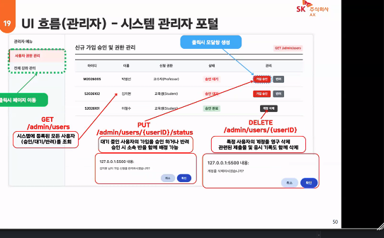

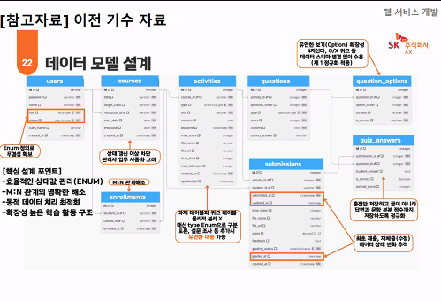

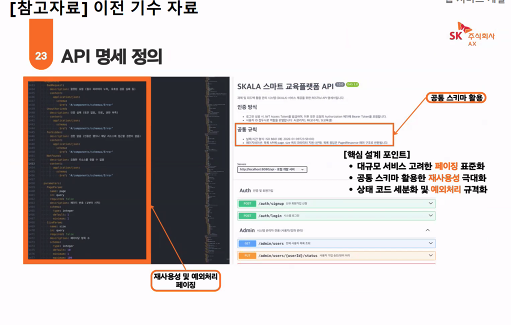

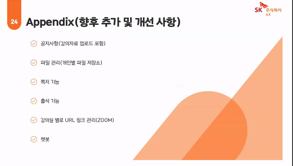

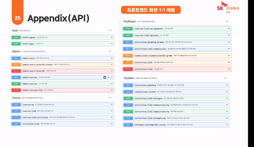

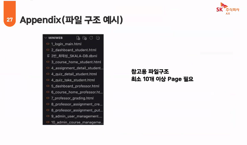
