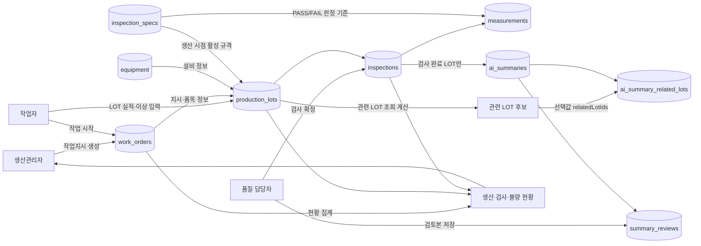

# PartFlow MES 액터별 데이터 흐름 (v2)

> v1 대비 변경: 테이블명을 실제 DB(`PartFlow-DB.dbml`)와 일치시키고(`inspection_measurements`→`measurements` 등), 관련 LOT 선택값(`relatedLotIds`) 저장 문제를 해결했으며, 각 흐름에 설계 이유를 보강했다.

## 전체 흐름

## 액터별 입력·저장·조회

| Actor | 입력 화면·API | 저장 또는 갱신 데이터 | 다음 Actor가 사용하는 데이터 | 설계 이유 |
| --- | --- | --- | --- | --- |
| 생산관리자 | S03 / `POST /work-orders` | `work_orders`: 품목, 목표수량, 예정일, 생성자, 상태 `PLANNED` | 작업자가 작업지시 상세를 열고 시작한다. | 설비·LOT번호는 이 시점엔 정해지지 않으므로(작업자가 실제 가공 시 결정) `work_orders`에는 두지 않고 `production_lots`에만 둔다. |
| 작업자 | S04 / `POST /work-orders/{id}/start` | `work_orders`: `started_by`, `started_at`, 상태 `IN_PROGRESS` | LOT 실적을 등록할 수 있는 작업지시가 된다. | 시작 권한을 생산관리자와 분리한 이유는 실제로 라인 앞에 서 있는 사람(작업자)만 "지금 가공을 시작했다"는 사실을 확정할 수 있기 때문이다. |
| 작업자 | S04 / `POST /work-orders/{id}/lots` | `production_lots`: LOT 번호, 설비, 수량, 생산 시간(시작~종료), 작업자, 메모. 작업지시 누적 생산량은 연결 LOT의 `produced_qty` 합계로 계산한다. | 품질 담당자가 검사 대기 LOT를 조회한다. | `equipment_id`와 `spec_id`(그 시점 활성 규격)를 LOT 생성 시점에 고정해 두는 이유는, 이후 규격이 개정되어도 이미 만든 LOT의 판정 기준이 바뀌지 않게 하기 위해서다. |
| 작업자 | S04 / `POST /work-orders/{id}/lots/{lotId}/anomalies` | `production_lots`: 이상유형(`anomaly_type`), 감지시각, 관찰 메모 | 품질 검사·AI 요약에 생산 이상 정보가 포함된다. | 이상징후는 검사 전에도 등록할 수 있어야 하므로 `inspections`가 아니라 `production_lots`에 둔다. 이 필드가 채워져 있고 검사기록이 없으면 화면상 '확인대기' 상태로 계산된다. |
| 품질 담당자 | S06 / `POST /lots/{id}/inspection` | `inspections`: 검사자, 검사시각, 메모. `measurements`: 제품 순번별 측정값과 `inspection_specs` 기준 PASS/FAIL(서버 계산) | 검사 완료 LOT만 AI 요약 대상이 된다. | 합/불 판정은 사람이 눈으로 보지 않고 서버가 규격과 비교해 계산한다 — 담당자마다 판정이 갈리는 일을 막기 위함이다. |
| 품질 담당자 | S05 / `GET /lots/{id}/related` | 저장 없음. 같은 품목·설비·생산일 기준으로 관련 LOT 후보를 매번 계산해 반환한다. | 선택한 LOT ID가 AI 요청에 포함된다. | 관련 LOT "후보"는 조회할 때마다 최신 데이터로 다시 계산되어야 의미가 있으므로(예: 그 사이 다른 LOT이 검사완료될 수 있음) 별도 저장하지 않는다. |
| 품질 담당자 | S05 / `POST /lots/{id}/ai-summaries` | `ai_summaries`: 기준 LOT, 요약문 또는 `FAILED` 상태, 생성시각. `ai_summary_related_lots`: 실제로 함께 분석한 관련 LOT ID 스냅샷 | 검토 대상 AI 원문이 된다. | 후보 "계산"은 매번 바뀔 수 있지만, 이미 생성된 요약이 "그때 무엇을 근거로 삼았는지"는 고정돼야 재현·감사가 가능하므로 생성 시점에 스냅샷으로 저장한다(아래 상세 참고). |
| 품질 담당자 | S05 / `POST /ai-summaries/{id}/reviews` | `summary_reviews`: 검토문, 검토자, 검토시각 | 생산관리자·품질 담당자가 LOT 상세 이력에서 확인한다. | AI 원문(`ai_summaries.summary_text`)은 절대 수정하지 않고 검토본을 별도 행으로 쌓는 이유는, "AI가 뭐라고 했는지"와 "사람이 최종적으로 뭐라고 판단했는지"를 구분해 보존해야 하기 때문이다. |
| 생산관리자 | S02 / `GET /dashboard` | 저장 없음. `work_orders`·`production_lots`·`inspections`·`measurements`를 기간·품목 기준으로 집계한다. | 생산수량, 검사수량, 부적합률, 검사대기 LOT를 확인한다. | 부적합률은 LOT별 비율의 평균이 아니라 Σ부적합/Σ검사수량으로 계산한다 — LOT마다 생산수량이 달라 평균을 쓰면 소량 LOT의 이상치가 과대 반영되기 때문이다. |

## 상태 전이와 데이터 책임

| 순서 | 상태 또는 조건 | 책임 Actor | 차단 규칙 |
| --- | --- | --- | --- |
| 1 | `PLANNED` 작업지시 생성 | 생산관리자 | 품목·목표수량이 없으면 생성하지 않는다. |
| 2 | `PLANNED → IN_PROGRESS` | 작업자 | 시작 전 LOT를 등록하지 않는다. |
| 3 | LOT 생산·이상 기록 | 작업자 | LOT 수량은 양수이고 작업지시 목표 누적수량을 넘지 않는다(동시 등록 시에도 트랜잭션으로 원자적 처리). |
| 4 | 검사 확정 | 품질 담당자 | 측정값 개수가 LOT 생산수량과 일치해야 하며, LOT당 검사는 1회만 확정한다(재검사는 후속 범위). |
| 5 | AI 요약·검토 | 품질 담당자 | 검사 확정 전 AI 생성을 막는다. `FAILED` 요약은 검토 대상이 아니며 재생성만 가능하다. |
| 6 | `IN_PROGRESS → CLOSED` | 생산관리자 | 목표 미달 종료 시 종료 사유가 필요하고 종료 후 LOT를 추가하지 않는다. |

## 관련 LOT 선택과 AI 요약 근거 보존 (해결됨)

**이전 이슈**: `relatedLotIds`가 AI 요청에는 전달되지만 저장되는 곳이 없어, 나중에 AI 요약을 다시 볼 때 "그 요약이 어떤 LOT을 같이 분석했는지" 재현할 수 없었다.

**결정**: `ai_summary_related_lots(summary_id, related_lot_id)` 연결 테이블을 추가해 요약 생성 시점의 선택값을 스냅샷으로 저장한다.

- `GET /lots/{id}/related`는 여전히 저장 없이 매번 계산한다 — 이건 "지금 시점의 후보 목록"이라 조회할 때마다 최신이어야 의미가 있다.
- 반면 `POST /lots/{id}/ai-summaries`로 실제 생성된 요약은, 그 순간 사람이 무엇을 선택해서 AI에게 줬는지가 고정된 사실이므로 별도로 저장해야 한다.
- 검증 규칙: `relatedLotIds`는 `GET /lots/{id}/related` 결과에 있는 LOT ID만 허용하고, 기준 LOT 자기 자신은 자동 포함되므로 목록에 넣지 않는다.
- 화면(S05)에서는 AI 요약 이력을 열람할 때 그 요약이 참고한 관련 LOT 목록을 함께 표시할 수 있다.
