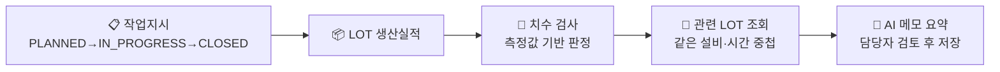
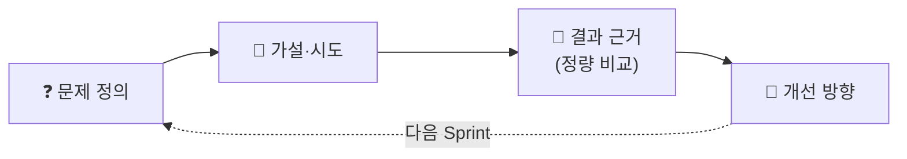

# 🎓 SKALA 4기 학습 기록

**판교 4반 · 최승우**

풀스택 → 데이터·ML → 생성형 AI → 클라우드·MLOps → RAG·Vector DB까지 
12주 동안 배운 이론, 직접 해 본 실습, 그리고 **"한 걸음 더" 해 본 것**을 정리한 저장소

---

## 🗺️ 학습 로드맵

```mermaid
flowchart LR
    A["🌐 1주차<br/>Git · Web"] --> B["📊 2주차<br/>통계 · LLM"]
    B --> C["☕ 3주차<br/>Java · Spring"]
    C --> D["🐍 4주차<br/>Python · ML"]
    D --> E["🗄️ 5주차<br/>DB · SQL"]
    E --> F["🐳 6주차<br/>sLLM · Docker"]
    F --> G["🖼️ 7주차<br/>Vue · Spring AI"]
    G --> H["🧩 8주차<br/>Agile · MSA"]
    H --> I["🏭 9주차<br/>Mini Project"]
    I --> J["☸️ 10주차<br/>LangChain · K8s"]
    J --> K["⚙️ 11주차<br/>MLOps · RAG"]
    K --> L["🔎 12주차<br/>Vector DB · K8s 심화"]
```

| 영역 | 주차 | 한 줄 요약 |
| :-- | :-: | :-- |
| 🖥️ **Full-stack** | 1 · 3 · 5 · 7 | HTML/CSS/JS → Spring Boot REST API → DB 설계·튜닝 → Vue 3 |
| 📈 **Data · ML** | 2 · 4 · 10 | 기초 통계 → Pandas EDA·Feature Engineering → 모델 최적화·HPO |
| 🤖 **Generative AI** | 2 · 6 · 7 · 10 · 11 · 12 | 프롬프트·Agent → sLLM Fine-tuning → Spring AI·MCP → LangChain → RAG → Vector DB |
| ☁️ **Cloud · Ops** | 6 · 8 · 10 · 11 · 12 | Docker → MSA → Kubernetes → Airflow·MLflow·KServe·LGTM → K8s 심화 |
| 🏗️ **Project** | 2 · 4 · 8 · 9 · 11 | STEP GUARD, NYC Taxi, MediBridge, **PartFlow MES**, 삼성 보증 RAG |

---

## ⭐ 한눈에 보는 나의 차별점

> 수업 실습을 "돌려 보기"에서 끝내지 않고, **문제 정의 → 가설 → 근거(수치) → 개선 방향** 순서로 끝까지 밀어붙이는 것을 원칙으로 삼았습니다.

| 주차 | 수업 기본 범위 | ➕ 내가 더 한 것 |
| :-: | :-- | :-- |
| 2 | CrewAI Agent 실습 | 팀 **기획·총괄**으로 STEP GUARD 설계, 서버리스 함수로 API 키를 숨기고 **접근 토큰으로 비용 남용 차단** |
| 4 | Python 종합실습 | NYC Taxi 409만 건: 군집 라벨을 **승차 전 정보만으로 예측**하도록 설계해 정보 누수 차단, 시간 홀드아웃·재현성 검증 |
| 5 | SQL 문법·튜닝 | PostgreSQL 체크포인트·Trigger 정리 문서를 별도로 만들어 **실행 계획 기반 진단** 습관화 |
| 6 | LoRA Fine-tuning | Epoch / 데이터 크기 / Rank 변수를 **실험 설계**해 규칙 준수율 비교·토의 |
| 7 | Vue · Spring AI | 시험 대비 **JS·Vue 노트 직접 제작**, MCP Server(stdio/HTTP)까지 확장 |
| 8 | MSA 코드 템플릿 | **B2B 의약품 플랫폼(MediBridge)** 으로 재해석, 컴플라이언스 경계·성공 지표까지 정의 |
| 9 | AI 웹 서비스 설계 | **엘리베이터 고장 실데이터 82만 행** 분석으로 MES 컬럼 설계, API 19개·테이블 11개 **정합성 전수 점검** |
| 10 | LangChain 실습 | 벡터 DB 없이 **TF-IDF부터 시작하는 단계적 빌드업**, HPO 4종을 성능·시간으로 해석 |
| 11 | RAG 캡스톤 | 문서를 **삼성 보증 정책으로 교체·크롤러 작성**, 헤더 경로 청킹 + metadata 필터로 제품 정확도 **0.117 → 0.950** |
| 12 | Vector DB | 강의 PDF 16개(2,397청크)로 **FAISS HNSW vs Qdrant 필터 검색** 비교, 임베딩 모델 교체 실험 |

---

## 📚 주차별 학습 · 실습

<b>🌐 1주차 — Git과 프론트엔드 기초</b>

**📖 배운 것**
- Git 저장소·커밋·브랜치 흐름, HTML 문서 구조, CSS 선택자·박스 모델·반응형
- JavaScript 이벤트와 DOM 조작, Emmet으로 반복 마크업 빠르게 작성

**🛠️ 실습**
- Git 프로필 실습, HTML/CSS/JS 예제 페이지 제작

📁 [`git사용`](./1주차/git사용) · [`html_css`](./1주차/html_css)

<b>📊 2주차 — 데이터 분석 · LLM 이해 · 프롬프트 설계</b>

**📖 배운 것**
- 기술 통계·전처리·시각화로 데이터에서 근거 찾기
- RNN/LSTM의 한계 → Transformer Self-Attention, 토큰화 → 임베딩 → Attention → 출력 흐름
- CoT, Self-Consistency, ReAct, Memory & Compaction 등 프롬프트·컨텍스트 엔지니어링

**🛠️ 실습**
- 기초 통계 노트북(주택 데이터), CrewAI로 목표·역할·도구를 가진 Agent 구성
- **STEP GUARD** — 에스컬레이터 고장 이력 + 이용객 흐름으로 점검 종류를 분류하고 2인 1조·3교대 인력을 배치하는 AI 대시보드

**⭐ 차별점**
- 3인 팀에서 **서비스 기획·프로젝트 총괄** (문제 정의, 서비스 흐름, 점검 기준 설계)
- 빌드 없는 정적 대시보드 + Vercel Serverless로 OpenAI 호출, 키는 서버 환경변수에만 두고 **별도 접근 토큰**으로 공개 URL 비용 남용 방지

📁 [`데이터 분석 및 기초통계`](./2주차/데이터%20분석%20및%20기초통계) · [`LLM모델이해`](./2주차/LLM모델이해) · [`STEP GUARD`](./2주차/LLM모델이해/code/dashboard)

<b>☕ 3주차 — Java · Spring Boot 백엔드</b>

**📖 배운 것**
- 객체지향 4대 특징과 SOLID, DI·IoC, Controller–Service–Repository 계층
- Spring MVC 요청 흐름, DTO·검증, Profile, JPA·`@Transactional`, `@ControllerAdvice`, AOP, Actuator

**🛠️ 실습**
- 메뉴 추천 API → 주식 거래(StockTrading) → 쇼핑몰 API로 CRUD·API 설계 반복

**⭐ 차별점**
- 쇼핑몰 API를 **Dockerfile로 컨테이너화**, 일자별 메모와 트러블슈팅 기록을 따로 남김

📁 [`day1`](./3주차/day1_JAVA) · [`day2`](./3주차/day2_JAVA) · [`day3`](./3주차/day3_JAVA) · [`day4`](./3주차/day4_JAVA) · [`day5`](./3주차/day5_JAVA)

<b>🐍 4주차 — Python 데이터 분석과 머신러닝</b>

**📖 배운 것**
- Python 자료구조·파일 I/O·예외 처리·로깅, Pandas EDA
- 결측·이상치, 인코딩, 스케일링, 파생 변수 등 Feature Engineering
- 회귀·분류·군집화, CNN·LSTM·Autoencoder·ResNet·BERT 구조

**🛠️ 실습**
- `asyncio.gather`로 3개 API 병렬 수집 → Pydantic 검증 → CSV·Parquet 저장 파이프라인
- **NYC Taxi 수익 최적화** (4조) — 전처리 → EDA → K-Means → 분류 모델 → 리포트 자동 생성

**⭐ 차별점**
- K-Means는 *운행 후* 정보로 군집을 만들고, 분류 모델은 *승차 전* 정보(zone·요일·시간대)만으로 그 군집을 예측 → **기사가 실제로 쓸 수 있는 시점**에 맞춘 설계
- 시간 홀드아웃, 변수 조합·단일/계층형 비교, 독립 재학습 **재현성 검증**, 거리 컷오프 민감도 분석, pytest

📁 [`nyc-taxi-earnings-optimizer`](./4주차/nyc-taxi-earnings-optimizer) · [`실습자료`](./4주차/실습자료)

<b>🗄️ 5주차 — 데이터베이스 설계와 SQL 최적화</b>

**📖 배운 것**
- 관계형 모델, 키·제약조건, 정규화·ERD, 트랜잭션·ACID·WAL·Lock
- JOIN·서브쿼리·CTE·윈도 함수, `ROLLUP`/`CUBE`/`FILTER`, View vs Materialized View
- Nested Loop / Sort-Merge / Hash Join, OFFSET vs Keyset 페이지네이션, 인덱스 선택도·`EXPLAIN ANALYZE`

**🛠️ 실습**
- 학사 관리 DB 설계(다대다 → Bridge Table), PostgreSQL 쿼리 작성·튜닝 종합실습 보고서

**⭐ 차별점**
- [PostgreSQL 체크포인트](./5주차/Day4/24-32_PostgreSQL_SQL_Checkpoint.md), [Trigger 이벤트 처리](./5주차/SQL_예시_정리/25_Trigger_이벤트_처리.md)를 별도 문서로 정리

📁 [`Day1`](./5주차/Day1) · [`Day2`](./5주차/Day2) · [`Day3`](./5주차/Day3) · [`Day4`](./5주차/Day4)

<b>🐳 6주차 — sLLM Fine-tuning · Docker 컨테이너화</b>

**📖 배운 것**
- sLLM이 필요한 상황(반복 업무, 저지연, 내부망, 비용), 모델 계열(Llama·Qwen·Gemma·Phi)·Base vs Instruct·Model Card
- 컨테이너 개념과 애플리케이션 컨테이너화

**🛠️ 실습**
- sLLM 실행·비교 노트북, LoRA Fine-tuning Baseline vs Fine-Tuned 비교
- Docker 종합실습: 게시판 CRUD API 컨테이너화 + 결과·코드 리뷰 보고서

**⭐ 차별점**
- Epoch / 데이터 크기 / Rank 중 실험 변수를 나눠 **"어떤 요인이 규칙 준수율에 가장 영향을 주는가"** 를 조별로 비교·토의

📁 [`Day1`](./6주차/Day1) · [`Day2`](./6주차/Day2) · [`Day3`](./6주차/Day3)

<b>🖼️ 7주차 — JavaScript 심화 · Vue 3 · Spring AI</b>

**📖 배운 것**
- JSON 직렬화, DOM 이벤트·버블링, Callback → Promise → async/await
- Vue 3 Composition API(`ref`·`reactive`·`computed`·`watch`), Router, Pinia
- Spring AI: 모델 교체 시 재검증 항목, RAG·Chat Memory·Tool Calling·MCP

**🛠️ 실습**
- `skala-vue`: 이벤트 수식자, `v-model` 수식자, 날씨 컴포넌트, 반응형 레이아웃
- Spring AI 01~13 실습(RAG ETL, Chat Memory, MCP Client/Server, Simple/Multi Agent)

**⭐ 차별점**
- 시험 대비용 [JavaScript 심화 노트](./7주차/학습자료/JavaScript_심화_시험대비_노트.md), [Vue 객관식 노트](./7주차/학습자료/Vue_객관식_시험대비_1시간_노트.md) 직접 제작
- Vue 실습 [개발·트러블슈팅 노트](./7주차/실습자료/skala-vue/DEVELOPMENT_NOTES.md) — 키보드 접근(`@focus`) 등 접근성까지 고려

📁 [`Day1`](./7주차/Day1) · [`Day5/spring-ai`](./7주차/Day5/spring-ai) · [`skala-vue`](./7주차/실습자료/skala-vue)

<b>🧩 8주차 — Agile 방법론 · MSA</b>

**📖 배운 것**
- Sprint 반복과 피드백 반영, 이해관계자 설정, 서비스 독립성
- API Gateway · Eureka · Kafka · 서비스별 DB를 갖춘 MSA 구조

**🛠️ 실습**
- course / enrollment / payment / recommend / user 서비스 + Vue 프론트를 Docker Compose로 구성·분석

**⭐ 차별점 — MediBridge (CSO·약국·병원 B2B 플랫폼)**
- 실습 템플릿을 **의약품 발주 B2B 도메인**으로 재해석해 이해관계자별 Pain Point·가치 정의
- 고급 개인화 대신 **설명 가능한 규칙 기반 추천**(최다 구매 약효군 중 미구매 제품 Top 5)으로 MVP 범위 확정
- "진단·처방 판단을 대신하지 않는다"는 **컴플라이언스 경계**, 발주 완료율·추천 전환율·변경 리드타임 등 **성공 지표** 명시
- Walking Skeleton → 추천·결제 연동 순으로 Sprint 계획

📁 [`Day1`](./8주차/Day1) · [`msa-lecture`](./8주차/실습자료/msa-lecture)

<b>🏭 9주차 — AI 웹 서비스 설계 Mini Project · PartFlow MES</b>

**📖 배운 것**
- 기준정보 vs 발생정보, 계획 vs 실적, 작업지시 1:N LOT, 명시 상태 vs 계산 상태
- 규격 버전 보존, 서버 판정, DB 제약·트랜잭션, B2B 추적성과 AI 역할 경계

**🛠️ 실습 — PartFlow: 자동차·가전 부품 생산·품질관리 MES**

- 산출물: 서비스 개요 PDF, 요구사항정의서·화면설계서, OpenAPI YML, DBML, HTML 와이어프레임(S00~S09), Figma 역할별 흐름, 발표 자료

**⭐ 차별점**
- **엘리베이터 고장 실데이터 2종(약 3만 + 79만 행)** 을 분석해 고장 이력 구조를 MES 컬럼 설계에 반영
- 아날로그 설비 현장 → 작업자 태블릿 수기 입력으로 디지털 이력을 남기는 **현실적 페인포인트** 설정
- 불량 발견 시 **같은 설비·시간대에 생산된 관련 LOT**를 찾는 품질 추적 로직, AI는 "요약 보조"로만 한정
- API 19개 · 테이블 11개를 **전수 점검**해 화면-API-DB 불일치 수정 (AI 실패도 `201 + FAILED` 이력으로 단일화)

📁 [`9주차`](./9주차) · [`프로젝트 정의서`](./9주차/MES_프로젝트정의서.md) · [`설계 학습노트`](./9주차/MES_설계_학습노트.md) · [`PartFlow-최종제출`](./PartFlow-최종제출)

<b>☸️ 10주차 — 모델 최적화 · LangChain · Kubernetes 기초</b>

**📖 배운 것**
- 모델 최적화 = 더 좋은 데이터 / 더 좋은 모델 / 더 좋은 전략, 과소·과적합 방향을 정하고 HPO
- XAI, LangChain(`init_chat_model`, `ChatPromptTemplate`, LCEL), Gradio
- 컨테이너 기반 Kubernetes: Pod, Deployment, kubectl, 첫 API 서버 배포

**🛠️ 실습**
- HPO Activity (Bank Marketing 45,211행): Grid / Random / Bayesian / Optuna 비교
- **LangChain 통신사 요금제 추천** 개인 과제
- `skala-kube`: Pod → Deploy → kubectl → Spring API + MariaDB 배포

**⭐ 차별점**
- HPO 결과를 **성능과 시간으로 함께 해석** — Grid 0.9351 / 39.6s vs Optuna 0.9326 / 6.9s, Bayesian이 순차 탐색 오버헤드로 더 느린 이유까지 정리
- 요금제 추천은 벡터 DB 없이 **TF-IDF + cosine + cutoff**로 최소 구현 → 숫자 필터 → 임베딩 → 벡터 DB → 서비스화의 **도입 조건별 빌드업** 설계

📁 [`day2`](./10주차/day2) · [`day3`](./10주차/day3) · [`요금제 추천 과제`](./10주차/학습자료/LangChain_요금제_추천_과제.ipynb)

<b>⚙️ 11주차 — 모델 서빙 · MLOps / AIOps · RAG Pipeline</b>

**📖 배운 것**
- 학습 → 저장·복원 → FastAPI 서빙, Airflow 자동화, KServe 배포, vLLM API
- MLflow 실험·모델 레지스트리, LGTM Observability, MLOps / LLMOps / AIOps
- RAG Step 00~15: Loader → Splitter → Embedding → Vector Store → Retriever → 평가 → 검색 품질 → Advanced RAG → LangGraph → Agentic RAG

**🛠️ 실습**
- sklearn / Keras / PyTorch × FastAPI, Airflow, KServe, MLflow, AIOps 등 실습별 **followup 비교표**를 실제 실행 결과로 채움
- **RAG 캡스톤** — 삼성 보증 정책 문서 기반 RAG 설계·평가

**⭐ 차별점**
- MLflow 서버 기동 실패를 로그로 추적해 **SQLAlchemy 2.1 호환성 문제**를 근본 원인으로 확인, 버전 고정으로 해결
- RAG 캡스톤 문서를 **samsung.com 보증 정책으로 교체**하고 stdlib HTMLParser 크롤러로 6카테고리 53제품 Markdown 구축
- 헤더 경로 주입 청킹 + metadata 필터:

| 지표 | Baseline | 개선 |
| :-- | :-: | :-: |
| 테스트 Hit | 0.778 | **0.889** |
| 개발셋 MRR | 0.738 | **0.838** |
| Context 길이 | 743자 | **555자** |
| 답변 정상률 | 7/10 | **8/10** |
| 전 제품 제품 정확도@3 | 0.117 | **0.950** |

- 인사이트: "헤더에서 *자르기*"가 아니라 "헤더 *경로를 남기기*"가 효과의 원인, Hit만 보면 놓치는 문제를 **분리도·1·2위 유사도 차이** 지표로 발견

📁 [`실습자료`](./11주차/실습자료) · [`rag-pipeline-lab2026`](./11주차/Day3/rag-pipeline-lab2026) · [`캡스톤 평가`](./11주차/Day3/rag-pipeline-lab2026/final_capstone/practice/results/evaluation.md)

<b>🔎 12주차 — Vector DB · Kubernetes 실무 심화 (진행 중)</b>

**📖 배운 것**
- 유사도·거리 4종(Cosine·Dot·L2·L1), HNSW(ANN), Recall@K·Precision@K·MRR·nDCG
- 청킹 크기·전략·overlap, Fixed / Recursive / Semantic / Parent-Child
- Dense vs BM25, RRF 기반 Hybrid, Cross-encoder Re-ranking
- 가상화 vs 컨테이너, Docker 이미지 레이어·Copy-on-Write, Harbor 레지스트리, kind, 파드·브릿지 네트워크

**🛠️ 실습**
- PDF(PyMuPDF) → Recursive 청킹(500/50) → Ollama 임베딩 → **FAISS HNSW → Qdrant** 저장 → 일반·파일명/페이지 필터 검색 비교

**⭐ 차별점**
- 수업 PDF 16개를 그대로 데이터셋으로 사용해 **2,397청크** 적재
- 기본 `embeddinggemma`(768차원)와 교재 `bge-m3`(1,024차원)를 옵션으로 교체 실행, FAISS 후처리 필터 vs Qdrant payload 필터 비교
- 청킹 튜닝용 **질의셋 설계**(사실형·조건형·다중 근거형·무근거형 층화 + macro 평균) 정리

📁 [`Day1`](./12주차/Day1) · [`실습 코드`](./12주차/실습자료/src)

---

## 💡 과정을 관통하는 인사이트

- 🎯 **기술보다 문제가 먼저** — 해결할 업무 문제와 측정 가능한 성공 기준부터 정한다.
- ⚖️ **비싼 모델이 정답은 아니다** — 규칙으로 되는지 먼저 보고, 비용 대비 적절한 모델·구조를 고른다.
- 📏 **수치로 말한다** — 도입 전후를 같은 질의셋·같은 지표로 비교한다.
- 🧱 **AI의 역할에 경계를 긋는다** — 판단은 사람, AI는 근거 있는 보조(PartFlow 메모 요약, MediBridge 설명 가능한 추천).
- 📝 **제3자가 이해할 수 있게 기록한다** — 코드·문서·트러블슈팅 기록이 협업 능력의 근거가 된다.

📎 관련 기록: [교육 인사이트 및 실행 계획](./기타/교육인사이트/전체인사이트.md) · [트러블슈팅](./기타/학습자료/트러블슈팅.md) · [학습관리](./학습관리.md)
