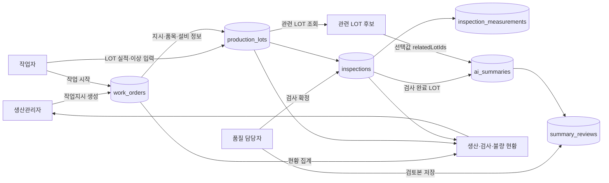

# PartFlow MES 액터별 데이터 흐름

## 전체 흐름

## 액터별 입력·저장·조회

| Actor | 입력 화면·API | 저장 또는 갱신 데이터 | 다음 Actor가 사용하는 데이터 |
| --- | --- | --- | --- |
| 생산관리자 | S03 / `POST /work-orders` | `work_orders`: 품목, 설비, 목표수량, 예정일, 생성자, 상태 `PLANNED` | 작업자가 작업지시 상세를 열고 시작한다. |
| 작업자 | S04 / `POST /work-orders/{id}/start` | `work_orders`: `started_by`, `started_at`, 상태 `IN_PROGRESS` | LOT 실적을 등록할 수 있는 작업지시가 된다. |
| 작업자 | S04 / `POST /work-orders/{id}/lots` | `production_lots`: LOT 번호, 수량, 생산 시간, 작업자, 메모. 작업지시 누적 생산량도 갱신한다. | 품질 담당자가 검사 대기 LOT를 조회한다. |
| 작업자 | S04 / `POST /work-orders/{id}/lots/{lotId}/anomalies` | `production_lots`: 이상유형, 감지시각, 관찰 메모 | 품질 검사·AI 요약에 생산 이상 정보가 포함된다. |
| 품질 담당자 | S06 / `POST /lots/{id}/inspection` | `inspections`: 검사자, 검사시각, 판정, 메모. `inspection_measurements`: 항목별 측정값·합격 여부 | 검사 완료 LOT만 AI 요약 대상이 된다. |
| 품질 담당자 | S05 / `GET /lots/{id}/related` | 저장 없음. 같은 기준으로 관련 LOT 후보를 계산해 반환한다. | 선택한 LOT ID가 AI 요청에 포함된다. |
| 품질 담당자 | S05 / `POST /lots/{id}/ai-summaries` | `ai_summaries`: 기준 LOT, 요약문 또는 `FAILED` 상태, 생성시각 | 검토 대상 AI 원문이 된다. |
| 품질 담당자 | S05 / `POST /ai-summaries/{id}/reviews` | `summary_reviews`: 검토문, 검토자, 검토시각 | 생산관리자·품질 담당자가 LOT 상세 이력에서 확인한다. |
| 생산관리자 | S02 / `GET /dashboard` | 저장 없음. `work_orders`·`production_lots`·`inspections`를 기간·품목 기준으로 집계한다. | 생산수량, 검사수량, 부적합률, 검사대기 LOT를 확인한다. |

## 상태 전이와 데이터 책임

| 순서 | 상태 또는 조건 | 책임 Actor | 차단 규칙 |
| --- | --- | --- | --- |
| 1 | `PLANNED` 작업지시 생성 | 생산관리자 | 품목·설비·목표수량이 없으면 생성하지 않는다. |
| 2 | `PLANNED → IN_PROGRESS` | 작업자 | 시작 전 LOT를 등록하지 않는다. |
| 3 | LOT 생산·이상 기록 | 작업자 | LOT 수량은 양수이고 작업지시 목표 누적수량을 넘지 않는다. |
| 4 | 검사 확정 | 품질 담당자 | 검사 합계와 생산수량이 일치해야 하며 중복 확정하지 않는다. |
| 5 | AI 요약·검토 | 품질 담당자 | 검사 확정 전 AI 생성과 `FAILED` 요약의 검토 저장을 막는다. |
| 6 | `IN_PROGRESS → CLOSED` | 생산관리자 | 목표 미달 종료 시 종료 사유가 필요하고 종료 후 LOT를 추가하지 않는다. |

## 확인이 필요한 데이터 이력

`relatedLotIds`는 AI 요청에 전달되지만 현재 DBML에는 해당 선택 목록을 저장하는 테이블이나 컬럼이 없다. 따라서 AI 요약을 다시 볼 때 **어떤 관련 LOT를 함께 분석했는지 재현할 수 없다.**

AI 요약의 근거 추적이 제출·운영에 필요하면 `ai_summary_related_lots(summary_id, related_lot_id)` 연결 테이블을 추가해 선택 LOT를 저장한다. 필요하지 않다면 현재처럼 API 요청에만 사용하고, 관련 LOT는 조회 시점 기준으로 다시 계산한다.
